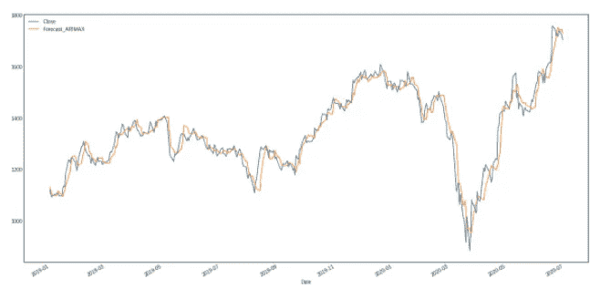

# 完整的时间序列分析概述| Reliance NIFTY 50

> 原文：<https://medium.com/analytics-vidhya/complete-time-series-analysis-overview-reliance-nifty-50-deeb67ce74fd?source=collection_archive---------5----------------------->

# 介绍


谈到生意，时间起着非常重要的作用。每一秒钟都是金钱，每个国家和全球经济都依赖时间。时间序列分析已经成为分析领域中广泛使用的工具，以了解依赖于时间的变量。

# 什么是时间序列分析？


时间序列分析是一种处理时间序列数据或趋势分析的统计技术。时间序列数据是指数据在一系列特定的时间段或间隔内。数据分为三种类型:

*   **时间序列数据:**一个变量在不同时间取值的一组观察值。
*   **横截面**数据:在同一时间点收集的一个或多个变量的数据。
*   **汇集数据:**时间序列数据和横断面数据的组合。

来源:[统计解](https://www.statisticssolutions.com/time-series-analysis/)

# 信实工业公司

信实工业有限公司(RIL)是一家印度跨国集团公司，总部设在印度马哈拉施特拉邦孟买。Reliance 在印度拥有能源、石化、纺织、自然资源、零售和电信等行业。Reliance 是印度最赚钱的公司之一，按市值计算是印度最大的上市公司，按收入计算是印度最大的公司，最近刚刚超过了政府控制的印度石油公司。[5]2020 年 6 月 22 日，Reliance Industries 成为第一家市值超过 1500 亿美元的印度公司，此前其市值在 BSE 上触及₹11,43,667 克罗尔。

截至 2019 年，该公司在《财富》全球 500 强企业排行榜上排名第 106 位。截至 2016 年，它在普氏全球能源公司 250 强中排名第 8。Reliance 仍然是印度最大的出口商，占印度商品出口总额的 8%,出口额为 100 亿₹1,47,755，市场遍及 108 个国家。印度政府关税和消费税总收入的近 5%来自 Reliance。它也是印度私营部门中最高的所得税缴纳者。

来源:[维基百科](https://en.wikipedia.org/wiki/Reliance_Industries)

# 承认

1.  为了清楚地解释汽车 ARIMA 模型— [沃帕尼](https://www.kaggle.com/rohanrao/a-modern-time-series-tutorial)
2.  精彩的可视化指南- [Parul Pandey](https://www.kaggle.com/parulpandey/nifty-data-eda)
3.  先知文献— [脸书](http://facebook.github.io/prophet/docs/quick_start.html)

# 项目摘要

该项目围绕分析信实公司股票的收盘价和成交量加权平均价随时间的变化。首先是为可视化准备数据，接着是广泛的探索性数据分析，其中也包括新冠肺炎事件对 Reliance 股票的影响，然后是时间序列模型构建和使用脸书发布的新工具 Prophet 进行时间序列预测。你可以检查[笔记本](https://www.kaggle.com/benroshan/reliance-nifty50-time-series-analysis)与剧情互动

# 项目目标

1.  数据准备
2.  数据可视化
3.  构建时间序列模型

# 资料组


数据是印度国家证券交易所的 [NIFTY 50 指数中 50 只股票的价格历史和交易量。所有数据集都是一天级别的，定价和交易值是分开的。每个股票的 csv 文件以及一个元数据文件，其中包含一些关于股票本身的宏观信息。数据跨度从 2000 年 1 月 1 日到 2020 年 7 月 31 日。](https://www.nseindia.com/)

## 导入库

## 导入数据集

首先让我们欢迎我们的数据集

```
reliance_raw=pd.read_csv("../input/nifty50-stock-market-data/RELIANCE.csv")

*## print shape of dataset with rows and columns and information* 
print ("The shape of the  data is (row, column):"+ str(reliance_raw.shape))
print (reliance_raw.info())
```


## 数据集详细信息

文件中列的描述:

*   日期—交易日期
*   符号—公司名称(Reliance)
*   系列——我们只有一个系列(EQ):它代表公平。在这个系列中，除了交割之外，当天交易也是可能的
*   prev Close——指证券前一天正式收盘时的最终价格。
*   开市——开市是证券交易所或有组织的场外交易市场交易的开始阶段。
*   高——股票在交易日中的最高交易价格。
*   低——股票在交易日中的最低交易价格。
*   最后——股票的最后价格只是买卖股票时要考虑的一个价格。最后的价格只是最近的价格
*   收盘——收盘是指当天市场收盘时金融市场交易时段的结束。
*   VWAP(交易量加权平均价格)-它是特定时间范围内交易价值与总交易量的比率。它是对股票在交易期限内的平均交易价格的衡量
*   成交量——是在给定时间内交易的证券数量
*   成交量——这是一个衡量特定股票的卖家和买家的指标。它的计算方法是用股票的日交易量除以股票的“流通量”，即普通交易大众可出售的股票数量。
*   交易——某一天交易的股票数量称为交易量
*   可交割量——从一组人(今天之前在 demat 账户中持有这些股票，今天正在出售)手中实际转移到另一组人(已经购买了这些股票)手中的股票数量
*   % Deliverable——实际从一个人的 demat 账户转移到另一个人的 demat 账户的股份。

```
*#Checking out the statistical measures*
reliance_raw.describe()
```


**见解:**

*   我们的数据集中有许多异常值，我们可以看到最大值是第 75 百分位的 3 倍
*   标准偏差和其他统计测量值在所有特征中或多或少是相等的

# 数据准备

为了让我们的机器学习算法表现良好，我们需要清理我们的数据。在我们的例子中，除了一些空值，我们没有太多的垃圾需要清理。此外，让我们也从时间中提取一些更多的功能来执行深入的 EDA


我们必须将日期设置为索引

由于提取，我们几乎没有组装新功能。让我们用平均值来代替空值。

```
*#Imputing null values with mean* 
reliance_analysis.fillna(reliance_analysis.mean(),inplace=True)

*#Checking for null values*
reliance_analysis.isnull().sum()
```


# 数据可视化


探索性数据分析是时间序列分析的核心部分。在这一阶段，我们将看到许多线图，它们可以帮助我们理解趋势、季节性和时间序列分析中的许多其他概念

## 库存措施的分配

让我们见证股票指标的直方图分布，如开盘、收盘、盘高、盘低和 VWAP。


**感悟:**

*   所有的测度都表现出等分布性质
*   所有的分布都是右偏的

# 单变量分析

我们来看看单因素随时间的变化趋势

## VWAP 随着时间的推移

现在让我们看看一段时间内的成交量加权平均价格。请访问我的 [kaggle 笔记本](https://www.kaggle.com/benroshan/reliance-nifty50-time-series-analysis)与剧情互动


**见解:**

*   多年来，VWAP 的趋势一直在逐渐增强
*   2008 年 1 月和 2009 年 5-10 月出现了两次高峰
*   凯什·安巴尼控股公司目前股价接近约 1625 卢比的历史最高水平，这是 9 年半多前的 2008 年 1 月的价格。信实工业的股价周三收于 1621.15 卢比。相比之下，该指数曾达到 1649 卢比的日内高点，此前在 2008 年 1 月曾达到 1610 卢比的收盘高点。[新闻在此](https://www.financialexpress.com/market/reliance-industries-ril-share-price-all-time-high-10-year-return-zero-jul-2017/780392/)

## 开盘、收盘、盘高和盘低的单变量分析

让我们看看历年的开盘价、收盘价、最高价和最低价

```
cols_plot = ['Open', 'Close', 'High','Low']
axes = reliance_analysis[cols_plot].plot(marker='.', alpha=0.5, linestyle='None', figsize=(11, 9), subplots=True)
for ax **in** axes:
    ax.set_ylabel('Daily trade')
```


**见解:**

*   正如我们所知，所有这些参数遵循相同的模式，没有太大的偏差
*   2008–2012 年和 2016–2020 年之间有一个间歇期。这标志着信赖感市场的突然下滑。

## 历年份额量的单变量分析

让我们来看看 NIFTY 50 的股票交易量。

```
ax=reliance_analysis[['Volume']].plot(stacked=True)
ax.set_title('Volume over years',fontsize= 30)
ax.set_xlabel('Year',fontsize = 20)
ax.set_ylabel('Volume',fontsize = 20)
plt.show()
```


**见解:**

*   2020 年有大量的共享。这可能是由于 Jio 的统治和顶级科技巨头如脸书和谷歌的投资。
*   清淡阶段位于 2008 年至 2016 年之间，在这一阶段，这些年没有大的交易量。
*   Reliance 在印度有很强的影响力，并赢得了印度公民的信任，这是一家有价值的公司。

# 双变量分析

让我们比较两个因素的时间变化

## 随着时间的推移打开与关闭

我们的第一个双变量分析涉及开放和关闭参数


**见解:**

*   如果你能注意到(使用 rangeslider 缩放，使用我的 [kaggle 笔记本](https://www.kaggle.com/benroshan/reliance-nifty50-time-series-analysis)与绘图互动)我们可以清楚地看到大多数时候开盘价高于收盘价。
*   但是差别很微妙。如果我们采用移动平均线，我们甚至可能不会注意到差异。
*   有一个地方你可以注意到很大的不同，那就是 2008 年 5 月 2 日，开盘时是 3026 点，收盘时是 2674.5 点

## 高与低

现在，让我们看看这些年来的高低参数

**感悟:**

*   高对低遵循与开盘对低相同的路径，其中高比当天的低价格高一点。
*   如果你看看 2009 年 11 月 25 日和 26 日，25 日的最低价格是 2169，26 日的最高价格是 1111，这显示了巨大的下跌

# 移动平均分析

移动平均是一种应用于时间序列的平滑技术，用于消除时间步长之间的细微变化。平滑的目的是去除噪声，更好地揭示潜在的因果过程的信号。移动平均是时间序列分析和时间序列预测中使用的一种简单而常用的平滑方法。计算移动平均值需要创建一个新序列，其中的值由原始时间序列中原始观察值的平均值组成。移动平均要求您指定一个窗口大小，称为窗口宽度。这定义了用于计算移动平均值的原始观察值的数量。移动平均中的“移动”部分是指由窗口宽度定义的窗口沿着时间序列滑动，以计算新序列中的平均值。你可以通过 [investopedia](https://www.investopedia.com/articles/active-trading/052014/how-use-moving-average-buy-stocks.asp#:~:text=The%20moving%20average%20(MA)%20is,time%20period%20the%20trader%20chooses.) 阅读这篇文章来获得清晰的图片

在我们的项目中，我们考虑 3、7 和 30 天的移动平均值和标准差。感谢 [Vopani](https://www.kaggle.com/rohanrao) 这段精彩的代码。


创建的功能一瞥

我们已经创建了高，低，交易量，VWAP 各日的移动平均线和标准差

## 高与低，均值和标准差滞后— 30 天

在这篇文章中，我只考虑 30 天的比较，以获得更低的噪音。你可以复制和编辑这段代码来根据你的意愿改变窗口。这里我们用平均值和标准偏差来比较高低值。


**见解:**

*   考虑到标准偏差(紫色线)，每当股票价格下跌时，就会出现高偏差。
*   在标准差的帮助下，我们可以了解公司面临的损失。
*   即使滞后曲线没有减少太多噪音，我们对高低价格如何随时间移动有一个清晰的想法

## 均值和标准差滞后量— 30 天

**感悟:**

*   在这里，我们有一个移动平均线和标准差图表的简洁表示
*   当体积值达到 2020 年时有很多偏差，相应的平均值比标准偏差高

# 新冠肺炎的愤怒

 [## RILResponsetoCovid-19

### 通过安娜·塞娃使命，我们将为边缘化社区和前线工作者提供超过 300 万份膳食…

www.ril.com](https://www.ril.com/ResponsetoCOVID-19.aspx) 

## 锁定后的性能-VWAP

封锁已经成为印度经济的一大打击。从跨国公司到街头小贩都受到了封锁期的影响。由于许多公司在家办公，许多公司设法在竞争中生存下来。让我们看看 Reliance 在封锁期间的表现

```
fig = px.line(reliance_analysis, x='Date', y='VWAP',title='VWAP after lockdown', range_x=['2020-03-23','2020-06-30'])
fig.show()
```


**感悟:**

*   封锁开始时低于 1000 VWAP，但逐渐上升超过 1500 VWAP，到 2020 年 6 月 30 日达到 1718 VWAP 附近。
*   这可能是由于脸书、谷歌和其他公司对 Jio 股票表现出的兴趣。

## 锁定后的烛台(打开、关闭、高、低)

交易者使用蜡烛图来根据过去的模式确定可能的价格变动。烛台在交易时很有用，因为它们在交易者指定的时间内显示四个价格点(开盘价、收盘价、最高价和最低价)。在这里，我们衡量锁定阶段开始后的趋势

```
reliance_analysis_lockdown = reliance_analysis[reliance_analysis['Date'] >= '2020-03-23']
fig = go.Figure(data=[go.Candlestick(x=reliance_analysis_lockdown['Date'],
                open=reliance_analysis_lockdown['Open'],
                high=reliance_analysis_lockdown['High'],
                low=reliance_analysis_lockdown['Low'],
                close=reliance_analysis_lockdown['Close'])])

fig.show()
```


**见解:**

*   然后，股票表现最初是好的，自从锁定以来，Reliance 还没有出现大的下跌，因为我们可以看到总的来说一直在增长
*   2020 年 5 月 11 日至 14 日和 2020 年 6 月 22 日至 25 日之间出现了连续下跌。
*   在 2020 年 5 月 11 日至 6 月 5 日期间，股票表现没有太大增长。但 6 月 12 日和 6 月 19 日，股市表现的大幅上涨保持了增长势头。

## 第一阶段锁定(3 月 25 日至 4 月 14 日)和第二阶段锁定(4 月 15 日至 5 月 3 日)期间的数量


**见解:**

*   我们可以看到，由于突然宣布，第一次锁定逐渐下降，在这种情况下采用 WFH 很乏味，像 Reliance 这样的公司都面临短暂的下降
*   但是，在第二阶段锁定中，信实已经超越了它的界限，因为我们可以看到，通过 WFH 提出的各种战略和计划，该公司在第二阶段锁定中达到了 2020 年的顶峰。让我们来看看信实在 2020 年为达到顶峰做了什么

## 2020 年主要企业公告(截至 6 月 30 日)

 [## 企业公告

### 编辑描述

www.ril.com](https://www.ril.com/InvestorRelations/Corporate-Announcements.aspx) 

在这里，我们将见证主要的公司公告和新闻如何影响股票市场的价格


**见解:**

*   Reliance industries 的缓慢启动在 covid 锁定期间得到了推动。正如我们所看到的，开始的时候不景气，这是由于两个声明支持国家抗击新冠肺炎，股票价格逐渐上涨
*   此外，来自脸书、银湖、通用大西洋等公司的投资也提高了股价，并通过成为有价值的公司赢得了股东的信任
*   这里没有提到谷歌的投资，因为数据集到 6 月 30 日才可用，谷歌在 2020 年 7 月投资了 Jio


# 平稳性转换


许多时间序列技术中的一个常见假设是数据是平稳的。平稳过程具有均值、方差和自相关结构不随时间变化的特性。平稳性可以用精确的数学术语来定义，但就我们的目的而言，我们指的是一个看起来平坦的序列，没有趋势，随时间的恒定方差，随时间的恒定自相关结构，没有周期性波动(季节性)。

**重要提示:**随着时间的推移，库已经发展到处理静态数据，我们实际上不需要将时间序列数据转换成静态数据。出于学习目的，我在本文中解释了如何检查静态和静态转换

有两种方法可以检查时间序列的平稳性。首先是通过查看数据。通过可视化数据，应该很容易识别数据中的变化均值或差异。为了更准确的评估，有迪基-富勒测试。我不会深入这个测试的细节，但是如果“测试统计”大于“临界值”，那么时间序列是平稳的，我们也可以检查 p 值。你可以在[这篇文章](https://towardsdatascience.com/stationarity-in-time-series-analysis-90c94f27322)中了解更多关于平稳性的内容。下面的代码将帮助您可视化时间序列并测试平稳性。

## 目视检查稳定性

我们只要画出一个数据，就可以知道它是否是平稳的

```
reliance_stationarity=reliance_analysis[['Close']]

reliance_stationarity.plot()
```


从绘制的图表中，我们可以说，数据没有一个恒定的平均值，因为有许多跳跃和低谷，并且在数据的不同阶段，方差也是不同的。所以我们的数据不是静止的。我们也可以用 adfuller 测试对平稳性进行数学测试

# 增强迪基富勒试验

扩充的 Dickey-Fuller 检验是一种被称为单位根检验的统计检验。单位根检验背后的直觉是，它决定了趋势对时间序列的定义有多强。有许多单位根检验，而扩展的 Dickey-Fuller 可能是应用最广泛的一种。它使用自回归模型，并跨多个不同的滞后值优化信息标准。阅读[机器学习大师](https://machinelearningmastery.com/time-series-data-stationary-python/)的这篇令人惊叹的文章，了解更多信息

检验的零假设是时间序列可以用一个单位根来表示，它不是平稳的(具有一些依赖于时间的结构)。另一个假设(拒绝零假设)是时间序列是平稳的。

*   零假设(H0):如果没有被拒绝，这表明时间序列有一个单位根，这意味着它是非平稳的。它有一些依赖于时间的结构。
*   替代假设(H1):零假设被拒绝；这表明时间序列没有单位根，这意味着它是平稳的。它没有依赖于时间的结构。

我们用测试中的 p 值来解释这个结果。p 值低于阈值(如 5%或 1%)表明我们拒绝零假设(平稳)，否则 p 值高于阈值表明我们无法拒绝零假设(非平稳)。

*   p 值> 0.05:未能拒绝零假设(H0)，数据有单位根，非平稳。
*   p 值<= 0.05: Reject the null hypothesis (H0), the data does not have a unit root and is stationary.


Since our p value is greater than 0.05 we need to accept the null hypothesis which states that our data is non-stationary

## Stationarity Conversion with shift()

Now let’s convert our non-stationary data to stationary with shift() method. Here we take a shift() of 1 day which means all the records will step down to one step and we take the difference from the original data. Since we see a trend in our data, when we subtract today’s value from yesterday’s value considering a trend it will leave a constant value on its way thus making the plot stationary.

```
reliance_stationarity['Close First Difference']=reliance_stationarity['Close']-reliance_stationarity['Close'].shift(1)
reliance_stationarity['Close First Difference'].plot()
```


# Model building Phase- Forecasting & Prediction

Here we arrive at the most important phase why this project is being built.The forecasting and prediction phase.Many might wonder whether both terms are same or different. It is different. Here are few points to justify the statement.

*   **预测**与估计未知数据的结果有关。为此，您将模型与训练数据集相匹配，这将产生一个可以对新样本 x 进行预测的估计量 f^(x
*   **预测**是预测的一个分支，我们根据时间序列数据对未来进行预测。因此，预测和预报之间的唯一区别是我们考虑时间维度。

对于模型构建，我们正在考虑接近的价格特征。因为它对预测非常可靠，而 VWAP 是一个推导/计算值，在获得预测值时没有多大意义。

## 自动 ARIMA-自回归综合移动平均

## 什么是 ARIMA？

ARIMA 是“自动回归综合移动平均”的缩写，实际上是一类模型，它根据给定时间序列的过去值(即其自身的滞后和滞后预测误差)来“解释”该时间序列，因此该方程可用于预测未来值。

任何“非季节性”的时间序列显示模式，不是一个随机的白噪声可以用 ARIMA 模型建模。

ARIMA 模型有三个特征:p，d，q

在哪里，

*   p 是 AR 项的阶数
*   q 是 MA 项的顺序
*   d 是使时间序列平稳所需的差分次数

如果一个时间序列有季节模式，那么你需要添加季节项，它就变成了萨里玛，是“季节性 ARIMA”的缩写。

# 为什么是 ARIMA 汽车公司？

虽然 ARIMA 是预测时间序列数据的一个非常强大的模型，但数据准备和参数调整过程最终非常耗时。在实现 ARIMA 之前，你需要使序列稳定，并使用我们上面讨论的图来确定 p 和 q 的值。自动 ARIMA 使这项任务变得非常简单，因为它消除了转换平稳性和从 acf 和 pacf 图中获取 p、q 值等步骤。

以下关于 acf 和 pacf 的解释是出于学习目的。在我们的模型中没有使用它，因为我们使用的是自动 arima，其中 p，q 由模型通过选择最佳的 [AIC](https://coolstatsblog.com/2013/08/14/using-aic-to-test-arima-models-2/) 计算出来。你可以在[这篇文章](https://www.analyticsvidhya.com/blog/2018/08/auto-arima-time-series-modeling-python-r/)中阅读更多关于 auto arima 的信息

# ACF 和 PACF 图

ACF 是一个(完全)自相关函数，它给出了任何序列与其滞后值的自相关值。我们将这些值与置信带和 tada 一起绘制出来！我们有一个 ACF 图。简而言之，它描述了序列的当前值与其过去值的关联程度。

**PACF** 是一个部分自相关函数。基本上，不是像 ACF 那样寻找当前与滞后的相关性，而是寻找残差(其在移除已经由早期滞后解释的效应之后剩余)与下一个滞后值的相关性，因此是“部分的”而不是“完整的”，因为我们在找到下一个相关性之前移除了已经找到的变化。

# 自回归直觉

考虑一个由滞后为 k 的自回归(AR)过程生成的时间序列。我们知道，ACF 描述了一个观察值与前一时间步的另一个观察值之间的自相关，其中包括直接和间接的相关性信息。这意味着我们将期望 AR(k)时间序列的 ACF 强到滞后 k，并且这种关系的惯性将延续到随后的滞后值，随着影响的减弱，在某个点上逐渐减弱。我们知道，PACF 只描述了一个观察和它的滞后之间的直接关系。这表明 k 以上的滞后值没有相关性。这正是 AR(k)过程的 ACF 和 PACF 图的预期值。

# 移动平均直觉

考虑一个由滞后为 k 的移动平均(MA)过程生成的时间序列。请记住，移动平均过程是先前预测的残差时间序列的自动回归模型。考虑移动平均线模型的另一种方式是，它根据最近预测的误差来修正未来的预测。我们预计 MA(k)过程的 ACF 在 k 滞后之前与最近的值有很强的相关性，然后急剧下降到低相关性或无相关性。根据定义，这就是流程是如何生成的。对于 PACF，我们预计该图将显示与滞后的密切关系，以及从滞后开始相关性的减弱。同样，这正是 ACF 和 PACF 图对 MA(k)过程的预期。

# 摘要

从自相关图中，我们可以知道是否需要添加 MA 项。根据部分自相关图，我们知道需要添加 AR 项，这里我们绘制 acf 和 pacf 图，并选择相关线首次触及误差/零带的 p，q 点

# 建立汽车 ARIMA 模型

为了构建 auto arima 模型，首先让我们拆分我们的训练和测试数据。对于时间序列分析，我们不再使用训练测试分割，因为我们的数据涉及时间，分割会导致训练和测试数据集的数据混合，容易发生数据泄漏。所以我们根据日期分开了。这里，我们基于 2019 年分割训练和验证数据，其中 2019 年之前的数据是训练数据，2019 年之后的数据是验证数据

```
train = reliance_lag[reliance_lag.Date < "2019"]
valid = reliance_lag[reliance_lag.Date >= "2019"]#Consider the new features created as exogenous_features
exogenous_features = ['High_mean_lag3','High_mean_lag7', 'High_mean_lag30', 'High_std_lag3', 'High_std_lag7',
       'High_std_lag30', 'Low_mean_lag3', 'Low_mean_lag7', 'Low_mean_lag30',
       'Low_std_lag3', 'Low_std_lag7', 'Low_std_lag30', 'Volume_mean_lag3',
       'Volume_mean_lag7', 'Volume_mean_lag30', 'Volume_std_lag3',
       'Volume_std_lag7', 'Volume_std_lag30', 'VWAP_mean_lag3',
       'VWAP_mean_lag7', 'VWAP_mean_lag30', 'VWAP_std_lag3', 'VWAP_std_lag7',
       'VWAP_std_lag30','Month', 'Week', 'Day', 'Day of week']
```

## 训练和预测

让我们用 auto arima 训练我们的模型。这里，模型通过确定 AIC 值(Akaike 信息标准)来自己选择正常 arima 模型中的参数 p，q，d 值。AIC 估计给定模型丢失的相对信息量:模型丢失的信息越少，模型的质量越高。因此，自动 ARIMA 更倾向于可以获得较少信息损失的参数


从 autoarima 结果中，我们得到 p 和 q 的值分别为 2，3，AIC 分数为 47648.135

## 用实际数据绘制预测值

让我们画出结果，并与实际值进行比较

```
valid[["Close", "Forecast_ARIMAX"]].plot()
```



太棒了，我们得到了或多或少相似的结果。我们的模型从训练数据集中获取了大量信息。让我们看看性能指标

# 绩效指标-RMSE 和梅

在 RMSE 和梅的帮助下，我们计算了我们的模型在数字上的表现。我们希望误差很小

```
print("RMSE of Auto ARIMAX:", np.sqrt(mean_squared_error(valid.Close, valid.Forecast_ARIMAX)))print("**\n**MAE of Auto ARIMAX:", mean_absolute_error(valid.Close, valid.Forecast_ARIMAX))
```


我们得到了 RMSE 和梅的 37 分和 26 分，考虑到时间序列数据，这是非常好的分数。AUTOARIMA 又来了！

# Fb 先知


脸书开发了一个开源 Prophet，这是一个预测工具，有 Python 和 r 两种版本。它提供了易于调整的直观参数。即使是对时间序列预测模型缺乏深入专业知识的人，也可以利用这一点对业务场景中的各种问题做出有意义的预测。

**重要提示:**Prophet 的输入始终是一个包含两列的 dataframe 和 y(我们应该重命名我们的列)。ds (datestamp)列应该是 Pandas 所期望的格式，理想情况下，日期是 YYYY-MM-DD，时间戳是 YYYY-MM-DD HH:MM:SS。y 列必须是数字，代表我们希望预测的测量值。此外，在 fb prophet 中，我们使用的是清理后的数据，而不是静态转换后的数据，因为 prophet 会在内部处理平稳性。在这里阅读脸书[的文档](https://facebook.github.io/prophet/docs/quick_start.html)。


我们已经创建了 365 天的未来数据框架，你可以在上面看到，我们有到 2021 年的日期，现在我们要预测股票价格。

## 未来值的预测

```
*### Prediction of future values*
reliance_prediction=model.predict(reliance_future)

reliance_prediction.tail()
```


我们已经预测了所有日期的值，甚至是 2021 年的值。yhat 是预测值，yhat 下限和上限是预测值可以偏离的范围。让我们看看情节，以便更好地理解。

## 预测图

```
*#Forecast plot*
model.plot(reliance_prediction)
```


从该图中，我们可以看到蓝线中的预测值，该预测值遵循大多数实际趋势，在 2020 年后，我们可以看到蓝线延伸到 2021 年，这是未来的价格，我们可以放心，上升趋势将在 2021 年继续。如果 Reliance 在 5G 方面获得大笔交易，它们的股价将会飙升。

## 预测组件

```
*#Forecast components*
model.plot_components(reliance_prediction)
```


从 prophet 的模型组件中，我们可以获得趋势、周图和年图。我们可以看到，在 3 月至 1 月的几个月里，股票都在上涨

## prophet 中的交叉验证

Prophet 包括时间序列交叉验证功能，使用历史数据测量预测误差。这是通过选择历史中的截止点来完成的，对于每个截止点，只使用截止点之前的数据来拟合模型。然后，我们可以将预测值与实际值进行比较。此图显示了培顿·曼宁数据集上的模拟历史预测，其中模型符合 5 年的初始历史，预测是在一年的范围内进行的。


使用 cross_validation 函数，可以对一系列历史临界值自动进行交叉验证程序。我们指定预测范围(horizon)，然后可选地指定初始训练期的大小(initial)和截止日期之间的间隔(period)。默认情况下，初始训练周期设置为三倍范围，每半个范围进行一次截止。

在每个模拟预测日期和每个截止日期，cross_validation 的输出是具有真值 y 和样本外预测值 yhat 的数据帧。特别是，对截止值和截止值+范围之间的每个观察点进行预测。然后，该数据帧可用于计算 yhat 与 y 的误差度量。

在这里，我们进行交叉验证以评估 365 天范围内的预测性能，从第一个截止日期的 1095 天训练数据开始，然后每隔 180 天进行预测。

```
*#Cross validation for the parameter days*
reliance_cv=cross_validation(model,initial='1095 days',period='180 days',horizon="365 days")
```

## 绩效指标

在这里，我们用均方根值检查我们的模型的性能，并绘制它

```
*#Checking the parameters*
reliance_performance=performance_metrics(reliance_cv)
reliance_performance.head()

*#Plotting for root mean squared metric*
fig=plot_cross_validation_metric(reliance_cv,metric='rmse')
```


从结果中我们可以理解，RMSE 值位于 0-500 之间，考虑到股票预测，这不是很大也不是很糟糕，因为预测的正确值是非常不确定的。

# 结论


通过分析，我们可以了解在进行时间序列项目时所经历的所有因素。时间序列结果并不是判断准确结果的最佳方法，因为任何事情都有可能使股票市场变得更糟或更好，预测也不是 100%可靠。但是我们可以很容易地理解和推导出过去的数据，并将其与时间联系起来，并找出事件发生的原因？。

谈到我们的项目，我们看到 Reliance 在 2000 年中期遭受严重打击后如何从灰烬中崛起，现在该公司正处于与脸书和谷歌合作的最佳状态，彻底改变了电信、零售、技术、石油和其他许多领域的投资组合。我相信 Reliance 将成为印度品牌在国际市场上的标志。

## 感谢您阅读这篇文章。你可以在这里找到我的其他文章。