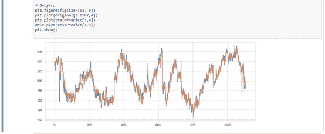

# 在 Python 中使用 LSTM 完成历史温度记录

> 原文：<https://medium.com/analytics-vidhya/completing-historical-temperature-records-with-lstm-in-python-f505b10289e7?source=collection_archive---------6----------------------->

## 基于公共数据集，我们完成了智利 Azapa 气象站的历史媒体每日温度记录。


照片由 [Unsplash](https://unsplash.com?utm_source=medium&utm_medium=referral) 上的 [Sharad Bhat](https://unsplash.com/@sharadmbhat?utm_source=medium&utm_medium=referral) 拍摄

## 背景

本文的目标是探索 LSTM 网络来预测智利阿扎帕气象站 1977-1980 年间缺失的温度记录值。

该数据集是从拉丁美洲气候评估和数据集(LACA)发布的数据中获得的，通过查阅以下网站获得 6 个最近气象站的单个 TXT 文件:【http://lacad.ciifen.org/ES/


阿扎帕气象站(596)被选为目标。


## 正在准备数据集

我们从六个单独的 TXT 文件开始，保存为 CSV 格式。每个 CSV 工作站如下所示:


每个记录包含源标识、日期、TG(十分之一摄氏度的温度，是我们的目标数据)和质量数据来源(其中 Q_TG=0 是原始数据，Q_TG=9 是空值)。

我们生成一个唯一的数据帧，合并六个数据文件，仅保留每个文件的 TG 列(温度等级),并以日期作为索引:

```
# Importing and joining CSV in single dataframe 
import pandas as pd#importing first file as data_553 
data_553 = pd.read_csv("./LACA_blended_custom/TG_STAID000553.csv",names=['SOUID','DATE','TG553','Q_TG'],
                        header=0,parse_dates=['DATE'],index_col=['DATE'],usecols=['DATE','TG553'])#process for adding following files
def anexo(merge,newset):
    col_name = 'TG'+newset
    data_new = pd.read_csv(
               "./LACA_blended_custom/TG_STAID000"+newset+".csv",
               names=['SOUID','DATE',col_name,'Q_TG'],
               header=0,parse_dates=['DATE'],
               index_col=['DATE'],usecols=['DATE',col_name])

    merge_n=pd.merge(merge,data_new, how='inner', left_index=True, right_index=True)
    return merge_n#adding the other files
merge = anexo(data_553,'585')
merge = anexo(merge,'588')
merge = anexo(merge,'595')
merge = anexo(merge,'596')
merge = anexo(merge,'597')
```


## 数据预览和特征工程

首先，我们必须将 TG=-9999 的寄存器指定为 null，并将它们可视化

```
import matplotlib.pyplot as plt
import seaborn as sns #Replace with None cols with -9999
cols = ['TG553','TG588','TG585','TG595','TG596','TG597']
for col in cols:
    merge[col] = merge[col].apply(lambda x: None if x == -9999 else x)#missing value counts in each of these columns
Isnull = merge.isnull().sum()/len(merge)*100
Isnull = Isnull[Isnull>0]
Isnull.sort_values(inplace=True, ascending=False)
Isnull = Isnull.to_frame()
Isnull.columns = ['Nulls']
Isnull.index.names = ['Stations']
Isnull['Stations'] = Isnull.index#plot Missing values
plt.figure(figsize=(13, 5))
sns.set(style='darkgrid',color_codes=True,)
sns.barplot(x='Stations', y='Nulls', data=Isnull)
plt.xticks(rotation = 90)
plt.show()
```


可视化热图中的空数据

```
plt.figure(figsize=(12, 6))
sns.heatmap(merge.isnull())
plt.show()
```


我们可以观察到，在 1976 年 10 月至 1984 年 12 月期间，信息(黑色背景)非常紧凑

删除整个数据集中的空记录我们得到了 1477 条记录的最终集合，在 1976 年 12 月 28 日和 1984 年 11 月 21 日之间

```
anual = merge.groupby(merge.index.year)
serie = anual.size()plt.figure(figsize=(13, 5))
sns.set(style='whitegrid')
sns.barplot(x=serie.index, y=serie)
plt.xticks(rotation = 90)
plt.show()
```


## 使用 LSTM 网络预测缺失数据记录

首先，让我们使用 MinMaxScaler 缩放数据。我喜欢在专题工作结束时使用我的 Jupiter 笔记本中的数据集副本，然后我可以在不影响最终数据集的情况下采用不同的方法来实现目标。

在这种情况下，变量有相似的值，那么缩放可能是不必要的，但我喜欢使用低的和相似的值，这总是可能的。

```
from sklearn.preprocessing import MinMaxScaler
dataset = merge.copy()dataset.reset_index(inplace=True, drop=True)scaler = MinMaxScaler()
reshape  = ['TG553','TG588','TG585','TG595','TG596','TG597']
dataset[reshape] = scaler.fit_transform(dataset[reshape])
```

我们必须在训练和测试中分割数据集以保持连续的形状

```
rate = 0.75  
tst_train_len = int(len(dataset)*rate)
tst_test_len = len(dataset) - tst_train
train, test = dataset.loc[0:tst_train_len,:],
              dataset.loc[tst_train_len:len(dataset),:]
```

当使用 LSTM 时，我们必须编程一个回看窗口功能。在这个函数中，我们接收 dataframe 或 serie 对象，并返回 X 和 Y numpy 对象。

如果我们定义回顾大小为 3，我们需要前 3 个记录作为 X 来获得第一个目标 y。在一个简单的例子中，如果我们有这个 X=[a，b，c，d，e，f]并且回顾=3，我们将获得:

a、b、c -> d

b、c、d -> e

c、d、e -> f

然后我们丢失了一些数据，我们有 6 个数据记录，只有 3 个标签。

```
def create_dataset(dataset, look_back=1):
    dataX, dataY = [], []
    for i in range(len(dataset)-look_back-1):
        a = np.array(dataset.loc[i:(i+look_back), :])        
        dataX.append(a)
        dataY.append(np.array(dataset.loc[i + look_back, :]))
    return np.array(dataX), np.array(dataY)
```

然后，我们将该函数应用于训练和测试数据，在第一次试验中，我们使用 look_back=3

```
from keras.models import Sequential
from keras.layers import Dense, LSTM
from keras.callbacks import ModelCheckpointlook_back = 3trainX, trainY = create_dataset(train,look_back)
testX, testY = create_dataset(test,look_back)
```

我们准备开始我们的 LSTM 神经网络。在第一次试验中，我们配置四个感知器，批量=1，训练 10 个时期。看起来不错，然后我们尝试 50 个纪元。

```
from keras.models import Sequential
from keras.layers import Dense, LSTMcnt_perc = 4
cnt_epoch = 50
bz = 1model = Sequential()
model.add(LSTM(cnt_perc, input_shape=(look_back+1,6)))
model.add(Dense(6))
model.summary()
model.compile(loss='mean_squared_error', optimizer='adam')model.fit(trainX, trainY, epochs=cnt_epoch, batch_size=bz)trainPredict = scaler.inverse_transform(model.predict(trainX))testPredict = scaler.inverse_transform(model.predict(testX))
```

为了评估分数，我们必须关注回看窗口，在这个 python 示例中，我们评估第 4 列中的准确性:Azapa 站(TG596)

```
from sklearn.metrics import mean_squared_error
import mathtrainScore = math.sqrt(mean_squared_error(original[look_back:(len(trainX)+look_back),4], trainPredict[:,4]))
print('Train: %.2f RMSE' % (trainScore))testScore = math.sqrt(mean_squared_error(original[len(trainX)+(look_back*2)+1:,4], testPredict[:,4]))
print('Test: %.2f RMSE' % (testScore))
```

获得准确度(日平均值的 0.471 度是初始尝试的合理准确度):

火车:6.56 RMSE，测试:4.71 RMSE



## 让 LSTM 接近精确

我们可以试着改变一些参数。回顾窗口、批量大小、更多训练时期和网络结构。

在做了一些测试后，有六个感知器模型运行得更好:

```
# Grafico
plt.figure(figsize=(13, 5))
plt.plot(original[4:1107,4])
plt.plot(trainPredict[:,4])
#plt.plot(testPredict[:,4])
plt.show()
```


最终分数:训练:0.80 RMSE，测试:0.55 RMSE

# 摘要

在这种情况下，LSTM 是获得精确预测值的绝佳工具。我们必须小心数据集索引和用于生成和评估 X，Y 训练和测试的例程。

我希望这篇文章对你有用，这是我在这里的第一份工作，如果有什么可以做得更好的，我将非常感谢您的评论和报告。

您可以在我的 Github 中访问完整的 Jupyter 笔记本和数据集:[https://github.com/gnaya73/medium](https://github.com/gnaya73/medium)