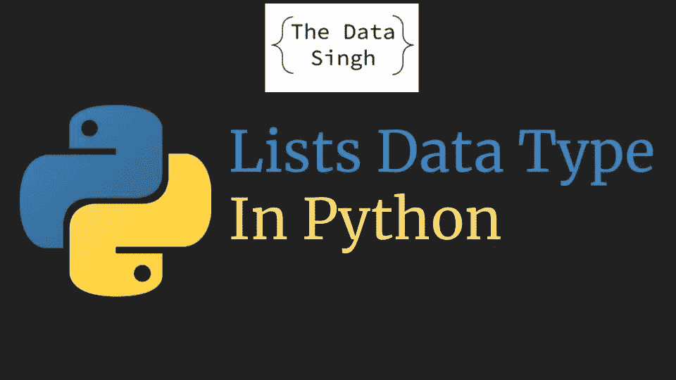

# Python 中的复杂数据类型

> 原文：<https://medium.com/analytics-vidhya/complex-data-types-in-python-26a25b917f64?source=collection_archive---------19----------------------->

在前一篇博客中，我们讨论了 python 中的简单数据类型，如果你想了解 Python 中的基本数据类型，可以看看这篇博客:[https://medium . com/analytics-vid hya/Data-Types-in-Python-c23b 8178 f96d](/analytics-vidhya/data-types-in-python-c23b8178f96d)

让我们来谈谈 python 中更多的数据类型:

# 目录

列表基本上是相同或不同数据类型的元素的集合。

让我们讨论一个使用列表的用例。

你必须为学生存储分数数据:英语、数学、科学

我们可以对每个学生使用 3 个不同的变量。

> var eng=90
> 
> var 数学=99
> 
> var sci=89

如果我们继续为每个学生添加这些类型的变量，我们可能会有大量的变量，创建一个非常难以管理的代码。

第二种选择是创建一个变量，并在其中存储所有三个标记，如下所示

> var marks_1= [90，99，89]
> var marks_2= [94，88，81]
> var marks_3= [91，90，82]

我们用来存储数据的这种新的数据结构叫做 List。

它可以有相同或不同类型的数据，例如

> var student_1=["The Data Singh "，" 28 "，" SDE"]
> 
> var marks_1=[90，89，69]

列表是 Python 中广泛使用的数据类型之一。

一些最常用的列表方法有:

> 马克斯 _1。 **append** (99) #在列表中添加新元素
> 
> 马克斯 _1。**扩展** ([10，20]) #将一个列表的所有元素添加到现有列表中
> 
> 马克斯 _1。**pop**(index)#像堆栈一样从列表中弹出一个值
> 
> 马克斯 _1。**反转**()#反转。一份名单
> 
> 马克斯 _1。 **insert** (index，value)#向特定索引添加一个值

现在我们已经知道了如何创建一个列表并向列表中添加值，让我们看看如何从列表中访问元素。

# 列表索引

在 python 中，列表中的索引从 0 开始。

为了从列表中访问元素，您可以使用以下命令

> marks _ 1[0]#将访问列表的第一个元素
> 
> marks_1[1] #将访问列表的第二个元素，依此类推…
> 
> marks _ 1[-1]#将访问列表的最后一个元素
> 
> marks _ 1[-2]#将访问列表的倒数第二个元素，依此类推…

# 列表切片

我们还可以使用列表切片在一条语句中访问多个元素。

> marks _ 1[1:5]#这将访问从 1 到 4 的元素，即 1，2，3，4。 **5 不包含在**元素中

我们也可以跳过这个切片的起点或终点

> marks_1[:5]将给出从 1 到 5 的所有元素，即 0，1，2，3，4

在下一篇文章中，我们将讨论字典数据类型的用例及用法。

一定要看看我在 youtube 上的频道:[数据辛格](https://www.youtube.com/TheDataSingh)

我的博客链接:[科技球探](https://techscouter.blogspot.com/)

快乐学习