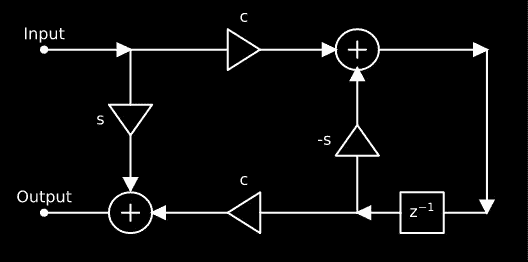
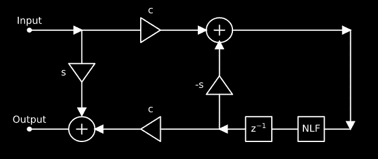
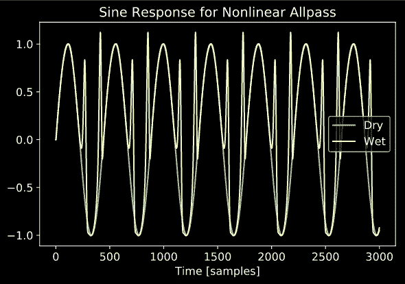
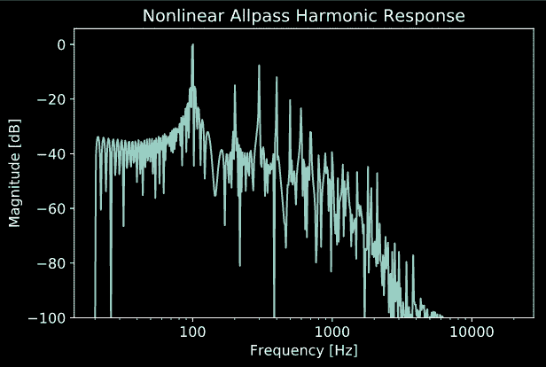
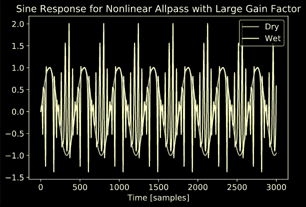
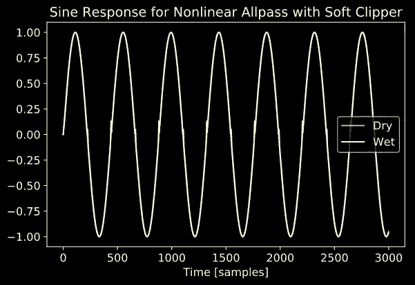
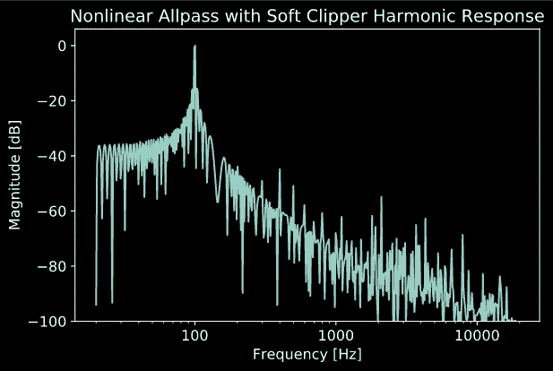

# 复杂非线性第 8 集:非线性全通滤波器

> 原文：<https://medium.com/analytics-vidhya/complex-nonlinearities-episode-8-nonlinear-allpass-filters-bd177c71078f?source=collection_archive---------11----------------------->

今天我们将研究一种有趣的非线性效果，这种效果可以用在声音合成中来创造一些有趣的纹理。我是通过我的两位导师 Romain Michon 和 Julius Smith 在 2011 年的 DAFx 论文中发现这个技巧的。虽然在本文中我不会超出他们的工作太多，但我计划使用这个处理器作为未来非线性效果的构建块。

和往常一样，本文可以看作是一个 Jupyter 笔记本，展示了所有提到的概念的代码示例。点击这里查看[。](https://ccrma.stanford.edu/~jatin/ComplexNonlinearities/NLAllpass.html)

# 基本结构:梯形滤波器

我们将从梯形滤波器的基本结构开始。一阶“归一化”梯形滤波器如下所示:

归一化一阶梯形滤波器

为了构建一个全通滤波器，选择滤波器系数，使得 s= *sin* ⁡(θ)和 c= *cos* ⁡(θ)，其中θ是π和π之间的某个数。

这种滤波器结构的第一个真正酷的地方是，它可以递归地扩展到高阶滤波器。作为示例，我们在下面展示了一个二阶滤波器。“NLF”框指的是上图所示的一阶梯形滤波器。

归一化二阶梯形滤波器

上面显示的递归性质可以用来非常简单地生成任意阶的梯形滤波器结构！

# 添加非线性

现在，我们可以通过改变每个样本的滤波器系数来使梯形滤波器非线性，从而使 s=sin(g∗x[n])s=sin⁡(g∗x[n]]和 c=cos(g∗x[n])c=cos⁡(g∗x[n])，其中 x[n]x[n]是该时间步长的输入样本，gg 是某个增益因子。

当我第一次听说这项技术时，我认为它听起来更像是一个时变滤波器，而不是一个非线性过程。经过一段时间的思考，我得出的结论是，在这个过程中，可以认为是非线性的，也可以认为是时变的，这取决于你如何看待它:如果你将这个滤波器视为具有时变系数的线性滤波器，那么这个过程可以被视为线性时变系统，这将是完全有效的。然而，你也可以把这个过程看作是一个增益依赖于输入的有状态过程，在这种情况下，它看起来更像是一个非线性系统，可以这样分析。

这种模糊性实际上挺好的，因为当我们分析这个系统时，我们有很多工具可以选择。我们可以使用时变滤波器理论中的工具，也可以使用我们通常用来分析非线性系统的工具，这两种方法都同样有效。

下面，我们展示 100 Hz 正弦波对 4 阶非线性全通滤波器的响应。

# 增加更多非线性

玩了一会儿这些非线性全通滤波器后，我注意到，当提高滤波器系数的增益系数时，滤波器开始变得非常粗糙，并对输入正弦波表现出“包裹”效应。

有时这种包装听起来很酷，但我绝对可以想象我可能想要一个“更平滑”的声音的情况。作为解决方案，我更新了滤波器系数方程，加入了另一个非线性函数:tanhtanh 软限幅器。所以新的系数方程可以写成 s =*sin*(π*tanh*(g∫x[n]))和 c =*cos*⁡(π*tanh*⁡(g∗x[n])).(注意，额外的π系数是为了保持范围在π和π之间。)

因此，如果增益系数提高到非常高的水平，非线性滤波器的失真会保持相对平稳。

# 履行

为了更好地理解这种效果可以产生的声音类型，我创建了一个简单的音频插件(VST，AU)来实现这种效果。我还包括 8 倍过采样，以帮助避免讨厌的混叠伪像。为了展示非线性全通滤波器如何用于合成，我还录制了一个简短的视频演示，在简单的正弦波上使用非线性全通滤波器。你可以在 [YouTube](https://youtu.be/3A2DKdlSnlQ) 上找到视频，在 [GitHub](https://github.com/jatinchowdhury18/ComplexNonlinearities) 上找到源代码。

# 最后…

感谢您阅读本系列关于复杂非线性信号处理的另一篇文章！希望很快就能看到这种非线性全通滤波器结构的一些有趣应用。与此同时，如果你想找些东西读，一定要看看我的新系列[“糟糕的电路建模”](/@jatinchowdhury18/bad-circuit-modelling-episode-1-component-tolerances-3ffdbe4e980c?source=your_stories_page---------------------------)。