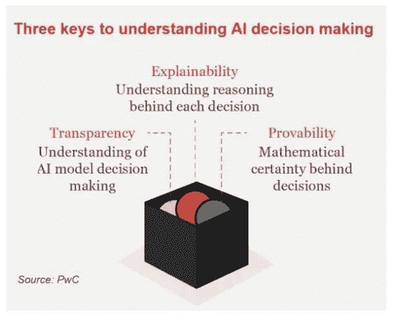
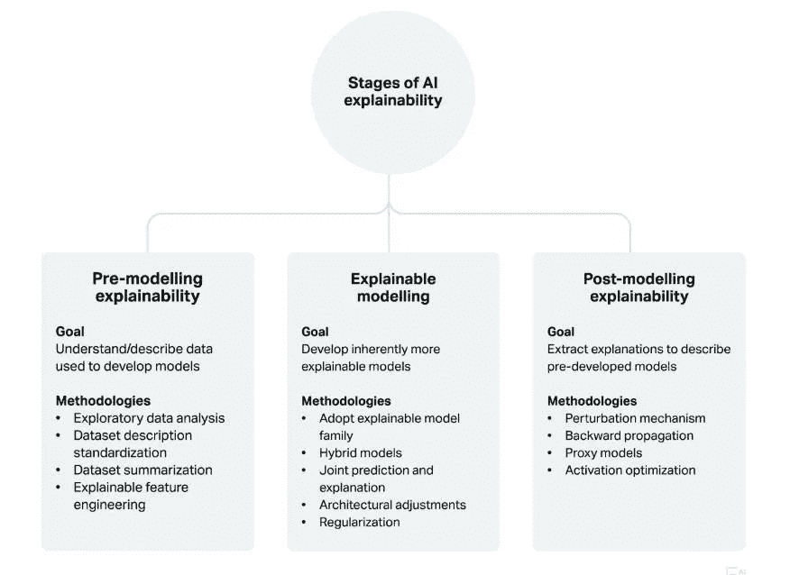
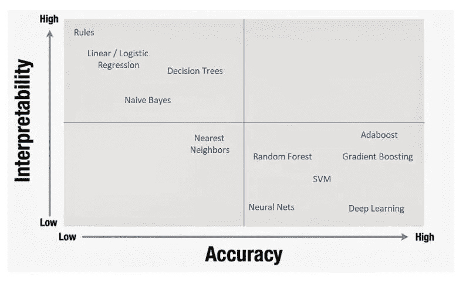

# 用 SHAPley 直觉理解人工智能模型决策-第 1 部分

> 原文：<https://medium.com/analytics-vidhya/comprehending-ai-model-decisions-with-shapley-intuitions-part-1-5d11cb79862c?source=collection_archive---------16----------------------->

想象一下，你被困在数据科学职业生涯中最糟糕的困境中，在那里你花费了几个小时，在周末辛苦工作，用最大化的隐藏层和最佳超参数来构建性能最佳的模型。但是，却无法向项目利益相关者解释你的深度学习模型在解决业务问题时所采取的自动化决策背后的理性。虽然在这种情况下着陆并不少见，但如果没有退出计划或解释，你肯定会遭到强烈反对。

人工智能可解释性的三个主要向量

为了获得社区对这种人工智能决策困境的回应，我几周前在 linkedIn 上发起了一项简短的调查，以理解复杂模型开发与可解释性的范式。令我惊讶的是，大部分投票都强烈支持可解释的人工智能，而不是复杂的人工智能。作为探索可解释人工智能未知领域的努力，我设计了一个巧妙的方法来整合可解释性作为开发管道的一部分。为了传达一个可理解的外卖，我已经建立了一个简单的表现形式，在 [TMDB 电影数据集](https://www.kaggle.com/c/tmdb-box-office-prediction/data)上添加可解释的管道来执行电影票房预测。接下来的工作不仅会让你接触到 SHAP 解释者的全新世界，还会在模型设计和开发中触发新的垂直维度。

可解释性可以在模型开发的不同阶段引入。通常，主要的插入点可以通过下面的快照来描述。

人工智能可解释性的不同阶段

然而，可解释性和准确性的概念经常在 ML 从业者和数据科学家中混淆。通常，下图显示了一个直观趋势，其中可解释性随着模型准确性的增加而降低，反之亦然，如神经网络、随机森林、梯度增强、SVM、Adaboost 等高级算法。用于初始基准测试的基本算法，如回归、朴素贝叶斯、决策树等，显示出相当高的准确性和高度的可解释性。

可解释性 v/s 准确性

你现在可能想知道从 SHAP、莱姆和 Grad-CAM 等模型解释工具或管道中可以得到什么类型的答案。好吧，我整理了一些这样的问题，它们的答案可以通过这些工具得到:

1.  *就解释结果而言，每个连接的权重意味着什么？*
2.  *哪组权重在最终预测中起着最重要和最有影响力的作用？*
3.  知道权重的大小能告诉我输入变量的重要性吗？
4.  *给定一些输入，哪些权重被激活得更快？*
5.  *图像的哪些区域被特定的卷积层检测到？*
6.  哪个特征最能描述我们的最终预测？
7.  *模型决策的主要影响者有哪些？我能以最佳方式操纵它吗？*

如果不是 explainer 工具利用模型分叉机制来提取特征重要性以及训练过程中的实时数据影响因素，寻找上述问题的清晰答案可能会成为圣杯。这样一个直观而全面的介绍一定已经在读者中注入了一些兴奋和好奇。这只是我关于人工智能解释者的新系列的开始。请继续关注本期的下一部分，在那里我将分享 SHAP 解释者关于张量流模型的结果和观察。

用掌声展示你在地球上的存在，并不断分享，因为学习永不停止。在 [*中*](/@Immaculate_sha2nk) *，* [*脸书*](https://www.facebook.com/TheSha2nk) *，* [*推特*](https://twitter.com/TheSha2nk) *和*[*GitHub*](https://github.com/Shashank545)*上做跟随和支持我的其他作品。*

*！！保持好奇！保持专注！继续读！干杯！！*