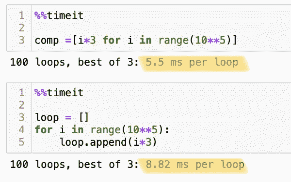

# 理解 Python 列表理解—初学者指南

> 原文：<https://medium.com/analytics-vidhya/comprehending-python-list-comprehensions-a-beginners-guide-7c97841c4eb0?source=collection_archive---------30----------------------->


马库斯·温克勒在 [Unsplash](https://unsplash.com?utm_source=medium&utm_medium=referral) 上的照片

*“哇，我怎么会在这里？我只是想找到一个简单的解释，到底什么是列表理解，现在我已经读了 10 篇文章，它们都非常复杂，我仍然不明白为什么我不应该使用 for 循环。”好了，给你，我将简单地分解如何理解和制定理解列表，并教你如何从一个虚构的政府机构获得晋升。*

# 为什么？

你可能会坐在那里对自己说，*“我了解循环以及如何形成循环，为什么要在这个地球上浪费我有限的时间*(或者如果你是一个扁平的地球，那就是圆盘)*学习如何以不同的方式做同样的事情？”*好吧，我问你:*“为什么史蒂夫·乔布斯设计的 iPhone 带有屏幕键盘，而不是功能更强大的硬件键盘？”*风格和成长空间。学习列表理解将使你的代码更加精简，更容易阅读，适应性更强。Python 在可读性方面是一种独特的语言，所以我们希望利用我们拥有的每一种工具来使我们的代码更容易阅读。

> 好吧，也许史蒂夫·乔布斯的比喻有点浮夸，但是学习这种技能来提高你的编码技能将会带来回报。


[动作推进](https://unsplash.com/@actionvance?utm_source=medium&utm_medium=referral)对[去飞溅](https://unsplash.com?utm_source=medium&utm_medium=referral)拍照

*简单地说，你可能想知道列表理解和 for 循环之间是否有速度或效率上的差异。简短的回答是肯定的，在一个非科学的测试中，列表理解比循环运行得更快，下面是一个片段。但是，有几件事需要注意。列表理解的工作方式是，在将列表写入变量之前，将列表的所有元素都放在内存中，这在大多数情况下都没问题，除非您正在处理非常非常大的列表。但是为了忠实于这篇博客，我不会再深入下去了。更多信息请查看 RealPython* *:* 的这篇精彩文章的结尾



# 现在说点好的

让我们来分解一下列表理解的结构

我将用两种方法来做这件事:首先，我要用循环的标准来说，然后我要用列表理解结构来说。 ***注意，任何格式化的*** `***like this***` ***都是代码或者伪代码***

如果我们使用 for 循环构建一个列表，第一步是创建一个空白列表

```
lst = []
```

接下来我们通过对`*some iterable*`中的`*some dummy variable*` 说 for 来初始化 for 循环

```
for member in monty_py:
```

对于一个没有条件的简单 For 循环，然后写出空白列表，添加`.append()`，然后在新列表的每一项中输入您想要的内容(通常使用虚拟变量)。

```
 lst.append(member.title())
```

> 对于列表理解，我们跳过第一步，因为我们是直接在理解中做列表。

在括号内，我们看到的第一段代码是应该放在`.append()`方法内的代码——换句话说，就是我们希望放在新列表每一项中的代码。 ***注意:在大多数情况下，我们使用一个虚拟变量，它实际上是我们循环遍历的 iterable 中每一项的占位符。*** 在列表理解中，我们在前引用虚拟变量**，我们在`*for*` 部分声明它。这是很多新 Python 程序员的困惑点。虚拟变量被*引用*到*然后*在列表理解的下一个片段中指定。下面的例子会让你更清楚。**

然后我们有了我们的`for` 语句，在这里我们声明了这个虚拟变量并指出它循环通过的内容。

# **我们来看一些例子**

```
[x+5 for x in range(6)]*OUT[1]: [5, 6, 7, 8, 9, 10]*
```

让我们从后向前分解:我们的 iterable 是一个从 0 到 5 的 [range 对象](https://www.w3schools.com/python/ref_func_range.asp)，我们设置虚拟变量`x`来循环遍历范围中的每个实例，我们的新列表中的每个项目都是`x+5`。所以我们输出的第一个项目是范围内的第一个项目`0`，将其设置为`x`，然后运行代码`x+5`，然后`x`被设置为范围对象中的下一个项目，我们重复运行`x+5`代码。我们对此进行循环，直到到达 iterable 对象`range(6)`的末尾，然后计算出的每个实例都被写入新列表！砰，这就是你的列表理解。


现在让我们快速地看一个稍微不那么做作但却愚蠢得多的例子。比方说，你的愚蠢走步部经理要求你检查他们是否开发了独特的走步。纳税人并没有资助你的部门去创造一堆陈词滥调或重复愚蠢的步态！你意识到你可以通过编辑一个愚蠢的形容词列表来描述每一个部里帮助开发的愚蠢的行走来做到这一点。为您提供了一个包含愚蠢行走名称的字符串列表，您希望创建一个只包含列表中每个项目的第一个单词的列表。我们想使我们的代码简洁，所以我们决定做一个列表理解！

> 我强烈建议打开一个 Python 环境，在继续阅读之前尝试自己做这件事，或者至少和我一起编码。这真的有助于记忆！

好的，我们问的第一个问题是“我们如何从一个多单词的字符串中选择第一个单词？”一种解决方案是使用`[.split()](https://www.w3schools.com/python/ref_string_split.asp)` [方法](https://www.w3schools.com/python/ref_string_split.asp)然后从其结果中选择第一个项目。我们可以用两个单词的字符串来测试这一点:

看起来不错，现在把这个应用到提供的愚蠢的散步列表。所以我们想对列表中的每一项应用`.split()`方法，所以我们只需要用一个虚拟变量替换上面代码探索中的`str`，然后创建包含所提供列表的`for loop`:

简单！你的老板很激动，正在为你举办一个愚蠢的游行。将我们的列表理解与使用标准的`for loop`进行比较:

该标准中有更多的内容

***注意*** 在上面的循环中，`walk`是一个虚拟变量。从技术上来说，我可以把它写成`for x in silly_walks:`或`for temp in silly_walks:`或`for twenty in silly_walks:`，尽管把它写成一个单数名词来指代列表中的每一项实际上是什么有助于提高代码的可读性。

一旦你掌握了理解列表的语法，它实际上会比做 for 循环更直观。您只需用一个`bracket`打开，写下您希望目标列表中的每一项包含的内容，然后编写一个`for`语句来循环遍历您的 iterable。

**关于条件语句、多个变量和其他 Python 对象理解的列表理解，可以在我的下一篇文章** **中找到** [**！感谢阅读！**](https://joebrowz.medium.com/comprehending-python-list-comprehensions-ii-lost-in-new-york-e8af27038f4b)