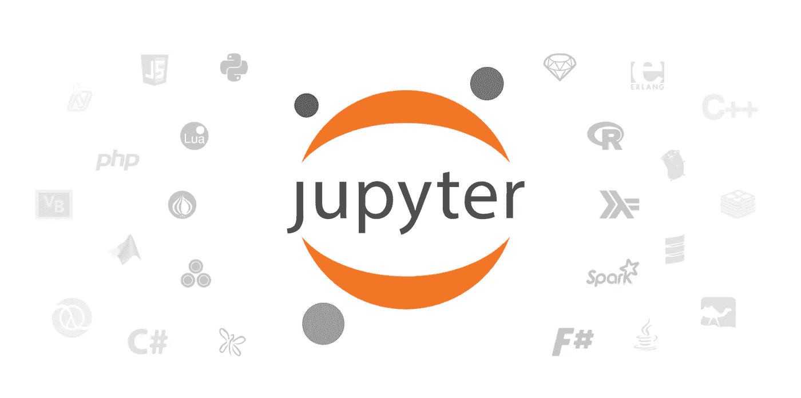

# Comprehensive Beginner’s Guide to Jupyter Notebooks for Data Science & Machine Learning

> 原文：<https://medium.com/analytics-vidhya/comprehensive-beginners-guide-to-jupyter-notebooks-for-data-science-machine-learning-3289f746856e?source=collection_archive---------2----------------------->

One of the most common question people ask is which IDE / environment / tool to use, while working on your data science projects. As you would expect, there is no dearth of options available — from language specific IDEs like R Studio, PyCharm to editors like Sublime Text or Atom — the choice can be intimidating for a beginner.

If there is one tool which every data scientist should use or must be comfortable with, it is Jupyter Notebooks (previously known as iPython notebooks as well). Jupyter Notebooks are powerful, versatile, shareable and provide the ability to perform data visualization in the same environment.

Jupyter Notebooks allow data scientists to create and share their documents, from codes to full blown reports. They help data scientists streamline their work and enable more productivity and easy collaboration. Due to these and several other reasons you will see below, Jupyter Notebooks are one of the most popular tools among data scientists.



In this article, we will introduce you to Jupyter notebooks and deep dive into it’s features and advantages.

By the time you reach the end of the article, you will have a good idea as to why you should leverage it for your machine learning projects and why Jupyter Notebooks are considered better than other standard tools in this domain!

Are you ready to learn? Let’s begin!

# Table of Contents

*   What is a Jupyter Notebook?
*   How to Install Jupyter Notebook?
*   Getting Started!
*   Using the Magic Functions
*   Not just limited to Python — Use R, Julia and JavaScript within Notebooks
*   Interactive Dashboards in Jupyter Notebooks — why not?
*   Keyboard Shortcuts — Save time and become even more productive!
*   Useful Jupyter Notebook Extensions
*   Saving and Sharing your Notebook
*   JupyterLab — The evolution of Jupyter Notebooks
*   Best Practices and Tips

# What is a Jupyter Notebook?

Jupyter Notebook is an open-source web application that allows us to create and share codes and documents.

It provides an environment, where you can document your code, run it, look at the outcome, visualize data and see the results without leaving the environment. This makes it a handy tool for performing end to end data science workflows — data cleaning, statistical modeling, building and training machine learning models, visualizing data, and many, many other uses.

Jupyter Notebooks really shine when you are still in the prototyping phase. This is because your code is written in indepedent cells, which are executed individually. This allows the user to test a specific block of code in a project without having to execute the code from the start of the script. Many other IDE enviornments (like RStudio) also do this in several ways, but I have personally found Jupyter’s individual cells structure to be the best of the lot.

正如您将在本文中看到的，这些笔记本电脑是数据科学家手中不可思议的灵活、交互和强大的工具。它们甚至允许你运行除 Python 之外的其他语言，比如 R，SQL 等等。因为它们比 IDE 平台更具交互性，所以它们被广泛用于以更具教育性的方式显示代码。

# 如何安装 Jupyter 笔记本

现在您可能已经猜到了，您需要首先在您的机器上安装 Python。Python 2.7 或 Python 3.3(或更高版本)都可以。

# 蟒蛇

对于新用户，普遍的共识是应该使用 Anaconda 发行版来安装 Python 和 Jupyter 笔记本。

Anaconda 安装了这两个工具，并包含了相当多的在数据科学和机器学习社区中常用的包。你可以从[这里](https://jupyter.readthedocs.io/en/latest/install.html)下载 Anaconda 的最新版本。

# pip 方法

如果出于某种原因，您决定不使用 Anaconda，那么您需要确保您的机器运行的是最新的 *pip* 版本。你是怎么做到的？如果您已经安装了 Python，那么 pip 就已经存在了。要升级到最新的 pip 版本，请遵循以下代码:

```
#Linux and OSX pip install -U pip setuptools #Windows python -m pip install -U pip setuptools
```

一旦 pip 准备就绪，您就可以开始安装 Jupyter 了:

```
*#For Python2* *pip install jupyter* *#For Python3* *pip3 install jupyter*
```

你可以在这里查看官方 Jupyter 安装文档。

# 入门！

我们现在已经了解了这些笔记本是什么，以及如何在我们自己的机器上设置它们。派对开始的时间到了！

要运行您的 Jupyter 笔记本，只需输入下面的命令，您就可以开始了！

```
*jupyter notebook*
```

完成此操作后，Jupyter 笔记本将在您的默认网络浏览器中打开，网址如下:

[http://localhost:8888/tree](http://localhost:8888/tree)

在某些情况下，它可能不会自动打开。将在终端/命令提示符下生成一个带有令牌密钥的 URL。打开笔记本时，您需要将整个 URL(包括令牌密钥)复制粘贴到浏览器中。

打开笔记本后，你会在顶部看到三个标签:文件、运行和集群。Files 基本上列出了所有的文件，Running 显示了你当前打开的终端和笔记本，Clusters 由 IPython parallel 提供。

要打开新的 Jupyter 笔记本，请单击页面右侧的“新建”选项。在这里，您有四个选项可供选择:

*   Python 3
*   文本文件
*   文件夹
*   末端的

在文本文件中，给你一张白纸。添加任何你想要的字母、单词和数字。它基本上是一个文本编辑器(类似于 Ubuntu 上的应用程序)。你也可以选择一种语言(有太多的语言给你了)，这样你就可以用它写一个脚本。您还可以在文件中查找和替换单词。

在文件夹选项中，它如其名所示。你可以创建一个新的文件夹来存放你的文件，重命名和删除它，无论你的要求。

终端的工作方式与 Mac 或 Linux 机器上的终端完全一样(Windows 上为 cmd)。它在你的网络浏览器中支持终端会话。在这个终端中输入 *python* ，瞧！您的 python 脚本已经可以编写了。

但在本文中，我们将重点关注笔记本，因此我们将从“新”选项中选择 Python 3 选项。您将看到以下屏幕:


然后，您可以通过导入最常见的 Python 库开始:pandas 和 numpy。在代码上方的菜单中，您可以选择操作单元格:添加、编辑、剪切、上下移动单元格、运行单元格中的代码、停止代码、保存您的工作并重启内核。


在下拉菜单中(如上所示)，您甚至有四个选项:

*   **代码** —这是不言自明的；这是您键入代码的地方
*   **Markdown** —这是你输入文本的地方。您可以在运行代码后添加您的结论，添加注释等。
*   Raw NBConvert —这是一个命令行工具，可以将你的笔记本转换成另一种格式(比如 HTML)
*   **标题** —这是你给不同的部分添加标题的地方，让你的笔记本看起来整洁。这现在已经被转换成降价选项本身。添加一个“##”以确保您在此之后键入的任何内容都将被视为标题

# 使用 Jupyter 笔记本的神奇功能

开发人员已经插入了预定义的神奇功能，使您的生活更轻松，您的工作更具互动性。您可以运行下面的命令来查看这些函数的列表(注意:通常不需要“%”，因为 Automagic 通常是打开的):

```
*%lsmagic*
```

你会看到列出了很多选项，你甚至可以认出几个！像%clear、%autosave、%debug 和%mkdir 这样的函数你以前一定见过。现在，魔法命令以两种方式运行:

顾名思义，行方式是指希望执行单个命令行，而单元方式是指希望不仅执行一行，而是执行整个单元中的整个代码块。

在行方面，所有给定的命令必须以%字符开始，而在单元方面，所有命令必须以%%开始。让我们看看下面的例子，以便更好地理解:

线路方面:

```
*%time a = range(10)*
```

细胞方面:

```
*%%timeit a = range (10)**min(a)*
```

我建议您运行这些命令，亲自看看有什么不同！

# 不仅仅局限于 Python——在笔记本中使用 R、Julia 和 JavaScript

魔法不止于此。你甚至可以在笔记本上使用其他语言，比如 R，Julia，JavaScript 等等。我个人喜欢 R 中的“ggplot2”包，因此使用它进行探索性数据分析是一个非常非常大的好处。

要在 Jupyter 中启用 R，您需要 GitHub 上提供的“IRKernel”(R 专用内核)。这是一个 8 步的过程，已经详细解释过了，还有截图来指导你，[这里](https://discuss.analyticsvidhya.com/t/how-to-run-r-on-jupyter-ipython-notebooks/5512)。

如果你是 Julia 用户，你也可以在 Jupyter 笔记本上使用它！查看[这篇全面的文章](https://www.analyticsvidhya.com/blog/2017/10/comprehensive-tutorial-learn-data-science-julia-from-scratch/)，它专注于为 Julia 用户学习数据科学，并包括一个关于如何在 Jupyter 环境中利用它的部分。

如果你更喜欢使用 JavaScript，我推荐使用‘IJavascript’内核。看看这个 [GitHub 库](https://github.com/n-riesco/ijavascript)，它会带你完成在不同的操作系统上安装这个内核所需的步骤。请注意，您需要安装 *Node.js* 和 *npm* 才能使用它。

# Jupyter 笔记本中的交互式仪表盘——为什么不呢？

在添加小部件之前，您需要导入*小部件*包:

```
*from ipywidgets import widgets*
```

小部件的基本类型是典型的文本输入、基于输入和按钮。请看下面这个取自 Dominodatalab 的例子，它展示了一个交互式小部件的外观:


你可以点击查看一个全面的小工具指南[。](https://blog.dominodatalab.com/interactive-dashboards-in-jupyter/)

# 键盘快捷键—节省时间，提高工作效率！

快捷方式是 Jupyter 笔记本最棒的地方之一。当你想运行任何代码块的时候，你需要做的就是按 Ctrl+Enter。Jupyter 笔记本提供了更多的键盘快捷键，为我们节省了大量时间。

下面是我们精心挑选的一些快捷方式，在你开始时会对你有很大的用处。我强烈建议你在一个一个阅读的时候尝试一下。你不会知道没有他们你是怎么生活的！

Jupyter 笔记本提供两种不同的键盘输入模式——命令和编辑。命令模式将键盘绑定到笔记本级别的命令，由带有蓝色左边距的灰色单元格边框表示。编辑模式允许您在活动单元格中键入文本(或代码)，并以绿色单元格边框表示。

**分别使用 Esc 和 Enter 在命令和编辑模式之间跳转。现在就尝试一下吧！**

一旦进入命令模式(即没有活动单元格)，您可以尝试以下快捷方式:

*   a 将在当前单元格上方插入一个新单元格，B 将在当前单元格下方插入一个新单元格
*   要删除单元格，请连续按两次 D
*   若要撤销已删除的单元格，请按 Z
*   y 将当前活动单元格变为代码单元格
*   按住 Shift +向上或向下箭头键选择多个单元格。在多重选择模式下，按 Shift + M 将合并您的选择
*   f 将弹出“查找和替换”菜单

在编辑模式下(在命令模式下按回车键进入编辑模式)，您会发现以下快捷方式很方便:

*   Ctrl + Home 转到单元格的开头
*   Ctrl + S 将保存您的进度
*   如上所述，Ctrl + Enter 将运行整个单元块
*   Alt + Enter 不仅会运行您的单元格块，它还会在下面添加一个新的单元格
*   Ctrl + Shift + F 打开命令选项板

要查看键盘快捷键的完整列表，请在命令模式下按“H”键，或者转到“帮助”>“键盘快捷键”。请定期检查，因为新的快捷方式会频繁添加。

# 有用的 Jupyter 笔记本扩展

扩展是提高 Jupyter 笔记本工作效率的一种非常有效的方式。我发现安装和使用扩展的最好工具之一是“Nbextensions”。在你的机器上安装它只需要两个简单的步骤(也有其他方法，但我发现这是最方便的):

**第一步:**从 *pip* 安装:

```
pip install jupyter_contrib_nbextensions
```

**第二步:**安装相关的 JavaScript 和 CSS 文件:

```
jupyter contrib nbextension install --user
```

完成后，您将在 Jupyter 笔记本电脑的顶部看到一个“Nbextensions”标签。瞧啊。有一组非常棒的扩展可以用于您的项目。


要启用扩展，只需点击它来激活它。我在下面提到了 4 个我认为最有用的扩展:

*   **Code pretify:**它重新格式化并美化代码块的内容。


*   **Printview:** 这个扩展增加了一个工具栏按钮，为当前的笔记本调用 *jupyter nbconvert* ，并可选地在新的浏览器标签中显示转换后的文件。
*   **草稿栏:**这增加了一个草稿栏单元，使您无需修改笔记本就能运行代码。当你想试验你的代码但不想在你的笔记本上做的时候，这是一个非常方便的扩展。
*   **目录(2):** 这个牛逼的扩展收集了你笔记本里所有的标题，并在浮动窗口中显示出来。

这些只是您可以随意使用的一些扩展。我强烈建议查看他们的全部列表，并尝试使用它们。

# 保存和共享您的笔记本

这是 Jupyter 笔记本最重要和最棒的功能之一。当我要写一篇博客文章，而我的代码和评论在一个 Jupyter 文件中时，我需要先把它们转换成另一种格式。请记住，这些笔记本都是 json 格式的，这对于分享并没有什么帮助。我不能在电子邮件或博客上发布不同的细胞块，对吗？

转到“文件”菜单，您会看到一个“下载方式”选项:


您可以在提供的 7 个选项中的任何一个中保存您的笔记本。最常用的要么是一个*。ipynb* 文件，这样其他人就可以在他们的机器或*上复制你的代码。html* 以网页形式打开(当你想保存嵌入笔记本的图片时，这很方便)。

您还可以使用 *nbconvert* 选项将笔记本手动转换为不同的格式，如 HTML 或 PDF。

你也可以使用 [jupyterhub](https://github.com/jupyterhub/jupyterhub) ，让你在服务器上托管笔记本，并与多个用户共享。许多顶尖的研究项目用这个来合作。

# Jupyter lab——Jupyter 笔记本电脑的发展

JupyterLab 于今年 2 月推出，被认为是 Jupyter 笔记本的进化。它提供了一种更加灵活和强大的项目工作方式，但使用的组件与 Jupyter 笔记本相同。JupyterLab 环境与 Jupyter 笔记本完全相同，但具有更高效的体验。


JupyterLab 使您能够在一个窗口中安排您的工作区域，包括笔记本、终端、文本文件和输出！你只需要把单元格拖放到你想要的地方。您还可以通过实时预览来编辑 Markdown、CSV 和 JSON 等流行文件格式，以查看实际文件中实时发生的变化。

如果你想在你的机器上试用，你可以在这里看到安装说明[。开发者的长期目标是让 JupyterLab 最终取代 Jupyter 笔记本。但这一点现在还有点遥远。](http://jupyterlab.readthedocs.io/en/stable/getting_started/installation.html)

# 最佳实践

虽然独自做项目很有趣，但大多数时候你会发现自己是在团队中工作。在这种情况下，遵循指导方针和最佳实践以确保您的代码和 Jupyter 笔记本被正确注释以与您的团队成员保持一致是非常重要的。在这里，我列出了一些你在使用 Jupyter 笔记本时绝对应该遵循的最佳实践:

*   对任何程序员来说，最重要的事情之一是——始终确保为代码添加正确的注释！
*   确保您拥有代码所需的文档
*   考虑一个命名方案，并在整个代码中坚持使用它，以确保一致性。这使得其他人更容易跟进
*   无论你的代码需要什么样的库，在笔记本的开头导入它们(并在它们旁边添加注释，说明你加载它们的目的)
*   确保代码中有适当的行距。你不希望你的循环和函数出现在同一行——当以后需要引用的时候，那会让你抓狂！
*   有时你会发现你的文件变得代码过多。查看如何隐藏一些你认为不重要的代码以供日后参考的选项。这对于让你的笔记本看起来更整洁是无价的
*   在 *matplotlib* 上查看[这个笔记本](http://nbviewer.jupyter.org/github/jrjohansson/scientific-python-lectures/blob/master/Lecture-4-Matplotlib.ipynb),看看它能被表现得多么漂亮和整洁

又一个奖励提示！当你想到创建一个演示文稿时，首先想到的工具是 PowerPoint 和谷歌幻灯片。但是你的 Jupyter 笔记本也可以制作幻灯片！还记得我说过它超级灵活吗？我没有夸张。

要将笔记本转换成幻灯片，请进入“视图”->“单元格工具栏”，然后单击“幻灯片”。嘣！现在，每个代码块的右侧都会显示一个“幻灯片类型”下拉选项。您将获得以下 5 个选项:


尝试每个选项，以便更好地理解它。它将改变你展示代码的方式！

# 结束注释

请注意，这并不是您可以用 Jupyter 笔记本做的事情的详尽列表。它还有更多的东西，你用得越多，你就越会学到这些东西。和许多事情一样，关键是通过实践进行实验。

看看这个 [GitHub 仓库](https://github.com/jupyter/jupyter/wiki/A-gallery-of-interesting-Jupyter-Notebooks)，里面有一系列有趣的 Jupyter 笔记本。

本指南只是您数据科学之旅的起点，我很高兴您能随身携带！请在下面的评论区告诉我你对 Jupyter 笔记本的看法以及它们对你的帮助。此外，如果您有任何问题，请告诉我！

*原载于 2018 年 5 月 24 日*[*www.analyticsvidhya.com*](https://www.analyticsvidhya.com/blog/2018/05/starters-guide-jupyter-notebook/)*。*