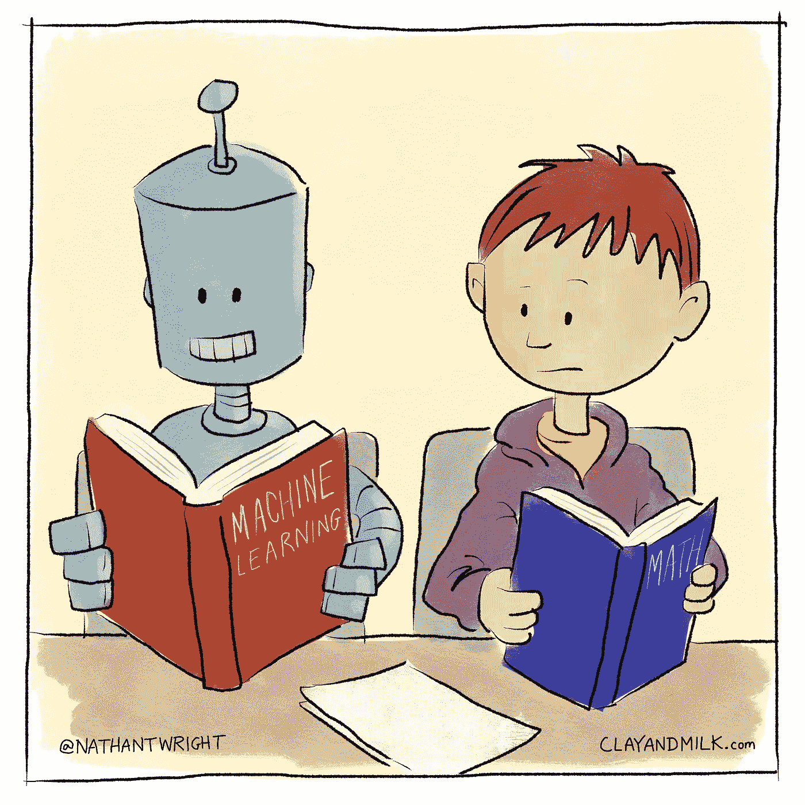
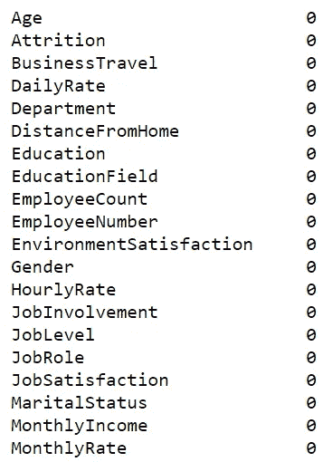
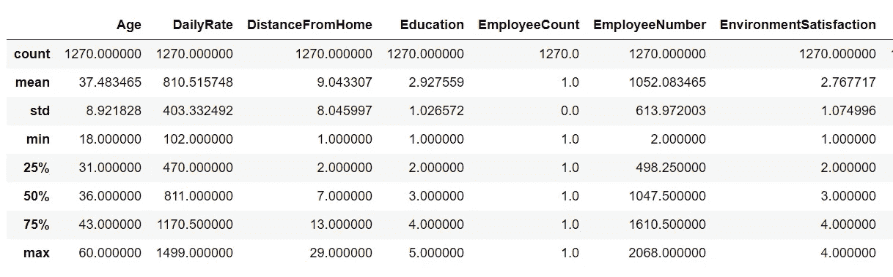
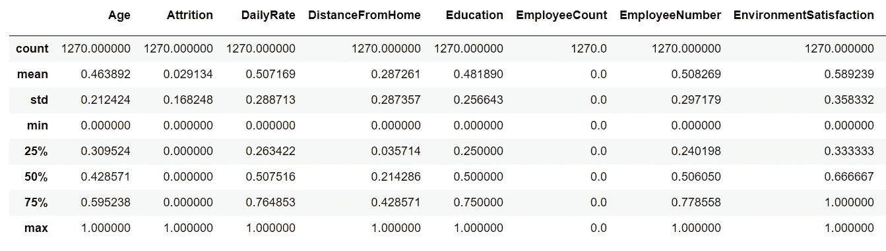
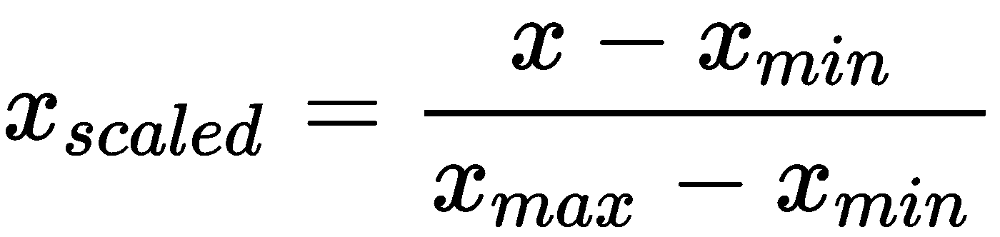
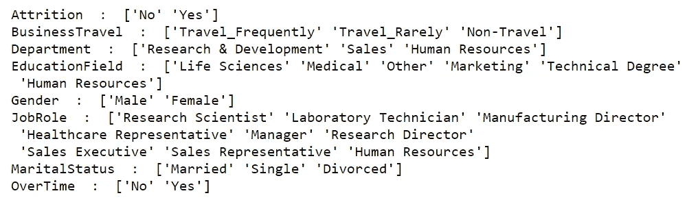
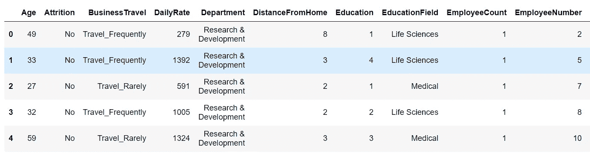
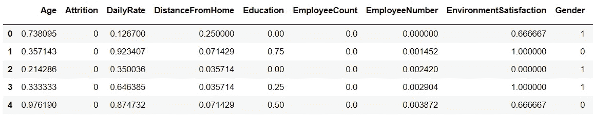
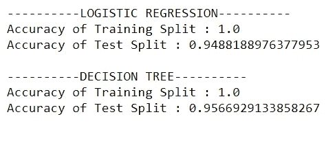

# 机器学习竞赛综合指南

> 原文：<https://medium.com/analytics-vidhya/comprehensive-guide-for-machine-learning-competitions-7ae71fb1700e?source=collection_archive---------5----------------------->

机器学习很简单！

这篇文章旨在作为初学者和专家开始机器学习竞赛的模板。

从理论上学习机器学习，理解所有这些令人敬畏的算法是有趣的，但最重要的是将这些概念应用到实践中。

做事实际上增强了你的概念，并帮助你揭示了仅靠理论无法实现的重大发现。

## 磨练你的技能的最好方法是参加真实世界的竞赛，在那里你可以找到许多志同道合的人一起为给定的问题陈述寻找解决方案。赢得竞争并不总是重要的，重要的是要认识到其他人取得杰出成就的因素和途径。

大家都是赢家！

几个你可以尝试所有想法的网站！

*   [卡格尔](https://www.kaggle.com/)
*   [驱动数据](https://www.drivendata.org/)
*   [dpi](https://dphi.tech/practice/)
*   [机器黑客](https://www.machinehack.com/)

> 要查找所有正在进行的比赛列表，请参考此[链接](https://mlcontests.com/)。

有 2 个奖金部分，包括带出最好的结果。所以一定要看完。

# 入门！

机器学习最重要的事情之一就是理解数据。大多数在线比赛都是基于有监督的机器学习，需要进行某种预测。

现在这个预测可能是:

1) **回归问题**其中输出标签为连续范围的整数。

*例子包括“预测人的年龄”、“预测物品的价格”、“普查收入”、“材料的抗压强度”等。*

2) **分类问题**其中输出标签本质上是离散且有限的。

*例子包括“预测人的性别”、“预测创业成功”、“对象识别”、“文本分类”、“情感分析”、“猫与狗分类”等。*

**还是越来越糊涂，我们来举个简单的例子。**

> 如果要求您预测股票价格，请查看输出列，如果有范围广泛的值，如 6.2、7.1、8.8、9、10 …并且预测“6.5”(训练集的输出列中没有提到的内容)也是可能的，您可以有把握地说这是一个经典的基于回归的问题。
> 
> 如果要求您预测股票的方向，并且输出标签包含+1、0 和-1 作为唯一的输出，其中“+1”表示上涨，“-1”表示下跌，“0”表示没有变化。在这里，我们可以清楚地注意到输出标签只有 3 种可能性，并且预测“6.5”，因为输出没有意义。因此，这变成了一个基于分类的问题，其中每个输出标签都推断出一个特殊的含义。

一旦你决定了可以用来解决给定问题的算法类型，事情就变得系统而简单了。

# 加载数据

在本文中，我们将考虑结构化数据(excel 表格、csv 文件等高度组织化的数据)。).对于处理非结构化数据(音频、文本、图像、视频文件)，深度学习模型占据优势。我将在接下来的文章中介绍。

Pandas 是加载“csv 文件”和“excel 表格”最常用的库，因为 pandas 提供了许多强大的数据操作和聚合。

链接到数据集。[【查看】](https://drive.google.com/file/d/1sjUNk5YBTcFN90HaflJHmGxcZ-mfK7oW/view?usp=sharing)

只需一行代码，您就可以读取文件“training_data.csv”中的数据

在*“data . head()”的帮助下，你可以查看数据的行和列，以估计要应用的机器学习算法的类型，如前所述【回归或分类】。*

# 探索性数据分析

一旦加载了数据，下一步就是研究数据并检查是否存在异常。

大多数时候，我们可以在数据集的每一列中观察到一些缺失值。

通过执行上面的行，如果我们看到 0 对应于所有的列，这意味着没有丢失的值。

如果您在任一列中观察到一些空值，我们需要注意这些特定的输入，因为模型无法从空值中理解。

> 机器理解的只是数值！

“0”和“无”之间有很大的区别，“0”是特定特性的值，而“无”意味着没有值。

有可能在数据准备期间，csv 文件中的所有值都没有填写，有些值可能会留空。留空的单元格占用“NaN”(非数字)。

每当我们遇到 NaN / missing 值时，这里有几种处理方法。

*   如果这类行的数量与数据集中的总行数相比非常少，则可以安全地删除这类行。

*例如:如果 5000 行数据中有 25 行缺少值，那么删除这些行不会有太大的区别。*

*   用一些特定值估算“NaN”值。

我们可以利用 sklearn 库中的 SimpleImputer 类，这是最著名的机器学习实现库之一。

因为，我们正在处理丢失的值。“NaN”，所以在第一个参数中，我们将提到 *np.nan.*

对于策略，我们有 4 个选项:“均值”、“中值”、“最频繁”和“常数”。

> 注:“平均值”和“中值”是统计量，因此只能用于数字数据。“最频繁”和“常数”既可用于数字数据，也可用于分类数据。

> 在这一步之后，我们将得到没有空值的干净数据。

# 处理数字特征

我们可以观察到特征“年龄”的最大值是 60，而“每日速率”的最大值是 1499。我们可以清楚地注意到数值范围的巨大差异。

> 机器学习涉及初等加法和乘法运算，基本上每个特征都有一个权重对应。由于显而易见的原因，取值范围越小的特征将被赋予越大的权重以考虑其影响。
> 
> 这将导致模型在特征重要性和排序方面不可解释。
> 
> 不要缩放输出特征，否则会导致灾难性的结果。仅需要缩放输入要素。

一个简单的解决方案是缩放这些值，使所有的数值跨越一个相似的值范围。

使用 sklearn 库中的 MinMaxScaler 类，我们已经将所有数字列的范围从[0，1]扩展到了[0，1]。

# 处理分类特征

我们可以观察到对应于每个分类特征的唯一值。根据值的数量和值的顺序性质，可以使用某些方法。

机器学习模型无法解释字符串值，所以我们需要将这些分类特征编码成数值。

您可以利用熊猫地图功能对特征进行手动编码。

处理这个问题最简单的方法是使用 LabelEncoder。它将开始为每个新要素标注分配从 0 开始的整数值。

或者，当您觉得所有特定的值都应该获得相同的权重，并且对特定类别的值没有特别的偏好时，您也可以对这些值进行热编码。

> 如果你感到困惑，我建议你继续使用 LabelEncoder。如果输出特征也是字符串值的形式，那么您也需要对输出特征/目标列进行编码。

## 干得好，你的数据现在可以输入各种机器学习模型了。

以前:缺少值，没有缩放和编码

后:看起来系统！

# 为模型拟合准备数据

“x”将是在训练阶段提供给模型的输入特征。y '是相应的输出标签。

我们的目标是给定一组新的输入特征值，我们的模型应该预测目标特征值的最准确值。

在这里，我们可以观察到有 52 个输入特征将被提供给模型。

在定义了“X”和“y”之后，我们需要将我们的数据集分成两部分，即。训练和测试设备。

该模型是在训练集上训练的，为了测试该模型的性能，我们将在测试集上对其进行评估(到目前为止该模型还未看到)。

# 模特培训

当前的输出标签本质上是分类的，因此它变成了开始时讨论的分类问题。

大多数分类模型都存在于 sklearn 库中。

您需要做的就是导入模型，用所需的参数集实例化该类。

在这一步之后，您只需要在训练集上拟合模型。

# 做预测

一旦模型被训练，进行预测是非常容易的，使用 model.predict()函数并在参数中提供输入特征。基于模型权重，模型将预测相应的输出标签。

有各种度量来评估模型，对于本文，我们将使用 accuracy_score。

如果你想了解更多，参考这个[链接](https://scikit-learn.org/stable/modules/model_evaluation.html#:~:text=3.3.%20Metrics%20and%20scoring%3A%20quantifying%20the%20...%201,comparing%20one%E2%80%99s%20estimator%20against%20simple%20rules%20of%20thumb.)。

正如我们在上面看到的，尽管两个模型在训练集上表现得非常好，但它们在测试结果上却没有表现出相同的承诺。

# 过度拟合与欠拟合

> 一个小故事:假设你给了 100 个 MCQ 问题作为模型的训练集，模型就是在这个训练集上训练的。为了测试您的模型是否运行良好，您提出了与模型训练时相同的问题。
> 
> 现在，你可能会觉得这个模型做得很好。你怎么能确定这个模型是基于知识或者简单的记忆所有答案来回答的呢？为了解决这个问题，我们使用了测试集，这是模型到目前为止还没有见过的。这个评估的结果肯定会确认模型是否能够很好地概括，或者它是否完全记住了你给它的 100 个问题。

用专业术语来说，我们称之为过度拟合与欠拟合。一个好的模型介于这两种极端情况之间。

**“一个好的机器学习算法能够归纳其观察结果，从而在新的未知数据上表现出色。”**

为了实用起见，

*   当训练集本身的精度较低时，会出现欠拟合。
*   当训练集的精度高但测试集的精度低时，就会发生过拟合。

解决这些问题有多种方法。

*   为了解决欠拟合，尝试增加模型训练的迭代次数，增加基于树的模型的深度。

如果以上两种方法都不能得到满意的结果，那就使用高级的特征提取和特征工程技术。

*PS:你可以使用 KBest 功能，RFE(递归功能消除等)*

*   为了解决过度拟合，尝试减少基于树的模型的深度，使用正则化。

大多数情况下，正则化可以解决高级方法中的其他问题。

# 超参数调谐

> “表现再好，总有改进的余地”。

所有模型都有各种超参数，可以调整以优化性能。超参数是其值在模型训练之前手动固定的参数。

例子包括:“估计数”、“学习率”、“分裂数”等。

这可能是一个非常耗时的步骤，因为模型训练要进行几次。

网格搜索交叉验证用于寻找超参数的最优集合。在 param _ grid(python 字典)中，您可以指定要尝试的各种值。

上述代码的结果将是一个在所提供的值中具有最佳超参数集的模型。

然而，使用 GridSearchCV 的缺点是，这种方法将遍历超参数的所有中间组合，使得计算非常昂贵。

使用随机搜索 CV 解决了上述问题，因为您可以指定“*n _ ITER”*的值。由于该值当前为 5，这意味着将只测试 5 组随机选择的值。

这增加了获得最佳模型的机会，同时其计算复杂度基于“n_iter”的值。

如果时间紧迫，请使用较低的“n_iter”值，通过该值可以快速获得结果，但获得最佳超参数集的机会会更小。

# 额外奖励第 1 部分:创建管道

您可能想知道，既然这些步骤几乎是连续的，缩放数据，然后拟合模型和超参数调整，为什么不将它们结合在一起。

在 sklearn pipeline 的帮助下，所有步骤可以合并成一个步骤。

我已经告诉过你，sklearn 是一个很棒的库，有很多很棒的功能。

# 奖励部分 2:集成学习

几乎在每场比赛中，合奏技术都能取得最好的成绩。

集成学习简单地说就是“在一起”。*有句俗话，“一个群体比一个聪明的个体更聪明”。*

学习模型中误差的主要原因是由于噪声、偏差和方差。集合方法有助于最小化这些因素。集成方法旨在提高机器学习算法的稳定性和准确性。

因此，在这里，我们基本上训练大量弱学习者，最终结果/预测由单个弱学习者的预测聚合或类似于现实生活选举的投票过程来处理。

## 投票

在这里，您可以将三个模型结合在一起，以获取基于投票的最终预测。

我发现这种方法非常有用，因为我们通常训练至少 3 个模型来进行基于性能的比较。将 3 个或更多的最佳模型结合在一起可以产生更好的结果。

性能可能不会更好，但至少和最好的个体模型——决策树一样好。
这可能是因为其他两个模型的性能比决策树低 10%左右。

当目标变量是分类变量时，使用投票分类器。
默认情况下，投票是“硬”的。如果您想要预测概率的平均值，请使用参数 voting = 'soft '

## 其他几个可以使用的模型

*   可以使用随机森林模型，它是决策树的集合。这是最常用的算法。

或者，您可以利用:

*   **梯度推进分类器**

*   **Ada 助推选粉机**

*   分类强化

这里，默认的基础估计器是决策树。不需要对分类特征进行编码。该模型可以直接拟合。

这个列表很长。如果你想了解更多，请随时通过 linkedin 与我联系。请在 github[上关注我，寻找令人敬畏的机器学习片段和项目。](https://github.com/vineethm1627)