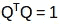

# 从头开始构建推荐引擎的综合指南(Python 语言)

> 原文：<https://medium.com/analytics-vidhya/comprehensive-guide-to-build-a-recommendation-engine-from-scratch-in-python-af7a62b37b0?source=collection_archive---------3----------------------->

在当今世界，每个客户都面临着多种选择。例如，如果我想找一本书来读，但不知道我想要什么，我的搜索结果有很多种可能性。我可能会浪费很多时间在网上浏览，浏览各种网站，希望找到金子。我可能会寻求其他人的推荐。

但是，如果有一个网站或应用程序可以根据我以前读过的内容向我推荐书籍，那将是一个巨大的帮助。与其在各种网站上浪费时间，我可以直接登录，瞧！10 本适合我口味的推荐书籍。


这就是推荐引擎所做的事情，如今大多数企业都在利用它们的力量。从亚马逊到网飞，从谷歌到 Goodreads，推荐引擎是机器学习技术最广泛使用的应用之一。

在本文中，我们将介绍各种类型的推荐引擎算法以及用 Python 创建它们的基础知识。我们还将看到这些算法背后的数学原理。最后，我们将使用矩阵分解创建我们自己的推荐引擎。

# 目录

1.  什么是推荐引擎？
2.  推荐引擎是如何工作的？
    2.1 数据收集
    2.2 数据存储
    2.3 数据过滤
    2.3.1 基于内容的过滤
    2.3.2 协同过滤
3.  使用 MovieLens 数据集的 Python 案例研究
4.  从头开始构建协同过滤模型
5.  使用 Turicreate 构建简单的流行度和协同过滤模型
6.  矩阵分解导论
7.  使用矩阵分解构建推荐引擎
8.  推荐引擎的评估指标
    8.1 召回率
    8.2 精确度
    8.3 RMSE(均方根误差)
    8.4 平均倒数排名
    8.5k 处的 MAP(截止 k 处的平均精确度)
    8.6 NDCG(归一化的折扣累积增益)
9.  还有什么可以尝试的？

# 1.什么是推荐引擎？

直到最近，人们通常倾向于购买朋友或信任的人推荐给他们的产品。这曾经是对产品有任何疑问时的主要购买方法。但随着数字时代的到来，这个圈子已经扩大到包括利用某种推荐引擎的在线网站。

**推荐引擎使用不同的算法过滤数据，并向用户推荐最相关的项目。它首先捕捉客户过去的行为，并在此基础上推荐用户可能会购买的产品。**

如果一个全新的用户访问一个电子商务网站，该网站将不会有该用户的任何过去的历史。那么在这种情况下，网站如何向用户推荐产品呢？一种可能的解决方案是推荐最畅销的产品，即需求量大的产品。另一个可能的解决方案是推荐能给企业带来最大利润的产品。

如果我们能够根据客户的需求和兴趣向他们推荐一些商品，这将对用户体验产生积极的影响，并导致频繁的访问。因此，现在的企业正在通过研究用户过去的行为来构建智能的推荐引擎。

既然我们对推荐引擎有了一个直觉，现在让我们看看它们是如何工作的。

# 2.推荐引擎是如何工作的？

在我们深入探讨这个主题之前，首先我们要考虑如何向用户推荐商品:

*   我们可以向用户推荐在所有用户中最受欢迎的项目
*   我们可以根据用户的偏好(用户特征)将他们分成多个细分市场，并根据他们所属的细分市场向他们推荐商品

以上两种方法都有缺点。在第一种情况下，最受欢迎的商品对每个用户来说都是一样的，所以每个人都会看到相同的推荐。而在第二种情况下，随着用户数量的增加，功能的数量也会增加。因此，将用户分为不同的类别将是一项非常困难的任务。

这里的主要问题是，我们无法根据用户的特定兴趣来定制推荐。这就像亚马逊建议你买一台笔记本电脑，仅仅因为它已经被大多数购物者购买了。但谢天谢地，亚马逊(或任何其他大公司)不推荐使用上述方法的产品。他们使用一些个性化的方法，帮助他们更准确地推荐产品。

现在让我们通过以下步骤来关注推荐引擎是如何工作的。

# 2.1 数据收集

这是构建推荐引擎的第一步，也是最关键的一步。数据可以通过两种方式收集:显式和隐式。显式数据是有意提供的信息，即来自用户的输入，如电影评级。隐含数据是无意提供的信息，而是从搜索历史、点击、订单历史等可用数据流中收集的信息。


在上图中，网飞以用户给不同电影评分的形式收集数据。


这里，用户的订单历史由 Amazon 记录，这是隐式数据收集模式的一个例子。

# 2.2 数据存储

数据量决定了模型的推荐结果有多好。例如，在电影推荐系统中，用户给电影的评级越多，其他用户得到的推荐就越好。数据类型在决定必须使用的存储类型时起着重要作用。这种类型的存储可以包括标准 SQL 数据库、NoSQL 数据库或某种对象存储。

# 2.3 过滤数据

在收集和存储数据之后，我们必须对其进行过滤，以便提取做出最终建议所需的相关信息。


来源: *intheshortestrun*

有各种算法可以帮助我们简化过滤过程。在下一节中，我们将详细介绍每个算法。

## 基于内容的过滤

该算法推荐与用户过去喜欢的产品相似的产品。


例如，如果一个人喜欢电影“盗梦空间”，那么这个算法将推荐属于同一流派的电影。但是算法如何理解从哪个流派中挑选和推荐电影呢？

**以网飞为例。**他们以向量的形式保存了与每个用户相关的所有信息。该向量包含用户过去的行为，即用户喜欢/不喜欢的电影以及他们给出的评级。这个矢量被称为*轮廓矢量*。所有与电影相关的信息都存储在另一个名为*项目向量*的向量中。Item vector 包含每部电影的详细信息，如流派、演员、导演等。

基于内容的过滤算法找到轮廓向量和项目向量之间角度的余弦，即**余弦相似度**。假设 A 是简档向量，B 是项目向量，那么它们之间的相似度可以计算为:


基于范围在-1 到 1 之间的余弦值，电影以降序排列，并且使用以下两种方法之一进行推荐:

*   **Top-n 方法**:推荐前 n 部电影(这里 n 可以由企业决定)
*   **分级方法**:设定一个阈值，推荐所有高于该阈值的电影

可用于计算相似性的其他方法有:

*   **欧几里德距离**:如果在 n 维空间中绘图，相似的项目将彼此非常接近。因此，我们可以计算商品之间的距离，并基于该距离向用户推荐商品。欧几里德距离的公式由下式给出:


*   皮尔逊相关:它告诉我们两个项目的相关程度。相关性越高，相似性就越大。皮尔逊相关性可以使用以下公式计算:


这种算法的一个主要缺点是它仅限于推荐相同类型的项目。它永远不会推荐用户过去没有买过或不喜欢的产品。因此，如果用户过去只看过或喜欢动作片，系统将只推荐动作片。这是一种非常狭隘的制造引擎的方式。

为了改进这种类型的系统，我们需要一种算法，不仅可以根据内容推荐项目，还可以根据用户的行为推荐项目。

## 协同过滤

让我们用一个例子来理解这一点。如果 A 喜欢三部电影，比如《星际穿越》、《盗梦空间》和《缘分天注定》，而 B 喜欢《盗梦空间》、《缘分天注定》和《声望》，那么他们有几乎相似的兴趣。我们可以有把握地说，A 应该喜欢声望，B 应该喜欢星际。协同过滤算法使用“用户行为”来推荐项目。这是业内最常用的算法之一，因为它不依赖于任何附加信息。有不同类型的协作过滤技术，我们将在下面详细介绍它们。

## 用户-用户协同过滤

这个算法首先找到用户之间的相似性得分。基于这个相似性得分，它挑选出最相似的用户，并推荐这些相似用户以前喜欢或购买过的产品。


就我们之前的电影示例而言，该算法根据每个用户之前对不同电影的评分来查找他们之间的相似性。通过计算其他用户对项目 *i* 给出的用户评分的加权和来计算用户对项目 *u* 的预测。

预测值 *Pu，i* 由下式给出:


这里，

*   *Pu，i* 是对某项的预测
*   *Rv，i* 是用户 *v* 对电影 *i* 的评价
*   *苏，v* 是用户之间的相似度

现在，我们有了用户在 profile vector 中的评分，基于此，我们必须预测其他用户的评分。为此，遵循以下步骤:

1.  对于预测，我们需要用户 u 和 v 之间的相似性。我们可以利用皮尔逊相关。
2.  首先，我们找到由用户评级的项目，并且基于评级，计算用户之间的相关性。
3.  可以使用相似性值来计算预测。该算法首先计算每个用户之间的相似性，然后基于每个相似性计算预测。**相关性较高的用户倾向于相似。**
4.  基于这些预测值，提出建议。让我们用一个例子来理解它:

考虑用户-电影评级矩阵:


这里我们有一个用户电影评级矩阵。为了更实际地理解这一点，让我们找出上表中用户(A，C)和(B，C)之间的相似性。由 A 和 C 评级的常见电影是电影 x2 和 x4，由 B 和 C 评级的常见电影是电影 x2、x4 和 x5。


用户 A 和 C 之间的相关性大于用户 B 和 C 之间的相关性。因此，用户 A 和 C 具有更多的相似性，并且用户 A 喜欢的电影将被推荐给用户 C，反之亦然。

该算法非常耗时，因为它涉及计算每个用户的相似性，然后计算每个相似性得分的预测。处理这个问题的一种方式是仅选择几个用户(邻居)而不是所有用户来进行预测，即，不是对所有相似性值进行预测，而是仅选择几个相似性值。选择邻居有多种方式:

*   选择一个阈值相似性，并选择高于该值的所有用户
*   随机选择用户
*   按照相似性值的降序排列邻居，并选择前 N 名用户
*   使用聚类选择邻居

当用户数量较少时，该算法是有用的。当有大量用户时，这是无效的，因为计算所有用户对之间的相似性将花费大量时间。这就引出了项目-项目协同过滤，当用户数量多于被推荐的项目时，这种方式是有效的。

## 项目-项目协同过滤

在这个算法中，我们计算每对项目之间的相似度。


因此，在我们的例子中，我们将找到每对电影之间的相似性，并基于此，我们将推荐用户过去喜欢的相似电影。这种算法的工作原理类似于用户-用户协同过滤，只是有一点点变化——我们不是采用“用户-邻居”评级的加权和，而是采用“项目-邻居”评级的加权和。预测由下式给出:


现在我们将找到项目之间的相似性。


现在，因为我们有了每部电影和分级之间的相似性，所以进行预测，并且基于这些预测，推荐相似的电影。让我们用一个例子来理解一下。


在这里，平均项目评分是对特定项目的所有评分的平均值(与我们在用户-用户过滤中看到的表格进行比较)。我们不是像前面看到的那样找到用户之间的相似性，而是找到项目之间的相似性。

要做到这一点，首先我们需要找到对这些项目进行评级的用户，并根据评级计算项目之间的相似性。让我们找到电影(x1，x4)和(x1，x5)的相似之处。评价了电影 x1 和 x4 的普通用户是 A 和 B，而评价了电影 x1 和 x5 的用户也是 A 和 B


电影 x1 和 x4 之间的相似性大于电影 x1 和 x5 之间的相似性。因此，基于这些相似性值，如果任何用户搜索电影 x1，他们将被推荐电影 x4，反之亦然。在进一步实施这些概念之前，有一个问题我们必须知道答案——如果在数据集中添加一个新用户或新项目，会发生什么情况？它被称为冷启动。冷启动有两种类型:

1.  访客冷启动
2.  产品冷启动

访问者冷启动意味着在数据集中引入了一个新用户。因为没有该用户的历史，所以系统不知道该用户的偏好。向该用户推荐产品变得更加困难。那么，如何才能解决这个问题呢？一个基本的方法可以是应用基于流行度的策略，即推荐最流行的产品。这些可以由最近流行的整体或区域来决定。一旦我们知道了用户的喜好，推荐产品就容易多了。

另一方面，产品冷启动意味着一种新产品投放市场或加入系统。用户行为是决定任何产品价值的最重要因素。产品收到的交互越多，我们的模型就越容易向正确的用户推荐该产品。我们可以利用基于内容的过滤来解决这个问题。系统首先使用新产品的内容进行推荐，然后最终用户对该产品采取行动。

现在，让我们通过 Python 中的一个案例来巩固我们对这些概念的理解。准备好你的机器，因为这将会很有趣！

# 3.使用 MovieLens 数据集的 Python 案例研究

我们将处理 MovieLens 数据集，并构建一个模型来向最终用户推荐电影。这些数据是由明尼苏达大学的 GroupLens 研究项目收集的。数据集可以从 [**这里**](https://grouplens.org/datasets/movielens/100k/) 下载。该数据集包括:

*   1682 部电影的 943 位用户给出了 100，000 个评分(1-5)
*   用户的人口统计信息(年龄、性别、职业等。)

首先，我们将导入我们的标准库并读取 Python 中的数据集。

```
import pandas as pd
%matplotlib inline
import matplotlib
import matplotlib.pyplot as plt
import numpy as np# pass in column names for each CSV as the column name is not given in the file and read them using pandas.
# You can check the column names from the readme file

#Reading users file:
u_cols = ['user_id', 'age', 'sex', 'occupation', 'zip_code']
users = pd.read_csv('ml-100k/u.user', sep='|', names=u_cols,encoding='latin-1')

#Reading ratings file:
r_cols = ['user_id', 'movie_id', 'rating', 'unix_timestamp']
ratings = pd.read_csv('ml-100k/u.data', sep='\t', names=r_cols,encoding='latin-1')

#Reading items file:
i_cols = ['movie id', 'movie title' ,'release date','video release date', 'IMDb URL', 'unknown', 'Action', 'Adventure',
'Animation', 'Children\'s', 'Comedy', 'Crime', 'Documentary', 'Drama', 'Fantasy',
'Film-Noir', 'Horror', 'Musical', 'Mystery', 'Romance', 'Sci-Fi', 'Thriller', 'War', 'Western']
items = pd.read_csv('ml-100k/u.item', sep='|', names=i_cols,
encoding='latin-1')
```

加载数据集后，我们应该查看每个文件的内容(用户、评分、项目)。

**用户**

```
print(users.shape) 
users.head()
```


因此，我们在数据集中有 943 个用户，每个用户有 5 个特征，即用户 ID、年龄、性别、职业和邮政编码。现在让我们来看看评级文件。

```
print(ratings.shape)
ratings.head()
```


我们对不同的用户和电影组合有 100k 的评分。现在，最后检查项目文件。

```
print(items.shape) 
items.head()
```


该数据集包含 1682 部电影的属性。有 24 列，其中最后 19 列指定特定电影的类型。这些是二进制列，即值 1 表示电影属于该类型，否则为 0。

该数据集已经被 GroupLens 分成训练和测试，其中测试数据对于每个用户具有 10 个评级，即总共 9，430 行。我们将把这两个文件读入我们的 Python 环境。

```
r_cols = ['user_id', 'movie_id', 'rating', 'unix_timestamp']
ratings_train = pd.read_csv('ml-100k/ua.base', sep='\t', names=r_cols, encoding='latin-1')
ratings_test = pd.read_csv('ml-100k/ua.test', sep='\t', names=r_cols, encoding='latin-1')
ratings_train.shape, ratings_test.shape
```


终于到了构建我们推荐引擎的时候了！

# 4.从头开始构建协同过滤模型

我们将根据用户-用户相似性和项目-项目相似性来推荐电影。为此，首先我们需要计算独立用户和电影的数量。

```
n_users = ratings.user_id.unique().shape[0] 
n_items = ratings.movie_id.unique().shape[0]
```

现在，我们将创建一个用户-项目矩阵，它可用于计算用户和项目之间的相似性。

```
data_matrix = np.zeros((n_users, n_items)) 
for line in ratings.itertuples(): 
    data_matrix[line[1]-1, line[2]-1] = line[3]
```

现在，我们将计算相似度。我们可以使用来自 *sklearn* 的 *pairwise_distance* 函数来计算余弦相似度。

```
from sklearn.metrics.pairwise import pairwise_distances user_similarity = pairwise_distances(data_matrix, metric='cosine') item_similarity = pairwise_distances(data_matrix.T, metric='cosine')
```

这为我们提供了一个数组形式的项目-项目和用户-用户相似性。下一步是根据这些相似性进行预测。让我们定义一个函数来做这件事。

```
def predict(ratings, similarity, type='user'):
    if type == 'user':
        mean_user_rating = ratings.mean(axis=1)
        #We use np.newaxis so that mean_user_rating has same format as ratings
        ratings_diff = (ratings - mean_user_rating[:, np.newaxis])
        pred = mean_user_rating[:, np.newaxis] + similarity.dot(ratings_diff) / np.array([np.abs(similarity).sum(axis=1)]).T
    elif type == 'item':
        pred = ratings.dot(similarity) / np.array([np.abs(similarity).sum(axis=1)])
    return pred
```

最后，我们会根据用户相似度和物品相似度进行预测。

```
user_prediction = predict(data_matrix, user_similarity, type='user') 
item_prediction = predict(data_matrix, item_similarity, type='item')
```

事实证明，我们也有一个自动生成所有这些推荐的库。现在让我们学习如何使用 Python 中的 turicreate 创建推荐引擎。要熟悉 turicreate 并将其安装到您的机器上，请参考此处的[**。**](https://github.com/apple/turicreate/blob/master/README.md)

# 5.使用 Turicreate 构建一个简单的流行度和协同过滤模型

安装 turicreate 后，首先让我们导入它，并在我们的环境中读取训练和测试数据集。由于我们将使用 turicreate，我们将需要在 SFrames 中转换数据集。

```
import turicreate 
train_data = turicreate.SFrame(ratings_train) 
test_data = turicreate.Sframe(ratings_test)
```

我们有用户行为以及用户和电影的属性，所以我们可以制作基于内容以及协同过滤的算法。我们将从一个简单的流行度模型开始，然后建立一个协同过滤模型。

首先，我们将构建一个基于最受欢迎的选择推荐电影的模型，即，所有用户都收到相同推荐的模型。为此，我们将使用 turicreate 推荐函数 *popularity_recommender* 。

```
popularity_model = turicreate.popularity_recommender.create(train_data, user_id='user_id', item_id='movie_id', target='rating')
```

我们使用的各种论据是:

*   **train_data** :包含所需训练数据的 SFrame
*   **user_id** :表示每个用户 id 的列名
*   **item_id** :表示每个推荐项目的列名(movie_id)
*   **目标:**表示用户给出的分数/评级的列名

预测时间到了！我们将为数据集中的前 5 个用户推荐前 5 个项目。

```
popularity_recomm = popularity_model.recommend(users=[1,2,3,4,5],k=5) popularity_recomm.print_rows(num_rows=25)
```


请注意，对所有用户的建议都是相同的— 1467、1201、1189、1122、814。而且都是一个顺序！这证实了所有推荐的电影具有 5 的平均评级，即所有观看该电影的用户给了它最高的评级。因此，我们的人气系统如预期的那样工作。

在构建了流行度模型之后，我们现在将构建协作过滤模型。我们来训练一下物品相似度模型，给前 5 个用户做前 5 个推荐。

```
#Training the model
item_sim_model = turicreate.item_similarity_recommender.create(train_data, user_id='user_id', item_id='movie_id', target='rating', similarity_type='cosine')

#Making recommendations
item_sim_recomm = item_sim_model.recommend(users=[1,2,3,4,5],k=5)
item_sim_recomm.print_rows(num_rows=25)
```


这里我们可以看到推荐(movie_id)对于每个用户都是不同的。所以个性化是存在的，也就是说，对于不同的用户，我们有不同的建议。

在这个模型中，我们没有每个用户对每部电影的评级。我们必须找到一种方法来预测所有这些缺失的评级。为此，我们必须找到一套能够定义用户如何评价电影的特征。这些被称为潜在特征。我们需要找到一种方法，从现有的特征中提取出最重要的潜在特征。下一节将介绍矩阵分解，这是一种使用低维密集矩阵的技术，有助于提取重要的潜在特征。

# 6.矩阵分解导论

我们用一个例子来理解矩阵分解。考虑不同用户对不同电影给出的用户电影评级矩阵(1-5)。


这里 user_id 是不同用户的唯一 id，并且每个电影也被分配一个唯一 ID。0.0 的评级表示用户没有对该特定电影进行评级(1 是用户可以给出的最低评级)。我们想预测这些缺失的收视率。使用矩阵分解，我们可以找到一些潜在的特征，这些特征可以决定用户如何评价一部电影。我们将矩阵分解成组成部分，使得这些部分的乘积生成原始矩阵。


让我们假设我们已经找到了 *k* 的潜在特征。因此，我们可以将评级矩阵 R(MxN)分为 P(MxK)和 Q(NxK ),从而 P x QT(这里 QT 是 Q 矩阵的转置)近似于 R 矩阵:


其中:

*   m 是用户总数
*   n 是电影的总数
*   k 是总潜在特征
*   r 是 MxN 用户-电影分级矩阵
*   p 是代表用户和特征之间关联的 MxK 用户-特征亲和矩阵
*   q 是 NxK 项目-特征相关矩阵，其表示电影和特征之间的关联
*   σ是 KxK 对角特征权重矩阵，它表示特征的本质权重

通过矩阵分解选择潜在特征从数据中去除了噪声。怎么会？嗯，它删除了不决定用户如何评价电影的特征。现在，为了获得由用户 *puk* 在所有潜在特征 *k* 上对电影 *qik* 的评级*芮*，我们可以计算 2 个向量的点积，并将它们相加，以获得基于所有潜在特征的评级。


这就是矩阵分解如何给我们没有被用户评级的电影的评级。但是，我们如何将新数据添加到我们的用户电影评级矩阵中，即，如果新用户加入并对电影进行评级，我们将如何将这些数据添加到我们预先存在的矩阵中？

让我通过矩阵分解的方法让你更容易理解。如果新用户加入系统，对角特征权重矩阵σ以及项目-特征相关性矩阵 q 将没有变化。唯一的变化将发生在用户-特征相关度矩阵 p 中。我们可以应用一些矩阵乘法方法来做到这一点。

我们有，


让我们两边都乘以 Q。


现在，我们有了



所以，


进一步简化，我们可以得到 P 矩阵:


这是更新的用户特征相似性矩阵。类似地，如果新电影被添加到系统中，我们可以按照类似的步骤来获得更新的项目-特征相关性矩阵 q。

记住，我们把 R 矩阵分解成 P 和 Q。但是我们如何决定哪个 P 和 Q 矩阵将近似 R 矩阵呢？为此，我们可以使用梯度下降算法。这里的目标是最小化实际额定值与使用 P 和 q 估计的值之间的平方误差，平方误差由下式给出:


这里，

*   *eui* 是误差
*   *锐*是用户 u 对电影 I 的实际评价
*   *řui* 是用户 u 对电影 I 的预测评级

我们的目的是确定 p 和 q 值，使误差最小。我们需要更新 p 和 q 值，以便得到这些矩阵的最佳值，这将给出最小的误差。现在我们将为 *puk* 和 *qki* 定义一个更新规则。梯度下降中的更新规则由要最小化的误差的梯度来定义。


现在我们有了梯度，我们可以对 *puk* 和 *qki* 应用更新规则。


这里α是学习率，它决定每次更新的大小。可以重复上述更新，直到误差最小。一旦完成，我们就可以得到最佳的 P 和 Q 矩阵，它可以用来预测收视率。让我们快速回顾一下这个算法是如何工作的，然后我们将构建推荐引擎来预测未分级电影的分级。

下面是矩阵分解如何预测评分:

```
# for f = 1,2,....,k :
    # for rui ε R :
        # predict rui
        # update puk and qki
```

因此，基于每个潜在特征，R 矩阵中所有缺失的评级将使用预测的 *rui* 值来填充。然后使用梯度下降更新 *puk* 和 *qki* 并获得它们的最优值。如下图所示:


现在我们已经理解了这个算法的内部工作原理，我们将举一个例子，看看一个矩阵是如何分解成它的成分的。

考虑一个 2×3 的矩阵，一个 2×3 的 T21，如下所示:


这里我们有 2 个用户和他们对 3 部电影的相应评级。现在，我们将把这个矩阵分解成子部分，例如:


AAT 的特征值将给出 P 矩阵，而 ATA 的特征值将给出 Q 矩阵。σ是 AAT 或 ATA 的特征值的平方根。

计算 AAT 的特征值。


所以 AAT 的特征值是 25，9。同样，我们可以计算 ATA 的特征值。这些值将是 25，9，0。现在我们必须计算 AAT 和 ATA 对应的特征向量。

对于λ = 25，我们有:


可以将 [**行的**缩减为](http://www.sparknotes.com/math/algebra2/matrices/section4/):


该矩阵的核中的单位长度向量为:


类似地，对于λ = 9，我们有:


可以将行简化为:


该矩阵的核中的单位长度向量为:


对于最后一个特征向量，我们可以找到一个垂直于 q1 和 q2 的单位向量。所以，


**σ**2x 3 矩阵是 AAT 或 ATA 的特征值的平方根，即 25 和 9。


最后我们可以通过公式σpi = Aqi，或者 pi = 1/σ(Aqi)来计算 P *2X2* 。这给出了:


因此，矩阵的分解形式由下式给出:


由于我们有 P 和 Q 矩阵，我们可以使用梯度下降法来获得它们的优化版本。让我们使用矩阵分解来构建我们的推荐引擎。

# 7.使用矩阵分解构建推荐引擎

让我们定义一个函数来预测用户对他/她没有评级的所有电影给出的评级。

```
class MF():

    # Initializing the user-movie rating matrix, no. of latent features, alpha and beta.
    def __init__(self, R, K, alpha, beta, iterations):
        self.R = R
        self.num_users, self.num_items = R.shape
        self.K = K
        self.alpha = alpha
        self.beta = beta
        self.iterations = iterations

    # Initializing user-feature and movie-feature matrix 
    def train(self):
        self.P = np.random.normal(scale=1./self.K, size=(self.num_users, self.K))
        self.Q = np.random.normal(scale=1./self.K, size=(self.num_items, self.K))

        # Initializing the bias terms
        self.b_u = np.zeros(self.num_users)
        self.b_i = np.zeros(self.num_items)
        self.b = np.mean(self.R[np.where(self.R != 0)])

        # List of training samples
        self.samples = [
        (i, j, self.R[i, j])
        for i in range(self.num_users)
        for j in range(self.num_items)
        if self.R[i, j] > 0
        ]

        # Stochastic gradient descent for given number of iterations
        training_process = []
        for i in range(self.iterations):
        np.random.shuffle(self.samples)
        self.sgd()
        mse = self.mse()
        training_process.append((i, mse))
        if (i+1) % 20 == 0:
            print("Iteration: %d ; error = %.4f" % (i+1, mse))

        return training_process

    # Computing total mean squared error
    def mse(self):
        xs, ys = self.R.nonzero()
        predicted = self.full_matrix()
        error = 0
        for x, y in zip(xs, ys):
            error += pow(self.R[x, y] - predicted[x, y], 2)
        return np.sqrt(error)

    # Stochastic gradient descent to get optimized P and Q matrix
    def sgd(self):
        for i, j, r in self.samples:
            prediction = self.get_rating(i, j)
            e = (r - prediction)

            self.b_u[i] += self.alpha * (e - self.beta * self.b_u[i])
            self.b_i[j] += self.alpha * (e - self.beta * self.b_i[j])

            self.P[i, :] += self.alpha * (e * self.Q[j, :] - self.beta * self.P[i,:])
            self.Q[j, :] += self.alpha * (e * self.P[i, :] - self.beta * self.Q[j,:])

    # Ratings for user i and moive j
    def get_rating(self, i, j):
        prediction = self.b + self.b_u[i] + self.b_i[j] + self.P[i, :].dot(self.Q[j, :].T)
        return prediction

    # Full user-movie rating matrix
    def full_matrix(self):
        return mf.b + mf.b_u[:,np.newaxis] + mf.b_i[np.newaxis:,] + mf.P.dot(mf.Q.T)
```

现在我们有了一个可以预测收视率的函数。该函数的输入是:

*   r-用户电影评级矩阵
*   k 个潜在特征
*   随机梯度下降的α学习率
*   偏差的β正则化参数
*   迭代次数-执行随机梯度下降的迭代次数

我们必须将用户项目评级转换为矩阵形式。可以使用 python 中的 pivot 函数来完成。

```
R= np.array(ratings.pivot(index = 'user_id', columns ='movie_id', values = 'rating').fillna(0))
```

fillna(0)将用 0 填充所有缺失的评分。现在我们有了 R 矩阵。我们可以初始化潜在特征的数量，但是这些特征的数量必须小于或等于原始特征的数量。

现在让我们预测所有缺失的评级。让我们假设 K=20，alpha=0.001，beta=0.01，迭代次数=100。

```
mf = MF(R, K=20, alpha=0.001, beta=0.01, iterations=100)
training_process = mf.train()
print()
print("P x Q:")
print(mf.full_matrix())
print()
```

这将给出对应于每 20 次迭代的误差值，并最终给出完整的用户电影评级矩阵。输出如下所示:


我们已经创建了我们的推荐引擎。让我们在下一节重点讨论如何评估一个推荐引擎。

# 8.推荐引擎的评估指标

为了评估推荐引擎，我们可以使用以下指标

**8.1 召回:**

*   用户喜欢的项目中有多少是真正被推荐的
*   它由下式给出:


这里 *tp* 表示推荐给用户的他/她喜欢的项目的数量， *tp* + *fn* 表示用户喜欢的项目的总数。
如果用户喜欢 5 个项目，推荐引擎决定显示其中的 3 个，那么召回率将是 0.6
召回率越大，推荐越好

**8.2 精度:**

*   在所有推荐的商品中，有多少是用户真正喜欢的？
*   它由下式给出:


*   这里 *tp* 表示推荐给用户的他/她喜欢的项目的数量，而 *tp* + *fp* 表示推荐给用户的项目总数
*   如果向用户推荐了 5 个项目，其中他喜欢 4 个，那么精度将是 0.8
*   精度越高，推荐越好
*   但是考虑这种情况:如果我们简单地推荐所有的项目，它们肯定会覆盖用户喜欢的项目。所以我们有 100%的召回率！但是考虑一下精确度。如果我们推荐 1000 个项目，而用户只喜欢其中的 10 个，那么精度是 0.1%。这真的很低。因此，我们的目标应该是最大化精确度和召回率。

**8.3 RMSE(均方根误差):**

*   它测量预测评级的误差:


*   在这里,“预测”是模型预测的评级,“实际”是原始评级
*   如果一个用户给一部电影打了 5 分，而我们预测评分是 4 分，那么 RMSE 就是 1 分
*   RMSE 值越小，推荐越好

上述指标告诉我们我们的推荐有多准确，但它们并不关注推荐的顺序，也就是说，它们并不关注首先推荐哪个产品，然后是什么。我们需要一些指标，也考虑了推荐产品的订单。那么，让我们来看看一些**排名指标**:

**8.4 平均倒数排名:**

*   评估建议列表


*   假设我们已经向用户推荐了 3 部电影，比如按照给定的顺序推荐 A、B、C，但是用户只喜欢电影 C。由于电影 C 的排名是 3，所以倒数排名将是 1/3
*   平均倒数排名越大，推荐越好

**8.5k 处的图(截止点 k 处的平均精度):**

*   精确度和召回率不关心推荐中的排序
*   截止 k 处的精度是通过仅考虑等级 1 到 k 的建议子集计算的精度


*   假设我们做了三个推荐[0，1，1]。这里 0 表示推荐不正确，1 表示推荐正确。那么 k 处的精度将是[0，1/2，2/3]，平均精度将是(1/3)*(0+1/2+2/3) = 0.38
*   平均精度越大，推荐就越正确

**8.6 NDCG(归一化贴现累计收益):**

*   MAP 和 NDCG 的主要区别在于，MAP 假设一个项目是感兴趣的(或不感兴趣的)，而 NDCG 给出相关性分数
*   让我们用一个例子来理解它:假设在 10 部电影 A 到 J 中，我们可以推荐前五部电影，即 A、B、C、D 和 E，而我们不能推荐其他 5 部电影，即 F、G、H、I 和 J。推荐的是[A、B、C、D]。因此，在这种情况下，NDCG 将为 1，因为推荐的产品与用户相关
*   NDCG 值越高，推荐越好

# 9.还有什么可以尝试的？

至此，我们已经了解了什么是推荐引擎，它的不同类型以及它们的工作原理。基于内容的过滤和协同过滤算法各有优缺点。

在某些领域，生成有用的内容描述可能非常困难。如果用户以前的行为没有提供证据，基于内容的过滤模型将不会选择项目。必须使用额外的技术，以便系统可以在用户已经表现出兴趣的范围之外提出建议。

协同过滤模型没有这些缺点。因为不需要对被推荐的项目进行描述，所以该系统可以处理任何种类的信息。此外，它可以推荐用户以前没有表现出兴趣的产品。但是，如果没有用户评级作为预测的基础，协同过滤就不能为新项目提供推荐。即使用户开始对项目进行评级，在项目获得足够的评级以做出准确的推荐之前，也需要一些时间。

一个结合了基于内容的过滤和协作过滤的系统可以潜在地利用内容的表示以及用户之间的相似性。一种结合协作和基于内容的过滤的方法是基于基于内容的推荐和协作推荐的加权平均来进行预测。这样做的各种方法有:

*   **合并项目得分**
*   在这种方法中，我们将从两种过滤方法中获得的评级相结合。最简单的方法是取评级的平均值
*   假设一种方法建议电影的等级为 4，而另一种方法建议同一部电影的等级为 5。因此，最终建议将是两个评级的平均值，即 4.5
*   我们也可以给不同的方法分配不同的权重
*   **结合物品等级:**
*   假设协同过滤按照以下顺序推荐了 5 部电影 A、B、C、D 和 E:A、B、C、D、E，而基于内容的过滤按照以下顺序推荐了它们:B、D、A、C、E
*   电影的排名是:

协作过滤:


基于内容的过滤:


因此，**混合推荐引擎将组合这些排名，并基于组合的排名做出最终推荐**。综合排名将为:


将根据这些排名做出推荐。所以，最终的推荐会是这样的:B，A，D，C，e。

通过这种方式，可以将两种或多种技术结合起来构建一个混合推荐引擎，并提高它们的整体推荐准确度和能力。

# 结束注释

这是一篇关于推荐引擎的非常全面的文章。本教程应该足以让你开始这个话题。我们不仅讨论了基本的推荐技术，还了解了如何实现当今行业中一些更高级的技术。

我们还讨论了与每种技术相关的一些关键事实。作为想学习如何制作推荐引擎的人，我建议你学习本教程中讨论的技术，然后在你的模型中实现它们。

你觉得这篇文章有用吗？在下面的评论区分享你的观点吧！

*原载于 2018 年 6 月 21 日*[*【www.analyticsvidhya.com*](https://www.analyticsvidhya.com/blog/2018/06/comprehensive-guide-recommendation-engine-python/)*。*