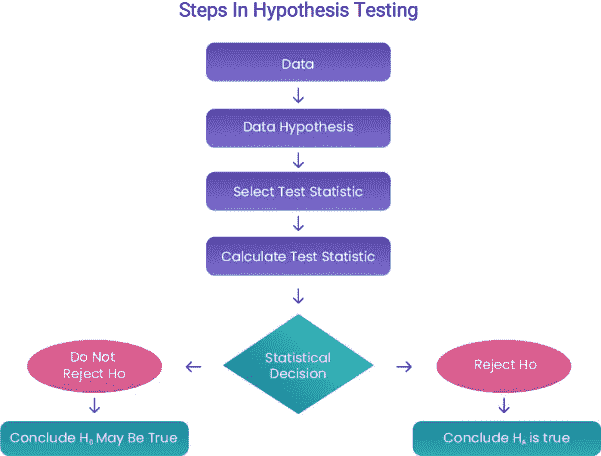

# 卡方检验综合指南——独立性检验

> 原文：<https://medium.com/analytics-vidhya/comprehensive-guide-to-chi-square-tests-for-independence-ff70f5734ad7?source=collection_archive---------5----------------------->

卢卡斯·布拉塞克在 [Unsplash](https://unsplash.com?utm_source=medium&utm_medium=referral) 上的照片

人性总是试图找出周围不同参数之间的关系和依赖关系。

下面是一些例子，如果存在依赖关系，我们可能想知道答案:

在得出某些结论/推论之前，我们总是希望得到某种证明。在这种情况下，我们可以借助推理统计学。我们可以借助统计分析来得出上述问题的结论/推论。

让我介绍一下独立性的卡方检验——找出分类变量之间关系的统计检验。

让我们快速了解一下什么是分类变量:

想象一下与房子相关的数据。人们可以在慈善机构中免费出租他们的房子，或者出租，或者拥有自己的房子并住在里面。所以，这三个免费|自有|租用被归类为类别。所以 HousingType 是一个类别变量。

想象一下与性别相关的数据。**性别是一个分类变量**有男性|女性等类别

但是，数学分数是一个数字变量。它是一个派生值，是一个数值。
当我们想要使用**卡方检验找出变量之间的相关性时，所有的参数都应该是分类的**。

本文与我的 Kaggle 内核同步，需要时请参考内核

[https://www . ka ggle . com/kirtibihade/chi-square-on-student-performance](https://www.kaggle.com/kirtibihade/chi-square-on-student-performance)

**问题陈述与解决** 思路是找出性别与数学成绩之间是否存在依赖关系。

> 如何将数学(数值变量)分数转换成分类？
> 
> 我们可以用等级将分数分为 4 类。

让我们考虑以下情况:

我们能根据少量数据做出推断吗？…不

可能一个班的女生比男生更有能力，而在另一个班，情况可能会不同。因此，为了在无偏模式 J 下运行，让我们假设我们有一个数据集，其中包含从 1000 名学生中随机选取的数据。

对数据进行统计分析是有意义的。因此，让我们首先应用一个独立性的统计检验，即卡方检验:

我从 Kaggle 上获取了一组学生表现的数据。数据集有 1000 个不同参数的条目。对于这篇文章，我们只考虑性别和数学成绩。

让我们从……开始..

**1 —卡方检验用于:**

*   测试拟合优度
*   测试两个属性之间关联的显著性或测试独立性
*   检验总体方差的同质性或显著性

我们将着重于检验两个属性之间关联的显著性或独立性的检验。考虑我的 Kaggle 笔记本中使用的学生表现数据。

**2 —数据集中的分类变量是**

**2.1 —性别**

*   男性的
*   女性的

**2.2——种族/民族**

*   A 组
*   B 组
*   C 组
*   D 组
*   E 组

**2.3 —父母的教育水平**

*   学士学位
*   某个大学
*   硕士学位
*   副学士学位
*   中学
*   某所高中

**2.4 —午餐**

*   免费/减价
*   标准

**2.5 —备考课程**

*   没有人
*   完成

**3 —数据集中的数值变量为**

*   数学成绩
*   写作分数
*   阅读分数

我们可以把一个数字变量转换成分类变量。
我们可以将数据分成多个箱，例如

*   低的
*   中等
*   高的
*   优秀的

数学分数现在可以被视为分类。同样的，我们可以换算一下写作分数，阅读分数等等。

**4 —卡方检验如何帮助我们找到性别和数学成绩之间的相关性:**
在解决问题之前，我们必须做出某些假设/前提

有两种可能-

1.性别和数学成绩是相依的还是
2。性别和数学成绩是独立的

卡方检验中的术语

**零假设 H0 —** 数学成绩和性别是独立的

**交替假设** **哈—** 数学成绩和性别有依赖关系

4.1 卡方检验将帮助我们拒绝或接受零假设。
卡方检验将如何决定接受或拒绝零假设？

以下是来自数据集的真实/观察到的数字。该表是一个列联表。

**4.1.1 —观测频率表:**

要计算卡方值

O —观察频率
E —预期频率

为了找出每个观察频率值的期望频率
行 1 和列 1 的期望频率=(行 1 合计)*(列 1 合计)/总计

**4.2.2 —给定列联表**的计算如下

*   第 1 行总计= 518
*   第 2 行总计= 482
*   **总计** = 1000
*   Col1 总计= 274
*   Col2 总计= 576
*   Col3 = 7
*   Col4 = 143
*   **总计** = 1000

行和列的总计相同。

**4.2.3 —预期频率表**

示例:对于第 1 行第 1 列的第一个观察值= 112

**期望值为** —

*   第 1 行第 1 列= (R1 合计)(C1 合计)/总计= (518)(274)/1000 = 141.932
*   第 1 行第 2 列= (R1 合计)(C2 合计)/总计= (518)(576)/1000 = 298.368 等等……..

**4.2.4 —计算出的卡方值为****=**[(112 –141.932)^2/141.932]+[(309–298.368)^2/298.268]+[(7–3.626)^2/3.626]+[(90–74.074)^2/74.074]+[(162–132.068)^2/132.068]+[(267–277.632)^2/277.632]+[(0–3.374)^2/3.374]+[(53–68.926)^2/68.926]
**=**= 6.31+0.37+3.13+3.42+6.78+0.407+3.374+3.67 = 27.461

**4 . 2 . 5-计算的卡方值(27.461)>0.001 显著性水平和 3 个自由度的表值(16.26)**

*   p 值应小于显著性水平。
*   所以如果计算卡方>表卡方和 P 值< significance level, reject the null hypothesis[(https://www.medcalc.org/manual/chi-square-table.php](https://www.medcalc.org/manual/chi-square-table.php))
*   [卡方分布表的值](https://www.medcalc.org/manual/chi-square-table.php)
*   [www.medcalc.org](http://www.medcalc.org)

**5 —如何决定显著性水平或 alpha 值？**

*   研究者可以决定显著性水平的值是考虑 0.05，0.01，0.5 还是 0.01。可以参考表格。

基本上，显著性水平是我们对我们的结果有多确定的度量——低显著性水平对应于实验结果偶然发生的低概率，反之亦然。

*   自由度计算为(行数-1)(列数-1)=(2–1)(4–1)= 3
*   对于给定的列联表，自由度= 3。
*   0.01 显著性水平表示置信度为 99.99%

**6 —检查测试**

根据独立性的卡方检验，如果计算值大于表中值，则拒绝零假设。

 [## StatDistributions.com-卡方分布计算器

### 计算卡方分布的 p 值和卡方值。

www.statdistributions.com](http://www.statdistributions.com/chisquare/) 

我们的零假设是——数学成绩和性别是独立的，但是根据表格和计算的卡方值，零假设被拒绝，我们可以说:

**数学成绩和性别是相依的。**

这就是我们如何使用卡方检验来检查不同分类数据之间的相关性/独立性。

请检查 Kaggle 内核的其余变量。您可以尝试另一个数据集**。**

**Kirti Parag Bihade**

*ML /DL 工程师@Infogen Labs*