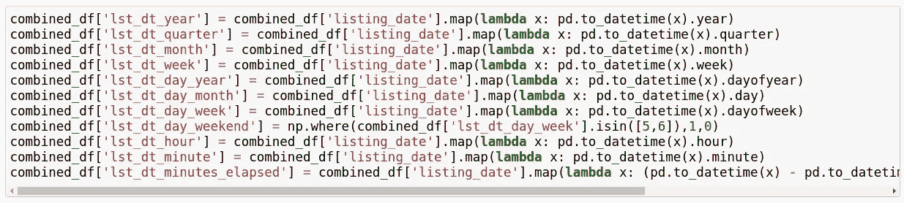
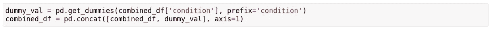
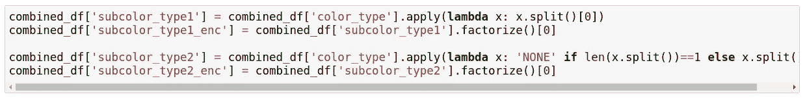
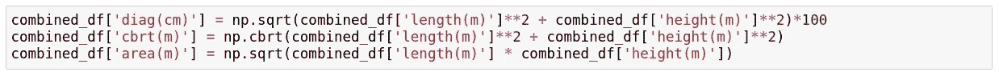
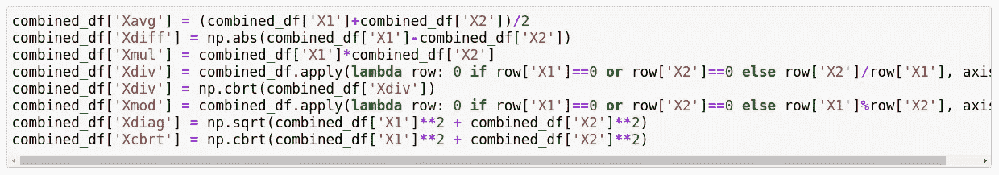
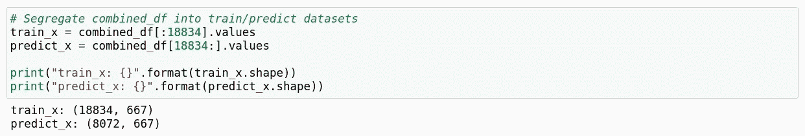
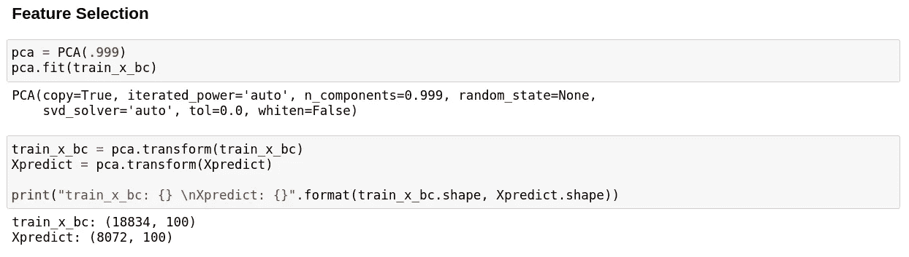
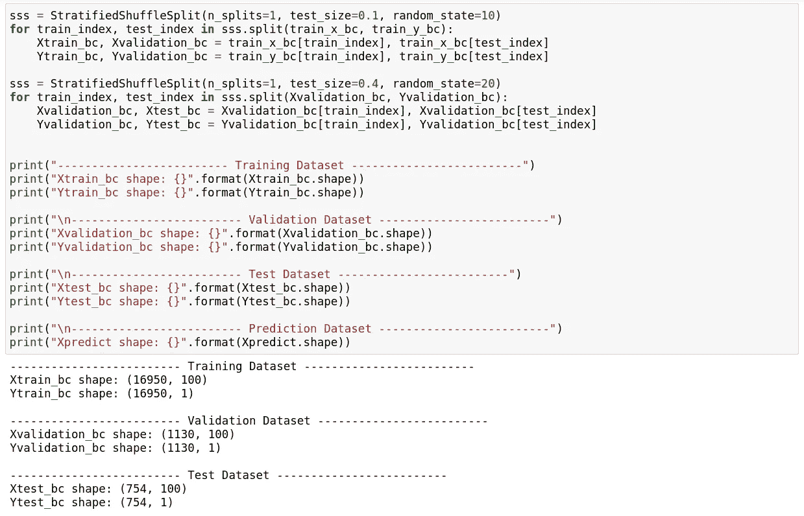

# 机器学习综合指南(第 2 部分，共 3 部分)

> 原文：<https://medium.com/analytics-vidhya/comprehensive-guide-to-machine-learning-part-2-of-3-cab36d4cf2a7?source=collection_archive---------32----------------------->

图片提供:[https://www.educative.io/track/become-ml-engineer](https://www.educative.io/track/become-ml-engineer)

欢迎来到“机器学习综合指南”系列的第二部分。在本系列的 [**第一部分**](/analytics-vidhya/comprehensive-guide-to-machine-learning-part-1-of-3-bbe058222278) 中，我们探讨了下面的机器学习概念。

*   获取数据
*   数据清理
*   探索性数据分析

我希望你们在自己的数据集上玩这些概念玩得开心。在这篇文章中，让我们深入探讨以下概念，这将极大地有助于建立一个强大的机器学习模型。

*   特征工程
*   特征选择
*   培训/验证/测试分割

> **注意:**这三个概念构成了整个机器学习模型开发生命周期的主干。**任何机器学习模型都只能与它在**上训练的功能一样好。一名优秀的数据工程师或数据科学家应该能够识别和创建直观的特征，并丢弃非直观的特征。

# 4)特征工程

我们先来了解一下“**特性**到底是什么意思。根据维基百科—

> 特征是所有独立单元共享的属性或特性，将对其进行分析或预测。**任何属性都可以是特征，只要对模型有用。**

因此，在机器学习的上下文中，*特征*有两个基本属性。

*   **所有功能都应该相互独立。**也就是说，它们之间应该有最小的相关性或者没有相关性。(我们已经在本系列的第一部分 的 [**中讨论过相关分析)**](/analytics-vidhya/comprehensive-guide-to-machine-learning-part-1-of-3-bbe058222278)
*   **该特征应该直观且对模型有用。丢弃不直观或无用的功能通常被认为是最佳实践。**

现在，让我们来定义一下“**特征工程**”。

> 特征工程是使用领域知识通过数据挖掘技术从原始数据中提取特征的过程。这些特征可以用来提高机器学习算法的性能。

*领域知识*是建立一个好的机器学习模型的关键之一。在实际开始开发机器学习模型之前，获取足够的领域或业务领域的知识是明智的。

既然我们已经有了特征工程的理论知识，让我们看看同样的代码。

*   **日期时间特性**

给定一个日期时间值，我们可以从中导出以下属性。

1.  年
2.  月
3.  四分之一
4.  周
5.  一年中的某一天
6.  一月中的某一天
7.  星期几
8.  如果日期是不是周末
9.  小时
10.  分钟
11.  第二
12.  经过的分钟数

*pandas* python 库已经有现成的功能来派生上面提到的特性，如下图所示。

*   **分类特征**

通常，以下两种技术用于分类变量的特征工程。

1.  **一键编码**

这可以使用 Pandas 库的“ *get_dummies* ”功能来完成，如下所示。

**2。标签编码**

这可以使用 Pandas 库的“*因式分解*”功能来完成，如下所示。

您可以查看下面的帖子，进一步了解分类特征编码。

 [## 编码分类特征

### 介绍

towardsdatascience.com](https://towardsdatascience.com/encoding-categorical-features-21a2651a065c) 

*   **连续特征**

对于分类特征，它归结为生成新特征的领域知识。在下图中，我使用“*长度*”和“*高度*”特征导出了“*面积*”和“*对角线*”值。

类似地，我通过使用现有变量的不同算术组合生成了新的特征，如下图所示。

我真的鼓励去阅读下面的帖子，以获得对特征工程技术的进一步理解。

 [## 面向机器学习的特征工程基本技术

### 用熊猫例子进行综合数据预处理所需的所有方法。

towardsdatascience.com](https://towardsdatascience.com/feature-engineering-for-machine-learning-3a5e293a5114) 

# 5)特征选择

让我们首先理解为什么执行特性选择如此重要。

> 机器学习的工作原理很简单——**如果你把垃圾放进去，你只会让垃圾出来**。这里的垃圾是指数据中的噪音。

当特征的数量非常大时，这变得更加重要。你不需要使用每一个特性来创建一个算法。你可以通过只输入那些真正重要的特征来帮助你的算法。

以下是使用特征选择的优点。

*   它使机器学习算法能够更快地训练。
*   它降低了模型的复杂性，使其更容易解释。
*   如果选择了正确的子集，就可以提高模型的准确性。
*   它减少了过度拟合。

在这篇文章中，我将只讨论使用主成分分析作为特征选择方法。

> PCA(主成分分析)是一种降维技术，它将数据投影到一个更低维的空间中。

让我们先来看看我完成特征工程后的特征数量。

所以我最终得到了 667 个特征，并不是所有的特征都对最终的机器学习模型直观或有用。现在让我们应用 PCA，只保留有用的特征，丢弃其余的。

如上图所示，只保留了 100 个有用的特征用于训练机器学习模型。

我建议浏览下面的帖子，以便更好地理解 PCA 和其他特征选择技术。

 [## 主成分分析:在机器学习中的应用

### 主成分分析在机器学习中的应用介绍

medium.com](/apprentice-journal/pca-application-in-machine-learning-4827c07a61db)  [## 每个数据科学家都应该知道的 5 种特征选择算法

### 额外收获:是什么让一个优秀的足球运动员变得伟大？

towardsdatascience.com](https://towardsdatascience.com/the-5-feature-selection-algorithms-every-data-scientist-need-to-know-3a6b566efd2) 

# 6)培训/验证/测试分割

在训练机器学习模型时，监控模型性能并确保没有“*”欠拟合或“*”是至关重要的。这两个术语的含义将会很清楚。**

**假设我们有一个包含 10，000 条记录的数据集，我们必须用它来构建机器学习模型。在训练模型时，我有以下 3 种可能的情况。**

*   **在 10，000 条记录的整个数据集上训练模型。但是，我没有任何进一步的数据来验证该模型是否如预期的那样工作。**
*   **我可以分离出 2000 条记录(**测试数据集**)并在剩余的 8000 条记录上训练模型(**训练数据集**)。这样，一旦训练完成，我就可以在剩余的 2，000 条记录上验证模型。然而，这种方法的唯一问题是，当我们调整超参数并重新训练/重新验证模型时，它会偏向测试数据集，因为模型现在已经看到了两个数据集。**
*   **我可以分离出 1，000 条记录(**测试数据集**)，只有当我非常确定它能按预期工作时，我才会向模型展示这些记录。我将进一步分离出另外 1000 条记录(**验证数据集**)，我将使用这些记录在不同的超参数上验证模型。我将使用剩余的 8000 条记录(**训练数据集**)来训练模型。这样我可以解决第二种方法中的偏差问题。**

**既然我们对训练/验证/测试数据集分割有了一个理论上的想法，我们就来简单讨论一下“**欠拟合**”和“**过拟合**”。**

> ****欠拟合** —当模型在训练和验证数据集上表现不佳时。例如，如果模型在训练数据上给出了 70%的准确性，在验证数据上给出了 55%的准确性，那么我们可以说该模型是欠拟合的。在这种情况下，最佳做法是使模型更加复杂，或者增加特征的数量来训练模型。**
> 
> ****过度拟合** —当模型在训练数据上表现优异，但在验证数据上表现不佳时。例如，如果模型对训练数据给出了 99%的准确性，而对验证数据给出了 60%的准确性，那么我们可以说该模型是过度拟合的。在这种情况下，最佳实践是简化模型或减少特征的数量来训练模型。**

**现在让我们看看训练/验证/测试数据集分割的代码。“**sk learn**”python 库为此提供了 2 个功能。**

*   ****sk learn . model _ selection . train _ test _ split**—对于回归问题，我通常更喜欢这个。**
*   ****sklearn.model_selection。StratifiedShuffleSplit**——对于分类问题，我通常更喜欢这样。**

**下图显示了执行数据集分割的 python 代码。**

****

**您可以查看下面的帖子，进一步了解模型验证的数据集分割。**

** [## 在 Python 中训练/测试分割和交叉验证

### 大家好！在我上一篇关于 Python 中线性回归的文章之后，我认为写一篇文章是很自然的…

towardsdatascience.com](https://towardsdatascience.com/train-test-split-and-cross-validation-in-python-80b61beca4b6)** 

# **结束语**

**全面的机器学习指南的第二部分到此结束。在下一篇 的 [**中，我将介绍模型构建、超参数调整和模型验证技术。然后，我们将对测试数据集进行预测，以确保模型按预期工作。**](/@tdtapas/comprehensive-guide-to-machine-learning-part-3-of-3-907cd1dd41dd)**

**和往常一样，你可以在下面的链接找到这篇文章的代码库。我强烈建议获得你自己的数据集(从 Kaggle 或使用网络搜集),并尝试这篇文章中详述的不同特征工程和特征选择方法。**

** [## dlaststark/机器学习项目

### permalink dissolve GitHub 是超过 5000 万开发人员的家园，他们一起工作来托管和审查代码，管理…

github.com](https://github.com/dlaststark/machine-learning-projects/blob/master/HackerEarth%20Competitions/Adopt%20a%20Buddy/Pet%20Adoption%20%28EDA%29.ipynb) 

请访问我的博客(下面的链接)来探索更多关于机器学习和 Linux 计算的内容。

 [## 自由博客作者|技术极客漫谈

### 技术极客漫谈|关于我不同技术事业的自由博客

www.techgeekramblings.com](https://www.techgeekramblings.com/)**