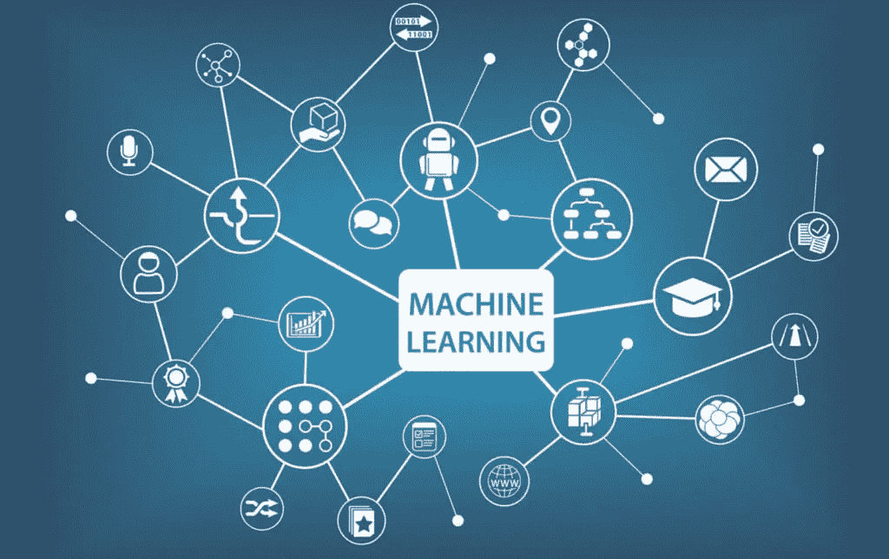

# 机器学习综合指南(第 3 部分，共 3 部分)

> 原文：<https://medium.com/analytics-vidhya/comprehensive-guide-to-machine-learning-part-3-of-3-907cd1dd41dd?source=collection_archive---------17----------------------->

图片提供:[https://www.advectas.com/en/blog/what-is-machine-learning/](https://www.advectas.com/en/blog/what-is-machine-learning/)

欢迎来到“机器学习综合指南”系列的第 3 部分，也是最后一部分。在本系列的课程中，我们研究了在开发良好的机器学习模型中起重要作用的几个关键概念。

像数据清理和 EDA 这样的概念对于更深入地理解数据有很大的帮助。类似地，像特性这样的概念…