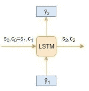

# 使用 Python 深度学习的文本摘要综合指南

> 原文：<https://medium.com/analytics-vidhya/comprehensive-guide-to-text-summarization-using-deep-learning-in-python-6435db1d008d?source=collection_archive---------0----------------------->

# 介绍

“我不要完整的报告，只要给我结果的摘要”。我经常发现自己处于这种情况——无论是在大学还是在职业生涯中。我们准备一份全面的报告，老师/主管只有时间阅读摘要。

听起来很熟悉？嗯，我决定做点什么。手动将报告转换为汇总版本太费时间了，对吗？我能依靠自然语言处理技术来帮我吗？

这就是使用深度学习的文本摘要的可怕概念真正帮助我的地方。它解决了之前一直困扰我的一个问题——**现在我们的模型可以理解整个文本的上下文**。对于我们所有需要快速总结文档的人来说，这是一个梦想成真的机会！

而我们在深度学习中使用文本摘要所达到的结果呢？了不起。因此，在本文中，我们将通过涵盖构建**文本摘要器所需的所有概念，一步步地使用深度学习**来构建文本摘要器。然后我们将用 Python 实现我们的第一个文本摘要模型！

*注意:本文要求对一些深度学习概念有基本的理解。我推荐浏览下面的文章。*

*   [*【序列建模必读入门(含用例)*](https://www.analyticsvidhya.com/blog/2018/04/sequence-modelling-an-introduction-with-practical-use-cases/?utm_source=blog&utm_medium=comprehensive-guide-text-summarization-using-deep-learning-python)
*   [*学习序列建模的必读教程(deeplearning.ai 课程#5)*](https://www.analyticsvidhya.com/blog/2019/01/sequence-models-deeplearning/?utm_source=blog&utm_medium=comprehensive-guide-text-summarization-using-deep-learning-python)
*   [*深度学习精要:长短期记忆入门*](https://www.analyticsvidhya.com/blog/2017/12/fundamentals-of-deep-learning-introduction-to-lstm/?utm_source=blog&utm_medium=comprehensive-guide-text-summarization-using-deep-learning-python)

# 目录

1.  什么是自然语言处理中的文本摘要？
2.  序列间(Seq2Seq)建模简介
3.  了解编码器-解码器架构
4.  编码器-解码器结构的局限性
5.  注意力机制背后的直觉
6.  理解问题陈述
7.  使用 Keras 在 Python 中实现文本摘要模型
8.  下一步是什么？
9.  注意力机制是如何工作的？

这篇文章涵盖的章节较少。为了阅读整篇帖子，请参考 [*这里*](https://www.analyticsvidhya.com/blog/2019/06/comprehensive-guide-text-summarization-using-deep-learning-python/) *。*

# 什么是自然语言处理中的文本摘要？

在了解文本摘要的工作原理之前，我们先来了解一下什么是文本摘要。这里有一个简洁的定义让我们开始:

> *自动文本摘要的任务是生成简洁流畅的摘要，同时保留关键信息内容和整体含义*
> 
> *-文本摘要技术:简要调查，2017*

概括地说，有两种不同的方法用于文本摘要:

*   摘录摘要
*   抽象概括

让我们更详细地看看这两种类型。

# 摘录摘要

这个名字透露了这种方法的作用。**我们从原始文本中识别出重要的句子或短语，并且只从文本中提取那些句子或短语。这些提取出来的句子就是我们的摘要。下图说明了摘录总结:**

我推荐阅读下面这篇文章，使用 TextRank 算法构建一个文本摘要:

# 抽象概括

这是一个非常有趣的方法。这里，**我们从原文生成新的句子。**这与我们之前看到的提取方法形成对比，在提取方法中，我们只使用存在的句子。通过抽象概括生成的句子可能不会出现在原文中:

你可能已经猜到了——在本文中，我们将使用深度学习来构建一个抽象的文本摘要器！在进入实现部分之前，让我们首先理解构建文本摘要器模型所必需的概念。

激动人心的时刻即将到来！

# 序列间(Seq2Seq)建模简介

我们可以对任何涉及序列信息的问题建立 Seq2Seq 模型。这包括情感分类、神经机器翻译和命名实体识别——序列信息的一些非常常见的应用。

在神经机器翻译的情况下，输入是一种语言的文本，输出也是另一种语言的文本:

在命名实体识别中，输入是单词序列，输出是输入序列中每个单词的标签序列:

我们的目标是构建一个文本摘要器，其中输入是一长串单词(在文本正文中)，输出是一个简短的摘要(也是一个序列)。因此，**我们可以将此建模为多对多 Seq2Seq 问题。**下面是一个典型的 Seq2Seq 模型架构:

Seq2Seq 模型有两个主要组件:

下面我们来详细了解一下这两位。这些对于理解文本摘要如何在代码下工作是必不可少的。您也可以查看本教程来更详细地了解序列到序列建模。

# 理解编码器-解码器架构

> *编解码架构主要用于解决输入输出序列长度不同的序列对序列(Seq2Seq)问题。*

让我们从文本摘要的角度来理解这个。输入是一个长单词序列，输出是输入序列的一个短版本。

通常，递归神经网络(RNNs)的变体，即门控递归神经网络(GRU)或长短期记忆(LSTM)，优选作为编码器和解码器组件。这是因为它们能够通过克服梯度消失的问题来捕捉长期依赖性。

我们可以分两个阶段设置编码器-解码器:

让我们通过 LSTM 模型来理解这些概念。

# 培训阶段

在训练阶段，我们将首先设置编码器和解码器。然后，我们将训练模型来预测目标序列偏移一个时间步长。让我们详细看看如何设置编码器和解码器。

**编码器**

编码器长短期记忆模型(LSTM)读取整个输入序列，其中，在每个时间步长，一个字被馈入编码器。然后，它在每个时间步长处理信息，并捕获输入序列中的上下文信息。

我整理了下图来说明这一过程:

最后一个时间步长的隐藏状态(hi)和单元状态(ci)用于初始化解码器。请记住，这是因为编码器和解码器是两套不同的 LSTM 架构。

**解码器**

解码器也是一个 LSTM 网络，它逐字读取整个目标序列，并预测偏移一个时间步长的相同序列。**解码器被训练成在给定前一个字的情况下预测序列中的下一个字。**

**< start >** 和< **end >** 是在将目标序列送入解码器之前添加到目标序列中的特殊标记。解码测试序列时目标序列未知。因此，我们通过将第一个字传入解码器来开始预测目标序列，该解码器将始终是< **开始>** 标记。而< **end >** 记号表示句子结束。

目前为止很直观。

# 推理阶段

训练后，在目标序列未知的新源序列上测试该模型。因此，我们需要建立推理架构来解码一个测试序列:

推理过程是如何进行的？

以下是解码测试序列的步骤:

1.  对整个输入序列进行编码，并用编码器的内部状态初始化解码器
2.  传递< **开始>令牌作为解码器的输入**
3.  用内部状态运行解码器一个时间步长
4.  输出将是下一个单词的概率。将选择具有最大概率的单词
5.  在下一个时间步长将采样字作为输入传递给解码器，并用当前时间步长更新内部状态
6.  重复步骤 3-5，直到我们生成 **<结束>** 令牌或者达到目标序列的最大长度

让我们举一个例子，测试序列由[x1，x2，x3，x4 ]给出。对于这个测试序列，推理过程将如何工作？我想让你在看我下面的想法之前好好想想。

1.  将测试序列编码成内部状态向量
2.  观察解码器如何在每个时间步长预测目标序列:

**时间步长:t=1**

**时间步长:t=2**

**并且，时间步长:t=3**

# 编码器-解码器结构的局限性

尽管这种编码器-解码器架构非常有用，但也有一定的局限性。

*   编码器将整个输入序列转换成固定长度的向量，然后解码器预测输出序列。**这仅适用于短序列**,因为解码器会查看整个输入序列进行预测
*   长序列的问题来了。**编码器很难将长序列记忆成固定长度的向量**

> *这种编码器-解码器方法的一个潜在问题是，神经网络需要能够将源句子的所有必要信息压缩到固定长度的向量中。这可能会使神经网络难以处理长句。随着输入句子长度的增加，基本编码器-解码器的性能迅速恶化。*
> 
> *-通过联合学习对齐和翻译的神经机器翻译*

那么我们如何克服这个长序列的问题呢？这就是注意力机制的概念出现的地方。它的目的是通过只查看序列的几个特定部分来预测一个单词，而不是整个序列。它真的像听起来一样棒！

*为了阅读整篇文章，这里请参考***。**

*你也可以在分析 Vidhya 的 Android 应用上阅读这篇文章*

**原载于 2019 年 6 月 10 日*[*https://www.analyticsvidhya.com*](https://www.analyticsvidhya.com/blog/2019/06/comprehensive-guide-text-summarization-using-deep-learning-python/)*。**