# 包含数据集和代码的 Twitter 情感分析综合实践指南

> 原文：<https://medium.com/analytics-vidhya/comprehensive-hands-on-guide-to-twitter-sentiment-analysis-with-dataset-and-code-960c055ada3f?source=collection_archive---------2----------------------->

自然语言处理(NLP)是目前数据科学研究的温床，NLP 最常见的应用之一是情感分析。从民意调查到创建完整的营销策略，这个领域已经完全重塑了企业的工作方式，这就是为什么这是每个数据科学家都必须熟悉的领域。

可以针对情感(以及包括命名实体、话题、主题等在内的其他特征)来处理数千个文本文档。)在几秒钟内，相比之下，一组人手工完成同样的任务需要几个小时。


在本文中，我们将学习如何解决 [Twitter 情感分析练习题](https://datahack.analyticsvidhya.com/contest/practice-problem-twitter-sentiment-analysis/)。

我们将按照解决一般情感分析问题所需的一系列步骤来完成。我们将从预处理和清理推文的原始文本开始。然后，我们将探索干净的文本，并尝试获得一些关于推文上下文的直觉。之后，我们将从数据中提取数字特征，并最终使用这些特征集来训练模型并识别推文的情绪。

这是 NLP 中最有趣的挑战之一，所以我很高兴能和你一起踏上这段旅程！

# 目录

1.  理解问题陈述
2.  Tweets 预处理和清理
3.  推文中的故事生成和可视化
4.  从干净的推文中提取特征
5.  模型构建:情感分析
6.  下一步是什么

# 1.理解问题陈述

让我们看一下问题陈述，因为在处理数据集之前理解目标是非常重要的。问题陈述如下:

***该任务的目标是检测推文中的仇恨言论。为了简单起见，如果一条推文带有种族主义或性别歧视的情绪，我们就说这条推文包含仇恨言论。所以，任务是将种族主义或性别歧视的推文从其他推文中分类。***

形式上，给定一个推文和标签的训练样本，其中标签“1”表示该推文是种族主义/性别歧视的，标签“0”表示该推文不是种族主义/性别歧视的，你的目标是预测给定测试数据集上的标签。

*注:本练习题的评价指标为****F1-得分*** *。*


就我个人而言，我非常喜欢这项任务，因为仇恨言论、网络钓鱼和社交媒体欺凌已经成为这些天的严重问题，一个能够检测这些文本的系统肯定会在使互联网和社交媒体成为一个更好和无欺凌的地方方面发挥巨大作用。现在让我们详细看看每个步骤。

# 2.Tweets 预处理和清理

看看下面的图片，它们描绘了办公空间的两种场景——一种是不整洁的，另一种是整洁有序的。


您正在此办公空间中搜索文档。在哪种情况下，您更容易找到文档？当然，在不太杂乱的地方，因为每件物品都放在适当的位置。数据清理练习非常类似。如果数据以结构化的格式排列，那么就更容易找到正确的信息。

文本数据的预处理是必不可少的步骤，因为它使原始文本为挖掘做好准备，即，从文本中提取信息并对其应用机器学习算法变得更容易。如果我们跳过这一步，那么很有可能您正在处理有噪声和不一致的数据。这一步的目的是清除那些与寻找推文情感不太相关的噪音，如标点符号、特殊字符、数字和在文本上下文中没有多少分量的术语。

在后面的一个阶段，我们将从 Twitter 文本数据中提取数字特征。该特征空间是使用整个数据中存在的所有唯一单词创建的。因此，如果我们对数据进行良好的预处理，那么我们将能够获得质量更好的特征空间。

让我们首先读取数据并加载必要的库。你可以从[这里](https://datahack.analyticsvidhya.com/contest/practice-problem-twitter-sentiment-analysis/)下载数据集。

```
**import** re 
**import** pandas **as** pd  
**import** numpy **as** np  
**import** matplotlib.pyplot **as** plt  
**import** seaborn **as** sns 
**import** string 
**import** nltk 
**import** warnings  
warnings.filterwarnings("ignore", category=DeprecationWarning) %matplotlib inlinetrain  = pd.read_csv('train_E6oV3lV.csv') 
test = pd.read_csv('test_tweets_anuFYb8.csv')
```

让我们检查训练数据集的前几行。

```
train.head()
```

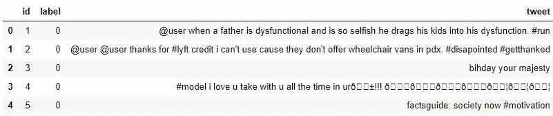

数据有 3 列***id*******标签******tweet***。 ***标签*** 是二进制目标变量， ***tweet*** 包含我们将要清理和预处理的 tweet。*

*查看前 5 条记录后，我们可以想到的初始数据清理要求:*

*   *出于隐私考虑，Twitter 账号已经被屏蔽为@user。因此，这些 Twitter 句柄几乎没有给出任何关于推文性质的信息。*
*   *我们也可以考虑去掉标点符号、数字甚至特殊字符，因为它们无助于区分不同类型的推文。*
*   *大部分较小的字并没有增加多少价值。比如' pdx '，' his '，' all '。因此，我们将尝试从我们的数据中删除它们。*
*   *一旦我们执行了上面的三个步骤，我们就可以将每条 tweet 拆分成单独的单词或标记，这是任何 NLP 任务中必不可少的一步。*
*   *在第四条推文中，有一个词“爱”。我们也可能会有爱、可爱、可爱等术语。在剩下的数据中。这些术语经常在相同的上下文中使用。如果我们能把它们简化为词根，也就是“爱”，那么我们就能减少数据中独特词汇的总数，而不会丢失大量信息。*

## *a)移除 Twitter 句柄(@user)*

*如上所述，tweets 包含许多 twitter 句柄(@user)，这是一个 Twitter 用户在 Twitter 上承认的。我们将从数据中删除所有这些 twitter 句柄，因为它们没有传达太多信息。*

*为了方便起见，我们先把训练集和测试集结合起来。这省去了在测试和训练中两次执行相同步骤的麻烦。*

```
*combi = train.append(test, ignore_index=**True**)*
```

*下面给出了一个用户定义的函数，用于从推文中删除不需要的文本模式。它有两个参数，一个是文本的原始字符串，另一个是我们想要从字符串中移除的文本模式。该函数返回相同的输入字符串，但没有给定的模式。我们将使用这个函数从我们数据中的所有 tweets 中删除模式' @user '。*

```
***def** **remove_pattern**(input_txt, pattern):     
    r = re.findall(pattern, input_txt)     
    **for** i **in** r:         
        input_txt = re.sub(i, '', input_txt)              
    **return** input_txt*
```

*现在让我们创建一个新的列 **tidy_tweet，**它将包含经过清理和处理的 tweet。注意，我们已经将“@[\w]*”作为模式传递给了 *remove_pattern* 函数。它实际上是一个正则表达式，可以选择任何以“@”开头的单词。*

```
**# remove twitter handles (@user)* combi['tidy_tweet'] = np.vectorize(remove_pattern)(combi['tweet'], "@[\w]*")*
```

## *b)删除标点、数字和特殊字符*

*如前所述，标点符号、数字和特殊字符没有太大帮助。最好将它们从文本中删除，就像我们删除 twitter 句柄一样。这里我们将用空格替换除字符和标签之外的所有内容。*

```
**# remove special characters, numbers, punctuation*combi['tidy_tweet'] = combi['tidy_tweet'].str.replace("[^a-zA-Z#]", " ")*
```

## *c)删除短词*

*在选择要删除的单词的长度时，我们必须小心一点。所以，我决定删除所有长度不超过 3 的单词。例如，像“嗯”、“哦”这样的术语用处很小。最好摆脱他们。*

```
*combi['tidy_tweet'] = combi['tidy_tweet'].apply(**lambda** x:' '.join([w                            **for** w **in** x.split() **if** len(w)>3]))*
```

*让我们再看一看组合数据帧的前几行。*

```
*combi.head()*
```

*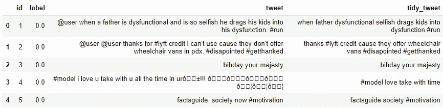*

*您可以非常清楚地看到原始推文和干净推文(tidy_tweet)之间的差异。只有推文中的重要单词被保留，噪音(数字、标点符号和特殊字符)被删除。*

## *d)标记化*

*现在，我们将对数据集中所有清理过的推文进行标记。记号是单独的术语或单词，记号化是将一串文本拆分成记号的过程。*

```
*tokenized_tweet = combi['tidy_tweet'].apply(**lambda** x: x.split()) tokenized_tweet.head()*
```

*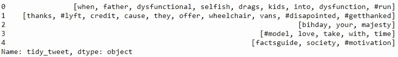*

## *e)词干*

*词干提取是一个基于规则的过程，从单词中去除后缀(“ing”、“ly”、“es”、“s”等)。举个例子，比如—“玩”“玩家”“玩过”“玩”“玩”是“玩”这个词的不同变体。*

```
*from nltk.stem.porter import * 
stemmer = PorterStemmer() tokenized_tweet = tokenized_tweet.apply(lambda x: [stemmer.stem(i) for i in x]tokenized_tweet.head()*
```

*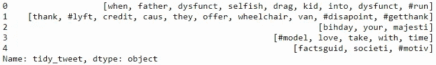*

*现在让我们把这些代币缝合在一起。*

```
*for i in range(len(tokenized_tweet)): 
    tokenized_tweet[i] = ' '.join(tokenized_tweet[i]) combi['tidy_tweet'] = tokenized_tweet*
```

# *3.推文中的故事生成和可视化*

*在这一节中，我们将探索清理后的 tweets 文本。探索和可视化数据，无论是文本还是其他数据，都是获得洞察力的重要步骤。不要只局限于本教程中讲述的这些方法，尽可能自由地探索数据。*

*在我们开始探索之前，我们必须思考并提出与手头数据相关的问题。一些可能的问题如下:*

*   *整个数据集中最常见的词是什么？*
*   *数据集中最常见的负面和正面推文分别是什么？*
*   *一条推文中有多少标签？*
*   *哪些趋势与我的数据集相关联？*
*   *哪些趋势与这两种情绪有关？它们与情感相容吗？*

# *a)了解推文中使用的常用词:WordCloud*

*现在，我想看看给定的情感在训练数据集中分布得如何。完成这项任务的一种方法是通过绘制单词云来理解常用单词。*

*单词云是一种可视化，其中最频繁出现的单词以大尺寸出现，不太频繁出现的单词以小尺寸出现。*

*让我们用词云图来可视化我们数据中的所有词。*

```
*all_words = ' '.join([text **for** text **in** combi['tidy_tweet']]) 
from wordcloud **import** WordCloud wordcloud = WordCloud(width=800, height=500, random_state=21, max_font_size=110).generate(all_words) plt.figure(figsize=(10, 7)) 
plt.imshow(wordcloud, interpolation="bilinear") 
plt.axis('off') 
plt.show()*
```

*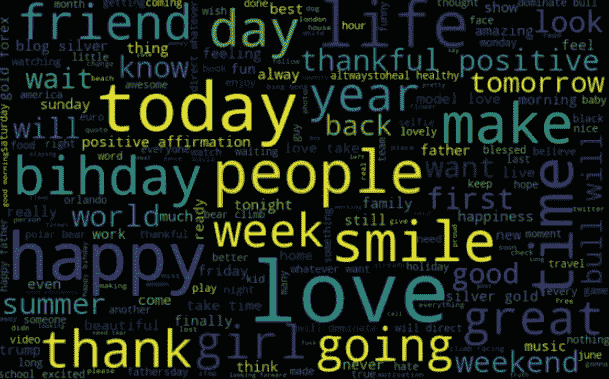*

*我们可以看到大多数单词是积极的或中性的。其中*快乐*和*爱情*是最常见的。它没有给我们任何关于种族主义/性别歧视推文相关词汇的概念。因此，我们将在我们的训练数据中为两个类别(种族主义/性别歧视或非种族主义)绘制单独的词云。*

# *b)非种族主义/性别歧视推文中的词语*

```
*normal_words =' '.join([text **for** text **in** combi['tidy_tweet'][combi['label'] == 0]]) wordcloud = WordCloud(width=800, height=500, random_state=21, max_font_size=110).generate(normal_words) plt.figure(figsize=(10, 7)) 
plt.imshow(wordcloud, interpolation="bilinear") 
plt.axis('off') 
plt.show()*
```

*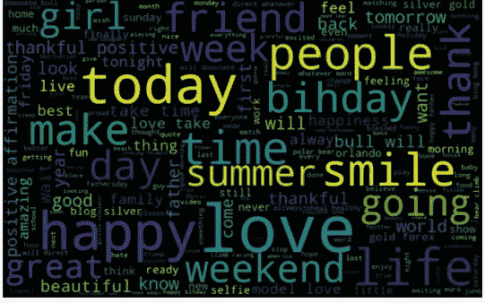*

*我们可以看到大多数单词是积极的或中性的。随着*开心，微笑，*和*爱*是最频繁的。因此，大多数常用词与非种族主义/性别歧视推特的情绪是一致的。类似地，我们将为另一种情绪绘制单词 cloud。期待看到负面的、种族主义的和性别歧视的词语。*

# *c)种族主义/性别歧视的推文*

```
*negative_words = ' '.join([text for text in combi['tidy_tweet'][combi['label'] == 1]]) wordcloud = WordCloud(width=800, height=500, random_state=21, max_font_size=110).generate(negative_words) plt.figure(figsize=(10, 7)) 
plt.imshow(wordcloud, interpolation="bilinear") 
plt.axis('off') 
plt.show()*
```

*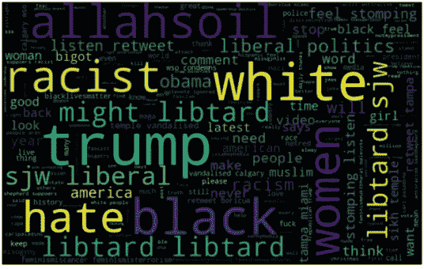*

*我们可以清楚地看到，大多数单词都有负面含义。所以，看起来我们有一个很好的文本数据要处理。接下来，我们将讨论 twitter 数据中的标签/趋势。*

# *d)理解标签对推文情绪的影响*

*twitter 中的标签是 twitter 上任何特定时间点上正在进行的趋势的同义词。我们应该尝试检查这些标签是否给我们的情感分析任务增加了任何价值，也就是说，它们有助于将推文区分为不同的情感。*

*例如，下面是我们数据集的一条推文:*

*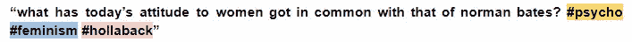*

*这条推文本质上似乎带有性别歧视，推文中的标签也传达了同样的感觉。*

*我们将所有的趋势术语存储在两个单独的列表中——一个用于非种族主义/性别歧视的推文，另一个用于种族主义/性别歧视的推文。*

```
**# function to collect hashtags* 
**def** **hashtag_extract**(x):     
    hashtags = []     
    *# Loop over the words in the tweet*     
    **for** i **in** x:         
        ht = re.findall(r"#(\w+)", i)         
        hashtags.append(ht)     

    **return** hashtags*# extracting hashtags from non racist/sexist tweets* 
HT_regular = hashtag_extract(combi['tidy_tweet'][combi['label'] == 0]) *# extracting hashtags from racist/sexist tweets* 
HT_negative = hashtag_extract(combi['tidy_tweet'][combi['label'] == 1]) *# unnesting list* 
HT_regular = sum(HT_regular,[]) 
HT_negative = sum(HT_negative,[])*
```

*现在我们已经为这两种情绪准备了标签列表，我们可以绘制前 n 个标签了。所以，首先让我们检查一下非种族主义/性别歧视推文中的标签。*

***非种族主义/性别歧视的推文***

```
*a = nltk.FreqDist(HT_regular) 
d = pd.DataFrame({'Hashtag': list(a.keys()),                   'Count': list(a.values())}) *# selecting top 10 most frequent hashtags     * 
d = d.nlargest(columns="Count", n = 10) plt.figure(figsize=(16,5)) 
ax = sns.barplot(data=d, x= "Hashtag", y = "Count") 
ax.set(ylabel = 'Count') 
plt.show()*
```

*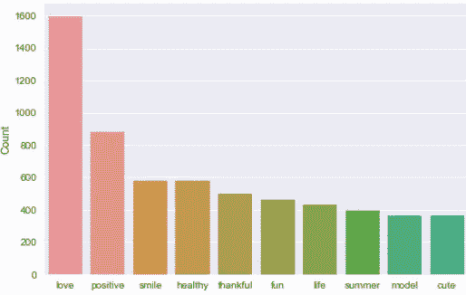*

*所有这些标签都是积极的，有意义的。我预计在第二个列表的情节中会出现负项。让我们来看看种族主义/性别歧视推文中出现频率最高的标签。*

*种族主义/性别歧视推文*

```
*b = nltk.FreqDist(HT_negative) 
e = pd.DataFrame({'Hashtag': list(b.keys()), 'Count': list(b.values())}) *# selecting top 10 most frequent hashtags* 
e = e.nlargest(columns="Count", n = 10) plt.figure(figsize=(16,5)) 
ax = sns.barplot(data=e, x= "Hashtag", y = "Count") 
ax.set(ylabel = 'Count') 
plt.show()*
```

*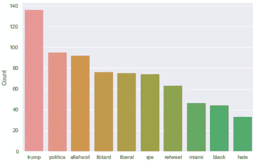*

*不出所料，大多数术语都是负面的，也有一些中性术语。因此，在我们的数据中保留这些标签并不是一个坏主意，因为它们包含有用的信息。接下来，我们将尝试从标记化的推文中提取特征。*

# *4.从干净的推文中提取特征*

*为了分析预处理过的数据，需要将其转换为特征。根据使用情况，可以使用各种技术来构造文本特征——单词包、TF-IDF 和单词嵌入。在本文中，我们将只涉及词汇袋和 TF-IDF。*

# *词袋特征*

*词袋是一种将文本表示成数字特征的方法。考虑一个名为 C of D documents {d1，d2…..dD}和从语料库 c 中提取出的 N 个唯一记号。这 N 个记号(单词)将形成一个列表，单词袋矩阵 M 的大小将由 D×N 给出。矩阵 M 中的每一行都包含文档 D(i)中记号的频率。*

*让我们用一个简单的例子来理解这一点。假设我们只有两个文档*

*D1:他是一个懒惰的男孩。她也很懒。*

*D2:史密斯是一个懒惰的人。*

*所创建的列表将由语料库 c 中的所有唯一标记组成*

*= ['他'，'她'，'懒惰'，'男孩'，'史密斯'，'人']*

*这里，D=2，N=6*

*大小为 2 X 6 的矩阵 M 将表示为*

*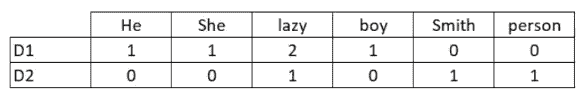*

*现在，上述矩阵中的列可以用作构建分类模型的特征。使用 sklearn 的*计数矢量器*函数可以很容易地创建单词袋特征。我们将设置参数 max_features = 1000，只选择语料库中按词频排序的前 1000 个词。*

```
***from** sklearn.feature_extraction.text **import** CountVectorizer bow_vectorizer = CountVectorizer(max_df=0.90, min_df=2, max_features=1000, stop_words='english') *# bag-of-words feature 
matrix* bow = bow_vectorizer.fit_transform(combi['tidy_tweet'])*
```

# *TF-IDF 功能*

*这是另一种基于频率方法的方法，但它不同于词袋方法，因为它考虑的不仅仅是一个词在单个文档(或 tweet)中的出现，而是整个语料库。*

*TF-IDF 的工作原理是通过给常用词分配较低的权重来惩罚它们，同时给那些在整个语料库中很少见但在少数文档中出现次数较多的词赋予重要性。*

*让我们来看看与 TF-IDF 相关的重要术语:*

*   *TF =(术语 t 在文档中出现的次数)/(文档中的术语数)*
*   *IDF = log(N/n)，其中，N 是文档数，N 是术语 t 出现的文档数。*
*   *TF-IDF = TF*IDF*

```
***from** sklearn.feature_extraction.text **import** TfidfVectorizer tfidf_vectorizer = TfidfVectorizer(max_df=0.90, min_df=2, max_features=1000, stop_words='english') *# TF-IDF feature matrix* 
tfidf = tfidf_vectorizer.fit_transform(combi['tidy_tweet'])*
```

# *5.模型构建:情感分析*

*现在，我们已经完成了以正确的形式获取数据所需的所有预建模阶段。现在，我们将使用两个特征集(词袋和 TF-IDF)在数据集上构建预测模型。*

*我们将使用逻辑回归来建立模型。它通过将数据拟合到 logit 函数来预测事件发生的概率。*

*逻辑回归中使用以下等式:*

*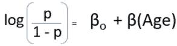*

*阅读这篇[文章](https://www.analyticsvidhya.com/blog/2015/11/beginners-guide-on-logistic-regression-in-r/)了解更多关于逻辑回归的知识。*

**注:如果你有兴趣尝试随机森林、支持向量机或 XGBoost 等其他机器学习算法，https://trainings.analyticsvidhya.com*[*将很快为你提供一门成熟的情感分析课程。*](https://trainings.analyticsvidhya.com.)*

# *a)使用词袋特征建立模型*

```
***from** sklearn.linear_model **import** LogisticRegression 
**from** sklearn.model_selection **import** train_test_split 
**from** sklearn.metrics **import** f1_score train_bow = bow[:31962,:] 
test_bow = bow[31962:,:] *# splitting data into training and validation set* 
xtrain_bow, xvalid_bow, ytrain, yvalid = train_test_split(train_bow, train['label'], random_state=42, test_size=0.3) lreg = LogisticRegression() 
lreg.fit(xtrain_bow, ytrain) *# training the model* prediction = lreg.predict_proba(xvalid_bow) *# predicting on the validation set* prediction_int = prediction[:,1] >= 0.3 *# if prediction is greater than or equal to 0.3 than 1 else 0* prediction_int = prediction_int.astype(np.int) f1_score(yvalid, prediction_int) *# calculating f1 score**
```

***输出:0.53***

*我们在词袋特征上训练了逻辑回归模型，它给我们的验证集的 F1 值是 0.53。现在我们将使用这个模型来预测测试数据。*

```
*test_pred = lreg.predict_proba(test_bow) 
test_pred_int = test_pred[:,1] >= 0.3 
test_pred_int = test_pred_int.astype(np.int) 
test['label'] = test_pred_int 
submission = test[['id','label']] *# writing data to a CSV file*
submission.to_csv('sub_lreg_bow.csv', index=**False**)* 
```

*大众排行榜 F1 分 0.567。现在，我们将再次训练一个逻辑回归模型，但这次是基于 TF-IDF 特征。让我们看看它的表现如何。*

# *b)使用 TF-IDF 功能构建模型*

```
*train_tfidf = tfidf[:31962,:] 
test_tfidf = tfidf[31962:,:] 
xtrain_tfidf = train_tfidf[ytrain.index] 
xvalid_tfidf = train_tfidf[yvalid.index] lreg.fit(xtrain_tfidf, ytrain) 
prediction = lreg.predict_proba(xvalid_tfidf) 
prediction_int = prediction[:,1] >= 0.3 
prediction_int = prediction_int.astype(np.int) f1_score(yvalid, prediction_int)*
```

***输出:0.544***

*验证分数为 0.544，公共排行榜 F1 分数为 0.564。因此，通过使用 TF-IDF 功能，验证分数有所提高，公共排行榜分数或多或少相同。*

# *6.下一步是什么？*

*如果你有兴趣学习更先进的情感分析技术，我们为你准备了一个关于同一问题的免费课程，不久将在[https://trainings.analyticsvidhya.com/](https://trainings.analyticsvidhya.com/)发布。该课程将有先进的技术，如用于特征提取的 word2vec 模型，更多的机器学习算法，模型微调等等。*

*在本课程中，您将学到以下内容:*

*   *使用单词嵌入(word2vec 和 doc2vec)来创建更好的特性。*
*   *应用先进的机器学习算法，如 SVM、随机森林和 XGBoost。*
*   *模型微调*
*   *创建自定义指标*

# *结束注释*

*在本文中，我们学习了如何处理情感分析问题。我们从数据的预处理和探索开始。然后，我们使用词袋和 TF-IDF 从清洗后的文本中提取特征。最后，我们能够使用这两个特征集建立几个模型来对推文进行分类。*

*你觉得这篇文章有用吗？你有什么有用的窍门吗？你用其他方法提取特征了吗？欢迎在下面的评论中或在[讨论门户](https://discuss.analyticsvidhya.com/)上讨论你的经历，我们将非常乐意讨论。*

**原载于 2018 年 7 月 30 日*[*【www.analyticsvidhya.com】*](https://www.analyticsvidhya.com/blog/2018/07/hands-on-sentiment-analysis-dataset-python/)*。**