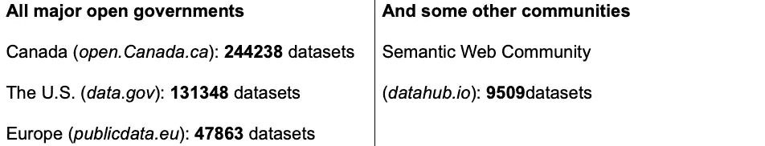
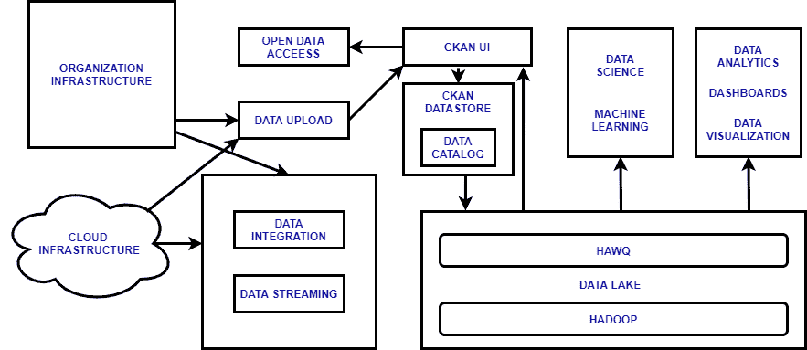
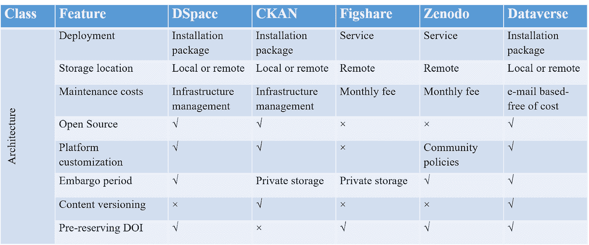
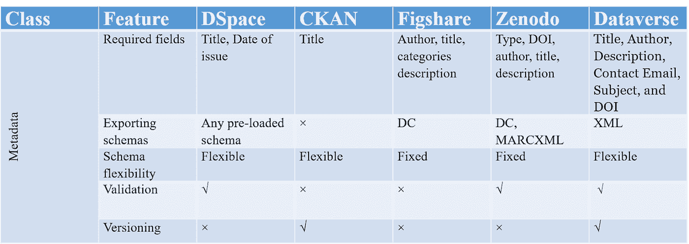
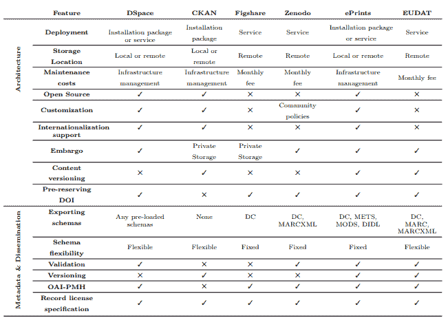

# 开放数据平台综合研究

> 原文：<https://medium.com/analytics-vidhya/comprehensive-study-of-open-data-platforms-a63d702ef0d5?source=collection_archive---------7----------------------->

# 第 1 部分:综合知识档案网络(CKAN)

CKAN(综合知识档案网络)是一个开源数据管理系统，旨在为数据中心和门户提供支持。 [CKAN](https://ckan.org) 促进数据的全球发布、共享和使用。如今，全世界每个人存储的数据总量约为 5 GB。这增加了对像 [CKAN](https://ckan.org) 这样的平台的需求，使人们能够访问世界各地的必要数据集。CKAN 是一个强大的开源数据管理系统，通过提供工具简化、发布和共享来自不同领域的多个用户的数据，使数据易于访问。这意味着我们无需支付任何许可费就可以使用它，并且我们保留对我们输入的数据和元数据的所有权利。 [CKAN](https://ckan.org) 对产品开发人员、技术顾问、数据分析人员、数据记者和研究人员很有用。它还让人们更容易找到、共享和重用数据，无论他们是研究科学家还是公务员、数据爱好者还是普通公民。CKAN 还帮助政府更好地管理其数据，因为它提供了更好的数据和知识发现。 [CKAN](https://ckan.org) 拥有智能的数据搜索方式，如关键词搜索(例如:标签浏览)、位置过滤、许可证、群组、出版商等。

CKAN 最重要的特性之一是存储元数据信息，包括一些小细节，如原始资源引用和转换后的数据标准(如 ISO)。有各种各样的网站连接到开源数据集，并且 [CKAN](https://ckan.org) 也充当网关，通过它我们可以访问那些端点并获得世界各地的数据。我们可以将其与亚马逊这样的网站进行比较，亚马逊与不同零售店的连接方式与 CKAN 与全球不同数据集的连接方式相同。

# **【1】谁用 CKAN？**

# **【2】CKAN 不仅仅是一个知识库**

有时候一个存储库被看作是存放你的研究的地方，然后忘记它。从这个意义上来说， [CKAN](https://ckan.org) 不是一个存储库。虽然它肯定可以从存储库中做所需的事情，但它也是一个数据将继续为研究社区工作的地方。也可以使用 [CKAN](https://ckan.org) 作为现有存储库旁边的数据存储。 [CKAN](https://ckan.org) 现在可以用来在数据中心发布研究成果。

CKAN 的目标是提供一个既简单又强大的平台，就像使用和与它交互一样简单，以构建数据存储和扩展。 [CKAN 的](https://ckan.org)核心是一个强大的机器交互注册/目录系统，旨在自动执行注册和获取数据集等任务。然后，这个核心可以灵活地扩展，以多种方式成为一个完整的数据中心，例如，您可以添加集成存储、社交工具、检查数据质量、列出应用程序和想法，以及与第三方的工具和服务集成。 [CKAN](https://ckan.org) 还具有学术知识库的基本功能，如丰富的可配置元数据、可添加资源的数据集、预览数据存储、细粒度授权选项、精选数据集组、版本化历史、面对面搜索、简单直观的 Web 界面。

# **【3】个人出版 CKAN**

一个存储库不需要由一个机构来运行才是有用的。有一份数据或研究想要通过固定地址的 [CKAN](https://ckan.org) 分享吗？人们现在就可以在数据中心做这件事，这是一个任何人都可以注册和上传数据集的仓库。人们可以为我们自己的所有文件建立一个小组，即使我们更换部门，也能给我们的输出一个永久的地址。可以为我们系的论文成立一个小组。还可以为每个数据集配置权限，例如允许论文的所有合作作者更新它。

# **[4] CKAN 提供丰富的元数据管理**

每个资源都有自己的关联元数据，包括外部链接，整个数据集也是如此。默认设置包括标准字段，如作者、标题、描述、许可证等。对于每个数据集，可以添加额外的任意字段。默认情况下，一个特定研究的网站可以包括 DOI、Journal 等领域。，这些可能因数据集的类型而异。(例如，论文可能有必填字段，如“导师”)

# **[5]联邦与链接**

[CKAN 的](https://ckan.org)‘收割’功能可以联合不同服务器之间的数据集。例如，一个研究委员会可以运行自己的存储库，并从其资助的研究机构获取元数据。例如，publidata.eu 从 18 个欧洲数据目录中收集数据 [CKAN 的](https://ckan.org)元数据也可以以标准格式导出，包括 W3C 数据目录标准 [DCAT](https://en.wikipedia.org/wiki/Data_Catalog_Vocabulary) ，并且内置了 [RDF](https://en.wikipedia.org/wiki/Resource_Description_Framework) (链接数据)输出。因为 [CKAN](https://ckan.org) 还没有被广泛用于学术知识库，所以现在还不支持 [OAI-PMH](https://en.wikipedia.org/wiki/Open_Archives_Initiative_Protocol_for_Metadata_Harvesting) 。这将是一个绝佳的扩展区域。

# **【6】CKAN 的 Web、命令行和 API 接口**

CKAN 有一个用户友好和直观的网络界面，用于上传、编辑和搜索:用户可以在几分钟内创建一个数据集。该搜索在 data.gov.uk 等门户网站上经过严格测试，允许按组(部门)、文档类型等对自由文本进行搜索或分面。重度用户也可以使用来自[开放知识基金会](https://en.wikipedia.org/wiki/Open_Knowledge_Foundation)的开源命令行数据包管理器 dpm。

# **[7]最大化重复使用的 CKAN**

CKAN 的数据存储库可以通过 API 存储和访问结构化数据。这意味着数据文件可以链接或上传为 CSV 或电子表格，用户可以直接在服务器上查询和下载。这可以让研究人员更容易检查和重复使用以前研究的数据。 [CKAN](https://ckan.org) 使用内置的倾角数据查看器来创建交互式数据可视化，可以嵌入到网络上的其他地方——例如，在一篇关于产生数据的研究的博客文章中。该可视化还包括地理编码数据的地图绘图，可视化的图像文件显示在它们的资源页面上。

# **【8】更多关于 CKAN**

[CKAN](https://ckan.org) 扩展性很强，有一个写扩展的标准接口，也可以做后台处理。虽然 Datahub 现在可以用来存储研究，但看看一个广泛使用的、特定于研究的 [CKAN](https://ckan.org) 实例将如何发展会很有趣。数据集元数据可以包括到其他数据集的链接，这只是另外一个方面。这可以用来实现作为外部链接的参考系统，内部链接自动显示为引用

# **【9】CKAN 的优势**

**1。更好的可视化效果**

谈到可用性，能够在 [CKAN](https://ckan.org) 中可视化导入的. csv 文件为用户提供了更多选项，帮助他们理解可用的数据集。 [CKAN 的](https://ckan.org)“资源视图”功能允许用户通过一系列简单类型的图表快速了解数据集中的核心趋势。

**2。易于维护**

CKAN 是最简单的工具，安装成本低。此外，方便的 CKAN 扩展允许用户以最小的成本和麻烦从其他来源上传数据集。

**3。数据说的是正确的语言**

兼容性要求平滑的语言本地化特性，以使来自世界不同地区的用户能够完全访问门户。CKAN 有很好的扩展，可以支持多语言数据集，非常适合全球的有用数据集。

**4。它让事情变得轻松**

对于使用 [CKAN](https://ckan.org) 等平台的互联网连接水平较低的地区，人们总是有正当的担忧。在网速会因当地基础设施的不同而有很大差异的地方，这是很有用的。然而，有可能在当前版本的 [CKAN](https://ckan.org) 中运行一个平台的‘精简’版本，以保持其对连接性较差的用户的可访问性。

**5。选择性更新**

我们可以选择想要公开的数据集的一部分。我们可以上传一个数据集，并通过设置各种权限使其成为公共的或私有的。

**6。与谷歌分析整合**

[CKAN](https://ckan.org) 内置于 Google Analytics，提供对热门标签、最多上传、最多观看、时间序列等的简单分析。

# **[10]一些令人兴奋的 CKAN 扩展**

[**页面**](https://github.com/ckan/ckanext-pages) **:** 是构建自定义页面的扩展。我们可以用它来构建新的“关于我们”和“用例”页面。

[**流畅**](https://github.com/ckan/ckanext-fluent) **:** 是对 [CKAN](https://ckan.org) 数据集、资源、组织、群组中多语言字段的存储和返回的扩展。

[**策划**](https://github.com/ckan/ckanext-scheming) **:** 这是对定制元数据模式的扩展。

[**PDF view**](https://github.com/ckan/ckanext-pdfview)**:**这个扩展可以渲染任何 PDF。

[**自定义主题**](http://docs.ckan.org/en/latest/theming/) **:** [CKAN](https://ckan.org) 提供了创建你自己的主题而不是改变核心文件的可能性

[**批量导入**](https://github.com/smallmedia/iod-ckan/tree/iod-v2.6/iod_import_datasets) **:** 从电子表格中批量导入数据集。这将为我们的团队节省大量宝贵的时间。

# **(i)发布者的特征**(地方/国家政府或数据提供商)

**发布:**通过引导流程发布数据，或通过 API 导入/从目录中获取

定制:添加你自己的元数据字段、主题和品牌

**存储:**将数据存储在 [CKAN](https://ckan.org) 内或外部部门站点上

**管理:**完全访问控制、带回滚的版本控制历史、INSPIRE/ [RDF](https://en.wikipedia.org/wiki/Resource_Description_Framework) 支持和用户分析

# **(ii)数据用户的特征**(研究人员、记者、程序员、非政府组织和公民)

**搜索:**搜索**，**通过 web 前端或 API 添加、编辑、描述、标记、分组数据集

**协作:**用户资料、仪表盘、社交网络集成和评论

**用途:**元数据和数据 API，数据预览和可视化

建筑扩建的全部文件

# **[11]使用 CKAN 进行数据移动**

可以从 [CKAN](https://ckan.org) 到数据湖进行数据集成，并通过 [CKAN](https://ckan.org) 公开数据湖数据。通过使用 [CKAN](https://ckan.org) 作为数据输入、上传、管理和访问的主要 UI，我们可以利用 [CKAN](https://ckan.org) 中现有的功能进行强大的数据分析。我们可以将数据从 [CKAN](https://ckan.org) 移动或复制到数据湖，并使其可用于利用可视化工具，如 Tableau(或其他工具)或其他用于更深入分析和机器学习的工具。 [CKAN](https://ckan.org) 也用于通过捕获每个数据集的元数据和数据湖中数据集的链接来提供数据集的数据目录。

**架构示例:**

# **【12】CKAN 的元数据能力**

CKAN 提供了一组与你的约会对象相关的丰富的元数据。该组元数据可以包括以下特征:

**标题:**提供直观的标签、搜索和链接。

**唯一标识符:**每个数据集都有一个唯一的 URL，这个 URL 最初是由发布者定制的，使得只通过 API 调用就可以轻松访问数据集。

**群组**:群组属于一组兴趣相似或属于同一个域的人。例如，一个小组可能有对科学领域感兴趣的人。这使得出版商和用户很容易找到他们感兴趣的数据和地方。

**描述:**描述数据集的附加信息。这些信息可以由管理员或其他出版商在未来编辑。

**数据预览:**我们可以在下载之前以 csv 模式查看我们的数据集，以检查这是否是我们想要进行分析或知识发现的数据。

**修订历史:**这个特性类似于 git 提供的工具。我们可以在数据集中存储我们所做的修订的历史。这使得跟踪数据集修改变得容易。

**额外字段:**这些字段可以存储附加信息，例如发布者的位置和特定于数据集的区域。

**许可:**正如我们之前讨论的，我们可以在开放许可下发布数据，或者我们可以为发布者或某个组保留私有数据。此字段用于让用户清楚他们是否有权使用、更改或修改数据。

**标签:**该字段用于阐明该数据集所属的问题。标记用于在相似标记的数据集之间浏览。这也使得为我们的问题寻找额外的数据和更好的数据发现变得容易。

**多种格式:**提供数据集可用的不同格式的信息。

**API Key:** 这允许访问数据集的每个元数据字段。这也允许我们限制对元数据的访问。

# **【问】我们为什么要元数据？**

我们想要元数据清单，为投资者提供他们分析数据所需的细节。像 Alation，Collibra 这样的公司不仅可以跟踪数据，还可以与机器学习和自动化相结合，使数据更容易发现，更具交互性，并且现在符合公司，行业甚至政府法规。由于元数据提供了关于公司数据源的公共事实来源，所以利用元数据来管理管道中的数据是非常容易的。

# 【问】为什么用户害怕使用 CKAN？

*   本身不符合 [OAI-PMH](https://en.wikipedia.org/wiki/Open_Archives_Initiative_Protocol_for_Metadata_Harvesting) (开放档案倡议元数据收集协议)协议。
*   [CKAN](https://ckan.org) 要求用户基本上承担与安装、集成、平台服务和持续更新相关的所有风险，以及数据管理的整个生命周期。
*   每个功能都有风险。对于许多人来说，将大部分技术负载转移给供应商可以让他们将有限的资源集中在更困难和更重要的任务上，即管理数据供应链和促进数据的重用，这才是真正的价值所在。
*   CKAN 需要精通技术的人来实现和维护他们的项目解决方案。
*   没有严格的数据发布指南。

# 【问】用户为什么喜欢 CKAN？

*   更好地控制记录的数据，因为 [CKAN](https://ckan.org) 是开源的。
*   允许从小的界面修改到新的数据图像插件的开发的改进定制。
*   能够导出符合既定元数据模式(XML、JSON 等)的记录。
*   记录不遵循任何标准模式。
*   该平台允许包含一个键-值对字典，可用于记录特定于领域的元数据。
*   [CKAN](https://ckan.org) 通过显示自上传以来对数据集所做的所有更改，提供对数据集每次更新的审计跟踪。
*   [CKAN](https://ckan.org) ，可以安装在机构服务器上，而不是依靠签约服务提供的外部存储。
*   保留存储选项，让研究人员控制数据发布模式。

# **第二部分:数据管理和元数据功能平台的比较研究**

# 

**Socrata 是一个软件即服务平台，专注于“数据输入 API 输出”的原则，为开放数据的发布和可视化提供基于云的解决方案。所有 Socrata 数据集都是支持 API 的，世界各地的 Socrata 开放数据 API (SODA)开发者可以使用 SODA 在任何 Socrata 数据集上构建应用程序、分析和复杂的可视化。SODA 服务器是免费分发的，也可以自己提供。在纽约市开放的网络中心是一个 Socrata 中心的完美例子:纽约市开放数据。**

# **CKAN 和 Socrata 之间的比较**

**Socrata 和 [CKAN](https://ckan.org) 的主要区别在于分发模式，Socrata 使用自我调配，而 [CKAN](https://ckan.org) 基于云。Socrata 和 CKAN 数据集在联邦范围内是可互操作的，这两个组织的共同目标是在全球范围内推动开放数据运动。**

**1)[CKAN](https://ckan.org)和 Socrata 通常以各种方式与内容管理系统(如 WordPress(data.gov)或 Drupal (data.gov.uk ))集成，以便更容易地提供功能更全面的门户网站，包括围绕数据讲述故事、创建围绕数据协作的小组等用例。**

**2)有些人仍然认为开源和没有“供应商锁定”是一个很大的优势，因此他们更喜欢能够灵活改变决策的产品。因此，他们认为 [CKAN](https://ckan.org) 和 [DKAN](https://getdkan.org) 在这方面更强。 [CKAN](https://ckan.org) 和 [DKAN](https://getdkan.org) 都可以在 AWS 和 Azure 等 IaaS 平台上的云中使用，也可以在 SLA 支持的 SaaS 版本中使用。开源+ SaaS = OpenSaaS**

**3)但 Socrata 最近也发布了他们软件的开源版本，该版本可以自我实现，以有效地将 API 服务纳入 Socrata has 产品的核心。Socrata 向社区开放了这一点，这样如果他们的客户希望停止使用 Socrata，他们可以设置兼容的 API 服务器来支持他们在其平台上构建的任何新应用程序。这防止了 API 级别的锁定。**

**5)与 [CKAN](https://ckan.org) 类似，Socrata 支持客户和用户通过大量开放标准(CSV、JSON 等)下载数据。)所以不存在数据层面的锁定风险。**

**6)我们还可以看到越来越多的情况，Socrata 和 [CKAN](https://ckan.org) 都是联合数据发布运营网络的一部分，而不是必须代表所有人的单一存储库。CDC 拥有巨大的公共卫生/教育授权，可能希望使用 Socrata(或其他)发布数据和创建 API，同时与其他目录(如 healthdata.gov、data.gov 等)联合。通常，最大的潜在价值可能是通过非常好地出版一个单一的日期集，并以最大限度地发挥其对各种受众的效用的方式分发。**

**7)如果能从风险管理的角度来看。 [CKAN](https://ckan.org) ，尤其是在没有 [OKF](https://en.wikipedia.org/wiki/Open_Knowledge_Foundation) 支持的情况下获取代码库的选项，要求用户基本上承担与安装、集成和平台服务以及持续更新相关的所有风险，以及数据管理的整个生命周期。对于一些人来说，如果他们有一个技术团队来处理这个问题，这将是很好的。但是每个功能都有风险。 [OKF 的](https://en.wikipedia.org/wiki/Open_Knowledge_Foundation)托管服务将部分风险(例如安装和托管)转移回了 [OKF](https://en.wikipedia.org/wiki/Open_Knowledge_Foundation) ，但这是有代价的。其他风险仍由客户承担。对于像 Socrata 这样的公司的解决方案，大部分风险转移到了解决方案提供商身上。对于许多人来说，将大部分技术负载转移给供应商可以让他们将有限的资源(和团队)集中在更困难和更重要的任务上，即管理数据供应链和促进数据的重用，这才是真正的价值所在。对于许多政府、机构和组织来说，他们根本没有带宽或团队来成功地完成这一切。正如一些政府已经发现的那样，这可能对一个平台最终的使用量产生真正的影响。在许多方面，这归结于用户最适合或愿意承担的风险，以及他们更愿意将有限的资源投入到哪里。从许多方面来看，锁定问题也是一个风险问题，但对此没有通用的答案。开放标准——尤其是在数据和 API 方面——对中和开放数据平台的真正锁定风险大有帮助。**

**8)，我们不必将 [CKAN](https://ckan.org) vs [Socrata](https://en.wikipedia.org/wiki/Socrata) 视为“非此即彼”的决定。当然，OKFN 和 [Socrata](https://en.wikipedia.org/wiki/Socrata) 对顾客有相似的愿景。即使有了 data.gov， [CKAN](https://ckan.org) 才是架构，但是白宫和一些联邦机构仍然在使用 [Socrata](https://en.wikipedia.org/wiki/Socrata) 来完成他们的开放政府目标，而这是 CKAN 无法做到的。第二，关于工具有一些基本的区别。Socrata 是交钥匙产品解决方案；CKAN 需要精通技术的人来实现和维护他们的项目解决方案。一种方法并不总是比另一种更好，它们只是不同而已。**

**9)大多数人最终会在开放数据门户的基础上比较 [CKAN](https://ckan.org) 和 [Socrata](https://en.wikipedia.org/wiki/Socrata) 。但 Socrata 还有另外两个产品:“GovStat”，这是一个开放的性能解决方案，以及“API Foundry”，这是一个面向开发者的自动化工具。**

# ****【2】其他实施标准****

**我们进行了一项调查，以确定与研究数据存储库相关的当前实施的标准、要求和功能。在此基础上，我们选择了以下众所周知的平台进行研究。基于架构、元数据处理能力、互操作性、内容传播、搜索功能和社区接受度来考虑和评估这些工具。**

**[**DSpace**](https://en.wikipedia.org/wiki/DSpace)**

*   **可以符合域级元数据模式**
*   **是开源的，有广泛的支持社区**
*   **拥有广泛的、由社区维护的文档**
*   **可以完全由机构控制**
*   **结构化元数据表示**
*   **对 [OAI-PMH](https://en.wikipedia.org/wiki/Open_Archives_Initiative_Protocol_for_Metadata_Harvesting) 的投诉**
*   **支持 [Dublin Core](https://en.wikipedia.org/wiki/Dublin_Core) 和 [MARCXML](https://en.wikipedia.org/wiki/MARC_standards#MARCXML) 进行元数据导出**

**[**CKAN**](https://ckan.org)**

*   **是开源的，受到开发人员社区的广泛支持**
*   **具有广泛而全面的文档**
*   **允许对其功能进行深度定制**
*   **可以完全由机构控制**
*   **支持不受限制的(不符合标准的)元数据**
*   **具有带模糊匹配的分面搜索**
*   **记录数据集更改日志和版本信息**

**[**Figshare**](https://figshare.com)**

*   **通过引用和参考文献给予作者荣誉**
*   **可以导出引用到[门德利](https://en.wikipedia.org/wiki/Mendeley)、[数据引用](https://en.wikipedia.org/wiki/DataCite)、[参考文献](https://en.wikipedia.org/wiki/RefWorks)、尾注、NLM 和引用管理器**
*   **记录与引用和共享相关的统计数据**
*   **不需要任何维护**

**[**芝诺多**](https://en.wikipedia.org/wiki/Zenodo)**

*   **允许创建社区来验证提交**
*   **支持 Dublin Core、 [MARC](https://en.wikipedia.org/wiki/MARC_standards#MARCXML) 和 [MARCXML](https://en.wikipedia.org/wiki/MARC_standards#MARCXML) 进行元数据导出**
*   **可以导出对 [BibTeX](https://en.wikipedia.org/wiki/BibTeX) 、 [DataCite](https://en.wikipedia.org/wiki/DataCite) 、DC、尾注、NLM、RefWorks 的引用**
*   **数据发布符合 [OAI-PMH](https://en.wikipedia.org/wiki/Open_Archives_Initiative_Protocol_for_Metadata_Harvesting)**
*   **不需要任何维护**
*   **在可搜索字段中包括元数据记录**

**[**数据节**](https://dataverse.org)**

*   **是开源的，受到开发人员社区的广泛支持**
*   **数据引用自动生成**
*   **多个发布工作流**
*   **分面搜索和标签都可以用于搜索**
*   **已经定义了角色，也可以设计自定义角色并分配给用户**
*   **品牌，基于元数据的方面，子数据对比，特色数据对比，**
*   **与 TwoRavens 集成的表格文件的重新格式化、汇总统计和分析**
*   **地理空间文件的映射以及与 WorldMap 的集成**
*   **受限文件以及请求访问受限文件的能力**
*   **三级元数据，即描述/引用、特定领域或自定义字段、文件元数据搜索 API、数据存放 API 等。**
*   **将为用户生成通知，还将通过邮件传达访问请求、角色和数据发布时间**
*   **CC0 弃权默认，用户可以自定义使用条款，并下载统计**
*   **可以将引用导出到 EndNote XML、 [RIS 格式](https://en.wikipedia.org/wiki/RIS_(file_format))或 [BibTeX](https://en.wikipedia.org/wiki/BibTeX) 格式**

# ****【3】基于架构的对比****

****

**[https://slideplayer.com/slide/17580256/](https://slideplayer.com/slide/17580256/)**

**上述大多数软件都是基于开放源码的，并为用户提供了一定的灵活性。快速简单的软件部署是实现的关键部分。**

**开源软件可以在室内安装，而像 [**Figshare**](https://figshare.com) 和 [**Zenodo**](https://en.wikipedia.org/wiki/Zenodo) 这样的平台要在开发者的帮助下安装和实现。 [**Dspace**](https://en.wikipedia.org/wiki/DSpace) ，[**Dataverse**](https://dataverse.org)&[**CKAN**](https://ckan.org)由于是开源的，对记录的数据有更好的控制。像 **Figshare** 或[Zeno do这样的专有软件对研究人员和机构来说都不是可行的平台，因为他们必须依赖开发者。](https://en.wikipedia.org/wiki/Zenodo) [**DSpace**](https://en.wikipedia.org/wiki/DSpace) ， [**CKAN**](https://ckan.org) ， [**Dataverse**](https://dataverse.org) 和 [**Zenodo**](https://en.wikipedia.org/wiki/Zenodo) 允许定制，改进范围从小的界面修改到开发新的数据想象插件，以满足其用户的需求:而 [**Zenodo**](https://en.wikipedia.org/wiki/Zenodo) 允许参数化设置，如社区级别，可进一步定制。 [**DSpace**](https://en.wikipedia.org/wiki/DSpace) ， [**Zenodo**](https://en.wikipedia.org/wiki/Zenodo) 和 [**Dataverse**](https://dataverse.org) 允许用户规定禁运期限，而 [**CKAN**](https://ckan.org) 和**[**fig share**](https://figshare.com)有保留存储的选项，让研究人员控制数据发布方式。 [**Zenodo**](https://en.wikipedia.org/wiki/Zenodo) 和 [**Figshare**](https://figshare.com) 软件能够导出符合既定元数据模式(XML、JSON 等)的记录。****

# ****【4】基于元数据管理的比较****

****

**https://slideplayer.com/slide/17580256/**

**[**CKAN**](https://ckan.org) 和 [**Dataverse**](https://dataverse.org) 元数据记录不遵循任何标准模式，该平台允许包含一个键-值对字典，该字典可用于记录领域特定元数据，作为通用元数据描述的补充。这两个平台本身都不支持协作验证阶段，即策展人和研究人员强制执行正确的数据和元数据结构，但 [**Zenodo**](https://en.wikipedia.org/wiki/Zenodo) 允许用户在社区内创建一个高度策展的区域，如“验证”功能中所强调的。如果特定社区的政策规定了人工验证，则每笔存款都必须由社区管理员进行验证。使用 [**Zenodo**](https://en.wikipedia.org/wiki/Zenodo) 跟踪数据管理中的内容变化有一个重要问题。 [**CKAN**](https://ckan.org) 通过显示自其存放以来对其进行的所有更改，提供了每个存放数据集的审计跟踪。所有评估的平台都允许开发外部客户端和工具，因为它们已经提供了自己的 API 来将元数据记录公开给外部社区，但是在标准遵从性方面存在一些差异。 [**芝诺多**](https://en.wikipedia.org/wiki/Zenodo) 和 [**DSpace**](https://en.wikipedia.org/wiki/DSpace) 本身符合 OAI-PMH(元数据采集开放档案倡议协议)协议。这是一个广泛使用的协议，它促进了存储库之间的互操作性，同时也简化了数据传播，并且是收割机索引存储库内容的宝贵资源。**

# ****【5】结论****

**[**Dataverse**](https://dataverse.org) 、 [**CKAN**](https://ckan.org) 和 [**DSpace 的**](https://en.wikipedia.org/wiki/DSpace) 开源许可被重点强调，允许它们进行更新和定制，同时保持核心功能不变。 [**CKAN**](https://ckan.org) 主要用于政府机构公开其数据，其功能。 [**DSpace**](https://en.wikipedia.org/wiki/DSpace) 使系统管理员能够参数化可用于描述资源的附加元数据模式。**

****

**[https://www . research gate . net/publication/303918099 _ A _ comparison _ of _ research _ data _ management _ platforms _ architecture _ flexible _ metadata _ and _ inter operability](https://www.researchgate.net/publication/303918099_A_comparison_of_research_data_management_platforms_architecture_flexible_metadata_and_interoperability)**

**总之，我们可以说，如果不首先仔细研究所有涉众的需求，很难选择一个平台。上表总结了此处考虑的平台的主要积极方面。突出显示了 [**CKAN**](https://ckan.org) 和 [**DSpace 的**](https://en.wikipedia.org/wiki/DSpace) 开源许可证，允许它们进行更新和定制，同时保持核心功能不变。虽然 [**CKAN**](https://ckan.org) 主要由政府机构用来公开他们的数据，但是它的特性和广泛的 API 使得也可以使用这个存储库来管理研究数据，利用它的键值字典来存储任何域级描述符。尽管如此，管理员可能更喜欢 [**DSpace**](https://en.wikipedia.org/wiki/DSpace) ，因为它使系统管理员能够参数化可用于描述资源的附加元数据模式。这些反过来将被用来捕获更丰富的特定于领域的特性，这些特性对于数据重用可能是有价值的。研究人员需要遵守资助机构的要求，因此他们可能倾向于方便的存储和方便的数据引用。 [**Zenodo**](https://en.wikipedia.org/wiki/Zenodo) 和 [**Figshare**](https://figshare.com) 提供了分配永久链接和 DOI 的方法，即使实际数据集在首次引用时处于禁运状态。这将需要数据创建者和潜在重用者之间的直接联系，然后才能提供访问。这两个平台都旨在让研究人员直接参与他们数据的发布，因为它们简化了上传和描述过程，尽管它们不支持特定领域的元数据描述符。要考虑的一个非常重要的因素是对数据存储位置的控制。一些机构可能希望存储数据的服务器由他们控制，并直接管理他们的研究资产。诸如 [**DSpace**](https://en.wikipedia.org/wiki/DSpace) 和 [**CKAN**](https://ckan.org) 之类的平台可以安装在机构服务器中，而不是依赖于由合同服务提供的外部存储，这适合于此。除了本分析中考虑的特征之外，研究数据存储库的评估还可以考虑其他特征，即它们在特定研究社区中的接受度和可用性。考虑到小型机构难以签订专门的数据管理服务合同，拥有一个支持独立平台开发的广泛社区可能是一项宝贵的资产。在这方面， [**CKAN**](https://ckan.org) 可能比其余的备选方案更有优势，因为几个政府机构已经汇聚到这个平台进行数据发布。**

**研究人员、研究资助者、数据库、科学界和公众从数据共享中受益。它促进更多的科学参与和合作，更好的研究导致更好的决策。**

## **“你的价值将不是你所知道的；它将是你所分享的。”**

**—吉尼·罗梅蒂**

# ****参考文献:****

****[1]研究数据管理平台的比较研究:互操作性、元数据功能和集成潜力****

**[https://link . springer . com/chapter/10.1007% 2f 978-3-319-16486-1 _ 10](https://link.springer.com/chapter/10.1007%2F978-3-319-16486-1_10)**

****【2】研究数据管理平台的比较:架构、灵活的元数据和互操作性****

**[https://repositorio-aberto . up . pt/bitstream/10216/111537/2/229906 . pdf](https://repositorio-aberto.up.pt/bitstream/10216/111537/2/229906.pdf)**

****[3]对各种数据存储库的比较审查****

**[https://data verse . org/blog/comparative-review-variable-data-repositories](https://dataverse.org/blog/comparative-review-various-data-repositories)**

****[4]针对研究数据管理的 CKAN 评估****

**[https://rd-alliance . org/system/files/documents/ckan evaluation . pdf](https://rd-alliance.org/system/files/documents/CKANEvaluation.pdf)**

****【5】****研究数据管理平台比较:架构、灵活元数据和互操作性****

**[https://www . research gate . net/publication/303918099 _ A _ comparison _ of _ research _ data _ management _ platforms _ architecture _ flexible _ metadata _ and _ inter operability](https://www.researchgate.net/publication/303918099_A_comparison_of_research_data_management_platforms_architecture_flexible_metadata_and_interoperability)**