# 综合支持向量机指南-用幻觉解决现实！

> 原文：<https://medium.com/analytics-vidhya/comprehensive-support-vector-machines-guide-using-illusion-to-solve-reality-ad3136d8f877?source=collection_archive---------0----------------------->

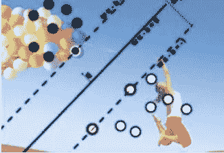

在梦里寻梦！很少有人需要提示就能猜到左边的图片来自电影《盗梦空间》。旋转陀螺的行为有助于区分现实和幻觉。这是一个迷人的概念，试图直观地表达潜意识。《盗梦空间》是一部基于清醒梦的电影。科幻小说展示了在现实世界中无法实现的事情，如何通过将世界转换为虚拟现实来实现，然后在目标实现后，将世界转换回现实。

这部电影由莱昂纳多·迪卡普里奥饰演多姆·科布，一个小偷，在他的搭档亚瑟(约瑟夫·戈登-莱维特饰)的帮助下，在受害者睡觉时从他们的梦中窃取信息。在最近一次商业间谍活动中遭遇罕见的失败后，他们的目标斋藤(渡边谦饰)给了多姆一个无法拒绝的提议。他得到了一份不可能的工作，那就是把一个想法植入费舍尔的大脑，这在现实世界中是不可能发生的。

人们看到角色们越来越深地进入他们任务目标的梦境——一家能源集团的继承人。他们通过他的潜意识层来植入一个想法:他们想让企业集团分崩离析，他们想让这个人来做决定。因此，目标是通过将世界转换到另一个想象和不真实的维度来实现的，但一旦目标实现，主体就会被带回现实。

这正是支持向量机的工作原理。右图描绘了通过将数据转换到更高维度而实现的分类(白点和黑点)。女孩在空中的跳跃象征着转变的行为。当我们进入主题时，我们将会进入技术细节。

# **技术介绍**

S 支持向量机(upport Vector machine)是一个线性分类器，它通过在两个或多个类别之间绘制一个超平面来分离目标变量的各个层次。理解支持向量机的三大概念，通俗地说就是 **(A)变换，(B)错觉(C)分离**。下图尽可能以最滑稽的方式解释了 SVM 的要旨。


*孩子，象征性地，分开丈夫和妻子，尽可能最大限度地防止冲突。

**A .变换:**如果类在二维空间中不是线性可分的，SVM 使用更高维的空间来绘制目标变量的类之间的分离超平面。这里要注意的关键点是，**当无法线性分离时，它会将数据转换到一个更高维的空间，以获得所需的分离。**

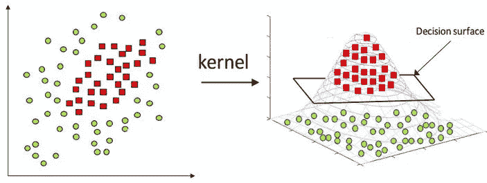

SVM 使用内核技巧，如左图所示，将数据转换到不同的维度以得到想要的结果。然后，结果以分类标签的形式被带回二维空间，用于现实生活中。下面是上述解释的直观表示。这是 SVM 在生物医药领域的一个真实应用。

对基于细胞的高含量筛选(HCS)实验中产生的大量数据进行分析一直是一个具有挑战性的命题。在这里，SVM 被用来寻找最好地将基因组分为已知和未知样本，即阳性(A)和阴性(B)样本的线(或平面)。特征是每个样品中细胞的数量和样品中细胞的强度/密度。有关更多详细信息，请参考原文— [高含量筛查数据的多参数分析](http://www.jbiomed.com/v02p0078.pdf)。

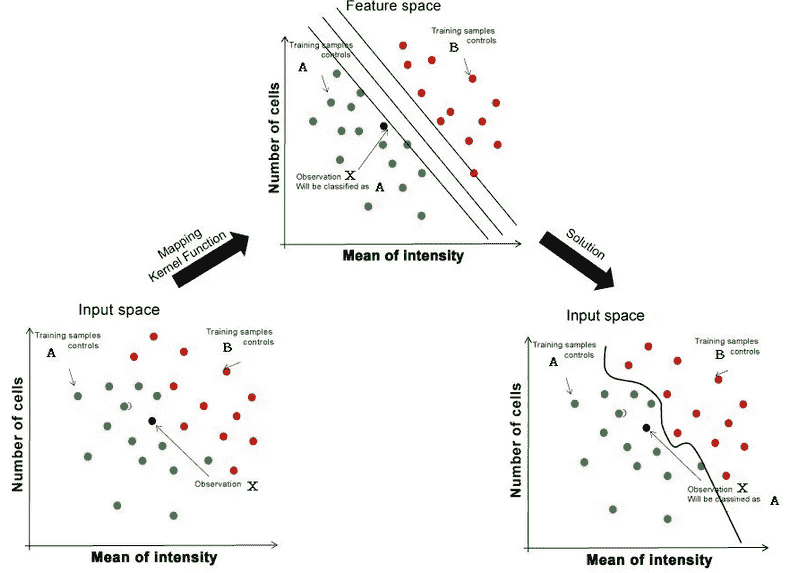

从输入空间到更高维特征空间的数据的**变换**用于线性分离，随后是回到输入空间的**变换**，其中分类边界看起来是非线性的。

**B .幻觉:看不见，但实际存在，并能在更高维度被感知的东西，肉眼看来是虚幻的。**人喝醉了才会“high”。他们想要“兴奋”以获得一种远离日常单调生活的空灵感。什么水平的“高”和一个人如何到达那里是一个不同的问题，因为，喝醉是一个选择的问题。

一些人只需要想象力就能点燃，而另一些人则借助人造物质来达到同样的目的。我们在陶醉状态下看到或感觉到的，可能看起来像是幻觉，而在那个精神空间，许多在正常状态下不可能的事情，看起来是可能的。问题是，那些“可能”的东西能不能转化回现实。对一些人来说，这已经被证明是可能的。

更进一步，想象一下我们有两组不同颜色的球，比如红色和蓝色。这些球躺在一个盘子上，这显然是二维的。球是混合的，不可能通过画一条直线来区分红色和蓝色。让我们假设蓝色的球比红色的球重，我们通过向整个盘子底部施加相等的推力将所有的球抛向空中。

由于球的重量不同，红色的球会比蓝色的球升到不同的高度。当它们处于这种状态(在空中)时，如果我们能想象一张纸放在各组之间，我们就能想象出我们想象的线性分离/分类边界。详见下文。肉眼看起来不可分的东西，通过创造更高维度的幻觉，并在那种状态下分离它们，是可能被分离的。

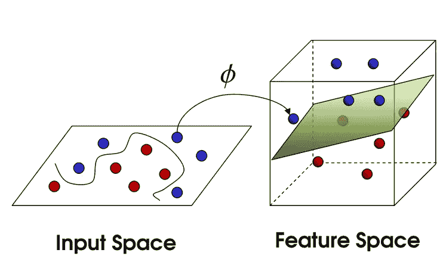

2D 空间中的不可分类(左图)，由高维特征空间中的超平面线性分隔(右图)

**C .分离:**每种算法都有其显著的数学特征，这些特征决定了分类如何工作。决策树使用“熵”或“基尼指数”来分割变量，逻辑回归的基本概念是比值比等等。

SVM 的基本概念是算法在目标变量的类别之间画出尽可能宽的界限的能力，即位于界限一侧的观察值属于一个类别，而位于界限另一侧的观察值属于另一个类别。余量越宽，类别之间的距离越大，分类器的置信度越高。

边距由离由边距定义的分离板的中值最远的观测值决定。这些定义类别间最大可能分离面的观察结果被称为**支持向量**。这些观察位置的任何变化都会影响分离裕度，从而影响分类器的性能。远离分离板块的其他观测值的移动，只要它们像以前一样停留在边缘的同一侧，就没有什么影响。

SVM 的优点是，通过绘制平板而不仅仅是一条分隔线，如果它是一条单线，可能会有许多直线来分隔各个类别，如下图所示。

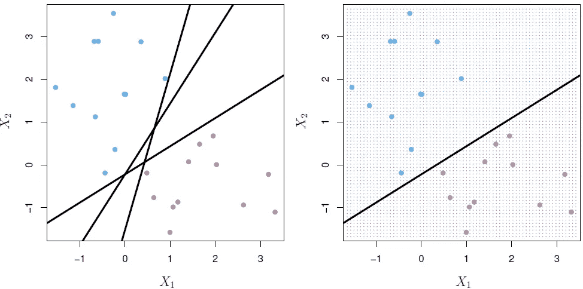

图片来自 Trevor Hastie 写的《统计学习入门》

左图显示了三条可能的分隔线。哪个最好？离线两边最近的观测值最远的一个，如第二张图所示。这种分类可以通过任何线性分类器来完成。

那么 SVM 还能提供什么额外的东西呢？如前所述，SVM 不仅通过一条直线，还通过一个超平面来分隔类别，然后超平面在概念上被约束，以确保类别之间存在比通过一条直线分隔更大的强制性分隔。在一个不同的 2D 例子中，通过 SVM 实现的分离可以如下所示。我们看到这两个类别之间的距离为“M”。

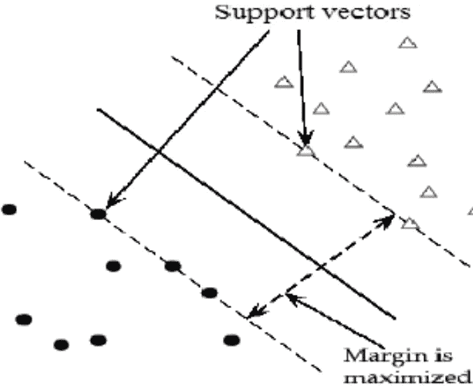

已经在非常一般的水平上介绍了 SVM，现在是数据科学接管的时候了。这里是我们将涉及到的主题的细节。

**目录**

1.  错觉- SVM 线性分离非线性数据。
2.  幻觉背后的现实——转变的数学提升
3.  陶醉效果的对象——核心技巧
4.  个案研究

**1。错觉——SVM 线性分离非线性数据**

我们看到了一个简化的例子，通过将 2D 变换到一个更高的维度，我们可以线性分离两个不能线性分离的类。这里我们看到了一个如何做到这一点的真实例子。这个例子是在 Kaggle 发现的[社交网络广告 daatset 上得出的。](https://www.kaggle.com/rakeshrau/social-network-ads#Social_Network_Ads.csv)

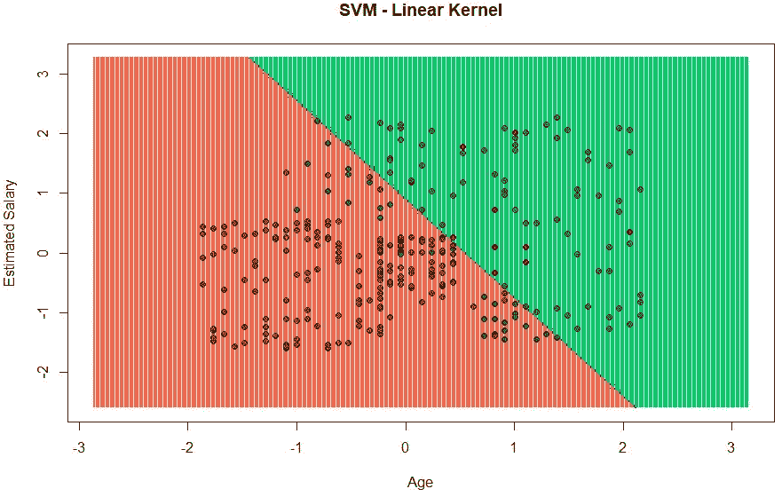

从上图可以看出对非线性数据进行线性分类的结果。我们看到相当多的错误分类。

然后，我们将数据转换到更高的维度，并查看结果。二次多项式核并没有做得更好，但是径向核做得非常好。通过转换实现的决策界限可以如下所示。

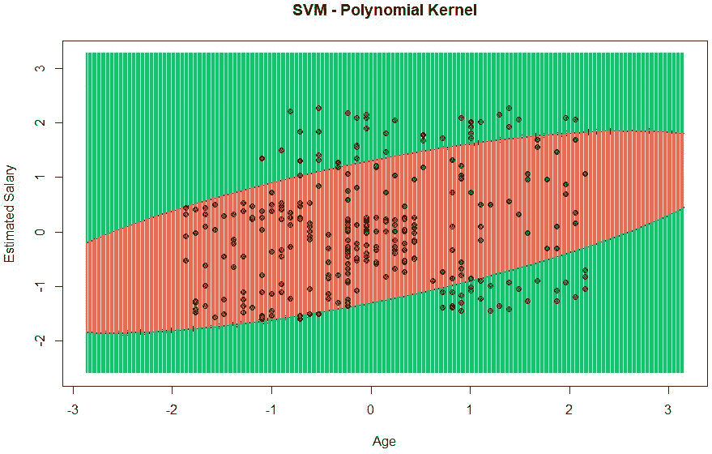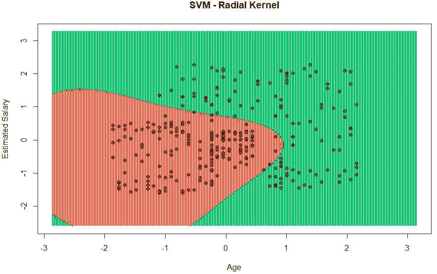

精度比较证明了上述事实。见下面的工作方式。准确率从 80%跃升到 90%。

```
*# Importing the dataset*
data=read.csv("Social_Network_ads.csv")# Subsetting the data to make it 2 dimensional for visualizationdataset = dataset[3:5]# Encoding the target feature as factor
dataset$Purchased = factor(dataset$Purchased, levels = c(0, 1))# Splitting the dataset into the Training set and Test set
# install.packages('caTools')
library(caTools)
set.seed(123)
split = sample.split(dataset$Purchased, SplitRatio = 0.75)
training_set = subset(dataset, split == TRUE)
test_set=subset(dataset,split==FALSE)
# Feature Scaling
training_set[-3] = scale(training_set[-3])
test_set[-3] = scale(test_set[-3])
# Fitting SVM to the Training set
# install.packages('e1071')
library(e1071)
library(caret)
#Linear Kernel
classifier_Linear = svm(formula = Purchased ~ .,
                 data = training_set,
                 type = 'C-classification',
                 kernel = 'linear')#Polynomial Kernel
classifier_Polynomial = svm(formula = Purchased ~ .,
                 data = training_set,
                 type = 'C-classification',
                 kernel = 'polynomial',
                 degree=2)#Polynomial Kernel
classifier_Radial = svm(formula = Purchased ~ .,
                 data = training_set,
                 type = 'C-classification',
                 kernel = 'radial',
                 gamma=0.4)# Predicting the Test set results
y_pred_Linear = predict(classifier_Linear, newdata = test_set[-3])
y_pred_Polynomial = predict(classifier_Polynomial, newdata = test_set[-3])
y_pred_Radial = predict(classifier_Radial, newdata = test_set[-3])# Making the Confusion Matrix
cm_Linear = confusionMatrix(test_set[, 3], y_pred_Linear)
Acc_Lin=cm_Linear$overall[[1]]
cm_Poly = confusionMatrix(test_set[, 3], y_pred_Polynomial)
Acc_Poly=cm_Poly$overall[[1]]
cm_Radial = confusionMatrix(test_set[, 3], y_pred_Radial)
Acc_Rad=cm_Radial$overall[[1]]Compare=data.frame(Kernel=c("Linear","Polynomial","Radial"),Accuracy=c(Acc_Lin,Acc_Poly, Acc_Rad))
Compare##       Kernel   Accuracy 
## 1     Linear     0.80 
## 2 Polynomial     0.74 
## 3     Radial     0.90
```

下面展示了从一本非常受欢迎的书**统计学习介绍**中借来的一个类似的可视化显示，以加强上面的例子所推动的观点。**我们看到，当我们从肉眼可见的二维空间向上移动到不可见但可以通过想象可视化的更高维度时，分类会逐渐改进。**

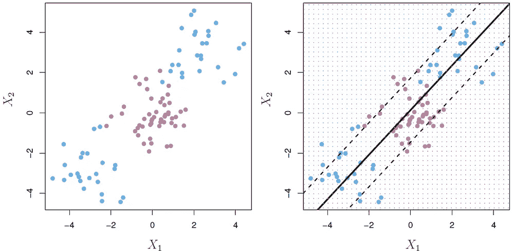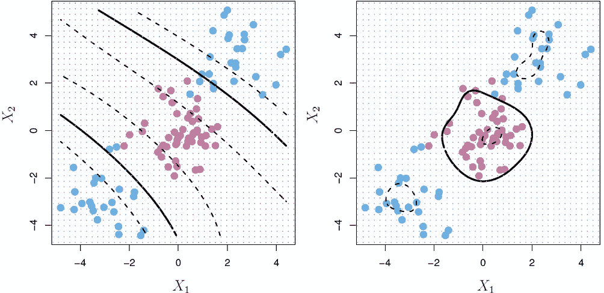

使用不同内核实现分类的比较

最左边的图表示需要分类的具有两级目标变量的二维数据。正如我们所见，下图试图在与输入要素相同的维度上进行线性分离。分类很差。接下来的两个图表代表了通过将数据转换到更高维度所实现的分类，这是通过我们将在接下来的章节中讨论的技术实现的。所实现的分离仍然是线性的，但是肉眼不可见。当我们回到现实时，我们看到的似乎是非线性的。这似乎是不可思议的，虚幻的。

**2。假象背后的现实——转变的数学提升**

当我们有许多特征并且我们想要更高维度来实现我们的目标时，将数据转换到更高维度可能是极其麻烦和计算昂贵的。然而，这可以通过减少仅点积高维特征所需的计算量来解决。因此，有了这个，我们实际上不需要知道变换后的特征是什么，而只需要知道变换后的特征的点积。这怎么可能。让我们探索吧！！！


如左图所示，我们似乎有一个分类问题，我们需要将阳性样本与阴性样本分开。在 SVM，分类是通过在两者之间画一条直线，并尽可能留有最宽的空白来区分两者。上图中的虚线是分隔线，两边的两条红色实线(与虚线等距)是最宽的板或街道，将两个阶层分开。它有时被称为最宽的街道方法。在本节中，我们将看到所画的分隔线或超平面取决于独立变量特征的点积，而不取决于特征的坐标。如果判定边界在 2 维空间中不是线性的，这个特定的属性帮助 SVM 将其特征变换到更高维度。

**3。陶醉效果的对象——内核诡计**

正如本博客中所讨论的，不可线性分离的数据可以通过转换到更高的维度进行线性分类。这种转换可以通过一种叫做内核技巧的技术来实现。基于上一节的结论，kernel trick 所做的是，它帮助分析师从一个无限高维空间的宇宙中获得转换特征的点积。

类似地，想象一下，你必须从一个大图书馆找到一本书，在那里你需要找出具体的房间、具体的过道、具体的书架，然后在所有堆在那里的书中找到这本书，与此相反，你可以选择让图书管理员知道你需要哪本书，他去找，然后把书还给你。哪个更方便？答案显而易见。这里，我们通过应用由 librarian 表示的函数实现了一个转换。kernel trick 所做的就是不需要去图书馆就能拿到书。

数值分析人员需要定义所需的转换，通过调用能够实现它的内核来进行所需的调整，剩下的工作由内核通过深入其无限深度并返回所需的最终结果来完成。如果没有内核技巧，分析师将不得不首先转换数据，然后完成所有中间计算以获得最终输出。

内核技巧本质上是使用内核函数，这使得能够在高维、*隐式*特征空间中操作，而无需计算该空间中数据的坐标。该操作通常比坐标的显式计算在计算上更便宜。一些更广泛使用的核函数是线性、多项式、径向和 sigmoid。在下一节中，我们将看到两个使用线性、多项式和径向核的案例研究。

**4。案例分析**

**案例研究 I——建立一个 SVM 模型来预测顾客行为，即顾客购买哪种口味的橙汁。**

这个案例研究是通过从一本非常受欢迎的书[《统计学习导论](http://www-bcf.usc.edu/~gareth/ISL/) (ISLR)中选取一组数据完成的。该数据包含 1070 次购买，其中客户购买了 Citrus Hill 或 Minute Maid 橙汁。顾客和产品的许多特征被记录下来。

构建了具有所有三个核的 SVM 模型，以比较哪个核给出了最好的结果。对于每个内核，进行参数调整以获得模型的最佳参数，从而给出最佳输出。可以看出，具有多项式核的模型是最不引人注目的。从其他两个模型获得的结果几乎相同。下面给出了在 R 中工作的细节。

```
#Calling the library and importing the data
library(ISLR)
mydata=OJ#Minimal exploratory analysis
dim(mydata)
str(OJ)
table(mydata$Purchase)
anyNA(mydata)#No missing values#Calling libraries for data preparation and model building
library(caret)
library(ROCR)prop.table(table(mydata$Purchase))##
## CH MM 
## 653 417set.seed(1234)
Index=createDataPartition(mydata$Purchase, p=0.75, list = FALSE)
Train=mydata[Index,]
Test=mydata[-Index,]#10 fold bootstrapped cross validation sampling
control=trainControl(method = "repeatedcv", number =10,repeats=1)#Build a SVM model using Linear kernel
###Tuning parameter C for optimized model
grid=expand.grid(C = seq(0.5,10,.5))
set.seed(1234)
SVM_L=train(Purchase~., data = Train,method = 'svmLinear',
            trControl = control,
            tuneGrid = grid,
            preProcess = c("scale","center"))plot(SVM_L)
#Accuracy seems to vary across various values of C
```

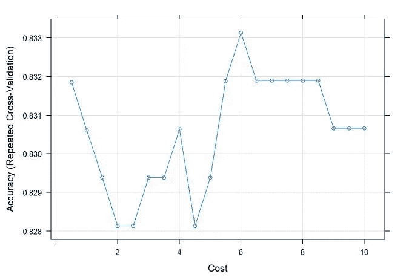

*不同的 C 值下，精度似乎不同。最佳值似乎在 C=6 时*

```
#The best value of C is found by the below
SVM_L$bestTune#Training Accuracy
a=SVM_L$results
TrainingAcc_L=a[which.max(a$Accuracy),"Accuracy"]
TrainingAcc_L##Predictions
Pred_L=predict(SVM_L, Test)
CM=confusionMatrix(Pred_L,Test$Purchase)
Acc_L=CM$overall[[1]]
Acc_L#Visulize the confusion matrix
CM$table
fourfoldplot(CM$table)
```

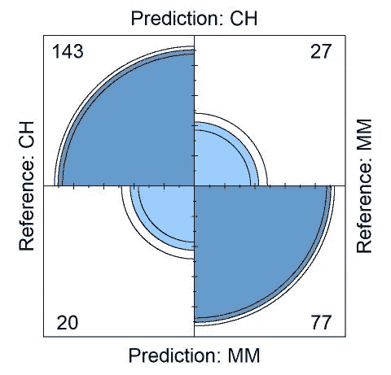

```
Sensitivity_Linear=CM$byClass[[1]]Specificity_Linear=CM$byClass[[2]]###ROC and AUCpredictions.L=prediction(as.numeric(Pred_L),Test$Purchase)
Perf.L=performance(predictions.L,"tpr","fpr")
plot(Perf.L, main="ROC - SVM with Linear Kernel")
```

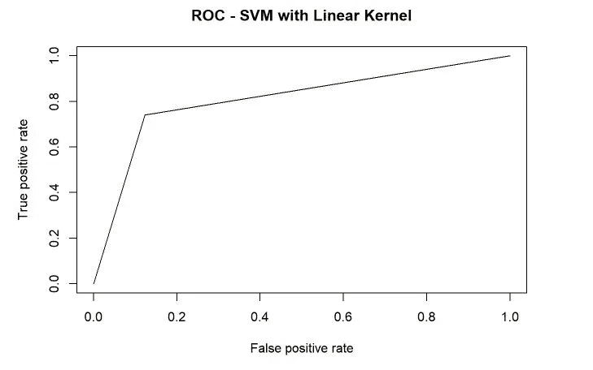

```
AUC=performance(predictions.L,"auc")
AUC_L=AUC@y.values[[1]]
# AUC_L = 0.8088426#Build the model by using Polynomial Kernel
#parameter tuning for both Cost and degree of polynomial
set.seed(3456555)
grid=expand.grid(C = c(0.1,1,3,5,7,9,10), 
                 degree=c(2,3),scale=1)
svm_P=train(Purchase~.,data=Train,method="svmPoly",
            trControl=control, tuneGrid=grid)#Best parameter values after tuning are
svm_P$bestTune
#Visualize
plot(svm_P)
```

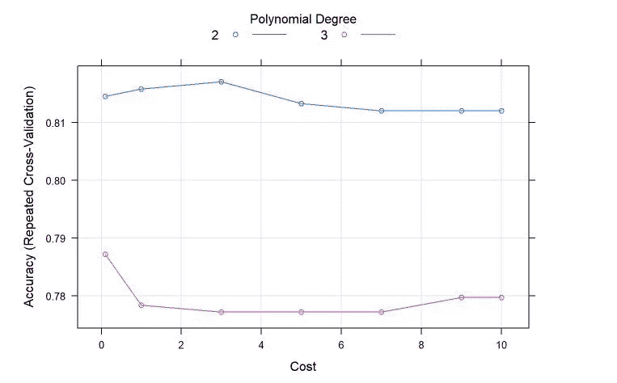

```
#Training Accuracy
b=svm_P$results
TrainingAcc_Poly=b[which.max(b$Accuracy),"Accuracy"]
TrainingAcc_Poly#Predictions
Pred_Poly=predict(svm_P,Test)
b=confusionMatrix(Pred_Poly,Test$Purchase)
Accuracy_Polynomial=b$overall[[1]]
Accuracy_Polynomial#Visulize the confusion matrix
b$table
fourfoldplot(b$table)
```

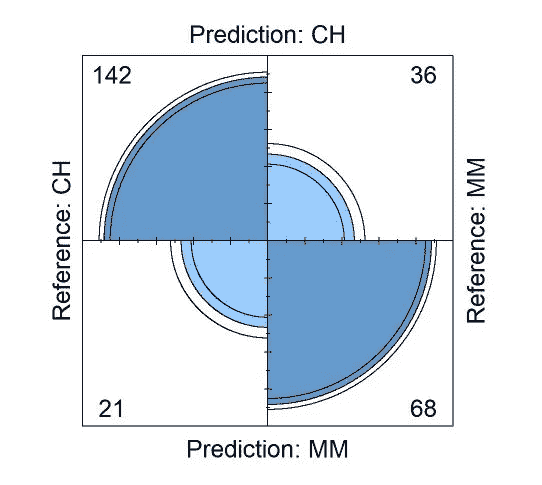

```
Sensitivity_Polynomial=b$byClass[[1]]
Sensitivity_Polynomial
Specificity_Polynomial=b$byClass[[2]]
Specificity_Polynomial##ROC& AUC
predictions.P=prediction(as.numeric(Pred_Poly),labels=Test$Purchase)
Perf.P=performance(predictions.P,"tpr","fpr")
plot(Perf.P, main="ROC - SVM with Polynomial Kernel")
```

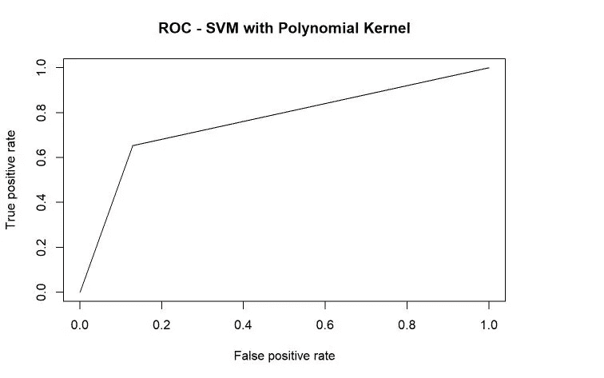

```
AUC=performance(predictions.P,"auc")
AUC_P=AUC@y.values[[1]]
AUC_P#Build the model by using Radial Kernel
#parameter tuning for both Cost and sigma of radial kernelgrid=expand.grid(C = c(0.1,0.5,1,2,3,5,7.5,8,8.5,9,9.5,10), 
                 sigma=c(0.0025,0.005,0.01,0.015,0.02,0.025))
set.seed(88888)
svm_Radial=train(Purchase~.,data=Train,method="svmRadial",
                 trControl=control, tuneGrid=grid)#Best tuned parameters for the model & Visualization
svm_Radial$bestTune
plot(svm_Radial)
```

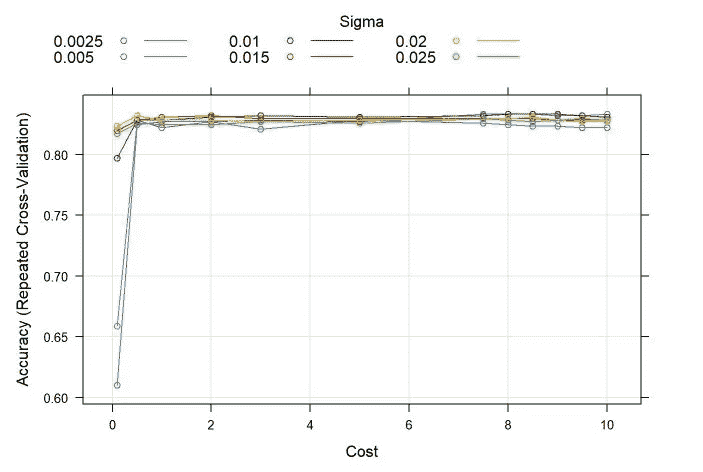

```
#Training Accuracy
c=svm_Radial$results
TrainingAcc_Rad=c[which.max(c$Accuracy),"Accuracy"]
TrainingAcc_Rad#Predictions
Pred_Radial=predict(svm_Radial,Test)
c=confusionMatrix(Pred_Radial,Test$Purchase)
Accuracy_Radial=c$overall[[1]]
Accuracy_Radial#Visulize the confusion matrix
c$table
fourfoldplot(c$table)
```

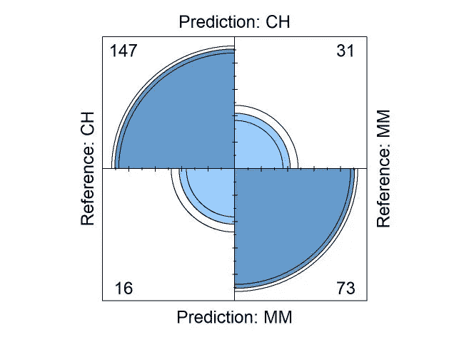

```
Sensitivity_Radial=c$byClass[[1]]
Sensitivity_Radial
Specificity_Radial=c$byClass[[2]]
Specificity_Radial#ROC & AUC
predictions.R=prediction(as.numeric(Pred_Radial),labels=Test$Purchase)
Perf.R=performance(predictions.R,"tpr","fpr")
plot(Perf.R, main="ROC - SVM with Radial Kernel")
```

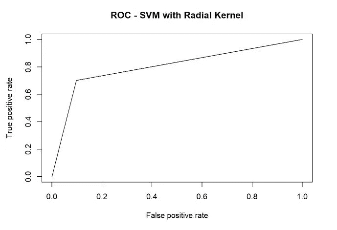

```
AUC=performance(predictions.R,"auc")
AUC_R=AUC@y.values[[1]]
AUC_R##Comparison across kernels
Compare=data.frame(Kernel=c("Linear","Poly","Radial"),
                   Train_Acc=c(TrainingAcc_L,TrainingAcc_Poly,TrainingAcc_Rad),
                   Test_Acc=c(Acc_L,Accuracy_Polynomial,Accuracy_Radial),
                   Sensitivity=c(Sensitivity_Linear,Sensitivity_Polynomial,Sensitivity_Radial),
                   Specificity=c(Specificity_Linear,Specificity_Polynomial,Specificity_Radial),
                   AUC_All=c(AUC_L,AUC_P,AUC_R))
Compare***##   Kernel Train_Acc  Test_Acc Sensitivity Specificity   AUC_All ## 1 Linear 0.8331327 0.8239700   0.8773006   0.7403846 0.8088426 ## 2   Poly 0.8170062 0.7865169   0.8711656   0.6538462 0.7625059 ## 3 Radial 0.8331327 0.8239700   0.9018405   0.7019231 0.8018818***
```

**案例研究 II——建立 SVM 模型来预测患者是否患有良性或恶性肿瘤。**

这些数据来自 UCI 机器学习库或我的 github 账户。这里的[是](https://github.com/Pranov1984/Predictive-Model-Building-with-Support-Vector-Machines)到数据的链接。工作的细节如下。构建了具有所有三个核的 SVM 模型，以比较哪个核给出了最好的结果。对于每个内核，进行参数调整以获得模型的最佳参数，从而给出最佳输出。

可以看出，用线性核和多项式核建立的模型对未知数据的精度几乎相同。径向核模型的精度更高。由于该模型最初是基于训练建立的，并符合所有 3 个场景的训练数据，因此准确性有所降低，这是意料之中的。

与用线性核建立模型相比，用多项式核建立的模型的 AUC 更大。用径向核构建的 AUC 最高。径向核模型在所有指标上都做得更好。

从灵敏度的角度来看，线性核模型略好于多项式核模型，但从特异性的角度来看，情况正好相反。

径向核最适合此数据集。如果是线性和多项式之间的选择，很难区分两者。工作细节如下

```
#Set working directory and import data
setwd("C:\\Users\\user\\Desktop\\Blogs\\SVM")
mydata=read.csv("Breast_Cancer_Dataset.csv")#Check data structure and dimension
str(mydata)
dim(mydata)#Change the levels of the target variable to "0" and "1" which stand for benign and malignant respectively
mydata$Class=ifelse(mydata$Class==2,0,1)
mydata$Class=as.factor(mydata$Class)
table(mydata$Class)#Unusual level identified in Bare_Nuclei. Identify the rows and remove them
table(mydata$Bare_Nuclei)
which(mydata$Bare_Nuclei=="?")data=mydata[-which(mydata$Bare_Nuclei=="?"),]
data=droplevels(data)#Partition the data in 70:30 ratiolibrary(caret)
set.seed(1234)
Index=createDataPartition(data$Class, p=0.7,list = FALSE)
Train=mydata[Index,]
Test=mydata[-Index,]#Prepare for model by having 10 fold bootstrapped crossvalidation sampling
control=trainControl(method = "repeatedcv", number = 10, repeats = 1)#Build a SVM model using Linear kernel
###Tuning parameter C for optimized model
grid=expand.grid(C = c(0.01, 0.02,0.05, 0.075, 0.1, 0.25, 0.5, 1, 1.25, 1.5, 1.75, 2,5))set.seed(123456)
svm_Linear_Grid=train(Class~., data = Train,method = "svmLinear",
                      trControl = control, 
                      preProcess=c("scale","center"),
                      tuneGrid=grid)a=svm_Linear_Grid$results
TrainingAcc_Linear=a[which.max(a$Accuracy),"Accuracy"]#Best parameter value after tuning
svm_Linear_Grid$bestTune#Predictions
Pred=predict(svm_Linear_Grid,Test)
a=confusionMatrix(Pred,Test$Class)
accuracy_Linear=a$overall[[1]]
accuracy_Linear
#An accuracy of 94.1% is achieved#Visulize the confusion matrix
a$table
fourfoldplot(a$table)
```

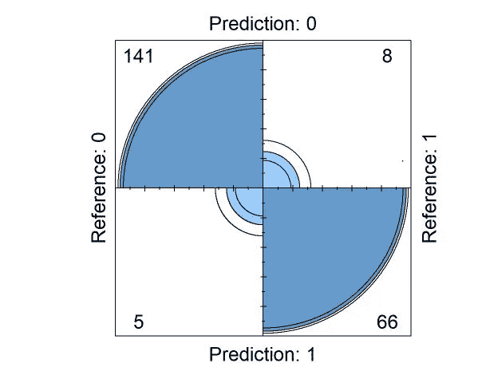

```
Sensitivity_Linear=a$byClass[[1]]
#True positive rate achieved is 96%
Specificity_Linear=a$byClass[[2]]
#True negative rate achieved is 89%###ROC and AUC
library(ROCR)
predictions.L=prediction(as.numeric(Pred),Test$Class)
Perf.L=performance(predictions.L,"tpr","fpr")
plot(Perf.L, main="ROC - SVM with Linear Kernel")
```

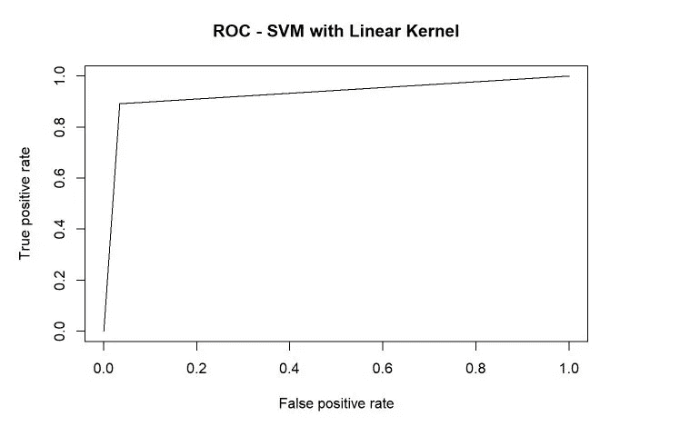

```
AUC=performance(predictions.L,"auc")
AUC_L=AUC@y.values
AUC_L#Build the model by using Polynomial Kernel
#parameter tuning for both Cost and degree of polynomial
grid=expand.grid(C = c(0.005,.01, .1, 1,10), 
                 degree=c(2,3,4), scale=1)
svm_P=train(Class~.,data=Train,method="svmPoly",tuneLength=10,
            trControl=control, tuneGrid=grid)#Best parameter value after tuning is a cost of 0.01 and degree of 2
svm_P$bestTune
#Visualize
plot(svm_P)
```

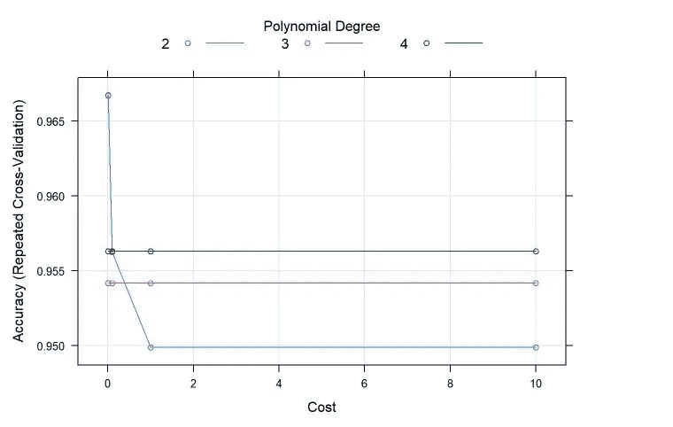

```
#Training Accuracy
b=svm_P$results
TrainingAcc_Poly=b[which.max(b$Accuracy),"Accuracy"]
TrainingAcc_Poly#Predictions
Pred_Poly=predict(svm_P,Test)
b=confusionMatrix(Pred_Poly,Test$Class)
Accuracy_Polynomial=b$overall[[1]]
Accuracy_Polynomial
#An accuracy of 94.1% is achieved#Visulize the confusion matrix
b$table
fourfoldplot(b$table)
```

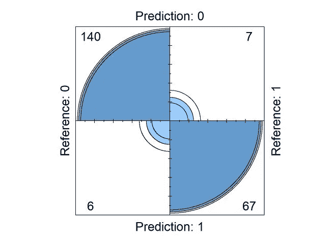

```
Sensitivity_Polynomial=b$byClass[[1]]
#True positive rate achieved is 96%
Specificity_Polynomial=b$byClass[[2]]
#True negative rate achieved is 91%##ROC& AUC
predictions.P=prediction(as.numeric(Pred_Poly),labels=Test$Class)
Perf.P=performance(predictions.P,"tpr","fpr")
plot(Perf.P, main="ROC - SVM with Polynomial Kernel")
```

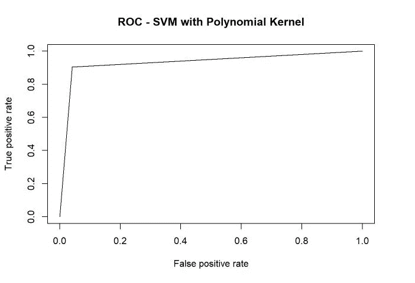

```
AUC=performance(predictions.P,"auc")
AUC_P=AUC@y.values
AUC_P#Build the model by using Radial Kernel
#parameter tuning for both Cost and sigma of radial kernelgrid=expand.grid(C = c(0.005,.01, 0.1, 0.15,0.20,0.25), 
                 sigma=c(0.0025,0.005,0.01,0.015,0.02,0.025))
set.seed(88888)
svm_Radial=train(Class~.,data=Train,method="svmRadial",tuneLength=10,
            trControl=control, tuneGrid=grid)#Best tuned parameters for the model & Visualization of the comparison while tuning
svm_Radial$bestTune
plot(svm_Radial)
```

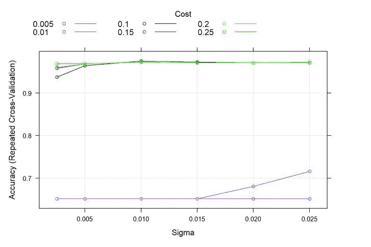

```
#Training Accuracy
c=svm_Radial$results
TrainingAcc_Rad=c[which.max(c$Accuracy),"Accuracy"]
TrainingAcc_Rad#Predictions
Pred_Radial=predict(svm_Radial,Test)
c=confusionMatrix(Pred_Radial,Test$Class)
Accuracy_Radial=c$overall[[1]]
Accuracy_Radial
#An accurtacy of 96% is achieved#Visulize the confusion matrix
c$table
fourfoldplot(c$table)
```

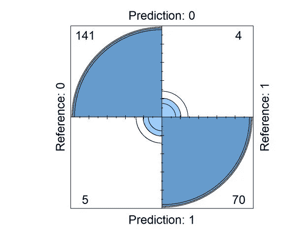

```
Sensitivity_Radial=c$byClass[[1]]
#True positive rate achieved is 96.5%
Specificity_Radial=c$byClass[[2]]
#True negative rate achieved is 95%#ROC & AUC
predictions.R=prediction(as.numeric(Pred_Radial),labels=Test$Class)
Perf.R=performance(predictions.R,"tpr","fpr")
plot(Perf.R, main="ROC - SVM with Radial Kernel")
```

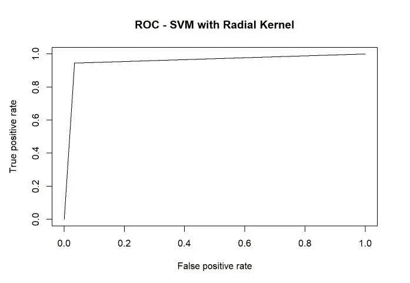

```
AUC=performance(predictions.R,"auc")
AUC_R=AUC@y.values
AUC_R##Comparison across kernels
Compare=data.frame(Kernel=c("Linear","Poly","Radial"),
                   Train_Acc=c(TrainingAcc_Linear,TrainingAcc_Poly,TrainingAcc_Rad),
                   Test_Acc=c(accuracy_Linear,Accuracy_Polynomial,Accuracy_Radial),
                   Sensitivity=c(Sensitivity_Linear,Sensitivity_Polynomial,Sensitivity_Radial),
                   Specificity=c(Specificity_Linear,Specificity_Polynomial,Specificity_Radial),
                   AUC_All=c(AUC_L[[1]],AUC_P[[1]],AUC_R[[1]]))Compare***##   Kernel Train_Acc  Test_Acc Sensitivity Specificity   AUC_All ## 1 Linear 0.9792481 0.9409091   0.9657534   0.8918919 0.9288227 ## 2   Poly 0.9667499 0.9409091   0.9589041   0.9054054 0.9321548 ## 3 Radial 0.9749964 0.9590909   0.9657534   0.9459459 0.9558497***
```

**结束注释**

支持向量机是每个数据科学家都希望拥有的最复杂的统计技术之一。当我们在文章中看到与幻觉的比较时，它有一种神秘感和魔力。SVM 的历史可以追溯到 20 世纪 60 年代，当时最初的 T2·SVM 算法是由弗拉基米尔·n·瓦普尼克和阿列克谢·亚发明的。1963 年。1992 年，Bernhard E. Boser，Isabelle M. Guyon 和 Vladimir N. Vapnik 提出了一种通过对最大边缘超平面应用核技巧来创建非线性分类器的方法。1992 年的故事虽然始于 1989 年的巴黎，当时伊莎贝尔用核方法对神经网络进行了基准测试，但是 SVM 的真正发明发生在 Bernhard 决定实现 Vladimir Vapnik 算法的时候。这正好表明，有时伟大的想法需要时间才能最终实现。

一般来说，当你有大量的特性时，SVM 是非常好的。例如，用于单词包模型中的文本分类。在大多数情况下，具有非线性核的支持向量机表现相当好，通常与随机森林正面对抗，有时 RFs 工作稍好，有时支持向量机胜出。它在尺寸数量大于样本数量的情况下有效。

然而，没有免费午餐，SVM 也有它的困难。有时，它们的计算成本很高。SVM 在有噪声的数据集上表现不佳。话虽如此，人们应该小心何时选择和何时不选择 SVM 作为分类器来解决手头的问题。