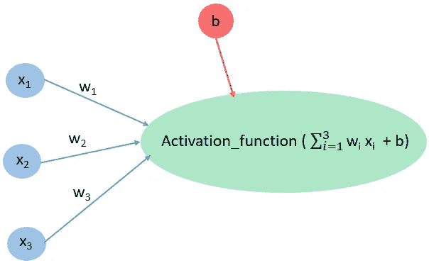
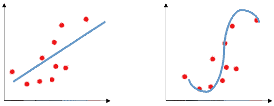
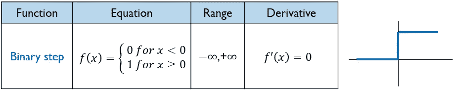
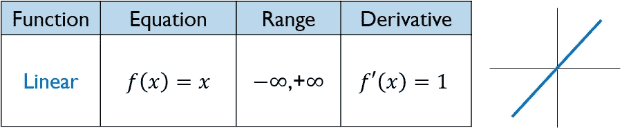
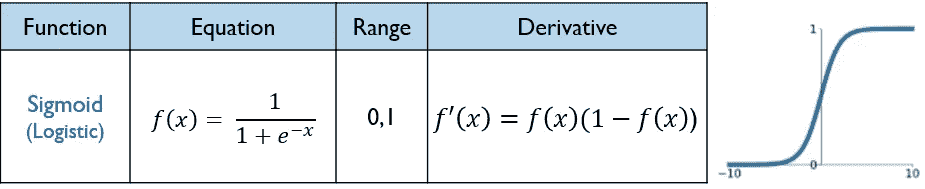
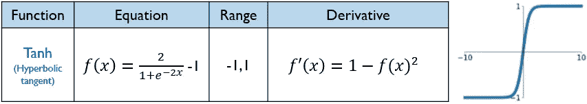
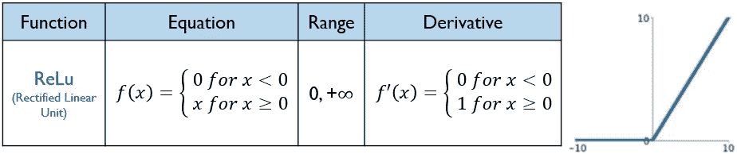
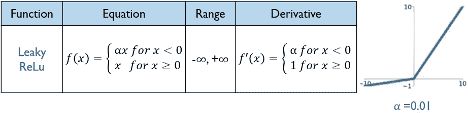

# 全面综合了主要激活函数的优缺点

> 原文：<https://medium.com/analytics-vidhya/comprehensive-synthesis-of-the-main-activation-functions-pros-and-cons-dab105fe4b3b?source=collection_archive---------4----------------------->

## 激活函数是神经网络最重要的超参数之一，必须仔细选择

## 介绍

神经网络是寻找参数(即权重和偏差)的常用算法，这些参数是输入到输出的最佳映射。为了实现这样的模型，你必须注意选择一个最重要的神经网络超参数:激活函数。为了知道如何处理它们，让我们来检查其中的一些。

在本文结束时，读者将能够回答下列问题:

1.  什么是激活函数？

2.我们会在神经网络中使用什么激活函数？

3.激活函数有哪些类型？

4.它们各自的利弊是什么？

假设读者熟悉神经网络的概念以及前向传播和后向传播。为了让你更舒服地理解文章的基本主题，你可以记住下面对神经网络工作原理的琐碎而非常简单的介绍。有了输入，神经网络计算它们的加权和，并通过一个激活函数传递，以获得输出。为了获得准确的预测，学习算法在从输出向输入反向移动的同时更新权重。

读得好！

## 什么是激活函数？

激活函数是附属于网络中每个隐藏和输出神经元的数学方程。它的作用是决定神经元是否应该被激活。这通常基于神经元输入对于输出预测是否重要。除了输入层的神经元之外，每个神经元输入的加权和加上一个偏置，通过一个激活函数。

隐藏节点的示例(绿色) :其值是通过激活函数传递的加权输入(蓝色)和偏差(红色)之和。

激活函数和传递函数之间有点混淆。一些作者认为传递函数计算其输入的神经元加权和，而激活函数决定是否激活神经元。其他人认为激活函数和传递函数都指定了相同的思维，也就是说，我们通过这个函数来传递我们的加权和，以获得有意义的输出。

就我而言，它们被我读过的所有书籍和文章交替使用。在机器学习中，激活函数称谓的使用频率更高，更不用说现在的专用了。传递函数名称主要是在早期使用的，当时深度学习并不常见，社区的主要部分具有信号和电气工程背景。

## 为什么我们要在神经网络中使用激活函数？

参考上面的例子，如果我们不使用激活函数，权重和神经元输入之间的关系总是线性的。因此，输出是后者的简单线性变换。当只处理变量之间的线性关系时，预测模型将不适用于复杂的问题，例如计算机视觉和自然语言处理。

这里，必须使用提供非线性的激活函数。这使我们能够建立更复杂的模型来解决现实世界的问题。

线性与非线性

## 激活功能的类型以及它们的优点和问题是什么？

有 3 种主要类型的激活函数，即二元阶跃、线性和非线性。对于这些类型中的每一种，我将给出函数的方程以及它的图形和值域。它的导数也被指定，因为它在最小化损失函数的反向传播过程中被使用。

**1- *二元阶跃函数***

二元阶跃激活函数的方程、值域、导数和绘图

*   这是一个基于阈值的激活函数。
*   它只支持二进制分类。换句话说，它不允许多值输出。

**2。*线性函数***

线性激活函数的方程、值域、导数和绘图

*   它用于简单的线性回归模型。
*   由于导数是常数，因此不可能使用反向传播来训练模型并了解哪些权重可以提供更好的预测。
*   无论神经网络有多深，它都无法捕捉复杂的模式。通常情况下，所有层合二为一，就好像网络变成了一层:输出层是输入层的线性函数。

**3。*非线性函数***

这种类型的激活函数是神经网络中最常用的一种，因为正如其名称所示，它引入了我们为了更好地捕捉数据中的模式而搜索的非线性。主要的非线性激活函数如下所述:

*3.1。乙状结肠/逻辑*

Sigmoid 激活函数的方程、值域、导数和绘图

*   它将神经元的输出标准化到 0 和 1 之间的范围，给出输入值的概率。这使得 sigmoid 对于分类目标神经网络的输出神经元是有用的。
*   它是高度计算密集型的，因为它需要计算指数，这使得网络收敛较慢。
*   它遭受饱和问题。如果神经元达到其最大值或最小值(例如 Sigmoid : *f(x) = 0 或 1* )，使其导数(例如。sigmoid:*(1-f(x))= 0*)**等于 0。在这种情况下，权重不会更新。损失函数相对于权重的梯度因此消失，直到下降到 0。这种现象被称为消失梯度，它会导致深度网络的学习效果不佳。**
*   **它不是一个以零为中心的函数。因此，连接到同一神经元的所有权重的梯度要么是正的，要么是负的。在更新过程中，这些权重一次只允许向一个方向移动，即正向或负向。这使得损失函数优化更加困难。**

***3.2。Tanh(双曲正切)***

****

*   **它将神经元的输出标准化到-1 和 1 之间的范围。**
*   **与 Sigmoid 不同，它是一个以零为中心的函数，因此损失函数的优化变得更容易。**
*   **至于 Sigmoid，Tanh 是高度计算密集型，并遭受饱和问题，因此梯度消失。事实上，当神经元达到其范围的最小值或最大值时，分别对应于-1 和 1，其导数等于 0。**

***3.3。ReLu(整流线性单元)***

****

**ReLu 激活函数的方程、值域、导数和绘图**

*   **这是最常用的激活功能。**
*   **它易于计算，因此神经网络收敛非常快。**
*   **由于它的导数对于神经元的正值不为 0(*f’(x)= 1，对于 x ≥ 0* )，ReLu 不饱和，并且没有报告死亡神经元。饱和度和消失梯度仅出现在负值时，如果给定 ReLu，则变为 0。**
*   **它不是一个以零为中心的函数。**

***3.4。泄漏的 ReLu***

****

**漏 ReLu 激活函数的方程、值域、导数和绘图**

*   **在试图解决负值的垂死 ReLu 时，Leaky ReLu 引入了一个小斜率。让负值按α缩放能使它们对应的神经元“保持存活”。漏 ReLu 是α = 0.01 时激活函数的称谓。如果α等于 0.01 以外的任何小值，则称为随机化 ReLu。**
*   **这很容易计算。**
*   **它接近以零为中心的函数。**

## **综合**

**在下表中，我根据 5 个标准总结了常见的激活功能。为了对用于特定神经网络、层和要解决的问题的函数做出正确的选择，必须知道后者:**

*   ***范围:*指定功能输出的范围。**
*   ***以 0 为中心:*表示函数是否以 0 为中心。**
*   ***饱和:*表示功能是否饱和。如果是，则提及发生饱和的神经元值。**
*   ***消失渐变:*指定激活功能是否导致消失渐变问题。**
*   ***计算:*表示函数是易于计算还是计算密集型。**

****

**最后，这里有一些好的实践，可以帮助你管理何时使用上述功能。二元阶跃函数和线性函数分别用于二元分类和线性回归问题。关于非线性激活函数，ReLu 是隐藏层中最常用的一个，因为它不会导致破坏消失梯度。否则，首选泄漏 ReLu。s 形 Sigmoid 和 Tanh 通常用于输出层，特别是用于卷积神经网络中的分类问题。**

****

**感谢阅读！**

**很快，我将谈论 Sigmoid 和 Softmax 之间的主要差异:在神经网络的末端使用的两个激活函数，用于将原始输出(即 logits)转换为概率。敬请期待！**

**阅读这些文章了解更多信息:**

**[https://towards data science . com/gradient-descent-in-python-a0d 07285742 f](https://towardsdatascience.com/the-vanishing-gradient-problem-69bf08b15484)**

**[https://towards data science . com/the-vanishing-gradient-problem-69 BF 08 b 15484](https://towardsdatascience.com/gradient-descent-in-python-a0d07285742f)**