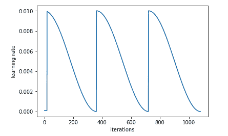
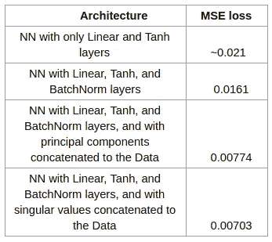
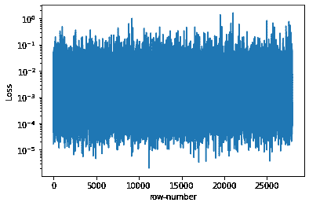
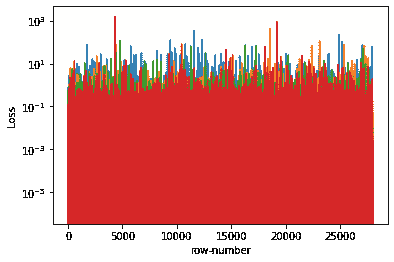

# 使用自动编码器将 4 个变量压缩为 3 个— Data_compression[0]

> 原文：<https://medium.com/analytics-vidhya/compressing-4-variables-into-3-aec88be7c7a3?source=collection_archive---------33----------------------->

在本文中，我们将学习如何训练一个模型，该模型可以将 4 个变量的信息编码为 3 个变量，并将它们存储在磁盘上，然后在需要时将 4 个变量解码回来。


来源:[https://pix abay . com/插图/分析-信息-创新-3088958/](https://pixabay.com/illustrations/analytics-information-innovation-3088958/)

# 介绍

为了优化数据传输和存储，压缩数据一直是一个大问题，特别是由于数据爆炸式增长的速度明显加快。在本文中，我将尝试解释我的方法，将 4 个变量的数据压缩(编码)成 3 个，将它们存储在磁盘上，然后解压缩(解码)编码的变量，并在需要时恢复原始数据。我将分享我做的一些小调整，让编码器表现得更好。这可以被认为是图像压缩的较小版本，因为图像只是由有意义的顺序的数字组成的矩阵。实际上，这样做的主要动机是在将来尝试将类似的方法应用于图像压缩。

剧透:我很快也会写关于图像压缩的文章。😜

# 子问题

1.  **预处理**:从给定的数据中提取有用的信息，使模型更好地学习。
2.  **模型定义**:为任务决定和定义完美的神经网络架构。
3.  **训练**:用梯度下降法训练模型。

## 1.预处理

这一步是指操纵输入数据并提取有用的信息供神经网络使用，以使神经网络能够更好地学习。我们将分两步进行预处理。

**A .正常化**

(对于有深厚学习背景的人来说，这很常见。如果你已经知道什么是规范化以及我们为什么使用它，请直接跳到下一步。)

**什么是正常化？**

*使输入的平均值为 0，标准差为 1。这使得数据被缩放，修复了数据中的异常值，并使得计算机的学习过程更容易、更平滑、更快。这可以通过下面的代码片段来实现:*

```
# train contains the raw(initial) datamean = train.mean()
std = train.std()train_data = (train - mean) / std
test_data = (test - mean) / std
```

标准化数据并不会真正影响原始数据和预测。在这种情况下，当您的模型预测来自 3 个编码变量的原始数据时，您只需将模型的结果乘以标准差，然后加上平均值，即可获得原始比例的数据。

**B .添加奇异值**

奇异值分解(SVD)是一个数学过程(基本上是矩阵运算),将矩阵分解成我们选择的低维。SVD 基本上将我们的矩阵分解成 3 个更小的矩阵。其中一个包含原始矩阵的奇异值。我还尝试将这 3 个矩阵的不同组合与原始数据连接起来，但只有奇异值比其他组合更好。如果您对 SVD 一无所知，那么它确实值得放在您的工具箱中。你可以在这个 [Jupyter 笔记本](https://github.com/fastai/numerical-linear-algebra/blob/master/nbs/2.%20Topic%20Modeling%20with%20NMF%20and%20SVD.ipynb)上了解更多关于奇异值的知识，你也可以在这个 [google colab](https://colab.research.google.com/drive/1bHwfyiklHl88FxvZ4Bk5dU2cewxpjOK0?usp=sharing) 上运行同样的笔记本。

所以我们要做的是首先从这 4 个变量中构造一个(4 x 4)对角线矩阵(这 4 个数字将位于矩阵的对角线位置)。我们将输入这个矩阵，用 3 个分量表示这个矩阵(3 是因为我们想把变量压缩成 3)。这将返回给我们 3 个矩阵。所以我试着连接这些矩阵的不同组合。但是只使用奇异值(只来自一个矩阵的数据，只有 3 个数字，矩阵的对角线元素)对我来说是最好的。

> "奇异值分解并不像它应该的那样出名."—吉尔伯特·斯特朗

*注意:最初我使用主成分分析(PCA)而不是奇异值分解，因为我认为它应该比奇异值分解表现得更好，但令人惊讶的是奇异值分解在比较中表现得稍微好一些。甚至在实践中使用 SVD 来实现 PCA，所以使用 SVD 代替 PCA 也将节省一些计算。你可以在这个笔记本* *中了解关于 PCA* [*的更多信息，你也可以在这个*](https://github.com/fastai/numerical-linear-algebra/blob/master/nbs/3.%20Background%20Removal%20with%20Robust%20PCA.ipynb)[*Google colab*](https://colab.research.google.com/drive/15iQ3gLMXbnU1w-B9-y4BI4M2nUKm-rl-?usp=sharing)*上自己运行同一个笔记本。*

**为什么我认为 PCA 或 SVD 可能有帮助？**

因为 SVD 和 PCA 背后的整个概念是压缩数据的维度，尽可能多地保留信息。而且我们的任务也差不多。但是使用 SVD 或 PCA 不能将 4 个变量压缩成 3 个，因为它们的输出是三个不同的矩阵，这无论如何都不能导致压缩到 3 个变量。*(因此，根据我的观点，使用 SVD/PCA 的压缩对较大的矩阵更有效。)*因此，我想为什么不首先使矩阵 2D(通过创建一个对角矩阵，如我前面所述)使用 SVD 或 PCA 压缩该矩阵，并将一些压缩数据与原始数据连接起来，看看是否有助于进一步压缩它。奇异值(SVD 的三个输出矩阵之一)证明是有帮助的。

## 2.模型定义

这一步指的是试图找到最佳的神经网络结构，以使结果最佳。

所以正如标题所说，我们将使用自动编码器。自动编码器由称为编码器和解码器的两个内部神经网络结构组成。


来源:[https://en . Wikipedia . org/wiki/auto encoder #/media/File:auto encoder _ structure . png](https://en.wikipedia.org/wiki/Autoencoder#/media/File:Autoencoder_structure.png)

1.  **编码器:**对数据进行编码的神经网络的一组顺序层。
2.  **解码器:**从代码中重建原始数据(解码/解压缩数据)的层。

Pytorch 中任务的简单自动编码可以定义为:

```
**class** **Autoencoder**(nn.Module): *# here the parameter'in_features' is set
    # to 7 because we have also concatenated the
   # 3 singular values with the 4 variables.* **def** __init__(self, in_features=7):
        super().__init__()
        self.encoder = nn.Sequential(
            nn.Linear(in_features, 128),
            nn.BatchNorm1d(128),
            nn.Tanh(),
            nn.Linear(128, 3),
            nn.Tanh()
        ) self.decoder = nn.Sequential(
            nn.Linear(3, 128),
            nn.BatchNorm1d(128),
            nn.Tanh(),
            nn.Linear(128, 4),
            nn.Tanh()
        ) *# In Pytorch, The* ***forward****()* ***method*** *is the actual network 
    #**transformation. The* ***forward method*** *is the mapping that 
    # maps an input tensor to a prediction output tensor.* **def** forward(self, x):
        encoded = self.encoder(x)
       ** *# Time to save the encoded data***
        decoded = self.decoder(encoded)
        return decoded
```

*注意:为了简单起见，这里我们只添加了几层，但最初可能会有更多层，比如一堆 nn。线性，nn。BatchNorm1d 和 nn。Tanh 层。nn。Tanh 的作用是增加网络的非线性。*

**为什么非线性？**

因为如果没有非线性，模型将变成一堆线性函数(这里是层),而一个以上线性函数的组合又是一个线性函数。

还有其他非线性函数，如 nn。ReLU 也是但是 nn。当我们测试时，Tanh 在这种情况下工作得更好。

**为什么是 Batchnorm？**

当我们规范化输入数据以使模型的学习过程变得容易时，Batchnorm 对隐藏层做了同样的事情。它使激活正常化，使学习过程更好。因为在训练过程中，一些激活可能会爆炸，所以 Batchnorm 会放大隐藏层中的所有内容。

## 3.培养

这一步指的是最终训练模型并微调参数以充分利用模型。

我使用了循环学习率(CLR)方法。这种方法让学习率在合理的边界之间循环变化，以优化训练。你可以在这里了解更多关于 CLR [的信息。](https://arxiv.org/abs/1506.01186)



我用均方差作为损失函数。在对学习速度、时期、体重下降等参数做了一些小的调整后，我开始得到相当好的结果。

# 结果

**A .不同方法的绩效**



截图来自我的白皮书

**b .**验证损失



jupyter 笔记本截图

测试集中每个数据项的行平均均方误差损失图。平均亏损 0.0073。



jupyter 笔记本截图

为测试集中的每个数据条目分别绘制行[(预期结果)/预期]值的图形。

*注意:在最后一个图表中，由于将[预期结果]除以较小的数字，范围最大为 10。*

# 结论

我们可以对我们的数据和架构进行这种小调整，以提高模型质量。

*   你也可以看看我写的白皮书。

*   在下面的 GitHub 库中找到代码。

[](https://github.com/rushabh-v/Autoencoder-4-to-3-variables) [## rush abh-v/自动编码器-4 到 3 变量

### 将 4 个变量压缩成 3 个变量的自动编码器。— rushabh-v/Autoencoder-4 到 3 变量

github.com](https://github.com/rushabh-v/Autoencoder-4-to-3-variables) 

在 [google colab 这里](https://colab.research.google.com/github/rushabh-v/Autoencoder-4-to-3-variables/blob/master/main.ipynb)玩转代码。

## 参考

1.  [L. N. Smith 关于循环学习率的研究论文【2017 年 4 月】](https://arxiv.org/abs/1506.01186)
2.  [https://en.wikipedia.org/wiki/Singular_value_decomposition](https://en.wikipedia.org/wiki/Singular_value_decomposition)

P.S. *带图像压缩的数据压缩[1]* 即将出版🤓

> “拷问数据，它什么都会坦白。”