# 使用线性代数压缩图像

> 原文：<https://medium.com/analytics-vidhya/compressing-images-using-linear-algebra-bdac64c5e7ef?source=collection_archive---------3----------------------->

我们在高中都学过某种程度的线性代数，有些人甚至在毕业时还认真地学过。但是线性代数比我们想象的更强大。它由算法/方法组成，这些算法/方法在现实世界中帮助很大，特别是在研究和处理图像方面。在当今的数字和社交世界中，图像是最常用的交流媒介之一。

我们都分享成千上万的图片、迷因等。敬我们已知的人。但是在分享大型图像文件时，我们需要对其进行压缩，以使图像的大小显著减小，同时尽可能保持良好的图像质量和内容。图像被表示为三维(2 个用于高度和宽度，1 个用于通道)像素阵列/矩阵，我们都知道每当矩阵被创造出来时，线性代数就会自动出现。

这个故事分为以下几个部分

*   线性代数复习者
*   想象矩阵对向量的作用
*   想象一下矩阵对形状的影响
*   矩阵分解和奇异值分解
*   利用奇异值分解压缩小伪图像
*   用奇异值分解压缩大实像

> **注意:**这篇文章包含了大量的图片(20+张)，所以如果你在慢速互联网甚至移动设备上阅读这篇文章，你可能会遇到渲染问题，可能会错过一些图片。此外，在移动设备中，有时图像会被媒体自动拉伸。所以，建议在笔记本电脑/台式机上阅读。

# 线性代数复习者

线性代数两个核心元素是**向量**和**矩阵**。向量表示欧几里得空间中的点，而矩阵是将向量从一个空间映射到另一个空间的线性映射(两个空间可以具有相同或不同的维度)。在这里，我创造了术语**线性映射**，它的意思是*从一个向量空间到另一个向量空间的映射尊重每个向量空间的底层(线性)结构，即，它保持线性，*(向量空间只是一个抽象的表示)。数学上，我们写为

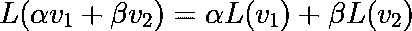

这里，L 是线性映射，也称为线性变换。

这都是数学术语，但它究竟在几何上起什么作用呢？所以，*如果欧几里得空间中有一个向量，那么它要么缩放它，要么旋转它，要么两者都按顺序进行。*让我们想象一下一个矩阵(线性映射)对欧几里得空间中的一个矢量(在这种情况下是 R2)做了什么。

## 想象矩阵对向量的作用

我们将首先创建一个随机向量和随机线性地图。

现在，我们将使用线性映射 M 变换随机向量 u，这将给出变换后的向量 u，我们称之为 v。

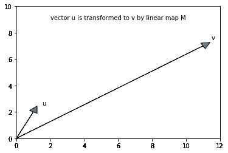

因此，我们看到线性映射 M 在应用于 u 时既做缩放又做旋转。

> 如果 M 仅对 u 进行缩放，则 u 将被称为线性映射 M 的**本征向量**，并且 M 缩放 u 的量被称为对应于该本征向量的**本征值**。同样，如果 M 只旋转到 u，那么 M 被称为**旋转矩阵**或**旋转映射**。

**因此，线性地图/矩阵对欧几里得空间中的矢量进行缩放或旋转，或者两者都进行。**

## 想象一下矩阵对形状的影响

我们现在想象一下矩阵/线性地图在欧几里得空间(在这种情况下是 R2)中对一个形状做了什么。

我们将取一个以(2，2)为圆心的单位圆，然后对其应用线性映射 M，并可视化它是如何变换的。

**圆周矢量**是该单位圆圆周上的矢量点。现在，我们将使用 m 来转换这些环绕矢量。

现在，让我们想象一下这个贴图是如何改变圆的形状的。

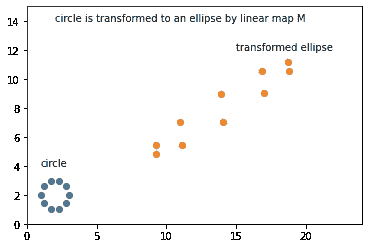

所以，我们可以看到这个圆变成了一个椭圆。这是因为每个矢量点都被缩放和旋转，从而产生这个变换的椭圆。*圆上的每一点都与椭圆上的点一一对应，因为映射是线性的。*

## 矩阵分解和奇异值分解

矩阵分解是线性代数中最强大的工具，它不仅广泛应用于数学领域，还广泛应用于数据科学和机器学习领域。推荐系统大量使用矩阵分解。*这个想法是将一个未知矩阵分解成我们已知属性或易于操作的块。*有许多可用的矩阵分解，但最流行和最基本的是奇异值分解(SVD)。*任何形状的矩阵都可以用 SVD 分解成三个矩阵。*

我们可以把任何线性变换 M 分解成 3 个变换。这些是-

*   使用 V_T(右奇异向量)的首次旋转
*   然后使用 S(奇异值)进行缩放
*   然后再次使用 U(左奇异向量)旋转

这里 V_T，S，U 是 m 的分解矩阵*所以，任何线性映射都可以分解成这三种基本变换，而这种分解叫做* ***【奇异值分解】*** *。*

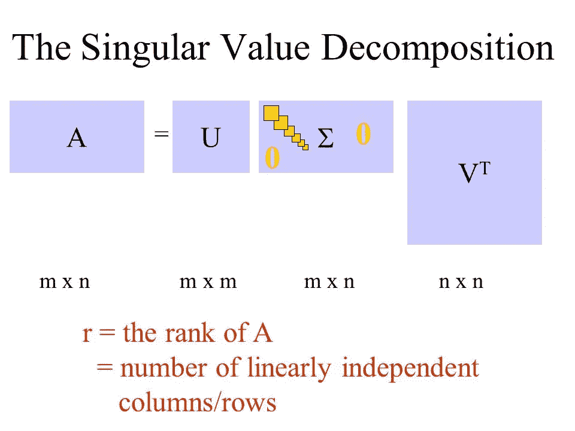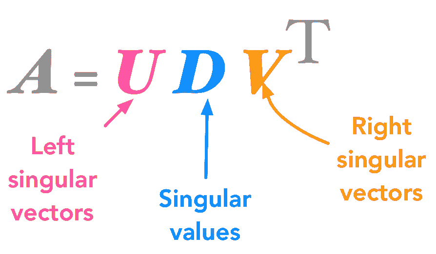

让我们将 SVD 应用于我们之前使用的线性映射 M。

## 使用 SVD 进行转换

现在，我们将以连续的方式使用这些分解的变换在以(2，2)为中心的单位圆上进行变换，并且将看到实际上最终结果与之前相同。

***无论是直接应用 M 还是先应用 V_T 再应用 S 再应用 U，都会给出相同的结果*。**见下图，

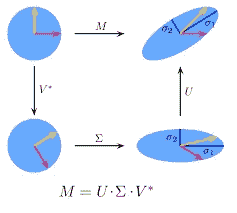

现在，让我们分别绘制这些转换。

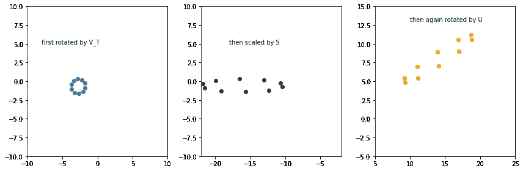

> 因此，V_T 旋转了原始圆，然后 S 缩放了这个旋转的圆，最后 U 再次旋转了这个缩放的圆。所有这些都是按顺序进行的。

因此，我们可以看到，最终结果确实是完全一样的。请注意，这些图像的比例不同(见 x 刻度)，这样做是因为如果我们用相同的比例绘制它们，那么圆看起来会非常小。

# 基于奇异值分解的图像压缩

现在我们将使用这个极其强大的工具来压缩图像。我们将看到*对应于几个最顶端奇异值的 u 和 v 的外积如何能够很好地逼近原始图像，同时显著减小图像大小。*

## 压缩虚拟图像

在本节中，我们将拍摄一个非常小的 7x7 虚拟图像。我们首先对其应用 SVD，然后看到对应于所有奇异值的所有秩 1 图像。然后我们将**通过累积** **对应于从 1 到 i** 的奇异值的所有等级 1 图像来构建最佳等级 I 图像。

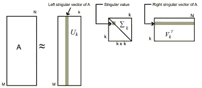

下面是随机 7x7 黑白图像的代码。

请注意，如果您想要构建相同的图像，那么请传递相同的种子 42。此外，该图像的等级为 6。

*矩阵的秩定义为该矩阵中独立行/列的数量。它总是小于矩阵中的最小行数和列数。*

让我们想象一下。

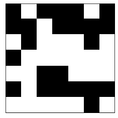

现在，我们将使用 SVD 分解这个图像。

下面都是**排名 1 的图片**。这些是通过取 U 的列和 V_T 的行的外积，然后乘以/缩放 s 中的相应 sigma 值来构造的。

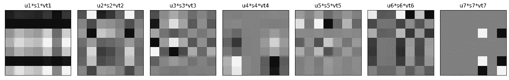

我们将使用这些等级 1 的图像来构建接近原始图像的图像。我们通过等级 1 图像的累积和来做到这一点。同样，通过这样做，我们增加了矩阵的秩，从而增加了存储的信息，即，随着我们累积越来越多的秩为 1 的图像，构建的图像将更接近原始图像。

> **注意:**在任何步骤中，近似图像都是该图像等级的最佳可能近似。

## 最佳秩 1 近似

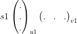

最好的秩 1 图像只不过是 u1 与 v1 的外积，并由 s1 缩放。

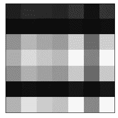

## 最佳秩 2 近似

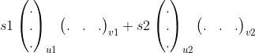

最佳等级 2 图像是上述最佳等级 1 图像和 u2 与 v2 的外积之和，并由 s2 缩放。

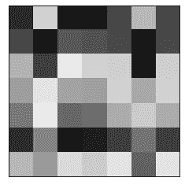

## 最佳高阶近似

类似地，**最佳等级 I 图像是最佳等级(i-1)图像和 ui 与 si 缩放的 vi 的外积之和。**

> 我们将**通过累积对应于从 1 到 I 的奇异值的所有等级 1 图像来构建最佳等级 I 图像**。

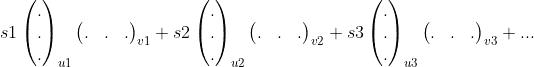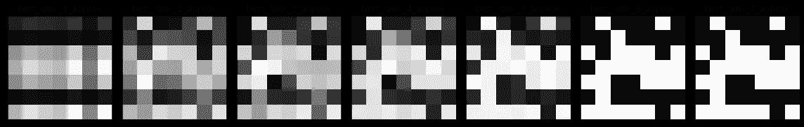

我们可以看到，随着我们添加越来越多的秩 1 图像，近似图像变得越来越接近原始图像，最终我们得到原始图像。

> 如果图像的等级为 **r** ，那么将所有 r 个等级为 1 的图像相加得到相同的原始图像。

但是我们不会去 r 级，毕竟它不会给我们带来任何好处，甚至需要更多的空间。所以我们停止得更早，在这种情况下，我们大多数人会停在**最佳等级 4 或 5 近似值**，因为它给出的图像足够接近原始图像，因此我们可以很好地了解图像是什么。同样，在这种情况下，我们所有人都会停在**最佳等级 6 近似值**，因为等级 7 与等级 6 相同。这是因为，由于图像的秩为 6，最后一个奇异值为 0，因此它不会给图像添加任何内容。

让我们看看使用最佳排名 3 的图像节省了多少空间。

因此，即使在极小的 7x7 图像的情况下，我们也可以使用秩 3 近似值节省大约 8%的空间。虽然这种节省并不多，因为我们也牺牲了图像质量，但在现实生活中更大的图像，我们节省了很多空间，保持图像质量几乎相同。

## 压缩真实图像

为了简单起见，我只拍摄灰度图像。但是该方法也可以容易地映射到彩色图像。

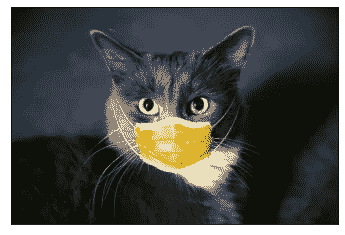

这张图片的分辨率非常大，所以我把它调整到较小的尺寸。

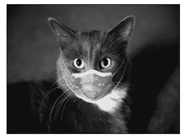

图像的排名是 300(这是很多)。我们来分解一下。

以下是对应于顶部奇异值的一些等级 1 图像。

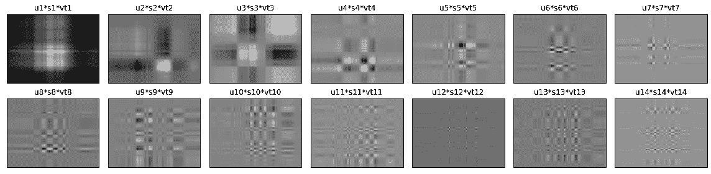

很明显，我们无法从这些排名第一的图片中猜出任何东西，但是当我们开始累积它们时，奇迹就会发生。

我们需要一些辅助函数。

由于 numpy linalg 包中的 SVD 给出的 S 不是一个矩阵，而是一组值，所以我定义了一个函数，它给出的 S 是一个对角矩阵。

**perc_storage:** 返回压缩图像所占的存储百分比。

**perc_energy:** 返回压缩图像所占的能量百分比(sigmas 之和)。

因为我们需要决定我们想要压缩的图像的等级，但是这不能手动完成，因为不同的图像有不同的等级。因此，我们将使用以下函数，返回给定能量和存储的最佳排名。

**get _ optimal _ rank _ by _ energy:**给出给定能量的最低等级。

**get _ optimal _ rank _ by _ storage:**给出给定存储量的最低等级。

让我们使用 SVD 分解图像。

我们将使用上面定义的函数找到最佳等级。

因此，我们得到了 85%能源和 30%存储的最佳排名。

现在让我们将不同等级的压缩图像可视化，并将它们与原始图像进行比较。

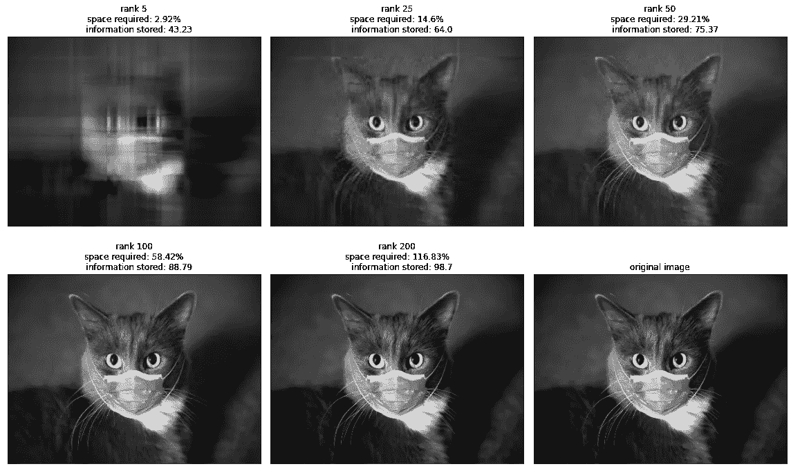

> 我们可以看到，秩 50 是一个非常好的近似值，因为它包含 75%的信息内容，而存储需求保持在 30%以下。因此，我们通过减少 71%的空间获得了 75%的信息，这在保持图像内容丰富的同时节省了很多。

我们中的许多人会停留在 50 级近似，我们中的一些人可能会达到 75 级近似，而那些想要更清晰图像的人可能会达到 100 级。在**保留的信息**和**需要的空间**之间总是有一个权衡。这取决于你的需要，*如果你想要更高质量的图像，那么你可以去更高等级的近似值，提供更多的图像空间，但如果空间对你是有限的，那么你将停止在初始等级，在给定的空间限制内保留最大的信息。*

**下图显示了不同属性等级之间的权衡。**

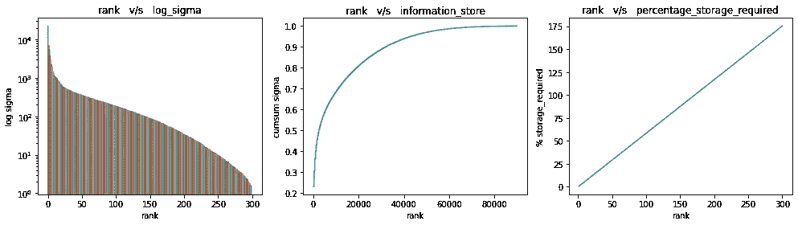

> 你将从 [**这里**](https://www.kaggle.com/gauravsharma99/compressing-images-using-linear-algebra?scriptVersionId=43268686) 获得**这个故事的完整记录 jupyter 笔记本**，你只需要叉上它。同样，如果你喜欢这个笔记本，那么**投票支持**，它会激励我创造更多高质量的内容。

如果你喜欢这个故事，请鼓掌并与他人分享。

此外，请阅读我的其他故事，其中包括各种主题，

*   [**python 中的统计分析**](/@greatsharma04/statistical-analysis-using-python-e83f10ca3c82)
*   [**线性回归中的多重共线性**](/analytics-vidhya/effect-of-multicollinearity-on-linear-regression-1cf7cfc5e8eb)
*   [**利用 keras 进行面部情感识别**](/analytics-vidhya/facial-emotion-recognition-fer-using-keras-763df7946a64)

还有[更多](/@greatsharma04)。

再次感谢你阅读我的故事，我的朋友:)