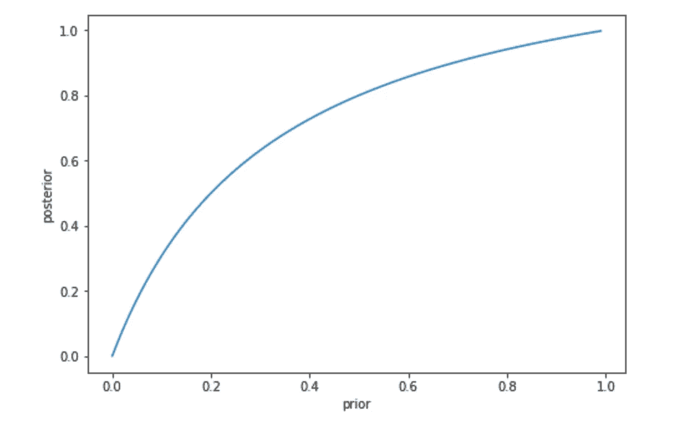
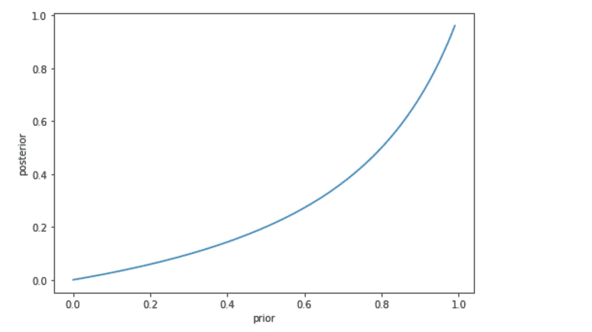

# 全民强制性新冠肺炎测试——有用还是无用？

> 原文：<https://medium.com/analytics-vidhya/compulsory-covid-19-test-for-the-whole-population-useful-or-not-7cbba815a244?source=collection_archive---------15----------------------->

刚刚看了一篇很好的[帖子](https://towardsdatascience.com/understand-bayes-rule-likelihood-prior-and-posterior-34eae0f378c5)关于媒体中的贝叶斯定理，我尝试将贝叶斯定理应用于新冠肺炎考试，以定量的方式表明它对于全市的必考是否有用。

根据贝叶斯定理，如果测试结果为阳性，一个人得到新冠肺炎的概率 P{infected|+ve}与测试准确度不相同，因为测试准确度被定义为一个人如果被感染(即 P{+ve|infected})。假定测试结果是阳性的，这不一定等于这个人被感染的概率(即 p {已感染|+ve})。

> P{infected|+ve}！= P{+ve|infected}

我们还应该考虑这个人被感染的非条件/一般概率 P{infected}(称为先验概率)。

用外行人的话说，

> 对于一个与患者密切接触的人，或者有症状的人，如果检测结果是阳性，那么被感染的几率是非常高的。

这意味着让有密切接触或有症状的人做测试是完全有意义的。

然而，如果我们要求全市所有人口进行强制性检测，由于总体感染率并不高，找出所有感染者的结果也不高。这是因为当先验概率(总体感染百分比)不高时(~ 10%–20%)，我们无法证明检测结果呈阳性的人是真正的感染者，更关键的是，检测结果呈阴性的人也可能是事实上的感染者。

让我们做一些粗略的计算。鼻测试的准确度被认为在 70%-80%左右。下图显示 y 轴(后)是 P {感染|+ve}，x 轴(前)是整个人群中感染的总百分比，即。p {已感染}

如果先验不高(P {感染}=~10%-20%)，则后验 P {感染|+ve}低于 40%。这意味着只有 40%的阳性结果的人真的被感染了。

另一方面，如果我们绘制 P{infected|-ve}的图表，我们会发现大约 10%的感染者仍然没有被感染(-ve 结果)。

总之，当对整个人口进行强制检测的成本非常高时，包括大量的医务人员，以及将整个城市封锁两周，如果结果是城市中仍然有许多未被感染的病例，甚至不算今天你是干净的并不意味着明天你不会被感染，那么就不值得这样做。