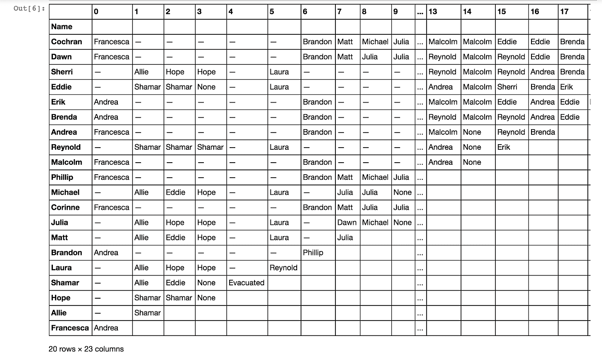
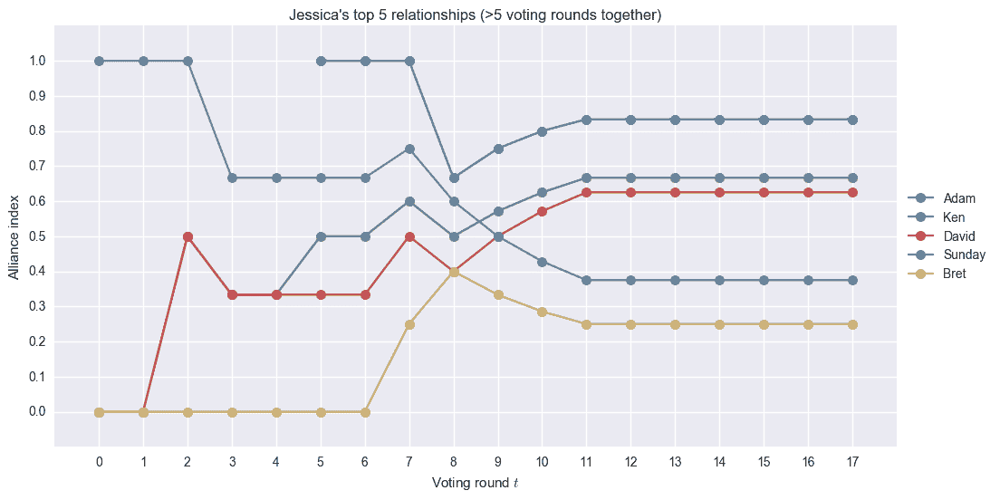
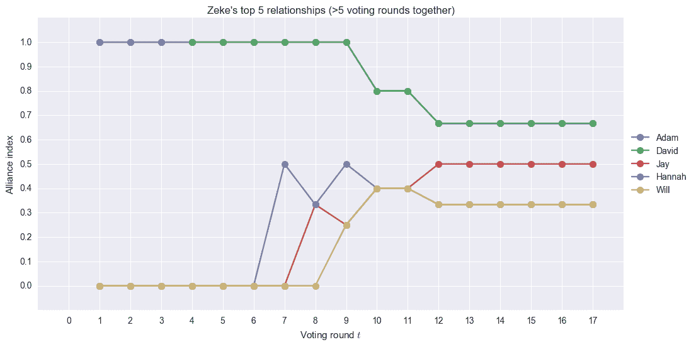
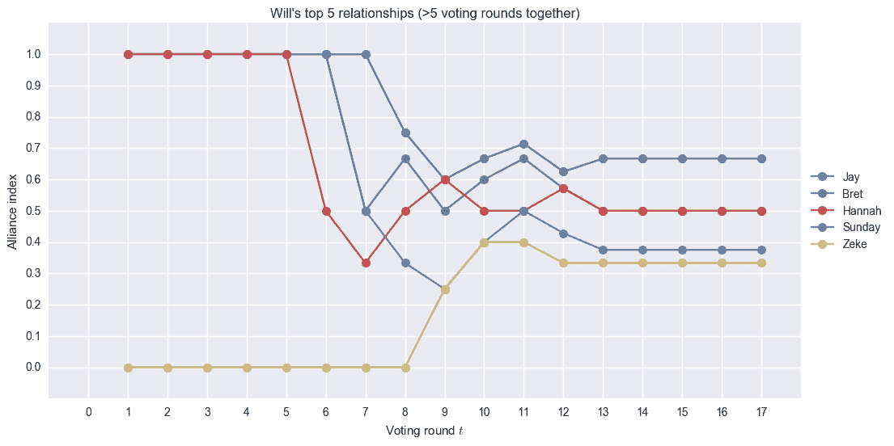
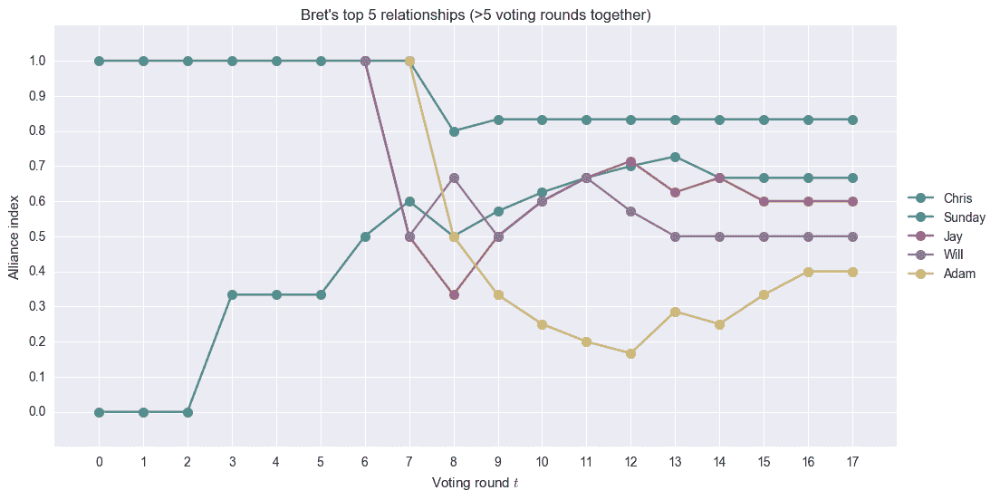
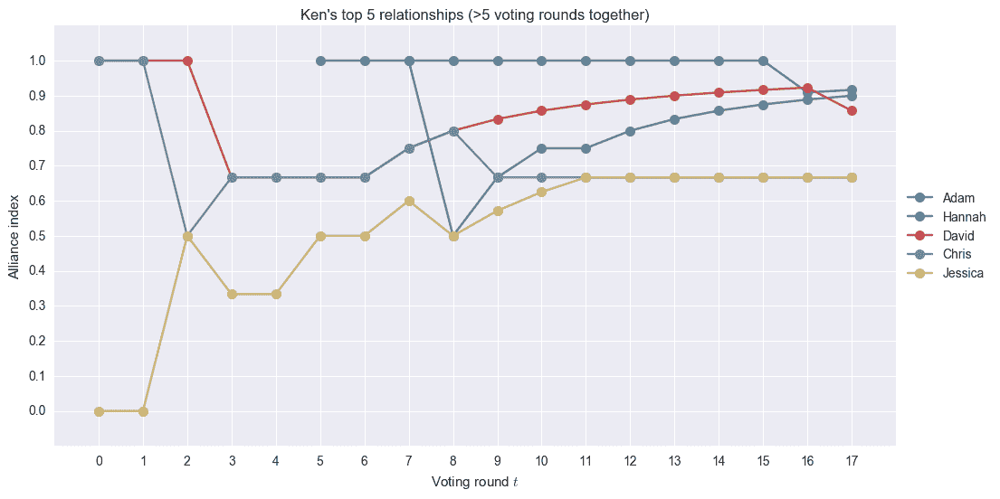
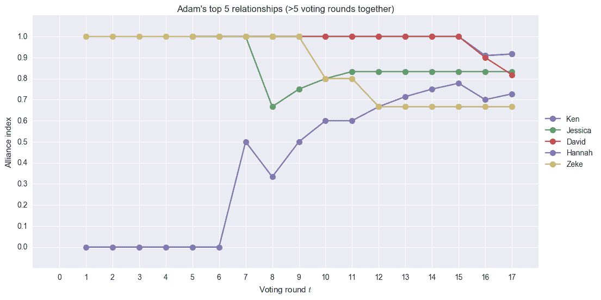

# 幸存者联盟的计算分析

> 原文：<https://medium.com/analytics-vidhya/computational-analysis-of-survivor-alliances-5c06d745d550?source=collection_archive---------3----------------------->

许多研究对电视节目《幸存者》进行了研究。其中一项研究分析了剧中女性的形象，而另一项研究则着眼于陪审团投票的 T2 心理。然而，我注意到的一件事是，我读过的所有文章都是从定性的角度研究这部剧的。我相信使用计算视角会有一些好处，这也是我将在本文中做的事情。

人际关系是幸存者中最重要的生存要素。关系导致联盟，联盟导致投票模式。问题是，我们真的可以反过来吗？通过分析投票历史数据，我们是否可以绘制一幅随时间推移的漂流者关系图？

# 回顾一下我们所做的事情

在上一篇文章中，我们[从幸存者维基中搜集了投票数据](http://datameetsmedia.com/scraping-the-survivor-wiki-with-beautiful-soup/)，并从中构建了一个数据框架。例如，卡拉莫安的数据框如下所示:

您可能会注意到数据框中的一些奇怪的东西，因为我做了三个简化。

**第一个**。数据框中的列代表**轮投票**，而不是部落会议。我们把一轮投票定义为一个被抛弃者投票的例子。每当部落会议以平局告终，就要重新投票。这意味着一个部落会议可以有两轮或更多轮投票，这取决于是否出现平局。也有一些时候，有人被淘汰，但没有通过部落会议离开。例如，当一个漂流者生病了，不得不撤离，或者当一个漂流者简单地放弃并退出游戏。不考虑这些抵销。

**第二个**。被取消的投票仍然有效。因为被取消的投票仍然是被抛弃者关系的指示器，他们仍然应该在分析中被考虑。

**第三个**。陪审团的投票不予考虑。

# 一起投票？

当两个漂流者投票淘汰同一个人时，这两个人通常是一个联盟。为了表示这样的关系，我们引入了一个简单的**从属指数**来表示投票中出现的每一对落选者。该附属索引可以是 1 或 0。如果两人一起投票则为 **1，如果两人不一起投票**则为 **0。**

为了修正符号，让我们考虑在投票轮 t 的参赛者 I 和 j。两者在时间 t 的联系指数被写成

你可能会注意到**一起投票**有点含糊。我们怎么知道这两个漂流者是否一起投票？想一想，最明显的情况就是这一对漂流者投票淘汰同一个人的时候。

然而，这并没有考虑到多数联盟挑选少数成员的常用策略:**选票分裂**。有时，多数派联盟处于足够有利的地位，他们可以在两个少数派成员之间分配选票。他们为什么要这么做？取消少数派成员的隐藏豁免神像，如果他决定使用的话。

# 解决投票分裂问题

要识别分裂投票，我们必须查看每个人的投票，包括目标。通常，在分裂投票中，选票上有两个以上的名字——多数派联盟的两个目标和少数派的目标(一个或多个)。我的算法扫描每个目标，并查看两个目标是否以相同的方式投票(我的算法更通用，我将在后面解释)。如果两个目标的票数相同，那么投给这两个目标的漂流者就被认为是一个联盟。

…这听起来仍然令人困惑，所以我将用一个例子来说明。

回想一下幸存者卡拉莫安中安德里亚的靴子。在这里，科克伦，道恩，谢里，埃里克和布伦达在埃迪和安德里亚之间分配他们的选票。另一方面，Eddie 和 Andrea 投了 Brenda。

现在，既然 Eddie 和 Andrea 投票给了同一个人，我们可以认为他们是一个联盟，尽管是少数。不仅如此，我们还可以进一步得出结论，Cochran、Dawn、Sheri、Erik 和 Brenda 也是一个联盟，尽管有些人投票给 Eddie，有些人投票给 Andrea，因为 Eddie 和 Andrea 针对的是他们组内的同一个人。

我的算法能识别这种情况。其实更一般的是——Andrea 和 Eddie 不一定要投给同一个人，他们可以投给两个人，只要这两个人单独投给 Andrea 或者 Eddie 中的一个。我的算法没有涵盖所有情况，因为投票模式可能相当复杂。但是作为第一近似值，它工作得相当好。

因此，{Cochran，Dawn，Sheri，Erik，Brenda}中的每一对在 Andrea-boot 投票轮中将具有等于 1 的联系指数，并且对 Eddie-Andrea 也将具有值 1。所有其他对将有 0。

如果我们为每轮投票收集每对漂流者的联系指数，我们将能够构建一个**联系数据帧**，其中每行是一对漂流者，每列是一轮投票。数据帧中的每个条目将是 1、0 或 NaN。如果这对漂流者没有一起参加投票，后一种情况就会发生。

算法的实现可以在[这里](https://gist.github.com/pcalderon0711/ca1c6756dd1641f3700c2b3231d48937)找到。挺长的，所以没收录在帖子里。

# 关系动力学

我们现在对每轮投票中谁一起投票有了一些模糊的想法。然而，我们真正想分析的是这一季中漂流者之间的关系，而不仅仅是个人投票。

我们可以使用从属指数来定义一个量，即**联盟指数**，来观察关系如何随时间变化。

假设我们在投票轮 t 有两个参赛者 I 和 j。联盟指数定义为

其中 vot(i，j，t)是到投票轮 t 为止 I 和 j 一起参加的投票轮数，基本上联盟指数是到投票轮 t 为止选手 I 和 j 的从属指数的平均值。

出于直觉，我们来介绍两个假设的漂流者，琳达和泰。假设第七轮投票刚刚结束。在第 7 轮之前，Linda 和 Ty 一起经历了 5 轮投票。假设他们的联盟指数目前为 0.80。这意味着在他们一起参加的 5 轮投票中，他们有 80%的时间一起投票(或 5 轮投票中的 4 轮)。

我们可以使用下面的脚本来计算一对被抛弃者的联盟指数。这里，*系列*是指隶属关系数据框中的一行。

# 对每个漂流者的最佳关系进行排名

随着用于计算联盟指数的投票轮数变高，联盟指数包含的信息越多。如果我们想总结一对漂流者在整个赛季的关系，我们可以计算他们直到最后一轮投票的联盟指数。如果我们对每一对漂流者都这样做，我们可以对得到的联盟指数进行排名，并识别每个幸存者漂流者的 **top *m* 关系**。

然而，有一个警告。一对漂流者一起参加的投票越多，我们就越有信心联盟指数是重要的。比方说，如果琳达和泰只一起经历了一轮投票，如果他们真的一起投票，那么他们的联盟指数将是 100%。如果他们一起经历了 10 轮投票，并在所有这些投票中一起投票，那么他们的联盟指数也将是 100%。然而，很明显，第二种情况下的联盟指数比第一种情况要重要得多，因为他们的关系已经过了更多的考验。

例如，在千禧一代对 X 世代的情况下，亚当-马里会注册 1.0 的联盟指数，因为他们都在马里唯一的部落会议上投票给菲吉。尽管亚当和汉娜在第一次部落会议中的投票不同，但我们预计亚当-汉娜的排名会比亚当-玛丽好，因为我们是将这一季作为一个整体来考虑的。

我们可以通过一起使用投票轮数(姑且称之为 *k)* 作为**过滤器**来解决这个问题。再想想我们假设的漂流者琳达。让我们来解决*的问题。我们的意思是，我们扫描所有其他被抛弃的人，只考虑那些和 Linda 一起参加了 5 轮或更多轮投票的人。从剩下的那些中，我们选择与 Linda 有最高最终联盟指数的 m。在我们的千禧一代对 X 一代的例子中，亚当-玛丽不会被考虑，因为亚当和玛丽只一起参加了一轮投票。*

# 可视化联盟指数

查看联盟指数动态的最佳方式是固定一个参赛者，并绘制他与其他落选者的联盟指数，作为投票回合的时间序列。以下代码绘制了特定季节中每个漂流者的前 m 个关系(带有过滤器 k)。

一对被抛弃者的联盟指数可以增加，保持不变，或者在随后的每一轮投票中减少。当联盟指数增加时，我们可以认为漂流者对的关系加强了(因为他们一起投票)。如果它保持不变，那么要么他们没有一起参加投票，要么他们中的一个已经被淘汰了。如果它减少，那么漂流者对在投票回合中没有一起投票。在这种情况下，我们可以认为是他们的关系在弱化。

# 案例研究:幸存者千禧一代与 X 一代

为了证明这一点，让我们来看看幸存者千禧一代 vs 世代最后 10 强中每个漂流者的前 5 位关系。为了获得重要的联盟指数，让我们将“一起投票”过滤器的最小数量设置为 5。

杰西卡的四个顶级关系来自 X 世代，这是意料之中的，因为她也是 X 世代。注意，Sunday 和 Bret 在这里是意外的。她和他们两个没有很强的联系，这一点从剧情走向可以明显看出。最初，她与 Sunday 的联盟指数很高，因为他们在第一次理事会上一起投票，但后来它慢慢下降。另一方面，她与 Bret 的联盟指数开始时很低，后来有所增加，最后相当低。

我们还可以看到 Jessica 和 David 的关系是如何发展的，可能是因为 David 用他隐藏的豁免神像救了 Jessica。她与亚当的联盟指数始于部落扩张发生的第 5 轮投票。然后它在泰勒投票期间减少(这不应该是这样的，因为他们分裂了投票——我的算法没有检测到这一点，因为杰伊和泰勒没有相同的目标)，然后增加。

亚当和大卫在整个赛季中扮演齐克的顶级关系(他们的情节从第四轮投票开始重叠)。他们在所有回合中都一起投票，直到 Hannah-Zeke 打平。随着领带，齐克与两人的关系下降。另一方面，他与汉娜、杰伊和威尔的关系随着季节而增加。

我忘了威尔发生了什么。我认为他最初在 Mari 投票中与 Hannah，Jay 和其他人结盟，解释了高指数。最终，他选择了 X 世代(Bret 和 Sunday) + Jay。但是他翻了很多次。我觉得上面的情节讲了一个有趣的故事。

我认为算法很好地检测了周日的顶级联盟成员。Bret，Jay 和 Chris 在幸存者最后阶段并列第一。

星期天和威尔是杰伊关系中最重要的两个人。紧随其后的是 Bret。他与威尔的关系开始时很好，但自从他暂时转向亚当，然后又转投杰伊，关系就开始走下坡路了。

布雷特也是。

不出所料，肯出现在大卫排名的首位。亚当和汉娜紧随其后。从第 15 轮开始，亚当和大卫的指数开始下降——这是亚当开始瞄准大卫的点。此外，杰西卡在第五位，即使大卫在杰西的排名中是第三位。(个人观点:我想让大卫赢。)

如果在上次部落会议上他没有投 David 的票，David 会是 Ken 的首选。亚当和汉娜是肯的 2 强，这是意料之中的，因为他们已经结盟很久了。我们可以看到在这一季中，肯和杰西卡的关系有所发展。

肯，大卫，亚当在顶端，正如所料。令人惊讶的是，Wil 和 Bret 也出现在这里。从第 8 轮投票开始，Ken、David 和 Adam 与 Hannah 的指数呈上升趋势，直到最后一轮投票淘汰 David。

亚当的情节很好看，因为我们可以看到他对他的联盟投了几轮票。从第 10 轮投票开始(汉娜-齐克投票)，他和齐克的指数开始下降。从第 15 轮开始(大卫-布雷特投票)，他与大卫的指数开始下降。我们还可以看到，起初，汉娜和亚当的关系并不好，但随着时间的推移，关系明显改善。

# 最后

检测一起投票的落选者的算法并不完美。有很多复杂的场景是它无法识别的。为了获得更精确的结果，进一步的调整是必要的。

上面的分析更多的是描述性的，而不是预测性的。你不能只看剧情就说在下一轮投票中，两个幸存者会反目成仇。真的，那么，这一切有什么意义呢？

我们可以使用联盟指数的另一种方法是总结一个季度的关系。我们可以试着用一个简单的网络来总结这些漂流者的关系。联盟索引有助于构建幸存者联盟网络。从这个网络中，我们将能够看到幸存者之间的相互联系。

和往常一样，完整的代码可以在我的 Github 上找到。

*最初发表于*【datameetsmedia.com】