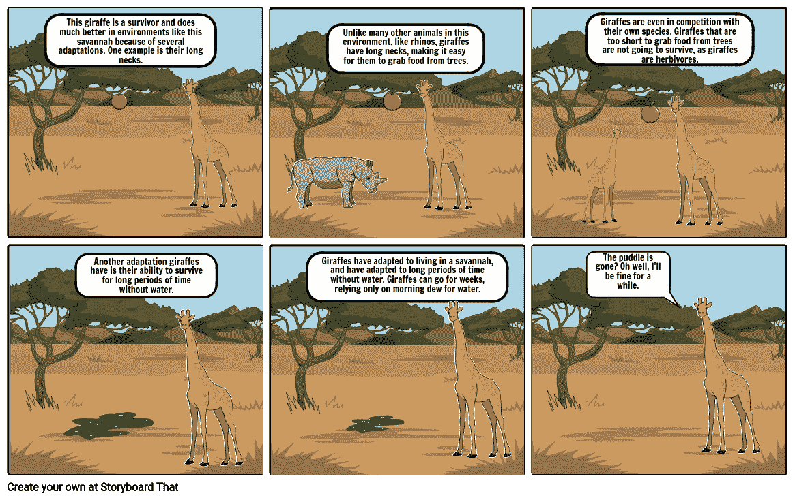

# 计算混沌:优化、探索和利用

> 原文：<https://medium.com/analytics-vidhya/computational-chaos-optimization-exploration-and-exploitation-43fe464aba9a?source=collection_archive---------16----------------------->

# “在人类漫长的历史中，那些学会最有效地合作和随机应变的人取得了胜利”——纪念查尔斯·罗伯特·达尔文的“达尔文日”。

在“计算智能”领域，我们必须考虑一种情况，在这种情况下，我们学习并描述决策的不确定性。问题是如何在决策和计算时平衡探索和开发。

将你的计算时间分成“探索”(学习)和“利用”(最优决策)是一项具有挑战性的任务，这就像找到你可以去你所在城市的每一家冰淇淋店的最美味的冰淇淋一样(探索)，并在每一家冰淇淋店尝试每一种口味的冰淇淋(利用)。权衡中的平衡位置还取决于问题的优化策略和数据分布。有时在像“多臂强盗”这样的问题中，除非你玩并理解底层的分布，否则不可能做出决定。考虑这样一个场景，其中安装了 4 台 bandit 机器，并且您想要计算出具有高预测成功值的机器。玩游戏时，你得到了 D1、D2、D3 和 D4 分布，它们的值相对于机器是独立的和同分布的。在玩游戏时，我们会发现每个分布的期望值和方差，这将使我们能够做出进一步的决定，但在一些问题中，你不需要像“股票投资问题”一样总是尝试，在投资一只股票时，你可以看到其他股票，这将有助于你做出进一步的决定。这也取决于你选择的计算系统的类型，即单智能体或多智能体，并且取决于系统的类型，你可以决定你的优化策略。此外，您可以根据模型的误差函数来决定您的优化算法，例如函数是凸的(具有单个最小值的非波形函数，例如:x -1=0)还是非凸的(具有多个局部最小值的波形函数，例如:x⁴+x -2x -2x=0)这里，我们感兴趣的是找到误差函数最小的参数。

我如何决定哪种优化方法适合我的问题？

ref:[https://www . researchgate . net/figure/Type-of-computational-intelligence-9 _ fig 2 _ 317263278](https://www.researchgate.net/figure/Type-of-computational-intelligence-9_fig2_317263278)

我们不能说一种优化算法优于另一种优化算法，因为每种算法都适合特定的数据、分布和运行时间。

**(1)梯度下降(确定性爬山)**

最常用的优化方法是“梯度下降”，这是有效的，如果你有一个凸误差函数。如果误差函数是非凸的，梯度下降有陷入局部最小值的问题，但是通过在“指数时间”运行梯度下降，可以获得全局最小值，这需要更多的时间。在选择优化方法之前，你可以问一个问题“重要的是你只想最小化一个误差函数，还是它真的关系到好的结果？".如果你正在寻找好的结果，“模拟退火”是一个不错的选择，但与梯度下降相比，它需要一些时间。

神经网络的问题:对于神经网络来说，“局部最小值”不是一个大问题。(I)你会得到一些局部极小值，因为通过置换隐藏层单元或通过否定网络中的输入和输出权重，你还会得到功能相同的布局，这会引起问题。当局部极小值略微非最优时，这实际上并不重要，因为神经网络有其他主要问题，例如“过拟合”。问题是，如果我们积极地寻找全局极小值，那么结果将更加过度拟合，因此模型可能表现不佳。(ii)过度拟合通常发生在神经网络中，因为我们使用了太多的参数，所以它不太依赖于局部最小值。但是对于一个参数很少的小神经网络，会出现局部极小问题。我们在神经网络中使用高斯过程模型或径向基函数，这有时会缓解问题。

**(2)模拟退火**

模拟退火是梯度下降的延伸，在绝对零度(退化情况)时，两者是相同的。模拟退火产生一个随机的相邻状态，如果该状态的适应度比当前状态好，那么它就跳转。关键的一点是，如果温度不为零，有可能会跳到最坏的状态。跳跃的概率取决于(I)新状态有多糟糕？(二)目前的温度有多糟糕？温度太差(太冷)很可能会跳，但可能跳出局部极小找到全局极小。
温度是‘探索’和‘剥削’之间权衡的一个旋钮。基本思想是从高温开始，跳来跳去，希望能找到全局最小值的附近。然后逐渐降低温度，并尝试确定局部最优解。

如果你在 A，你在寻求最低点，那么有一个概率，你会跳到 B，即使这是最糟糕的决定。希望你能找到 C，最后找到 D，全局最小值。单调递增序列在 A 和 D 之间没有路径，所以梯度下降法找不到，但模拟退火法可能找到。
**模拟退火中的收敛:**执行三次独立的模拟退火优化运行，看它们是否产生相似的结果。

模拟退火取一个群体，并对该群体的每个成员应用减少的随机变化。它是一种对给定函数进行全局最优逼近的技术。具体来说，将大搜索空间中的全局优化近似为优化问题是模拟退火的元启发式函数。随机变化的速率、数量和种类是设计过程的一部分。它利用退火(温度)原理来权衡勘探和开发。这在每次迭代中引入了新的测量点，但是随着迭代次数的增加，温度下降，并且算法越来越不可能将空间“收敛”到其当前的最佳候选。

**(3)如果我们在梯度下降之前应用模拟退火来获得一个全局最小值会怎么样？**

(I)使用模拟退火广泛探索优化前景。(爬山前先看一下那组山头，找出要爬的最高的山头)(二)获得问题结构感，选择一个要爬的山头，进行梯度下降。使用这种方法——通常，就像在神经网络中一样，有数百万个参数，所以没有必要进行模拟退火。我们直接从我们所处的初始随机状态开始应用梯度下降。

**(4)基于群体的算法(PSA)**

有一些基于种群的训练算法用于优化，如进化算法(EA)和粒子群优化(PSO)。迭代地探索搜索空间(它是许多子种群的集合)，同时共享信息并最终收敛到最小值是基于种群的学习背后的基本思想。由于使用了多个起始点(候选解)，收敛到全局最小值的机会大大增加了。在许多基于群体的系统中，进化算法和粒子群算法都表现得很有竞争力，优于梯度下降算法。

**(5)遗传算法**

如果有许多独立的个体，而所有其他算法都无法在大型数据集上找到最优解，那么就使用遗传算法。在旅行推销员等问题中，解决方案集包含多个随机路径(基因=所访问城市的顺序)。我们的目标是选择最小成本路径，即在多项式时间内找到适应度。

ref:[https://www . research gate . net/figure/chromius-genetic-arrangement-selection-crossover-and-mutation-procedures-in-the _ fig 1 _ 324062377](https://www.researchgate.net/figure/Chromosomes-genetic-arrangement-selection-crossover-and-mutation-procedures-in-the_fig1_324062377)

遗传算法从一个群体中产生一个新成员，并重复地从群体中取出两个成员并使他们“交配”。新成员可能会被放入一个新的群体，他们可能会从原来的群体中消除“父母”。他们总是能生两个孩子。它们是如何被选择的，它们在哪里“交配”，有多少父母被允许进行交配，以及许多其他变量都可以被改变。有时，遗传算法会收敛到局部极小值，但也存在其他解决方案，如(I)突变:随机翻转位(ii)基因突变(iii)配对的退火。

我们应该记住两个重要的事情:(1)如果交叉“太严格”可能会导致“局部最小值”的问题，但是如果交叉太宽松，则会导致收敛缓慢。(ii)如果突变“太少”,可能导致“局部最小值”的问题，但是太多的突变导致错误的噪声数据。

**(6)遗传算法与模拟退火有什么不同？**

在模拟退火中，我们逐渐减少每个群体成员的随机方差，其中我们采用遗传算法重复突变群体的两个成员。

ref:[https://www . storyboardthat . com/story boards/super Jackson 30/适者生存科学](https://www.storyboardthat.com/storyboards/superjackson30/survival-of-the-fittest---science)

遗传算法维护一个可能解决方案的群体，并在可能解决方案的每个阶段选择配对，混合它们(交叉)，并应用一些随机(突变)变化。该算法基于“适者生存”的思想，其中选择过程根据适应度参数来完成(通常它只是使用优化问题中的当前解决方案测量的目标函数值)。融合的目的是希望，当两个好的解决方案结合起来时，会给出一个更好的解决方案。另一方面，模拟退火仅跟踪可能解的空间中的一个解，并在每次迭代时根据某些概率(随时间衰减)决定是切换到相邻解还是保持在当前解中。这不同于启发式搜索(比如贪婪搜索)，因为它不会遇到局部最优问题，因为它可以摆脱所有邻近解都比当前解差的情况。

**(7)粒子群优化**

群体智能是一种观察，看似聪明的行为可以出现在由简单的“非智能”代理组成的复杂系统中。这就像一台拥有数百万个“弱智”晶体管的数字计算机，能够在“协同工作”的同时执行高速、先进、精确的数学运算。当各个部分看起来彼此独立运作时，群体智能就变得更加重要，就像一群蜜蜂为蜂巢寻找新家，或者一个水池中的鱼群，或者一个生命生成细胞中的分子。

参赛:https://personal.utdallas.edu/~jiezhang/research.html

粒子群优化算法是一种元启发式优化算法，可以应用于一大类优化问题。它没有严格的前提，如成本函数的可微性。它通常与单个全局成本函数一起用于合作优化问题。PSO 使用随机扰动来寻找成本函数的平衡点。产生许多随机分布的粒子，这些粒子随机移动直到收敛。旅行时，他们互相分享自己的最佳状态。粒子朝着它们以前的速度、个人最佳和全局最佳的组合的方向迁移。粒子朝着它们以前的**速度、个人最佳速度和全局最佳速度的组合**移动。先前的速度积分确保了对先前测量的依赖，向全局最佳移动提供了最佳收敛，而最佳个人方面提供了搜索多样性。当优化继续的时候，就有了个人的最佳状态和最佳的相互融合的全局方法。

**(8)总结**

简而言之，梯度下降和模拟退火是基于单一解的算法，而遗传算法和群体分析是基于群体的。这意味着基于单一解决方案的算法只有一个解决方案，并寻求改进它，而基于群体的算法有几个解决方案，或者基于群体大小可能有数百个解决方案。换句话说，基于单一解决方案的算法只有(开发)，而基于群体的算法两者都有(探索和开发)。因此，我们将基于单一解决方案的算法称为开发性算法。正如我们在上面的定义中看到的，这两种算法都取决于问题的性质。如果问题只有一个最优解(单峰)，那么可以使用 SA 和 GA。如果问题有多个最优解，GA 或 PSO 可以找到比 SA 更好的解。由于多模型问题，我们必须同时寻找搜索能力(探索和利用)。如上所述，模拟退火、粒子群优化和遗传算法是很好的全局优化算法，它们可以在广阔的搜索空间中很好地导航，并且与梯度下降不同，不需要任何关于梯度的知识，并且可以有效地用于客观黑盒函数和需要运行模拟的问题。

继续探索“探索-开发困境”。