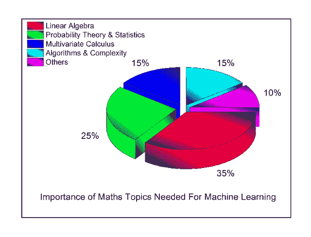
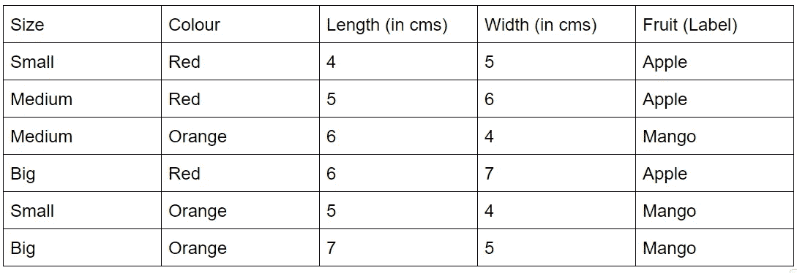

# 数学的计算机应用

> 原文：<https://medium.com/analytics-vidhya/computer-applications-of-mathematics-7d1e86ec5dbe?source=collection_archive---------21----------------------->

# 简介:

在这篇文章中，我将讨论数学的应用如何帮助数字领域达到非凡的高度，尤其是在计算机领域。写这篇文章的动机是，我们大多数人都没有意识到数学在这个领域所做的贡献。对我们大多数人来说，数学仍然是一门学科，我们需要找到“x”的值，仅此而已，正因为如此，我们许多人觉得它很难或很无聊。这篇文章的目的是让人们意识到这种贡献，从而改变对数学这门学科的看法。这将通过考虑几个真实世界的应用来实现。

# 示例:

我将讨论的第一个也是最重要的数学应用是在机器学习领域。这是机器学习中最常用的主题的图示。

比方说，我们正在尝试建立一个机器学习模型，该模型将对两种水果进行分类，比如一个苹果和一个芒果。现在，为了让机器将这两种水果分为两个不同的类别，它应该首先学习苹果和芒果的外观。机器在提供给它的数据的帮助下学习这一点。这里数据是最重要的部分。它可以是任何形式，如图像、视频、信号、表格数据等。让我们不要让它太复杂，保持简单，并考虑到数据是表格形式。在这种情况下，数据将是我们想要分类的两种水果(苹果和芒果)的描述。由于是表格数据，所以会包含一定数量的“**行**”和“**列**”。你能回忆起线性代数中可能学过的矩阵话题吗？我们用行和列的形式来表示矩阵。因此，数据可以被认为是一个矩阵。我甚至还没有开始讨论数据的内容，数学就已经出现了。现在让我们讨论一下数据会是什么样子。由于数据是对两种水果的描述，那么我们将如何描述这两种水果呢？很简单，从尺寸、颜色、长度、宽度等方面。所有这些都是表格数据的列，还有一个附加列，其中包含水果是苹果还是芒果的标签。这里有一个样本数据，这样你就容易理解了。

现在，如果您查看这里的数据，有些列中的信息不是以数字格式显示的。由于机器不理解非数字数据，这些数据被转换成数字。数据没有变化，只是转换成机器能理解的格式。对于 eg，可以认为苹果是 1，芒果是零。这样，所有的非数字数据都被转换成只包含数字的数据！

接下来是最重要的部分，即分类。请注意，我们将要构建的分类模型将从上述数据中学习。许多不同的算法被用于分类。由于我们决定保持简单，我们将考虑使用 KNN 或 K-最近邻分类算法。我们选择这种算法是因为它很容易理解其背后的数学原理。模型完成学习后，数据的图形表示如下所示。

想想被归类为苹果的红点和被归类为芒果的蓝点。现在我们想把一种新水果归类为苹果或芒果。因此，我们给出上表中除标签以外的所有参数，因为这是机器将要告诉我们的。现在，这些参数将再次被转换为数字，作为机器已经学习的数据的帮助，然后在上面的图表上绘制相应的数据点。由于我们正在利用 KNN 算法，这个算法利用了数学距离。为了更详细地理解这一点，考虑新获取的数据在图中被标为绿点。然后，该算法会将该点分类到更接近它的组中。为此，它必须计算距离对吗？现在，为了计算距离，它将再次使用像欧几里德距离这样的概念。距离计算后，进行比较，然后对点进行分类。这似乎是一个非常漫长的过程，每一步都涉及到计算和数学，对吗？但是数学使得在几秒钟内完成所有的过程成为可能！

注意，为了理解这个概念，我们已经考虑了非常少量的数据，并且上述条件可以由人类在不使用计算机的情况下容易地解决。但是现实世界的情况非常不同。数据将包含从几千行到数百万行的数据，以及数百个特征和两个以上的标签。现在，如果我们不利用计算机，而计算机又利用所有的数学，分类将变得几乎不可能！

目前使用机器学习的其他领域的例子有图像识别、新闻分类、虚拟个人助理、产品和服务推荐等。因此，在产生数据的每个领域中，机器学习的概念以及数学被广泛使用，这反过来证明了更有效、更高效和更全面的好处。