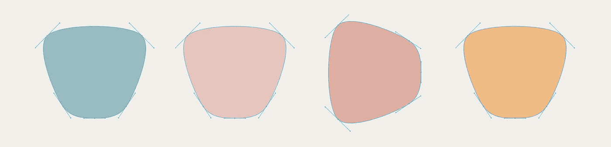

# 使用纸 JS 的生成艺术

> 原文：<https://medium.com/analytics-vidhya/computer-generated-art-using-paper-js-43ae694be765?source=collection_archive---------18----------------------->

## [点击此处观看演示](http://karanmhatre.com/auto-art)

## [在这里找到 GitHub 上的代码](https://github.com/karanmhatre1/auto-art)

# 纸质 JS 基础

[Paper JS](http://paperjs.org) 是一个运行在 HTML5 画布之上的开源矢量图形脚本框架。意思是，在 HTML5 画布上制作元素的简单方法。

我建议从[纸质 JS 教程](http://paperjs.org/tutorials/)开始，了解他们使用的各种组件，如点、大小、矩形和圆形。

# 艺术灵感

[Pinterest 上的心情板](https://in.pinterest.com/karanmhatre2000/auto-art/)

有了足够的艺术和技术知识，让我们开始编程吧。

# 成分

## 半圆

不是半圆，但我是这么叫的。

## 椭圆形

## 线条图案

线

让他们动摇

## 环形路径

# 动态选择

> Art = Math.random()

当制作算法生成的艺术品时，随机数生成是你最好的朋友。

## 元素数量

随机选择 1-5 之间的一个数字来决定要显示的元素数量。此外，选择元素的类型(圆、半圆、线型或圆形路径)

## 颜色

从预先定义的调色板中选择颜色。我为每个元素选择一种颜色。

调色板

## **尺寸**

我需要确保尺寸不会太大或太小。经过测试，我测试了一些最佳值。

## **位置**

为画布边界内的每个元素选择一个随机位置。

## **旋转**

除了**线条图案外，随机旋转应用于每一个。**旋转值从【90，180，-90，-180】中选择。

# 把它们放在一起

1.  决定我们想要显示多少元素，
2.  为每个元素选择大小、位置、颜色和旋转。
3.  在画布上添加元素。

请随意在[演示页面](http://karanmhatre.com/auto-art)上测试该算法。把你在 me@karanmhatre.com 的作品寄给我。

在 Github 上叉一下。