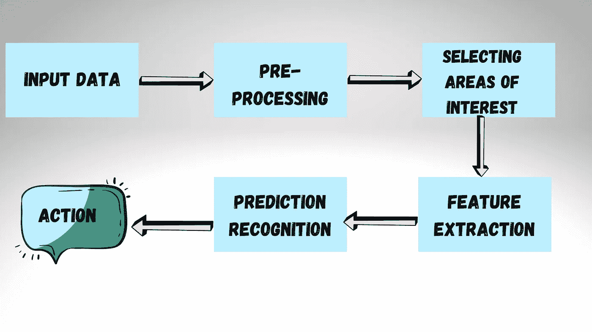
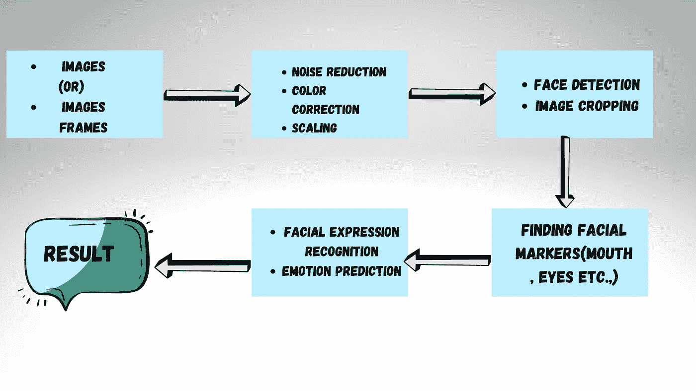
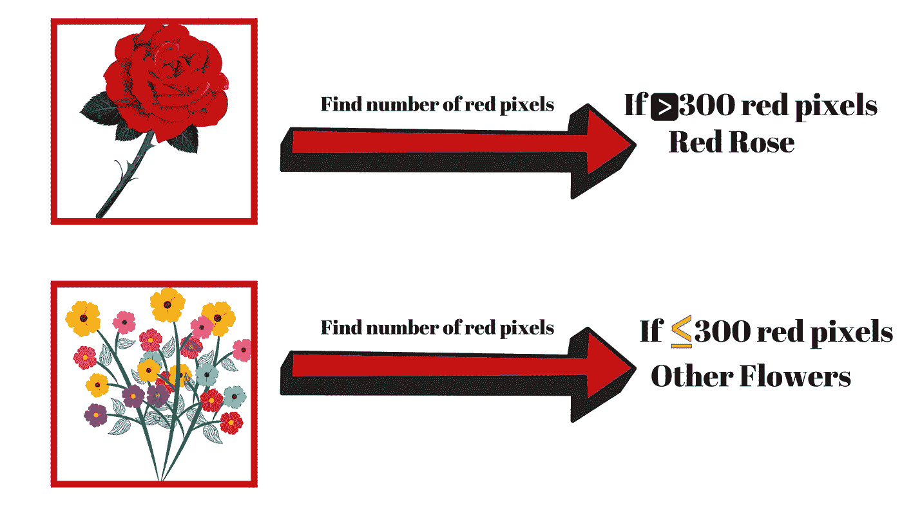
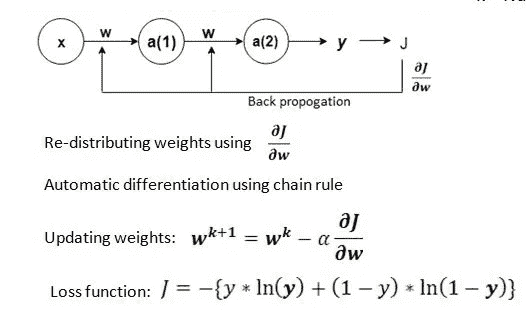

# 计算机视觉:解决许多图像数据相关问题的关键概念

> 原文：<https://medium.com/analytics-vidhya/computer-vision-a-key-concept-to-solve-many-problems-related-to-image-data-168c22d26bcc?source=collection_archive---------9----------------------->

# 介绍

计算机视觉是从新兴阶段发展而来的，其结果在各种应用中非常有用。我们的手机摄像头能够识别人脸。它可用于自动驾驶汽车，以识别交通信号、标志和行人。此外，工业机器人还可以监控问题和为同事导航。

计算机视觉的主要目的是让计算机像人类一样或者可能比我们更好地看待和澄清世界。计算机视觉经常使用编程语言，如 C++、Python 和 MATLAB。这是增强现实的一项重要技术。需要学习的流行的计算机视觉工具有 OpenCV、Tensorflow、Gpu、YOLO、Keras 等。，计算机视觉领域大量包括来自数字信号处理、神经科学、图像处理、模式识别、机器学习(ML)、机器人和人工智能(AI)等领域的概念。

在此之前，让我们先了解一下计算机视觉到底是什么:

计算机视觉是让计算机理解并标记图像中存在的内容的领域。

例如，请看下图:

从上图来看，要解读什么是衣服，或者什么是鞋子，对于没见过的人来说，细说服装并不容易。计算机视觉也是同样的问题。

为了解决这个问题，我们需要使用大量的衣服、鞋子和手袋的图片，并告诉计算机那是什么图片，然后让计算机找出让你区分衣服、鞋子、衬衫和手袋的图案。

# 计算机视觉应用:

计算机视觉已经广泛应用于各个领域。这里有几个例子:

*   识别物体和行为
*   无人驾驶汽车
*   医学图像分析和诊断
*   照片标签
*   人脸识别

# 计算机视觉管道:

计算机视觉流水线是大多数计算机视觉应用将经历的一系列步骤。许多视觉应用首先采集图像和数据，然后处理这些数据，执行一些分析和识别步骤，最后执行一项操作。

总管道如下图所示:

通用计算机视觉流水线

了解流水线是如何工作的。让我们来看看面部识别管道:

面部识别管道

主要步骤或第一步都是关于标准化数据的。所以让我们了解一下标准化数据。

# 标准化数据:

图像预处理就是对输入图像进行标准化，以便您可以沿着管道进一步移动，并以同样的方式分析图像。在机器学习任务中，预处理步骤通常是最重要的步骤之一。

例如，假设您创建了一个简单的算法来区分红玫瑰和其他花:

该算法计算出给定图像中红色像素的数量，如果有足够多的红色像素，它就被归类为红玫瑰。在这个例子中，我们只是提取一个颜色特征。

**注意:**如果图像大小不同，甚至裁剪不同，那么这种计数策略很可能会失败！因此，有必要对图像进行预处理，以便在它们沿着管道移动之前对它们进行标准化。

# 数字数据形式的图像:

图像中的每个像素只是一个数值，我们也可以改变这些像素值。我们可以将每个像素乘以一个标量来改变图像的亮度，我们可以将每个像素值向右移动，以及更多的操作。

将图像视为数字网格是许多图像处理技术的基础。大多数颜色和形状变换都是通过对图像进行数学运算，然后逐个像素地改变图像来完成的。

# 训练神经网络:

为了训练神经网络，我们通常提供标记图像集，我们可以将其与预测的输出标记或识别测量进行比较。然后，神经网络监控它产生的任何错误，并通过修改它如何找到图像数据中的模式和差异并对其进行优先排序来纠正这些错误。

梯度下降是一种最小化神经网络中误差的数学方法。

***X***=输入

a =激活功能

***W***= CNN 中的权重

J =损失函数

阿尔法=学习率

y =基本事实

***y*** =预测

k =迭代次数

卷积神经网络是一种特定类型的神经网络，通常用于计算机视觉应用。他们学习在一组给定的图像中识别模式。

要参考更多文章，请访问下面提到的链接:

[https://medium.com/@likhithakakanuru](/@likhithakakanuru)