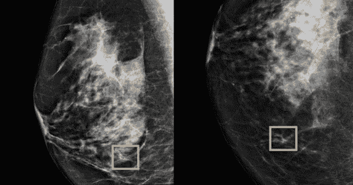
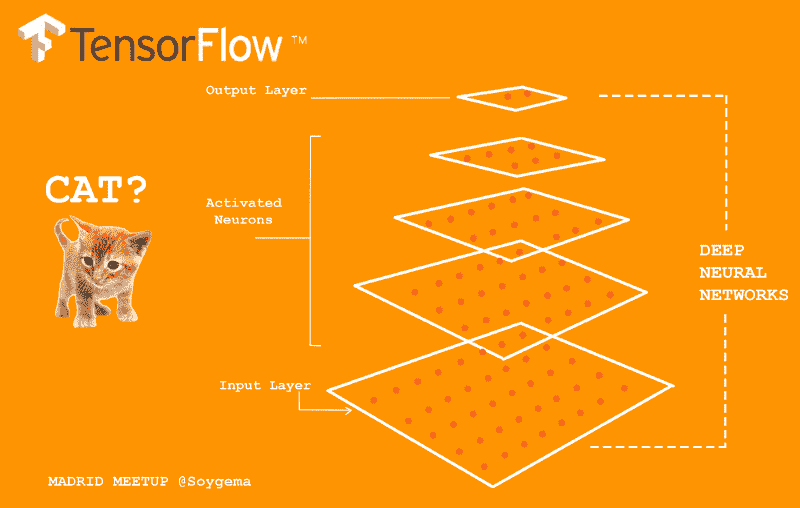
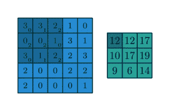
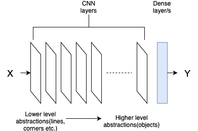
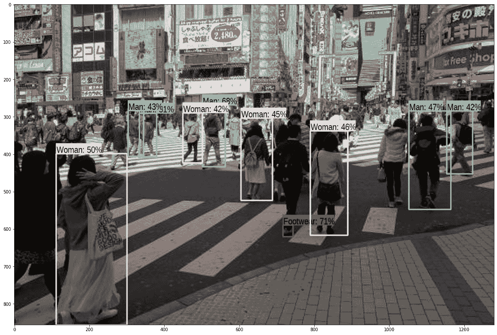

# 计算机视觉人工智能:解释器和例子

> 原文：<https://medium.com/analytics-vidhya/computer-vision-ai-explainer-and-examples-1666b089263a?source=collection_archive---------14----------------------->

## 对广大公众的介绍。

广义地定义计算机视觉人工智能(AI)，它的目标是理解视觉输入，即图像。图像类型和使用案例范围从监测作物产量的卫星成像到检测眼疾的视网膜扫描。最终，目的是从图像中获得意义。

在放射学方面，谷歌训练的人工智能在诊断癌症肿瘤方面甚至超过了医学专家，将英国女性的假阴性率降低了 2.7%，假阳性率降低了 1.2%。

来源:西北大学

那么，这个系统是如何超越那些将毕生精力投入训练的医疗专业人员的呢？一个答案是，AI 也花了很多时间进行训练，并且看到了比医学专家一生中希望看到的更多的例子。

为了更清楚地回答这个问题，我们将介绍一种深度神经网络。具体地说，卷积神经网络广泛应用于计算机视觉研究和应用领域。对于那些可能回避数学的人，请留下来，我尽我所能让这尽可能容易理解。

抛开猫，上面我们看到的是一个卷积神经网络(CNN)。它由多层组成，在这种情况下，大小为 5 层。从底层开始，图像作为输入被馈送到第一卷积层。

现在，是“网络”部分，它将一层与另一层连接起来。在 CNN 中，这是通过滑动窗口或代表图像的像素值的核心来完成的。

来源:[http://deep learning . net/software/the ano/tutorial/conv _ 算术. html](http://deeplearning.net/software/theano/tutorial/conv_arithmetic.html)

上面是一个简单的内核，它取每个窗口中所有值的总和，并将其映射到下一层。虽然有许多额外的操作可以应用，如汇集或退出，但这现在是一个神经网络，通过堆叠许多层，可以形成一个深度神经网络。

一旦它到达最后一层，就被映射到最后一个一维层，称为密集层，然后进行预测以解释输入是什么。预测通常使用 softmax 函数完成，该函数为每个可能的输出分配一个概率分数，并选择概率最高的一个作为最终预测。

来源:[https://I2 . WP . com/adventuresinmachine learning . com/WP-content/uploads/2019/08/Layers-and-abstractions . png？w=391 & ssl=1](https://i2.wp.com/adventuresinmachinelearning.com/wp-content/uploads/2019/08/Layers-and-abstractions.png?w=391&ssl=1)

通常，初始图层能够提取简单的特征，例如线和角，而后面的卷积图层具有形状更复杂的抽象。当训练我们的神经网络模型时，我们有实际值来比较模型预测，这在称为反向传播的过程中使用，以递归回溯和更新每层中的参数值。

此外，这些网络的层数越多，预测能力就越强。为了实现出色的效果，所需的图像量通常在 10，000 张以上。此外，在某些情况下，还必须在高能耗的 GPU 上进行多天的训练，这可能相当于数千个人类训练小时。

因此，随着计算机视觉研究的巨大进步，我们现在看到用例出现在更多的公共领域:

*   **COVID19:** 尽管从 2019 年 5 月到 2020 年 5 月，全球航班需求下降了 70%，但各国正在机场引入带有人工智能的热成像相机，以自动标记体温异常高的人，这是 COVID19 的一种症状。结果并不完美，但这是一种快速筛查密集人群的划算方法。由于 COVID19，配备人工智能的热感摄像机在工作场所和医院也变得越来越普遍。
*   **刑事侦查:**中国的研究人员开发了一种 500 万像素的摄像头，可以与人工智能一起使用，识别密集人群中的数千张面孔，并有可能指出大型公共场所如体育场或繁忙的十字路口的罪犯。
*   **交通:**创新型初创企业正在与大型现有组织合作使用人工智能来优化物流和自动化流程。在如此庞大的行业中，很小的百分比就能带来巨大的节约。

来源:[https://media-cdn . tripadvisor . com/media/photo-s/0a/EC/e9/b5/the-shinjuku-crossing . jpg](https://media-cdn.tripadvisor.com/media/photo-s/0a/ec/e9/b5/the-shinjuku-crossing.jpg)

这是我的第一篇媒体文章，希望向公众介绍计算机视觉。如果这个获得 10 个赞，那么我将围绕通用敌对网络(GANs)制作另一个，它是最近新闻中模仿名人和政治家的深度虚假视频的幕后黑手。也许这甚至可以发展成一个系列。

HackPartners 的数据科学家 Steven Vuong
公开评论&反馈:stevenvuong96@gmail.com
[https://www.linkedin.com/in/steven-vuong/](https://www.linkedin.com/in/steven-vuong/)
[https://github.com/StevenVuong/](https://github.com/StevenVuong/)