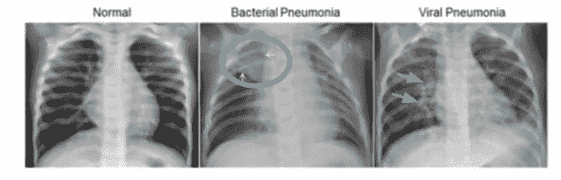

# 计算机视觉和肺炎检测第 1 部分:技术

> 原文：<https://medium.com/analytics-vidhya/computer-vision-and-pneumonia-detection-part-1-technical-4e3592de208b?source=collection_archive---------11----------------------->

最近，我让自己负责分析胸部 x 光图像，以确定病人是否患有肺炎。这些 x 光片由中国广州的广州妇女儿童医疗中心提供，对象为 1-5 岁的儿童。图像集包含“正常”、“病毒性”&“细菌性”肺炎的图像，分为两类:“正常”和“肺炎”。



描绘儿科病人肺部的胸部 x 光片。蓝色标注的区域显示了肺炎造成的损伤。

数据集是在理想的条件下提供的，没有低质量的扫描。在建立模型之前，我检查了类不平衡的训练数据。有 **1341 次正常**扫描和 **3875 次肺炎**扫描。一石二鸟，我添加了 2534 张额外的图像，并扩大它们以反映现实世界的场景-模糊，扭曲的图像，移动/旋转的图像，以及放大和缩小的图像。

```
# Set criteria for image augmentation
datagen = ImageDataGenerator(
            rotation_range = 40,
            width_shift_range = 0.2,
            height_shift_range = 0.2,
            rescale = 1./255,
            shear_range = 0.2,
            zoom_range = 0.2,
            horizontal_flip = True,
            fill_mode = 'nearest')# Select an image from the dataset
img = load_img('chest_xray/train/NORMAL/IM-0757-0001.jpeg')# Convert image to an array
img_array = img_to_array(img)# Reshape the array to a (1 X n X m X 3) array
img_array = img_array.reshape((1,) + img_array.shape)# Set the path where the updated images should be saved
norm_dir = 'chest_xray/train/NORMAL/'# Add 2534 photos to the directory in batches of 150
count = 0
for batch in datagen.flow(img_array, batch_size=150, save_to_dir=norm_dir, save_prefix='IM', save_format='jpeg'):
    count +=1
    if count == 2534:
        break

print('2534 images have been generated at', norm_dir)
```


样本增强图像。

添加完图像后，我将图像的大小减少到 64 x 64，这样大小就统一了，输入到模型中的计算开销也更小，并将更新后的图像保存到原始文件目录中。使用 next()函数，我遍历图像文件并返回存储在变量“__images”和“__labels”中的图像和标签，然后通过将像素除以 255 来规范化图像。

```
# Train set
train_generator = ImageDataGenerator(rescale=1./255).flow_from_directory(train_dir,                                                                           
                        target_size = (64, 64), batch_size= 7685)# Validation Set
val_generator = ImageDataGenerator(rescale=1./255).flow_from_directory(val_dir,                                                    
                           target_size=(64, 64), batch_size=16)# Test Set
test_generator = ImageDataGenerator(rescale=1./255).flow_from_directory(test_dir,                                                            
                         target_size = (64, 64), batch_size=624)# Create the image-label datasets
train_images, train_labels = next(train_generator)
val_images, val_labels = next(val_generator)
test_images, test_labels = next(test_generator)
```

最后的预处理步骤是将标签的大小调整为(1 x 1)数组，然后预览图像和标签，以确保正确的标签与相应的图像相对应。

```
train_labels_final = np.reshape(train_labels[:,0], (7685,1))
val_labels_final = np.reshape(val_labels[:,0], (16,1))
test_labels_final = np.reshape(test_labels[:,0], (624,1))# Sanity check on image 4000
array_to_img(train_images[4000])
train_labels_final[4000, :]
```


样本图像 4000 的预览，增强图像。

现在开始构建模型。初始模型使用默认设置运行，然后在每次迭代后进行阐述，以查看哪些参数有助于模型实现最佳性能。下面是一个代码片段，它遍历不同的优化器，同时适应训练和验证数据。运行代码块后，您可以通过折线图直观地检查优化器的性能。

```
# Create a dictionary of optimizers
optimizers = {"RMSprop": {"optimizer": RMSprop(), "color":"blue"},
              "adam_01": {"optimizer": Adam(lr=0.01),"color":"red"},
              "sgd": {"optimizer": SGD(), "color":"purple"},
              "adadelta": {"optimizer": Adadelta(), "color":"pink"},
              "adagrad": {"optimizer": Adagrad(), "color":"yellow"}}for optimizer, d in optimizers.items():
    print(f'Testing {optimizer}')

    # Build the CNN

    model = Sequential() model.add(layers.Conv2D(32, (3, 3), activation='relu',    
    input_shape=(64, 64, 3))) model.add(layers.MaxPooling2D((2, 2)))
    model.add(layers.Conv2D(32, (4, 4), activation='relu'))
    model.add(layers.MaxPooling2D((2, 2))) model.add(layers.Conv2D(64, (3, 3), activation='relu'))
    model.add(layers.MaxPooling2D((2,2))) # Flattening
    model.add(layers.Flatten())
    model.add(layers.Dense(64, activation = 'relu'))
    model.add(layers.Dense(1, activation='softmax'))
     model.compile(optimizer=d['optimizer'],loss='binary_crossentropy',    
   metrics=['accuracy']) results = model.fit(train_images, train_labels_final,   
  epochs=15, batch_size=500, validation_data=(val_images,   
  val_labels_final)) print("Stored Results")
  d['loss'] = history.history['loss'] 
  print('='*125) # Add a partition in between optimizer results
```

接下来，评估模型的最终损失和准确性，然后对验证图像进行预测。结合使用混淆矩阵和分类报告来评估模型的总体性能。我的最终模型产生了零个假阴性和八个假阳性，这证明了最好的情况，因为最好标记一个病人进行额外的测试，而不是释放一个携带肺炎的病人，他们的症状恶化或他们将病毒性肺炎传播给亲人。

```
# Evaluate the model on the metrics accuracy and loss
model.evaluate(train_images, train_labels_final)
model.evaluate(val_images, val_labels_final)# Make predictions on the validation set
preds = model.predict(val_images)
plot_confusion_matrix(val_labels_final, preds)# Print the Classification Report, which returns Recall, Precision, and F1-Score
classification_report =classification_report(val_labels_final, preds)
```

继续调整您的超参数，并根据您的测试数据训练您的最佳表现模型，然后重复。将您的结果与预先训练的模型进行比较。下面我用的是 **VGG16。**

```
# Import Pretrained Model
from keras.applications.vgg16 import preprocess_input
from keras.applications.vgg16 import VGG16# Edit the default image size to (64, 64, 3)
pretrain_mod = VGG16(include_top= False, input_shape=(64,64,3))# Initialize a model
model = Sequential()
model.add(pretrain_mod)
model.add(layers.Flatten())
model.add(layers.Dense(132, activation='tanh'))
model.add(layers.Dense(1, activation='softmax'))# Freeze layers (do this to speed up 
pretrain_mod.trainable = False
for layer in model.layers:
    print(layer.name, layer.trainable)
print(len(model.trainable_weights))model.compile(loss='binary_crossentropy', optimizer=Adam(lr=0.01), metrics=['accuracy'])results = model.fit(train_images, train_labels_final, epochs=11, batch_size=750, validation_data=(test_images, test_labels_final))
```

别忘了保存你最好的模型！

```
print('saving model to disk \n')
mod = './/Models/pretrained_mod'
model.save(mod)
```