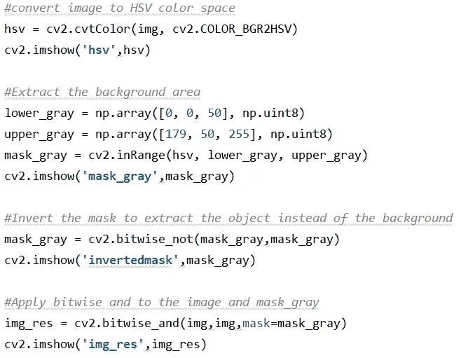

# 移除图像背景和轮廓

> 原文：<https://medium.com/analytics-vidhya/computer-vision-color-space-conversion-and-contouring-4bd03f2480d4?source=collection_archive---------14----------------------->

计算机视觉是从图像中提取数据的科学。它已被应用于各种实时应用，如人脸识别、运动跟踪、图像标记等。计算机视觉始于 20 世纪 60 年代的大学研究，并在 20 世纪 90 年代加速发展，在 2020 年的今天仍然非常受欢迎。在这篇文章中，我将介绍通向计算机视觉的踏脚石，即色彩空间转换和轮廓绘制。

# 议程

*   将图像的背景色转换为黑色
*   将图像转换为灰度
*   在图像上查找并绘制轮廓

# 什么是色彩空间？

色彩空间只不过是一个色彩模型，由 3-4 个主要成分组成，所有可能的颜色都是从这些成分中派生出来的。颜色范围是使用原色分量导出的数字元组。有许多可用的色彩空间，如 RGB、CMY、HSV 等。最广泛使用的是 RGB 和 HSV 色彩空间。如图 1 所示，颜色是基于 3 种主要成分的变化而产生的。

来源:迈克尔·霍瓦特，根据知识共享署名-同样分享 3.0 无版权许可协议提供

# 什么是轮廓？

来源:t 恤区，通过 Indiamart.com

轮廓是覆盖整个物体形状的任何物体的边界线。下图中 t 恤边界上的绿色边界线描绘了轮廓。

它有助于物体检测、形状预测等。

# 我们来编码吧！

我对这段代码使用 cv2 和 numpy 包。

在相邻的 c *ode 片段的第一行，*在读取了变量“ *img* 中的苹果图像后，我将图像的色彩空间转换为 HSV。

接下来，使用色调，饱和度，价值(HSV)的组合，我已经定义了较低和较高的灰色阵列。Python 的 inRange 函数从苹果的“ *hsv* ”图像中提取位于“ *lower_gray* ”到“ *upper_gray* ”颜色范围内的所有像素，并创建图像的灰色遮罩。

原始输入图像来源:盖蒂图片社 iStock

但是我们想要提取苹果图像而不是背景。

所以，让我们使用 bitwise_not 反转灰色遮罩。在倒置的图像中，我们看到的是背景是黑色的，而苹果区域是白色的。

它基本上是一个中间切开苹果形状的黑色纸板。

现在，如果我们把原来的苹果图像放在这个剪出的纸板上，我们将得到带有苹果图像的黑色背景。

因此，我使用逐位 and 将反转的蒙版覆盖在原始图像上。结果如下:

我们已经成功地将图像的背景转换为黑色，同时保持了苹果图像的完整性。耶！

让我们进入下一步的轮廓。

我们首先使用 cvtColor 函数将前面步骤的最终图像(" *img_res"* )转换为灰度图像，从而将其转换为单通道图像，这是 cv2.findContours 函数所需要的。

在接下来的几行代码中，我将选择面积最大的轮廓。

最后，我们使用 drawContours 函数在图像上绘制轮廓。

你可以在这里找到完整的代码。

我们完事了。恭喜你！我们已经成功地将图像的背景色转换为黑色，并在图像上画出了苹果的轮廓。你现在已经步入了计算机视觉的世界。尽情享受吧！😊