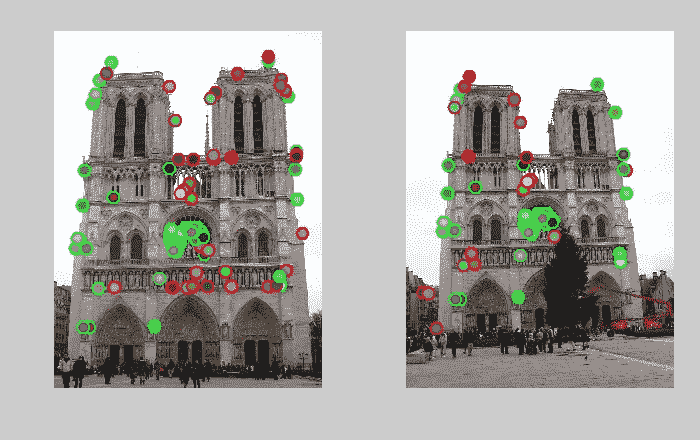
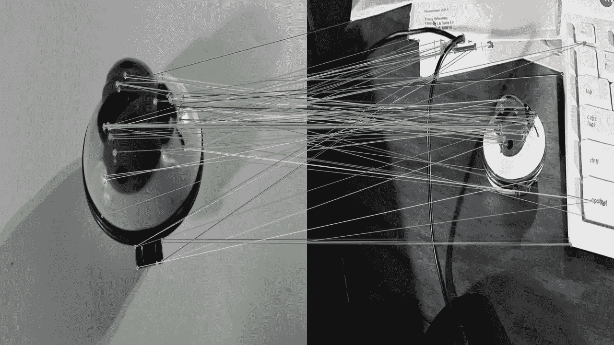

# 计算机视觉—特征检测和匹配

> 原文：<https://medium.com/analytics-vidhya/computer-vision-feature-detection-and-matching-c2aa728d9e59?source=collection_archive---------17----------------------->

顾名思义，特征检测和匹配是一种计算机视觉技术，用于检测特征并将这些检测到的特征与图像进行匹配，以识别感兴趣的区域。那么，什么是特征呢？

特征可以被认为是图像中的特定结构，其有助于能够识别图像中的感兴趣区域。例如，突出的边缘、拐角或点可以是图像的特征。我们经常使用边缘和拐角作为特征的例子，因为它们确实是帮助识别图像的特殊结构。

特征检测

因此，在特征检测中，我们基本上所做的是识别特征点，其中片段/对象的边界方向突然改变(就梯度而言，它可能是巨大的梯度差)。然后在特征匹配中，我们获取特征点的描述符，并在图像间进行比较。例如，在第一幅图像中，我们可以获得(X1，Y1)作为特征点，以及(X2，Y2)作为第二幅图像中的匹配特征点。我们将讨论用于(直到今天)检测这些特征点的算法。

但是之后呢？

特征点是一个感兴趣的点，但是为了从中获得一些信息，我们需要计算能够与许多其他图像进行比较的特征描述符来执行特征匹配。可以把它想象成图像的“指纹”,图像之间的一组独特的区别。类似地，在定位特征点之后，有许多算法来计算这些描述符，我们将在接下来的几节中讨论。

特征匹配

总的来说，为了理解特征检测和匹配是如何工作的，如下所示:

*   我们首先在图像中找到一组特征点
*   根据这些特征点，我们在每个特征点周围定义一个区域，并对该区域进行归一化
*   归一化带来了更好的准确性，因此我们可以开始计算归一化区域的局部描述符
*   使用这些描述符，我们可以将它们与其他图像的描述符进行匹配。