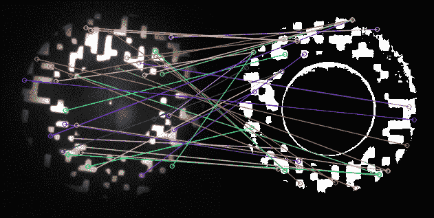

# 计算机视觉:OpenCV 的特征匹配

> 原文：<https://medium.com/analytics-vidhya/computer-vision-feature-matching-with-opencv-31987cdcfb21?source=collection_archive---------1----------------------->

计算机视觉是一个旨在从数字图像或视频中获得深度理解的研究领域。结合人工智能和 ML 技术，今天许多行业都在投资于计算机视觉的研究和解决方案。

也就是说，想想机场的安全程序:当你必须出示你的护照时，现在很常见的是找到一个能够…