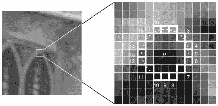

# 计算机视觉—加速分段测试(FAST)的特征

> 原文：<https://medium.com/analytics-vidhya/computer-vision-features-from-accelerated-segment-test-fast-7d87bc874f1f?source=collection_archive---------23----------------------->

这是计算效率最高的特征检测算法之一，非常适合实时视频处理。让我们直接进入算法，看看它是如何工作的:

1.  我们首先在图像中取一个像素 **p** (把这个点看作一个兴趣点，我们以后可能会忽略它)。让它的强度成为 **Ip。**
2.  然后我们在它周围画一个 16 像素的圆，叫做半径为 3 的 Bresenham 圆，也就是上图中的圆。
3.  然后我们选择一个合适的阈值 **t.**
4.  如果在 16 个像素的圆圈中存在一组比 **Ip+t** 更亮或比**Ip-t**更暗的 **n** 个连续像素，则我们确定像素 **p** 是否为拐角
5.  该算法进行高速测试，首先使用 **Ip 检查像素 1、5、9 和 13 的强度。**这 4 个像素中的至少 3 个像素应满足 4)中规定的阈值标准，以确定兴趣点将存在。
6.  如果它通过了第 5 步，我们继续检查所有 16 个像素，看看是否有 12 个相邻的像素符合标准。否则，我们拒绝利息点。
7.  当然，对图像中的所有像素重复同样的过程。

基本上就是这样！这是快速算法！然而，它也有一些局限性。

1.  对于 n<12，它不拒绝同样多的候选。
2.  像素的选择不是最佳的，因为效率取决于问题的顺序和角点外观的分布。
3.  高速测试的结果被扔掉，不存储。
4.  可能检测到多个彼此相邻的特征。

否则这就是一个超级酷的算法！