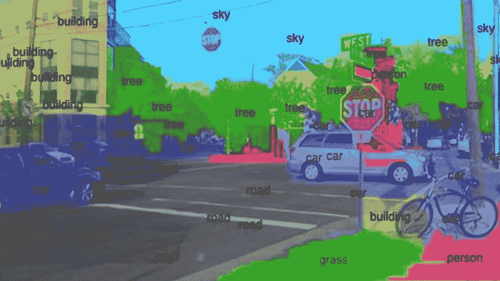
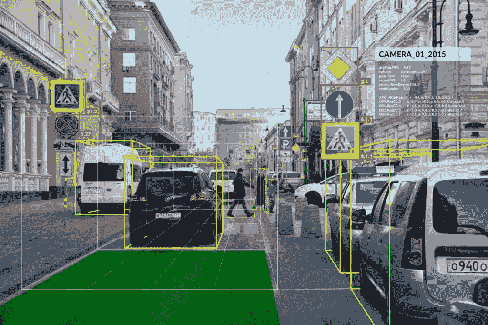

# 儿童计算机视觉

> 原文：<https://medium.com/analytics-vidhya/computer-vision-for-kids-3c326362736a?source=collection_archive---------10----------------------->

## 什么是计算机视觉？

计算机视觉是一个跨学科的科学领域，研究如何使计算机获得对数字图像或视频的高级理解。



[*https://algorithm ia . com/blog/WP-content/uploads/2018/03/word-image-9 . png*](https://algorithmia.com/blog/wp-content/uploads/2018/03/word-image-9.png)

## 计算机是如何认识一幅图像的？

电脑真的能看到你硬盘里的图像吗？不。计算机实际上不能像我们人类那样识别或看图片。这样，我们就需要想出如何将这些图片转换成数字。

因此，彩色图像是由三种颜色的三维矩阵构成的；红色、绿色和蓝色。对于灰度或黑白图像，只有一个通道。

## OpenCV 是什么？

OpenCV(开源计算机视觉库)是一个开源的计算机视觉和机器学习软件库。它主要专注于图像处理、视频捕捉和分析，包括人脸检测和对象检测等功能。OpenCV 旨在为计算机视觉应用提供一个公共基础设施，并加速机器感知在商业产品中的应用。作为一个 BSD 许可的产品，OpenCV 使得企业利用和修改代码变得很容易。



# 让我们来玩吧！

## 在我们开始之前你需要什么？

*   计算机编程语言
*   IDE

## OpenCV 基础知识

*   导入库

```
import cv2
```

*   阅读图像

我们可以使用 cv2.imread 函数来实现这一点。首先，创建一个变量，并使用函数读取图像，将它的路径作为第一个参数。

```
#For a coloured image
img = cv2.imread("Man.jpg", 1)#For a grayscale image
img = cv2.imread("Man.jpg", 0)
```

这里的“1”和“0”代表图像的类型。如果我们输入“1 ”,它将被读取为 RGB(彩色),如果我们输入“0 ”,它将被读取为灰度或黑白图像。OpenCV 将读取的数据作为一个 numpy 数组，或者用英语来说是一个数字矩阵。因此，如果图像是彩色的，它将是一个三维矩阵，如果是灰度图像，它将是一个二维矩阵。

如果你打印 img 变量，你将能够看到图像现在被转换成一个矩阵！如果你打印出图像的形状，你可以看到带有行数和列数的 Numpy 数组。

```
print(img.shape)
```

## 显示图像

我们可以使用 cv2.imshow 函数来显示您刚刚读取的图像。

```
cv2.imshow("Man", img)
```

这里第一个参数是窗口的名字，第二个是我们之前读过的对象。当我们使用 imshow 功能时，我们必须使用 waitkey 来等待，直到用户按下一个键，除非窗口一打开就关闭。

```
cv2\. waitKey(0)
cv2.destroyAllWindows()
```

## 调整图像大小

如果你想调整你阅读的图像的大小，你可以简单地使用 cv2.resize 函数。

```
resized = cv2.resize(img, (650,650))
```

第一个参数是我们读取的对象，第二个参数是我们希望它调整的大小。您也可以使用原始图像属性作为参数。这是你可以做到的。

```
#New image shape = Old image shape/2
resized = cv2.resize(img,(int(img.shape[1]/2),int(img.shape[0]/2)))
```

所以在这里，你可以使用 OpenCV 实现计算机视觉的超级基本功能。让我们以后再见面继续这个会话吧！一路平安。