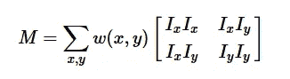

# 计算机视觉—哈里斯角点检测

> 原文：<https://medium.com/analytics-vidhya/computer-vision-harris-corner-detection-30d63a6e793d?source=collection_archive---------14----------------------->

Chris Harris 和 Mike Stephens 提出了一种算法，这种算法非常强大，能够检测出图像中的角点，这是一种非常有用的功能。要定义一个角，就从图像处理技术方面来说吧。拐角可以被认为是两个边缘的接合处，其中边缘是像素亮度或强度的突然变化，并且构成梯度。角点很重要，因为它们被认为是对平移、旋转和光照不变的特征点，但不幸的是，它们不是尺度不变的。我们将在后面的文章中讨论这个问题。

为了使事情变得简单，该算法基本上找到了所有方向的位移(u，v)的像素强度的差异。然后，当在图像中的像素上滑动窗口时，我们找到移动前后像素值的平方差之和(SSD ),以确定强度变化。函数 E(u，v)定义为所有平方差之和的和。Ix 和 Iy 是 x 和 y 方向上的图像导数，也可以被认为是像素的强度值。

所有平方差之和(SSD)

为了求解这个方程，我们将不得不通过应用泰勒展开式来最大化这个方程，特别是第二项。我们得到这样一个等式:

膨胀后

等式的这一部分可以总结为以下步骤:

1.  应用 Sobel 算子找出图像在 x 和 y 方向上的导数。
2.  乘以窗口意味着灰度(我们通常将图像转换为灰度以进行图像处理)图像中的每个像素，我们在图像上滑动窗口以找到哈里斯值 r。
3.  设置一个阈值，对于超过该阈值的像素，考虑该窗口中的局部极值，并且该区域包含一个角点！
4.  当然，我们可以在这里继续计算特征描述符。

并且函数 E(u，v)变成:

然而，为了找出图像中的点是否是特征点，E(u，v)的值必须很大。意思是，如果有一个角，E(u，v)会是一个很大的值。为了计算，我们可以求解 M 的特征向量，以确定 SSD 最大和最小增加的方向。基本上，他们提出了这样的条件:

通过求解 R，我们可以通过以下条件知道在图像中的该点处是否存在拐角:

基本上，这就是哈里斯角检测背后的数学原理！要查看实际情况，您可以尝试 OpenCV 中的 *cornerHarris()* 函数，该函数返回一个 Harris 分数 R，它需要阈值来给出角点。