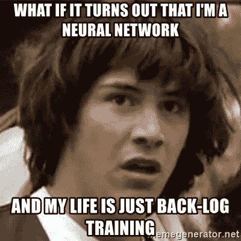
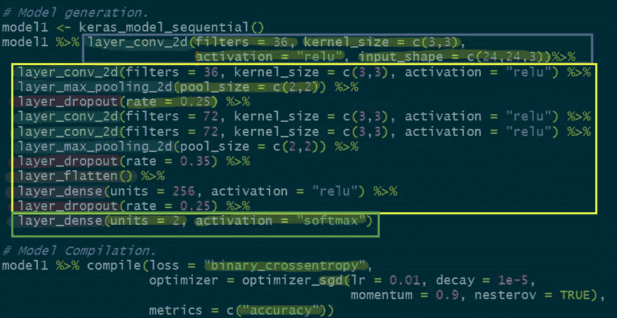
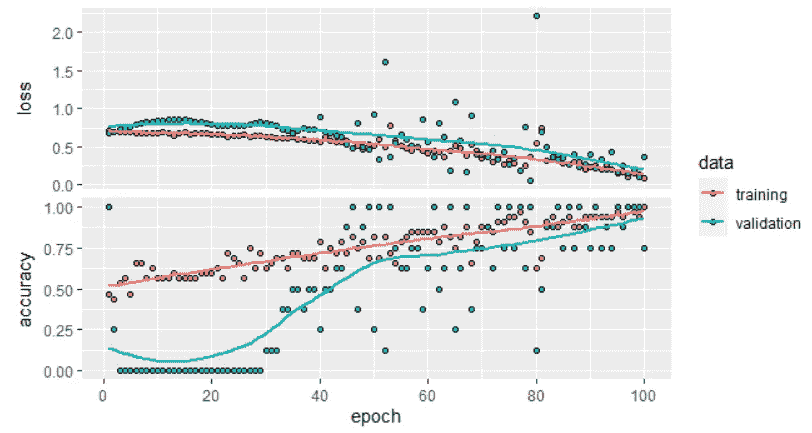
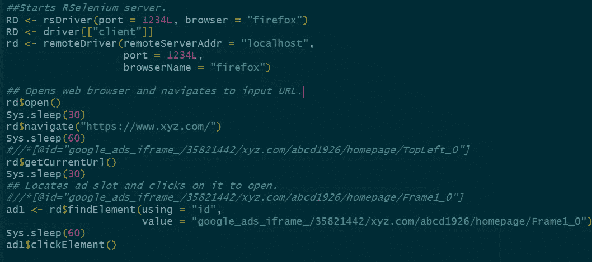

# 网络广告中的计算机视觉

> 原文：<https://medium.com/analytics-vidhya/computer-vision-in-advertisements-8630f8aa7d87?source=collection_archive---------20----------------------->

在我的工作中，我见过一些与网站上闪现的广告形象有关的问题。出于好奇，我想了想，用机器学习或人工智能来解决这类问题可能吗？如果是，这是如何工作的？要了解更多信息，让我们深入了解一下…

## **任务—**

举个例子，xyz.com 正在展示一些广告。但是由于某些原因，一些广告显示了不合适的图像。解决这个问题的一种方法是手动检查哪些域名显示了此类广告，或者我们可以尝试建立一个神经网络来为我们完成这项任务。

如果我们想让计算机做我们的手工任务，让我们看看我们的武器库中有什么…

> *就是计算机视觉！！！*

听起来很有趣，不是吗？确实如此。但是教计算机像人脑一样工作并不像听起来那么简单。那么，我们现在该怎么办呢？

让我们在实验的帮助下更详细地了解一下，看看它是如何工作的…

## **探索数据集—**

为了模拟从网页上获取广告的情况，我从 Google 下载了 46 张图片。其中 23 个广告是大多数网站所有者不希望在他们的网页上看到的随机的不适当的广告(例如，约会网站和赌博网站广告)。另外 23 个广告是汽车销售、保险和投资的随机广告。

(在这篇文章中，我只看图像广告，并为下一篇文章保留视频和动画广告🤓)

现在，我们有了数据集的概念。我们的目标是将所有这些广告分为两组，即不适当的广告(约会和赌博广告)和网站所有者批准的广告(汽车销售、保险和投资广告)。出于分类目的，在 46 个广告中，每组保留 3 个广告用于测试模型，其余 40 个用于训练和验证。

现在让我们来看看这个图像分类和 CNN(卷积神经网络)是如何一步步工作的…

## **卷积神经网络(CNN)–**

首先，让我们看看什么是神经网络…

神经网络受人脑的启发。神经元(是我们大脑的一个非常基本的元素)在我们的大脑中相互连接，并执行所有的处理活动，因此我们可以进行日常活动。以同样的方式，深度学习算法使用在几层中相互连接的节点。每个节点都可以用简单的话来描述为一个决策点。根据这些节点的布局和存在多少层这样的节点，可以确定神经网络的类型。浅层神经网络具有一个输入层、一个隐藏层和一个输出层，而深层神经网络具有一个输入层、多个隐藏层和一个输出层。根据问题的类型，可以决定网络的体系结构。

一个问题是，为什么使用 CNN 而不使用其他神经网络？这是因为 CNN 是一种专门的神经网络，用于对二维图像数据进行操作。

***卷积*** 是一种线性运算，涉及一组输入的乘法，很像传统的神经网络。假设该技术是为二维输入而设计的，则在输入数据数组和二维数组之间执行乘法，称为 ***滤波器*** 。

## **用于图像分类的神经网络—**

你可以在下面看到我的代码片段，它展示了神经网络的架构。我将尝试逐一解释所有重要的参数。

卷积神经网络层和编译

因此，正如您在上面的代码中看到的，我们的网络共有 12 层。首先是用蓝框标记的输入层。输入层向我们的网络提供图像数据。您可以看到高亮显示的参数，这些参数是我们在创建层时需要定义的。***input _ shape****定义了我们的图像数组的尺寸。在这里，我已经调整所有图像的大小为 24 x 24，图像有 3 个通道，所以形状变成 24 x 24 x 3。如果您想避免在运行模型时出现错误，调整图像的大小是一个很好的做法。😇*

**

*内核插图*

*要了解 ***内核*** 的工作原理，请看上图。我们有大小为 3 x 3 的内核，所以一个 3 x 3 矩阵的窗口(标记为黄色框)将从左到右、从上到下滑过整个输入图像。每次从输入图像中提取特征。上面显示的图像用于说明目的，实际过程发生在像素级，一个 3 x 3 像素的窗口在图像上移动以收集特征。*

*下一个参数是启动一个节点的 ***激活*** 。激活方法根据节点的值决定是否启动节点。这里使用 ***整流线性单位或 ReLU*** 作为激活方法。在这种方法中，具有负值的节点停止启动。这改进了计算时间。其他一些方法有 Sigmoid、TanH、Leaky ReLU、Parametric ReLU 和 Softmax。*

*在两个卷积层之后，有一个汇集层，它减少了样本量。这里使用了 ***Max Pooling*** 方法，从 2 x 2 窗口中取最大值。*

****漏层*** 是在最大汇集层之后启动的。Dropout 是一种在训练过程中忽略随机选择的神经元或节点的技术。他们是随机“辍学”的。你可以想象，如果神经元在训练期间随机退出网络，那么其他神经元将不得不介入并处理对缺失神经元进行预测所需的表示。这导致网络学习多个独立的内部表示。*

*其结果是，网络对神经元的具体权重变得不那么敏感。这进而导致网络能够更好地泛化，并且不太可能过度拟合训练数据。*

**

*CNN 的代表*

*我已经添加了另一套相同的网络层，以过滤出更多的功能。网络的结构完全取决于问题的类型。你会注意到，在第二组层的数量过滤器和辍学的百分比增加，以获得更好的准确性。*

*一旦我们通过卷积层创建了所需的数组，我们需要将它们转换成单一的矢量形式。这是通过 ***展平图层*** 实现的。该层将数据转换为单个长向量，然后传递到最终输出层进行分类。*

*建立模型架构后，我们需要编译我们的神经网络。由于我们只有两个分类输出(编码为 1 表示不合适，0 表示可接受)，我们使用***binary _ cross entropy***作为我们的 ***损失函数*** 。从我们的模型性能来看，最重要的参数是 ***优化器*** 。这里我们用的是 ***随机梯度下降或简称 SGD*** 。使用这种方法，网络被迫学习从图像中提取使网络被训练来解决的特定任务的损失最小化的特征，例如，提取对将图像分类为两个不同对象最有用的特征。*

## ***结果—***

*在训练数据集上编译和运行模型后，正如您在下图中看到的，我们获得了 92.5%的准确率，测试数据集的准确率为 83%。这意味着在我们测试数据集中的 6 幅图像中，我们的神经网络正确分类了 5 幅图像。这个结果也可以通过改变超参数、网络结构和优化方法来改善。*

**

*分类输出*

*通过观察这些图，我们可以了解损耗如何随着每次新的迭代而降低，精度如何随着迭代而提高。我们用于训练和验证数据集的两条线以类似的方式移动，并在大约第 100 次迭代时收敛。所以，我们可以说我们的模型没有过度拟合。*

**

*精确度和损耗图*

## ***从网页上输入图像–***

*在数据探索部分的开始，我提到过，为了模拟场景，我已经下载了图像。但是我们可以更进一步，尝试通过直接从网页向我们的数据集输入图像来自动化这个过程。要做到这一点，您可以参考下面的代码片段图像。*

**

*图像的网络抓取*

*因为我们想对来自 xyz.com 的图像进行分类(在文章开头提到过😛).通过使用一些网络抓取工具和包，比如 RStudio 的 **RSelenium** ，我们可以将图像输入我们的数据集。最重要的事情是要记住，而这样做是始终检查网站的政策，为刮。你可以在地址栏输入****域名*/robots.txt*** 来查看。*

## ***R/R studio 用户的要点—***

*   *如果您在 R/RStudio 中运行 Tensorflow 和 Keras，请确保您的机器上安装了 Python 或 Anaconda。*
*   *你需要先在 Python 上安装 Tensorflow 和 Keras。请确保安装的版本与您的 R/RStudio 版本兼容。否则，这两个包都不会加载到 RStudio 中。*

*(这让我在第一次安装时非常头疼，几乎花了 3 天才弄明白为什么我不能运行 Tensorflow🤯)*

*如果你觉得这篇文章很有帮助，那么就喜欢它并与他人分享。(它激励我不断尝试新事物🤓)*

*感谢阅读，你真棒！！！🥳*