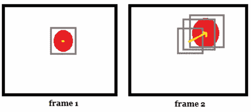

# 计算机视觉——均值漂移跟踪

> 原文：<https://medium.com/analytics-vidhya/computer-vision-mean-shift-tracking-a8be4233d9f6?source=collection_archive---------3----------------------->

之前，我们已经讨论了一些图像分割算法，以及如何在图像中找到对象边界。让我们来看看一种算法，该算法跟踪其外观由颜色直方图定义的对象，但当然不仅限于颜色直方图。

在这一节中，我们将深入算法的基本数学部分。