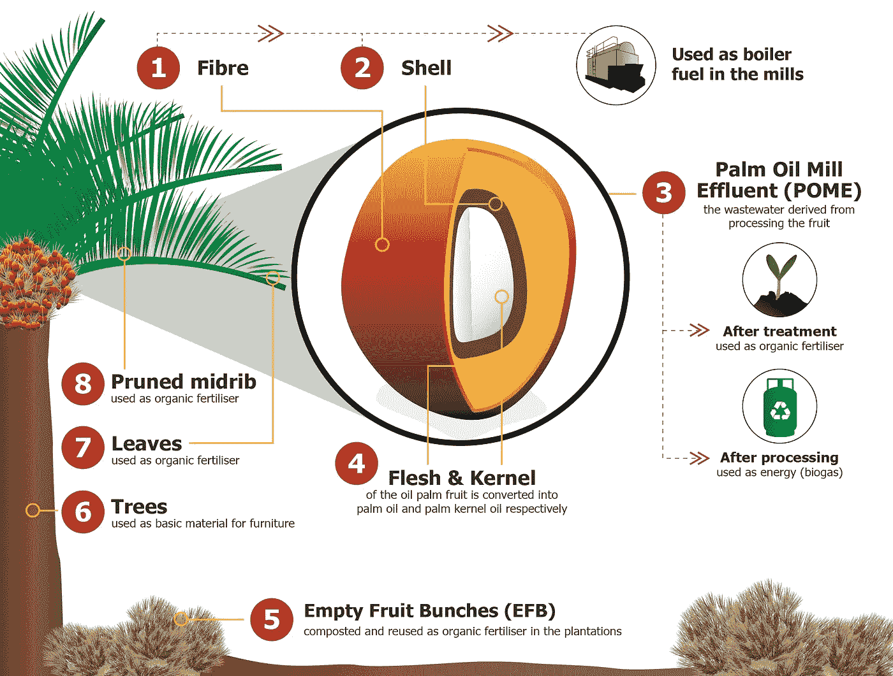

# 棕榈油的计算机视觉:成熟度预测机会

> 原文：<https://medium.com/analytics-vidhya/computer-vision-on-palm-oil-ripeness-prediction-opportunity-a1487ab83e28?source=collection_archive---------10----------------------->

融合被定义为从多个领域中提取信息的一种方法。在图像处理中，融合的目的是将相应的多传感器、多视图或多时相信息结合起来，然后对所有图像进行处理，以获得一幅质量较好的图像，从而使观察者做出更好的决策。

图像融合在许多应用领域有着巨大的重要性。计算机成像技术和传感器技术的快速发展将有助于提高夜视成像设备的质量和效率，这通常会为机器人视觉带来强大的信息处理，并揭示人眼不可见的信息。在融合的红外和可见光图像中对场景的准确、可靠和互补的描述使得这些技术被广泛应用于军事监视、农业自动化、工业应用、生物识别、医学成像、遥感、电子测试、空间探索、建筑物的热像 3D 模型的生成和古代文献的检查。

棕榈油为数百万人提供了至关重要的食物，并且具有良好的抗氧化性和长时间暴露在高温下的能力，因此使其成为油炸的理想选择。油棕出口商和生产商面临的一个主要问题是在加工前根据新鲜油棕果实的成熟度对其进行准确分级。工作人员仍然利用他们的经验来目测评估油棕果串的状况。油棕果实的这种人工分级是一个费时费力的过程，容易出现有偏见的评价和人为错误。因此，需要一种快速、可靠、准确的油棕鲜果串成熟度分级技术。

油棕的重要益处是众所周知的，许多不同的加工棕榈油产品用于食品工业、油脂化学以及生物柴油工业。使用现代技术来增加作物产量，其中之一是提高收获棕榈油的质量。利用图像处理和人工智能检测和分级新鲜棕榈果串正在发展。出现了与使用这种传感器技术相关的各种挑战，例如光、湿度、温度等。另一方面，对于新鲜棕榈果串的质量分类也需要使用多传感器。

棕榈油果实的零浪费:[https://www . smart-tbk . com/en/tak-ada-limbah-yang-dihasilkan-Dari-buah-Kela pa-sawit/](https://www.smart-tbk.com/en/tak-ada-limbah-yang-dihasilkan-dari-buah-kelapa-sawit/)

低游离脂肪酸和高出油率是油棕鲜果串(FFB)的品质参数。提高处理方式，防止油棕 FFB 在处理过程中受到损坏或擦伤，是保持油棕 FFB 良好品质的方法之一。此外，FFB 油棕的品质可以通过观察果实的成熟度来区分。年轻和过熟的果实会降低油棕 FFB 的质量，如果果实是年轻的，它将贡献无油或零油成分。茎长的束和非常年轻的束会降低提取率。成熟的水果串是一种红橙色的水果，有一些水果已经被分离。然而，最佳的成熟度将有助于高提取率。因此，成熟的果实应该由已经通过油棕果实分级培训课程的个人来分级。分级的目的是确保 FFB 油棕的收获和收集符合成熟的标准。油棕 FFB 人工分级的目的是提高棕榈油和果仁生产的质量和数量。油棕 FFB 分级也是确定购买价格。每当 FFB 油棕的质量很高时，根据溢价和溢价质量，小农户将获得一个值得的价格。这也将确保供应商和加工厂从他们的交易中获得公平交易。

在过去的十年中，表型技术被提出用于基于快速、无损技术的作物分析。这种方法利用图像处理技术和人工智能作为核心技术来观察、确定植物的特征，如叶子和果实的颜色等，并做出决策。一些研究建议使用图像处理来解决手掌问题。其中，有研究提出利用数学模型和人工智能技术对棕榈果进行分级和测定果实中的 OER。同样在过去的十年中，已经进行了与用于图像获取、水果检测和水果定位的机器视觉相关的各种研究。综上所述，在水果检测研究中使用的传感器可以分为四类，即:黑白摄像机、彩色摄像机、光谱摄像机和热感摄像机。利用图像处理技术进行果蔬品质检测将分为五个步骤，即:图像采集、预处理、图像分割、特征提取和分类。

油棕区及可能的计算机视觉应用

在图像采集过程中，传统的计算机视觉系统使用三原色:红、绿、蓝(RGB)，因此 RGB 彩色摄像机采集的图像以 RGB 波长为中心。通过使用这种方法，许多特征如纹理、形状、颜色、尺寸和缺陷可以被自动分级和检测，但是一些受光照条件影响的缺陷是一项具有挑战性的任务。然后，计算机视觉使用另一种传感器类型来获取数字图像，即:光谱相机和热相机。光谱相机结合了光谱技术和成像技术，为空间图像的每个像素提供光谱信息，这种技术可以获得更多的人眼不可见的波段光谱。利用这种技术可以得到更好的油棕果实成熟度预测率。挑战是由于风和不同过滤器成像之间阴影位置的变化导致的目标移动，因此建议同时捕捉多个波段图像。对于水果检测，高光谱成像的精度优于多光谱成像，因为它具有更多关于场景反射特性的信息。然而，高光谱成像的可行性受到耗时的数据获取和图像分析过程的限制。红外范围(IR)位于从“700 到 1000 纳米”的波长，这被称为热成像摄影。“热成像是基于这样一种原理，即所有物体都会发出一定量的热辐射，这是其温度的函数”。与叶子和植物冠层的其他部分相比，果实吸收更多的热量并辐射更多的热量，这允许用热成像区分这些植物材料。这种技术对依赖于环境和天气条件精确热测量提出了挑战。

油棕果串模型概念

利用图像处理作为机器视觉的一部分来对油棕进行分级 FFB 正好为使用深度学习进行水果检测提供了一个机会。这种方法可以更准确地检测水果对象。以西红柿为例，这种卷积神经网络方法也能够根据颜色识别水果的成熟度。深度学习通过向模型中添加更多的复杂性来扩展经典的机器学习，该模型使用各种函数来转换数据，这些函数允许通过几个抽象级别以分层的方式表示数据。DL 的一个强有力的优势是特征学习，即从原始数据中自动提取特征，其中来自较高层的特征由较低层特征的组合形成。利用这一优势，智能系统可以大规模并行处理数字图像。深度学习也带来了一个挑战，即提供更大的数据集进行训练，广泛的数据注释，并局限于超越数据集表达能力的边界进行概括。在一些用例中，深度学习使用异构数据和多模态数据，当前多模态深度学习模型以简单的线性方式连接每个模态的学习特征，这通常产生较差的结果。因此，探索有效的学习特征融合方法来改进多模态深度学习模型仍然具有挑战性。