# 计算机视觉第 6 部分:语义分割，像素级分类。

> 原文：<https://medium.com/analytics-vidhya/computer-vision-part-6-semantic-segmentation-classification-on-the-pixel-level-ee9f5d59c1c8?source=collection_archive---------4----------------------->

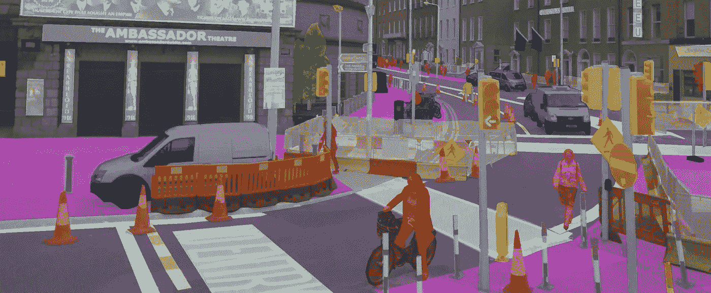

使用 Deeplab 进行语义分割

在前两章中，我们广泛讨论了如何构建神经网络架构，以及这些架构背后的基本原理，以对图像进行分类或检测图像中的对象，并在这些检测到的对象周围绘制边界框。通过查看每个像素并确定它属于哪个对象或类，可以在粒度上变得更细。如这里简要概述的和下面看到的，**语义分割**将把**每个像素分配到一个类别**，但是不会区分同一类别内的多个出现**，而**实例分割**进行这种区分，并且**识别类别**内的唯一出现。**

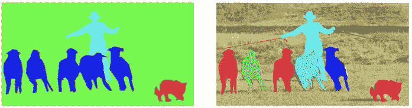

语义分割与实例分割。

# 1.概念

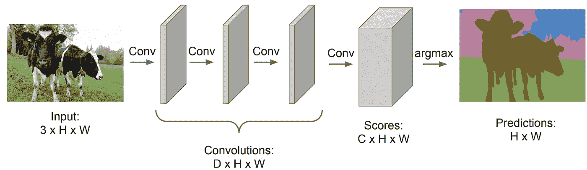

我们可以简单地堆叠一组**卷积**层，如我们所知，图像中的局部特征被捕获，创建一个层次集来提取更广泛的结构。通过连续的卷积层捕捉图像中日益复杂的特征，CNN 可以将图像编码为其内容的紧凑表示。该架构然后通过这种分层表示来学习输入图像与其相应分割输出之间的直接**映射** **。为了实现 conv 层的这种连接，必须在所有层上使用相同的填充，从而保持输入图像的分辨率，因此大大增加了计算成本。**

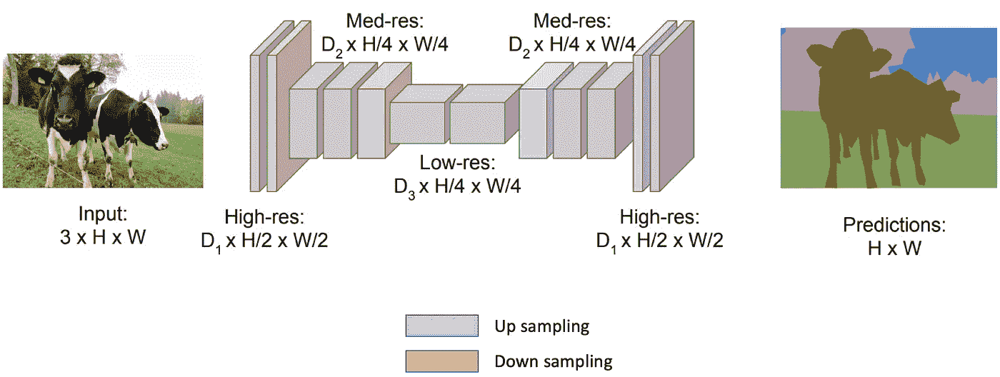

从之前的系列中，我们知道通过**连续的卷积层**，CNN 可以通过增加特征地图的数量来捕捉图像中日益复杂的特征**。此外，通过使用汇集和/或步长卷积来压缩空间分辨率导致了较低的计算负荷。这种**编码器配置**非常适合图像分类任务，因为它只关心图像的**内容，而不关心位置**。然而，对于**分割**任务，有必要使**具有像素方式预测**的全分辨率掩模。因此，具有如上所示的**编码器-解码器**结构的架构并不少见。**

**卷积解码器获取卷积编码器的低分辨率输出，并将对其进行上采样**。该解码器的最后一步是生成一个存储图像的逐像素标记的数组。上采样是如何发生的？直观地说，我们可以进行池化(取消池化)的反向操作，即获取单个像素值，并将其值分布到更高的分辨率上。如果架构能够学习如何最好地对像素进行上采样会怎么样？这就是转置卷积发挥作用的地方。

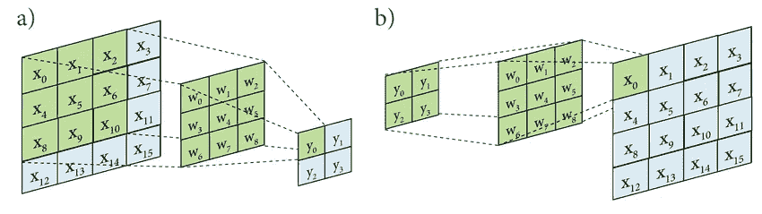

卷积与转置卷积

如上所示，卷积采用输入的点积，转置卷积采用输入并乘以所有权重。转置卷积可以容易地实现，因为卷积的向前和向后传递简单地颠倒。

# 2.结构

# 2.1.全卷积网络

在 [2015 中，龙等人](https://arxiv.org/pdf/1411.4038.pdf)介绍了第一种通过调整分类网络 (AlexNet、GoogleNet 和)并针对**分割**任务对其进行微调来训练**全卷积网络的方法。**

通过**将全连接层转换成跨越整个输入区域的卷积核**，使分类器架构适应全卷积版本。这种转换有一个重要的方面，因为这些转换的卷积中的每一个都将**输出标签的粗略热图**，这使得向后和向前传递的训练都非常简单。

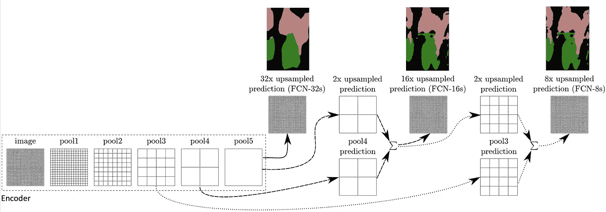

FCN 建筑概述。省略卷积层和转换的全连接层。

上面我们可以观察到 FCN 的建筑。我们看到**编码器会将**图像压缩成分辨率更低的图像。代表汇集图层的格网也显示了相对的空间粗糙度。在第 5 个池层之后，分辨率降低了 32 倍，这导致了上采样操作之后的粗略分割。本文讨论了“是什么”和“是什么”之间的平衡问题。为了理解图像中存在什么，全局(粗略)信息是必要的，而为了精确定位图像中存在什么，局部(精细)信息是必要的。因此，**跳过连接**(与 resnets 相似)和**慢速上采样**的组合。

# 2.2.优信网

在 FCN 的基础上， [O. Ronneberger et al. (2015)](https://arxiv.org/pdf/1505.04597.pdf) 提出了一个网络，*“由一个捕获上下文的收缩路径和一个* ***对称*** *扩展路径组成，能够实现精确定位。”*和训练策略“*，它依赖于对数据扩充的大量使用，以便更有效地使用可用的带注释的样本*

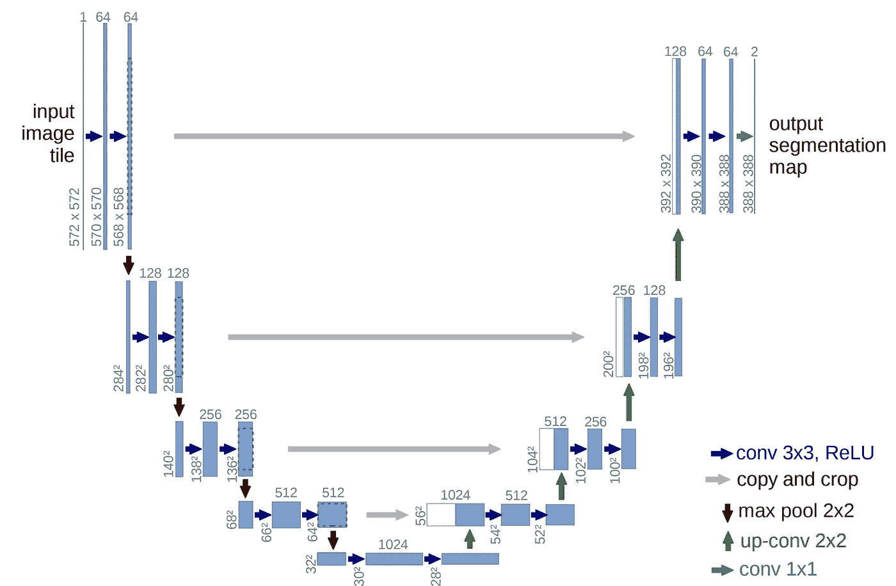

U-net 架构，其中蓝框对应于多通道特性图，通道数量在这些框的顶部标出。方框的左下边缘表示 x-y 尺寸，白色方框表示复制的特征地图。

从上图可以看出，第一部分是卷积、ReLU 和 max 池操作的集合。步长为 2 的 2x2 最大池操作将导致下采样步骤，其中特征通道的数量加倍，大小减半。第二部分包括对特征图进行上采样、连接相应的裁剪后的特征图的序列，这是必要的，因为在每次卷积、卷积和应用 ReLU 之后会丢失边界像素。

与 FCN 类似，**来自压缩路径的高分辨率特征与上采样输出**相结合，然后被馈送到一系列卷积层。与 FCN 的主要区别在于，在上采样部分，存在大量特征通道，这允许网络**将上下文信息传播到更高分辨率的层**。此外，网络不包含完全连接的层，而仅使用卷积输出。

# 2.3.FC-DenseNet

FC DenseNet 或 100 层提拉米苏是一种基于 DenseNet 架构的图像分类分割技术。DenseNet 基于从早期层到后来层的快捷连接的范例。DenseNet 的特别之处在于**所有层都相互连接**。

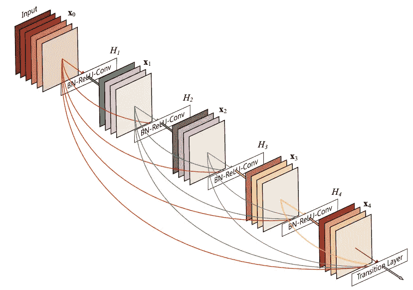

增长率为 k = 4 的 5 层密集块，其中 k 是指后续层的通道数。每一层都将所有前面的特征图作为输入。

每个层都将其自己的特征映射传递给所有后续层。ResNet 使用元素相加来组合特性，DenseNets 使用**串联**。因此，每一层都从所有前面的层接收一组知识。也许与直觉相反，这比传统方法需要更少的参数，因为不需要重新学习冗余的特征图。

下面，我们将看到该架构的概述。每一层产生一个 k 输出特征图，它与前面提到的增长率相一致。然后，这被馈送到下一层的密集块的瓶颈中，以减少输入特征映射的数量，从而提高其各自的复合块的计算效率。在传递到下一层之前，要素地图通过过渡层进行压缩。

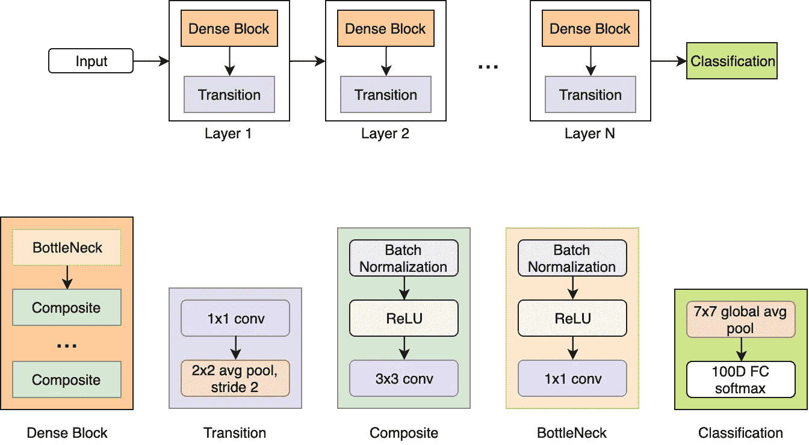

下面，我们可以观察 DenseNet 如何用于创建 FC-DenseNet 进行图像分割。我们可以在以前的 FCN 和 U-Net 中发现类似的编码器-解码器结构。

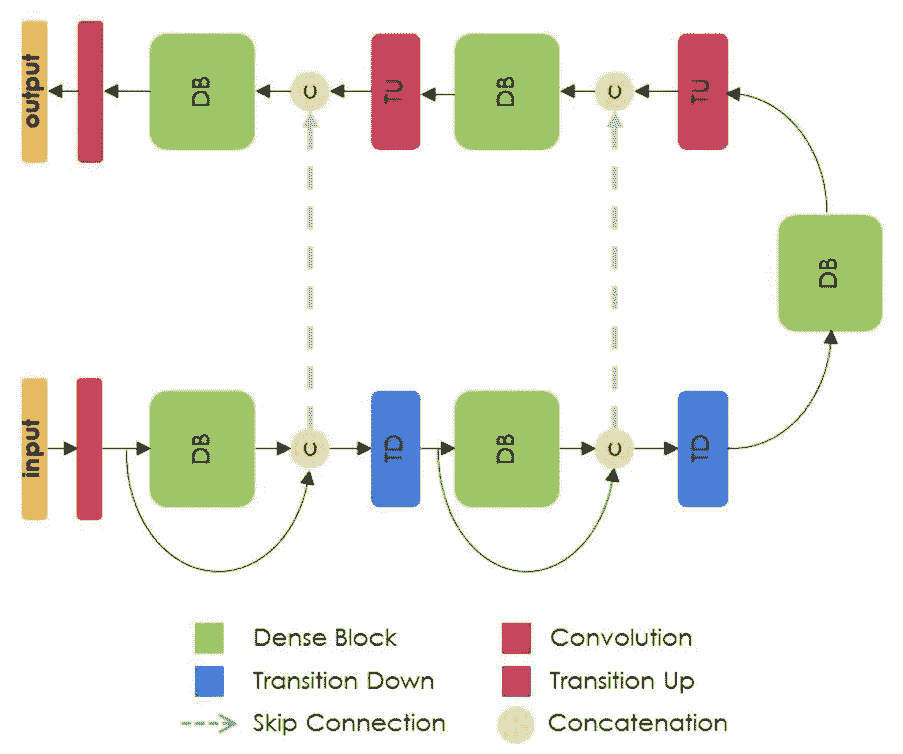

FC-DenseNet 的体系结构

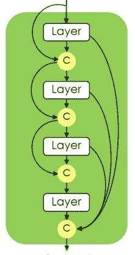

4 层密集块示意图

对于分割，密集块仅包含一系列复合块，其中应用了 0.2 的丢失。必须注意不要出现特征地图的**爆炸。**这样，每一层仅连接先前的连接。最后一层执行所有层的输出的连接，因此包含 4∫k 个特征图。在密集块之后发生的过渡上/下卷积仅应用于由最后一个密集块获得的特征图，这是因为特征数量的线性增长对存储器的要求太高。

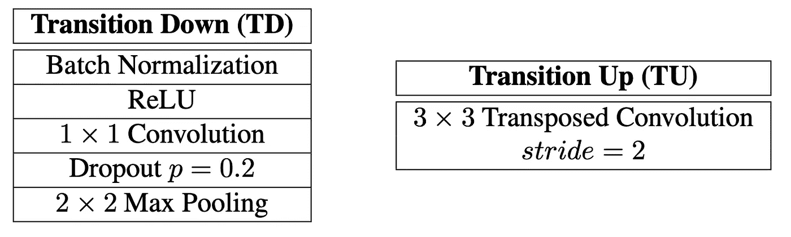

构建向下/向上转换卷积的模块

由于共用层，来自早期密集块的一些**信息丢失。因此，跳过连接有助于我们重用特征地图，其中上采样路径可以从下采样路径恢复一些空间详细信息。**

# 2.4.DeepLab

没有一篇声誉好的帖子敢不提及谷歌对这一主题的挑战就不完整。因此，按照谷歌的工作方式，我们将看看 2015 年首次亮相的主要概念的一系列有趣改进。

## **2.4.1。DeepLab v1**

DeepLab v1 [介绍](https://arxiv.org/pdf/1606.00915.pdf) 2 主要思想:**阿特鲁卷积和全连通条件随机场(FC CRF)** 。下面，我们找到了架构:

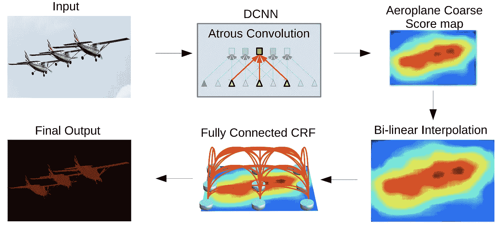

深度卷积神经网络(DCNN)中枢(VGG 或 ResNet)与 atrous 卷积一起用于对信号进行下采样。然后，将特征地图放大到原始尺寸。最后，使用模糊条件随机场来改进分割结果。

阿特鲁卷积来自法语“à trous ”,意思是洞。阿特鲁卷积也被称为**扩张卷积**。下面，我们看到扩张卷积是一个标准卷积，其中您**在两个维度上均匀地跳过一些像素**。更准确地说，下面我们观察到速率为 2 的稀释卷积，它从输入到卷积核每 2 个像素采样一次。

我们看到，与标准等效物相比，扩张卷积的**感受野更大。你可能想知道为什么这是相关的？**

所有先前讨论的架构都使用依赖于空间池的多尺度 CNN 来创建编码器-解码器类型的结构。这样做是为了结合和平衡:

*   像素级精度
*   图像的全局知识

DeepLab 使用扩展层来解决这个平衡问题，而不是典型的池化。通过**控制复杂卷积中的视场**，我们可以在精确定位(小视场)和**上下文同化**(大视场)之间找到最佳的**折衷，而不会过多增加参数的数量。这可以从下面看出:**

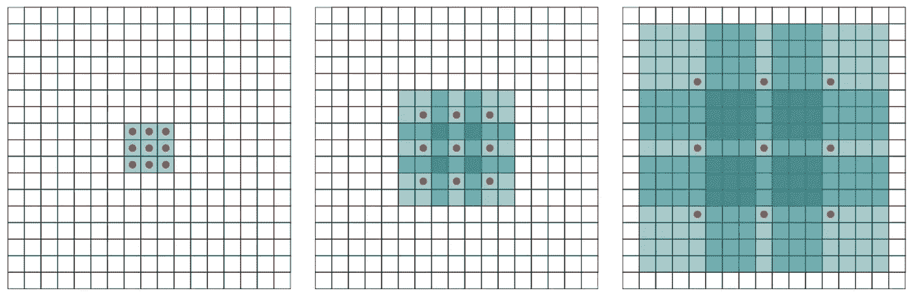

多层扩张的回旋，其中扩张因子在每层之后呈指数增加，导致也呈指数增加的有效感受野。感受野以比参数数量(线性)更快的速度(指数)增长。

一旦创建和升级了特征地图，就应用 FC CRF。CRF 是一种**统计学习方法**，它将上下文考虑在内。这种上下文可以理解为预测之间的依赖关系。在自然语言处理中，CRF 是预测的顺序相关性，而在计算机视觉中，邻近像素被定义为相关性。顾名思义，FC CRF 使用所有像素来创建一个远程模型，该模型可用于**平滑噪声分割图。**这里的主要挑战是由于模型的全连接性质而导致的计算爆炸。2012 年，一篇[论文](https://arxiv.org/pdf/1210.5644.pdf)介绍了 FC CRF 模型的高效推理算法。该模型最终用于 DeepLab v1 和 DeepLab v2，导致这两种架构都不能用作端到端的学习框架。

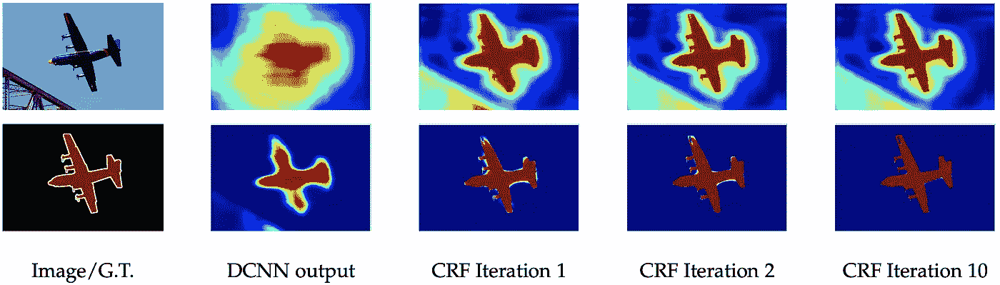

第一行是得分/特征图，第二行代表 softmax 函数的结果。

## 2.4.2. **DeepLab v2**

DeepLab v1 使用 VGGNet 作为主干，DeepLab v2 使用 **ResNet** 并引入**阿特鲁空间金字塔池(ASPP)** 。这是两种架构之间的主要区别。因此，让我们检查 ASPP 离开深实验室 v1 作为基地。

顾名思义，这仅仅是 SPP 的一个**版本。在 [2014](https://arxiv.org/abs/1406.4729) 中，引入了空间金字塔池，解决了**关于 CNN** 中需要固定大小的输入图像的担忧，因为完全连接的层在设计上具有固定大小的输入。因此，正是在从卷积层到 FCN 的过渡处施加了这种大小限制。SPP 是卷积层和 FCN 之间的新层，用于将输入大小映射到固定大小的输出。下面，可以看到 SPP 的图解。通过获取最后一层的特征图，并将其分成与图像尺寸成比例的多个**空间箱**。这意味着不管图像大小，箱的数量是固定的。如我们所见，在不同的粒度级别上创建箱，最终层由整个图像组成。最后，使用最大池合并每个过滤器的每个空间箱。因为仓的数量是已知的，所以我们可以连接不同的输出，以给出 F*B 的固定长度表示，其中 F 是滤波器数量，B 是仓的数量，这是随后被馈送到 FCN 的维度向量。**

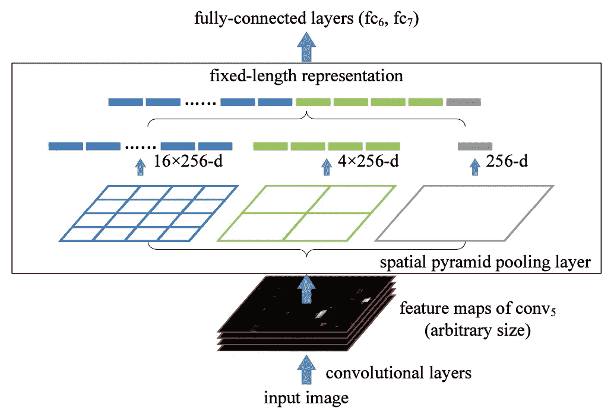

阿特鲁 SPP 类似于 SPP，但是它不使用仓，而是使用具有不同采样率的多个并行滤波器。然后融合提取的特征以生成最终结果。

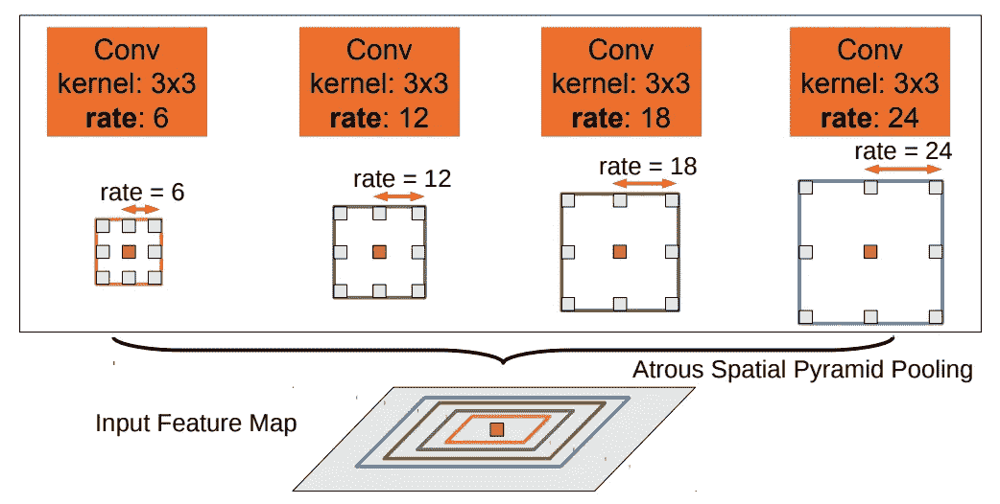

ASPP 提出了这样一个事实，即同一类的对象在一幅图像中可以有不同的比例，从而提高了精确度。

## 2.4.3. **DeepLab v3**

在[重新思考用于语义图像分割的阿特鲁卷积](https://arxiv.org/abs/1706.05587)中，来自 DeepLab v2 的主要概念经过了修改和改进，产生了一种新的架构，其性能明显优于以前的架构。我们将讨论的主要改进包括:

*   级联或并行阿特鲁卷积，采用多种速率捕捉多尺度背景
*   ASPP 的改进

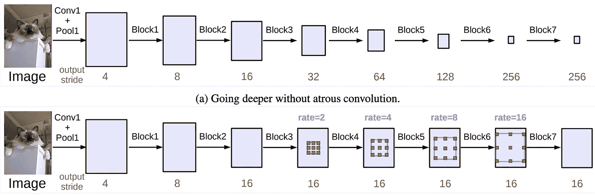

当输出步距= 16 时，在模块 3 之后应用速率> 1 的 atrous 卷积时，级联模块(无 atrous 卷积和有 atrous 卷积)

首先，我们可以从上图中看出，块 4 被复制了几次，其中在级联上放置了大量卷积。与没有 atrous 卷积的架构相比，我们可以保持恒定的步幅，同时保持更大的视野，同时具有最少数量的参数和更大的特征图，从而易于在更深的块中捕获长距离信息。

第二，通过引入 **4 个并行的 atrous 卷积**重新访问 ASPP，在特征图的顶部应用不同的 atrous 率以捕获多尺度信息。但是发现****随着采样率变大，有效滤波器权值的个数变小****。为了解决这个问题，在最后一个要素地图上应用了全局平均池。然后将结果送入 1x1 卷积，批量归一化，最后双线性上采样至所需尺寸。**

**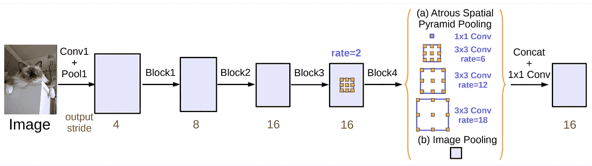**

**具有 atrous 卷积(ASPP)的并行模块，增加了图像级功能**

## **2.4.4. **DeepLab v3+****

**下面，我们可以看到编码器部分已经是 DeepLab v3 提供的了。通过**扩展带有解码器模块的 DeepLabv3，v3+** 诞生了。**

**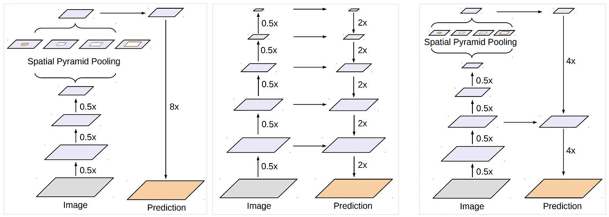**

**SPP(左)和编码器-解码器结构(中)的组合产生了 DeepLab v3+(右)，其中编码器部分提供了丰富的语义信息，而解码器提供了更详细的对象边界信息。**

**[DeepLab v3+](https://arxiv.org/pdf/1802.02611.pdf) 也基于深度方向可分离卷积修改 atrous 卷积。正常卷积可以分解成深度卷积和点态卷积。通过使用深度方向卷积，可以大大减少所需的计算量。通过应用相同的基本原理来分解深度方向上的卷积，表明它也降低了计算复杂度。**

**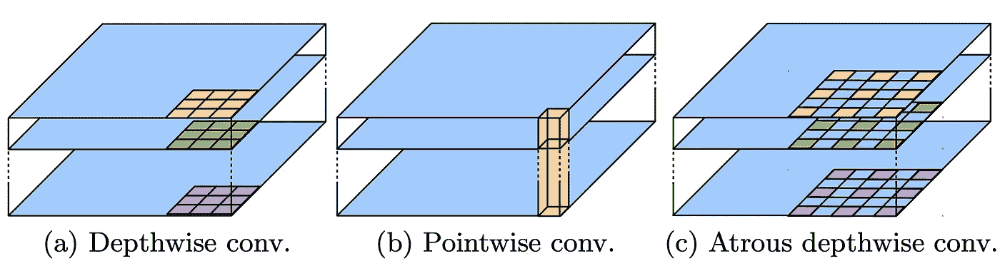**

**下面，我们可以观察一下 DeepLab v3+的架构。从这个图中可以清楚地看到，DeepLab v3 确实代表了编码器。**

**来自编码器的特征首先通过因子 4 进行双线性上采样，然后与来自主干网络的相应低级特征连接。这些低级特征首先通过 1x1 卷积来减少通道数量，通道数量会扭曲更丰富的编码器特征的重要性。之后，在再次以因子 4 进行上采样之前，出现另一组卷积。这些最后的 3×3 卷积有助于在放大图像之前细化特征。**

**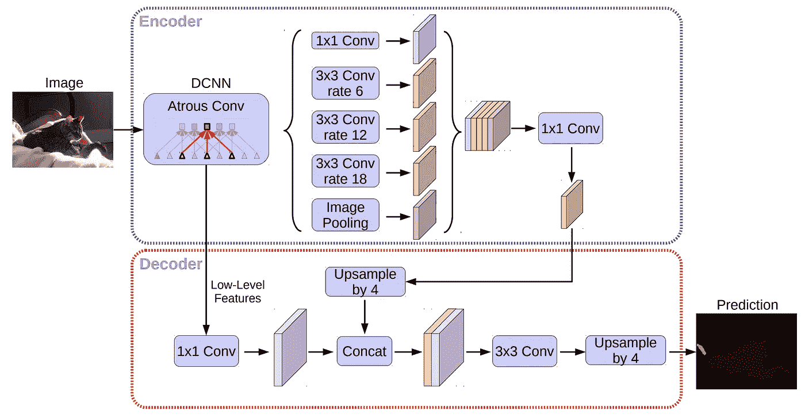**

**作为主干，对 ResNet-101 和 Xception 进行了研究，结果表明 SOTA 是在 PASCAL VOC 2012 数据集上使用 DeepLab v3+ Xception 架构实现的。**

# **2.5.快速 FCN**

**[2019](http://wuhuikai.me/FastFCNProject/fast_fcn.pdf)用**联合金字塔上采样(JPU)** 代替了扩张卷积的原理。作者讨论了旨在用 JPU 解决这个问题的膨胀卷积所引入的繁重的计算复杂度和内存。**

**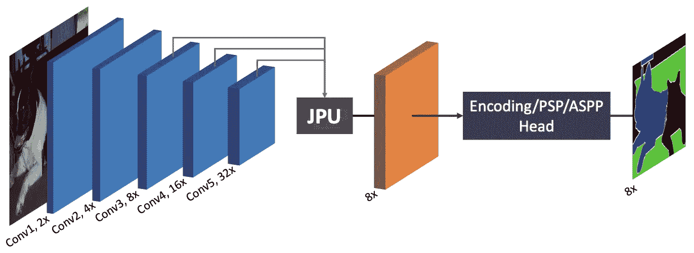**

**使用与扩张 FCN 相同的主干，JPU 模块将最后 3 个特征图作为输入图，并生成高分辨率特征图。**

**Fast FCN 主干和 DilatedFCN 的区别在于最后两个卷积阶段。通常，输入特征图首先由常规卷积层处理，随后是一系列扩展卷积。快速 FCN 在概念上用步进卷积处理输入特征图，然后使用几个常规卷积来生成输出。与 DilatedFCN 相比，这减轻了计算负担。从概念上讲，因为这是这个想法的主要要点，但发现在梯度下降过程中需要较长的收敛时间。因此，JPU 被创建来近似这个优化过程。**

**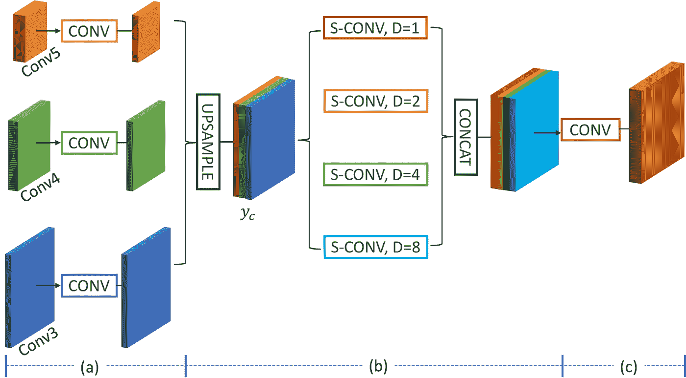**

**JPU 街区**

**正如我们在上面看到的，每个特征映射都通过你的常规卷积块。然后，特征图被上采样和连接，然后通过具有不同膨胀率的四个卷积。最后，卷积的结果被再次连接并通过最终的卷积层。ASPP 只利用最后一个特征图中的信息， **JPU 从多级特征图中提取多尺度上下文信息**，这导致了更好的性能。**

# **2.6.门控 SCNN**

**2019 年夏，[用于语义切分的门控形状 CNNs】推出。GSCNN 引入了一个新的 **CNN 架构，有两个流**:之前架构中讨论过的经典流和一个形状流。基本原理是，在前述架构设计中存在固有的低效，因为颜色、形状和纹理信息都在一个深度 CNN 内一起处理，而它们可能包含非常不同数量和类型的信息。](https://arxiv.org/pdf/1907.05740.pdf)**

**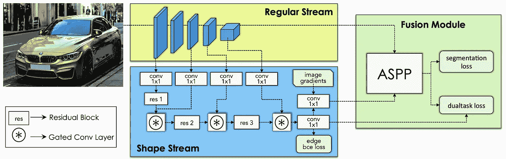**

**GSCNN 架构。常规流可以是任何主干架构。形状流侧重于通过一组残差块和选通卷积层进行形状处理。最后，这两个流通过阿特鲁空间金字塔池进行融合，以获得精确的语义分割输出。**

**虽然语义分割的任务和语义边界密切相关，但是形状流不采用来自常规流的特征。相反，**门控卷积层** (GCL)通过过滤掉其余信息来帮助 shape 流只处理相关信息。常规流形成对场景的高级理解，使用 GCL，我们可以确保形状流只关注相关信息，然后传递到形状流中的下一层进行进一步处理。直观上，形状流可以被视为生成注意力地图的一系列过程，其中具有重要的**边界信息**的区域在权重方面越来越重。最后，在形状流中，由于可以从规则流的语义分割掩码中获得边缘的基本事实，因此可以在输出边界上使用受监督的二进制交叉熵损失来监督形状流。**

**最后一步是使用 ASPP 融合规则流和形状流，以确保多尺度上下文信息得以保留。这种改进产生了一种架构，它可以围绕对象边界产生更清晰的预测，并显著提高更薄和更小对象的性能。**

# **结论**

**我们已经讨论了语义分割的不同关键架构。对于每一个，我们可以观察一个编码器-解码器结构，其目标是提取和组合细粒度的位置信息和粗粒度的内容信息。分割在自动驾驶、医疗保健、机器人导航、定位和场景理解等应用中至关重要。**

**在下一章中，我们将讨论实例分割，它为我们提供了一种获取图像中所有类别的单个**实例**的方法。**