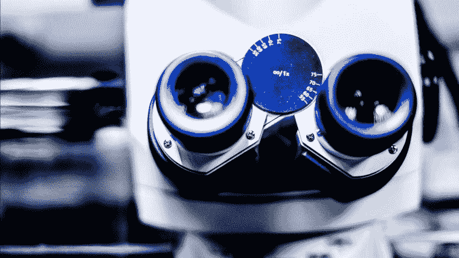
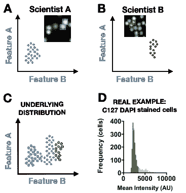
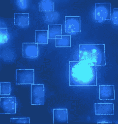

# 计算机视觉驱动的显微镜——主观性被取代。

> 原文：<https://medium.com/analytics-vidhya/computer-vision-powered-microscopy-subjectivity-dethroned-11eb21cade40?source=collection_archive---------11----------------------->

我们怎样才能在让人类了解情况的同时，消除科学中的主观性？

## 一个非常人性化的问题

当成像科学家在显微镜下观察时，他们经常面临一个令人困惑的选择。需要从数百、数千或数百万个细胞中选择特定的细胞，一个不可避免的主观过程随之而来。由于时间压力和资源可用性，科学家可能只有时间为每种情况选择少量细胞。问题是，在众多的细胞中，哪一个是最适合成像的，以便表示手边的问题？

诺贝尔奖获得者丹尼尔·卡内曼在《快速思考和慢速思考》一书中讨论了科学家的主观性:“与科学哲学家的规则相反，他们建议通过试图反驳假设来检验假设，人们(和科学家，往往)寻求可能与他们目前持有的信念相一致的数据”。因此，成像科学家做出的选择很有可能会在某种程度上不知不觉地受到他们的假设或其主管意愿的影响。每个科学家的目标都应该是发展透明的方法，让他们的同时代人可以批评。

## 无偏显微术

为了解决显微镜领域的这一偏见问题，我正在开发一种系统，该系统将快速智能地调查载玻片上的细胞，然后提供关于它们总体分布的信息和见解。这涉及使用机器学习和计算机视觉的细胞识别，以及通过简单的测量(如大小强度)或通过更复杂的高级细胞特征进行表征。这个想法是，随着对现有细胞的全面了解，可以公平地选择单个细胞进行详细研究。图 1 显示了偏见如何进入实验，以及科学家如何通过自动化和粗略表征来进行更稳健的实验。

*图 1:有偏抽样风险的可视化。a 和 B)两位科学家将基于他们期望看到的先入之见选择显微镜下的细胞，他们的选择可能不同。c)使用自动显微镜，我们可以测量和可视化细胞的整个分布(所有点)并将观察结果置于上下文中(红色和蓝色点)。d)在真实数据中(例如用 BrdU 处理并用 DAPI 染色的 C127 细胞)，存在双峰分布。一些细胞抵制了 BrdU 的吸收，并且比那些吸收了 BrdU 的细胞更亮(绿色)。在本例中，只有占用了 BrdU 的小区才是后续测量和比较的目标。对所有存在的细胞的粗略强度测量可以用于向科学家建议总体分布，以便他们可以对他们实验的剩余部分做出明智的决定。*

开发这种技术的挑战是使用与现代研究实践中使用的各种特定和定制显微镜兼容的硬件来实现大量细胞的快速成像。此外，该系统应该适用于所有背景的科学家，而不仅限于那些了解高端分析或机器人技术的科学家。

在我最近的论文 中，我概述了一个可以自动定位和成像细胞的显微镜系统，然后根据它们的属性返回一个分布:AMCA，自动显微镜控制算法。该技术使用常规显微镜设备(一台相机和自动载物台)和特殊成分:机器学习、计算机视觉和廉价的商业通勤电力。

使这种技术变得便宜且容易获得的关键技术是 [Nvidia Jetson](https://developer.nvidia.com/buy-jetson) 和 [LattePanda](https://www.lattepanda.com/) 开发板。有了这样的技术，半自动使用每台显微镜在经济上变得可行，节省了时间，优化了资源。Jetson 为系统提供极快的 GPU 处理，LattePanda 提供传统支持，与旧的硬件驱动程序接口，以支持一系列显微镜硬件。

基于细胞的简单二维注释(任何人都可以进行)，该系统可以被训练以识别和成像三维细胞。注释很简单，只需在细胞周围画出边界框，但它提供了一个系统，可以训练该系统独立识别和定位载玻片上的细胞。虽然对整个载玻片成像可能需要几个小时，但一旦经过训练和验证，该系统可以在无人监督的情况下在晚上或午餐休息时对整个标本的细胞进行成像。一旦完成，科学家可能希望检查算法在特定区域的性能，或者被带到特定区域，并决定是否要更详细地成像。这一过程通过一个新颖的增强现实系统来支持，该系统允许用户在向下看显微镜的双筒望远镜时直接预览分析结果(图 2)。这是有史以来开发的第一个开源荧光显微镜增强现实系统。通过这项技术，我们将科学家保持在实验循环中，这对建立信任和解决问题至关重要。

*图 2:当焦点改变并且增强现实系统更新细胞识别算法的输出时，向下查看显微镜目镜。*

AMCA 等人的未来

我的目标是扩展成像系统的能力，以包括对视觉线索做出反应的动态成像。例如，一个具有不寻常外观的细胞，可能即将分裂或经历一些其他过程，对其进行更详细的研究可能是有趣的。我希望我的系统能够发现这些动态过程，为其功能增加一个重要的维度。我希望这项研究将在 WIMM 医学研究中心产生第一次有意义的影响，我很高兴将这个系统应用到你们的生物学问题中。我邀请您联系合作，并希望有助于使您的成像更加有效和客观。

*这篇博客文章改编自 Dominic Waithe 撰写的* [*原文*](https://www.imm.ox.ac.uk/about/blog/machine-learning-meets-microscopy-subjectivity-dethroned) *文章，由 Alexandra Preston(德拉史密斯集团)编辑。*