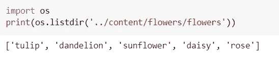
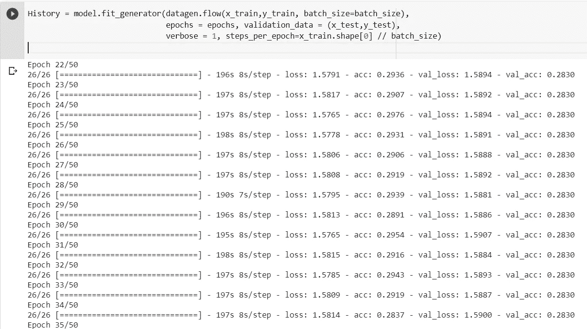

# 计算机视觉-通过从图像中提取特征和转移学习来预测图像样本。

> 原文：<https://medium.com/analytics-vidhya/computer-vision-predicting-image-samples-by-extracting-features-from-images-and-transfer-learning-127da30e5fa6?source=collection_archive---------15----------------------->

## 通过使用视觉几何组(一种深度卷积网络)进行基于机器的图像预测。

通过应用计算机视觉技术和自动化类似于人类视觉如何识别和预测模式的任务，可以解决空间、医学和虚拟现实中的各种未解之谜。

工艺流程图

预测图像的步骤

**数据集**

数据集是由 Alexander Mamaev 提供的花图像。

该数据由 4242 幅花的图像组成。图像的像素分辨率为 320x240 像素。数据是从 flickr、google 和 yandex 的图片中搜集来的。

数据基于五类图像:雏菊、郁金香、玫瑰、向日葵和蒲公英。

读取数据集

定义每类图像的路径并从 VGG16 中获取权重。

**VGG →视觉几何组**

每个输入图像大小保持一致。VGG 有 3 个相连的层，前 2 层各有 4096 个频道，第 3 层有 1000 个频道→每类 1 个。

隐藏层使用优化的 ReLu，与 AlexNet 等其他模型相比，VGG 的训练时间要少得多。较小尺寸的卷积层和较大权重的层导致性能提高。

培训和测试

可视化数据

标签编码

构建 CNN

预测结果

参考资料:

1.  用于大规模图像识别的极深度卷积网络:【https://arxiv.org/abs/1409.1556 
2.  用于 keras 的 VGG16 预训练模型:kaggle 数据集下载-d keras/vgg16