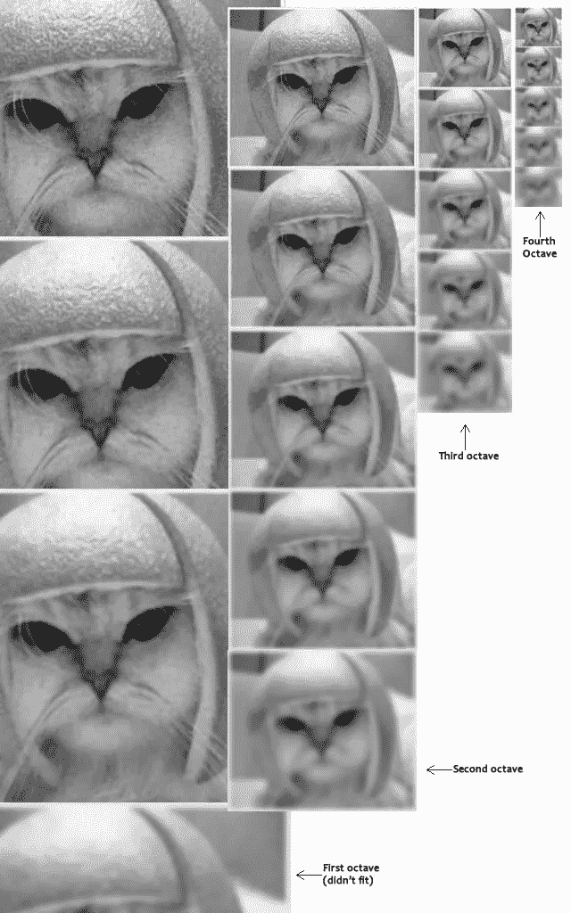
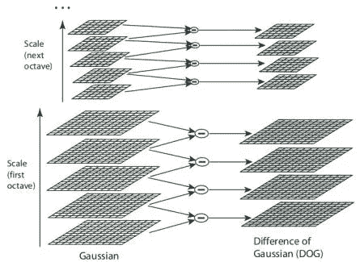

# 计算机视觉——尺度不变特征变换

> 原文：<https://medium.com/analytics-vidhya/computer-vision-scale-invariant-feature-transform-sift-37657fb57475?source=collection_archive---------16----------------------->

在之前的故事中，我们已经确定了如何识别图像中的特征。但是有一个问题:规模。由于尺度不同，被认为曾经存在的特征可能不再存在。一个简单的类比:用 6.7 英寸的屏幕看你的手机，你几乎可以看到屏幕上的一切。但是一旦公司缩小屏幕尺寸，你就不能看到所有的东西，你要么捏着屏幕放大文本/图像，要么靠得更近。从更广的层面来看，如果你从地球之外看你的手机，你的手机基本上已经不存在了。这就是从不同尺度的图像中检测特征的问题。

现在，SIFT 开始帮助解决这个问题。让我们来看看这个算法。

首先，我们将为图像定义一个尺度空间。就像我们一起探索在不同的尺度下看手机会产生不同的结果一样，我们需要将图像转换成不同的尺度才能继续。图像的尺度空间是由不同尺度的高斯核与输入图像的卷积产生的函数。音阶空间被分成八度音阶。简单地说，对于不同的八度音阶，我们生成不同音阶的图像的模糊版本。见下文:

一旦我们有了这些模糊的图像，我们使用高斯差分法(DoG)生成另一组图像。这些新的图像集合是通过获得具有两个不同 sigma 值的图像的高斯模糊的差异而获得的，设其为 sigma 和 k*sigma。记住:在高斯模糊中，西格玛值越高，图像越模糊。因此，我们通过在被 2 个不同的西格玛值高斯模糊的图像之间执行减法来获得狗。并且对于高斯金字塔中的不同八度音阶重复该过程。

狗在寻找关键点或特征点方面是有用的。通过计算高斯近似的拉普拉斯算子，我们可以找到关键点。基本上，我们将图像中的一个像素与其 8 个邻居进行比较，以及前一个尺度和下一个尺度中的 9 个像素进行比较。如果像素是局部极值，则它是潜在的关键点。在这里标记工作的“潜力”,因为我们可能会丢弃这里的许多关键点。这是因为一些关键点不够强大，不能被视为特征。因此，根据该算法，阈值 0.03 被设置为确定局部极值的强度是否可以被认为是关键点。最后，在执行高斯近似的拉普拉斯算子之后，我们将最终得到在某一尺度中最佳表示的关键点。

既然特征是尺度不变的，我们需要确保它是方向不变的。为此，我们绘制了一个方向直方图。我们要做的是，在之前找到的关键点周围取一个邻域，计算该区域的梯度大小和方向。然后使用 36 个箱绘制直方图(这将覆盖整个 360 度)。一旦对关键点区域周围的所有像素进行了这种处理，我们将得到一个直方图，其峰值出现在几个点上，这基本上意味着对于一个区域，大多数像素都朝向那个方向。

在这一点上，我们的关键点将有一个规模和方向，我们接下来需要做的只是计算每个关键点的描述符。取关键点周围的 16×16 的邻域，并将其细分成大小为 4×4 的子块。对于每个子块，创建方向直方图，并将其表示为特征向量以形成关键点描述符。然而，这些特征向量中的每一个都使用梯度方向，如果我们旋转图像，一切都会改变。为了使这种旋转不变，我们从每个方向减去关键点的旋转，这使得每个梯度方向相对于关键点的方向。

最后，获取关键点描述符引导我们完成最后一项任务，即匹配两幅或多幅图像中的关键点。

瞧啊。那就是 SIFT 算法！