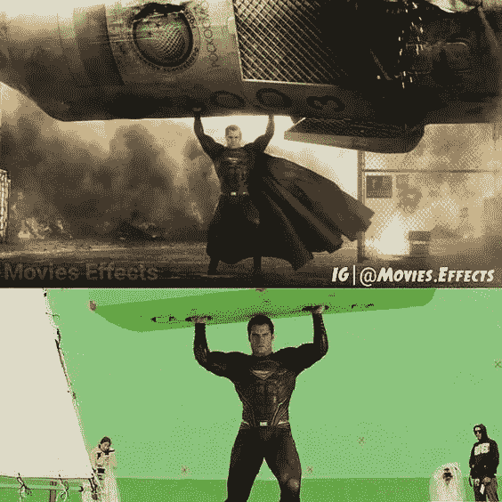
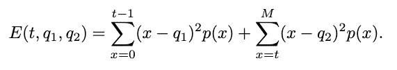
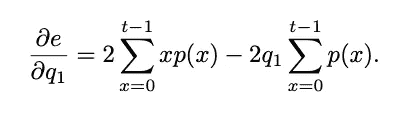
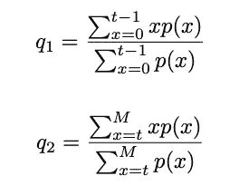
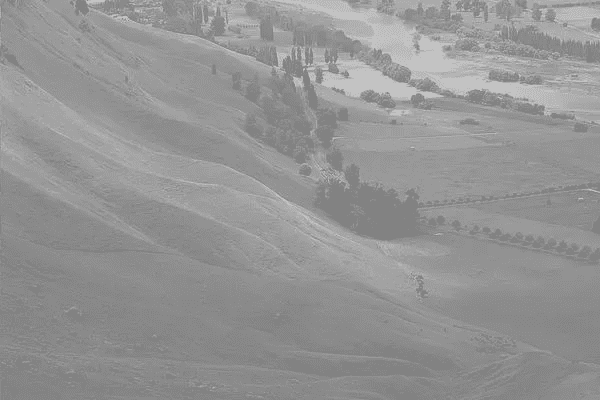
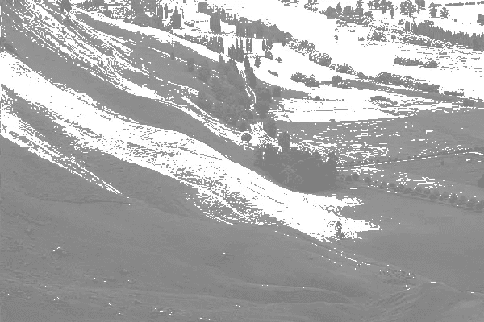
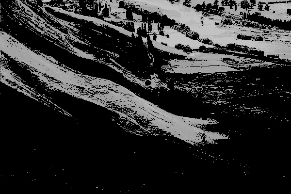

# 计算机视觉:分割

> 原文：<https://medium.com/analytics-vidhya/computer-vision-segmentation-42ffff0d7d40?source=collection_archive---------11----------------------->

今天是另一个图像处理算法:**阈值分割。**你们中的许多人都是漫威或 DC 的超级英雄世界的粉丝。我们来看一个超人的随机场景:



网址:【https://www.pinterest.com/pin/791507703239539817/ 

没错。你看到的是 CGI 技术。在这篇文章中，假设你和我想把超人从场景中分割出来，因为我们喜欢这样。在本文中，让我们通过量化 实现 [**阈值分割超人。**](https://en.wikipedia.org/wiki/Thresholding_(image_processing))

# 阈值分割

**分割**是一种基于多种方法将物体从背景中移除的技术[1]:

*   基于强度的分割:阈值
*   基于边缘的分割
*   基于区域的分割

在本文中，我们通过使用**量化对**进行阈值处理来关注**基于亮度的分割。**

# **量化**

是一种基于数学的算法，通过将图像直方图分成总误差方差最小的两半来寻找阈值*【2】。*

**设 p 为图片直方图，使 p(x)为值为 x 的像素个数，对于 x = 0，…，M，我们在寻找一个阈值 t 和两个值 q1，q2，使得范围 0 ≤ x < t 内的所有像素用 q1 代替，范围 t ≤ x ≤ M 内的所有像素用 q2 代替。将以下表达式定义为总误差:**

**

*计算总误差方差的公式被阈值分割成两半 **t (1)***

*现在，工作是找到误差方差最小的 q1 和 q2。为了求最小误差 E，让我们用微积分 I 对上述公式求导，求最小误差 E 的临界值。*

**

*总误差方差的导数，以找到 E 的临界值*

*现在，将上面的公式设置为 0，求解 q1 和 q2(记住如何在极值点找到临界值)。*

**

*求 q1 和 q2 误差 E 最小的公式(2)*

> *如果不记得微积分或线性代数，最好复习一下，因为微积分和线性代数在许多领域都非常重要，尤其是计算机视觉和机器学习(紧随其后的是情侣 CV 系列)。*

*这就是所有的数学和理论。接下来是我最喜欢的部分，编码和运行*

# *伪代码*

*对于对应于图像直方图中颜色的每个给定阈值 ***t*** ，*

*   *基于公式(2)计算 q1 和 q2，它们是两个段的峰值*
*   *基于公式(1)计算由每个给定阈值 *t* 分离的两个片段的总方差*
*   *找到两个分段的总最小方差，以便找到最佳阈值 ***t****

*基于最优阈值分割图像 ***t****

# *让我们编码*

*首先，我计算图像直方图，并用它来寻找最佳阈值。得到最佳阈值后，我将 2 个片段保存到 2 个图像中。*

*为了找到 q1 和 q2，我声明了 4 个变量来保存 q1 和 q2 的分子和分母，如公式(2)所示。这样做是为了减少 for 循环期间每个阈值的计算工作。*

*对于每个计算的总误差方差，寻找总最小方差以找到最佳阈值。*

*现在让我们结合一切！*

```
*#read images
img = cv2.imread(os.path.join(test_folder_path, img_name), 0)#segment images front and back
front_img, back_img = MoCV.segmentation.optimal_thresholding(img)#directory paths to save front and backgrounds
front_img_path = os.path.join(test_folder_path, "front_segmented_img.png")back_img_path = os.path.join(test_folder_path, "back_segmented_img.png")#write front and back images
cv2.imwrite(front_img_path, front_img)cv2.imwrite(back_img_path, back_img)*
```

*转到保存分割图像的目录进行查看。以下是分段示例。前面在左边；背景在右边。*

# *结果*

**

***原始图像***

****

***前后接地***

*好了，这就是如何分割前景和背景的强度为基础的阈值分割。如你所见，按颜色分段不是最好的选择；基于边缘的更好算法。但是，我的目标仍然是向你们展示容易理解的算法。*

*所有源代码均可在此处获得:*

*[](https://github.com/quocdat32461997/MoCV) [## quocdat32461997/MoCV

### 计算机视觉算法列表:直方图-计算图像直方图直方图均衡-均衡图像…

github.com](https://github.com/quocdat32461997/MoCV) 

# 参考

1.  图像分割，[https://www . ECE . uvic . ca/~ aalbu/computer % 20 vision % 202009/Lecture % 209。% 20 segmentation-thresholding . pdf](https://www.ece.uvic.ca/~aalbu/computer%20vision%202009/Lecture%209.%20Segmentation-Thresholding.pdf)
2.  *Crystal Maung，Quantization* ，[https://elearning . ut Dallas . edu/bbcswebdav/PID-3025155-dt-content-rid-79956708 _ 1/courses/2202-ut dal-CS-4391-sec 001-24310/Optimal-thresholding . pdf](https://elearning.utdallas.edu/bbcswebdav/pid-3025155-dt-content-rid-79956708_1/courses/2202-UTDAL-CS-4391-SEC001-24310/Optimal-Thresholding.pdf)*