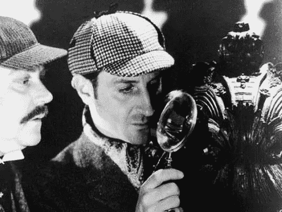

# 计算机视觉系列:几何变换

> 原文：<https://medium.com/analytics-vidhya/computer-vision-series-geometric-transformation-89477a7fc0ab?source=collection_archive---------8----------------------->

眼熟吗？他是夏洛克·福尔摩斯，用他的放大镜“放大”雕塑上的微小细节。在 21 世纪，计算机能够放大 100 倍，比福尔摩斯的放大镜好得多。作为一名工程师，我的问题是计算机如何放大或缩小？

# 几何变换