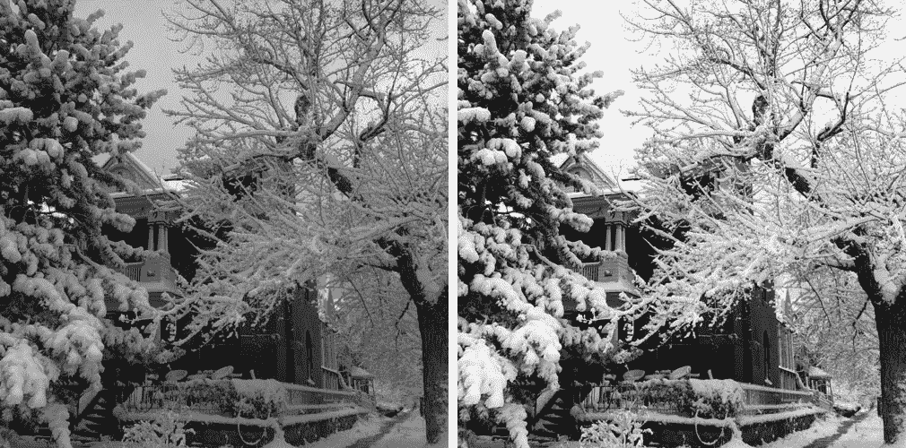
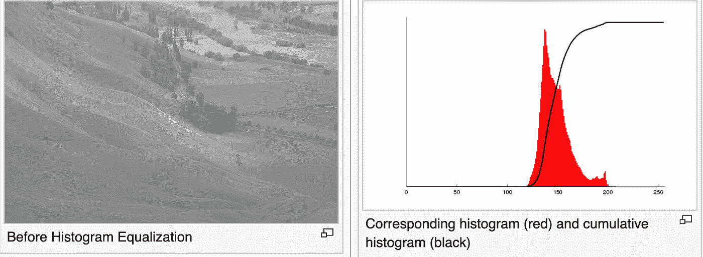
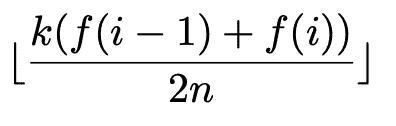
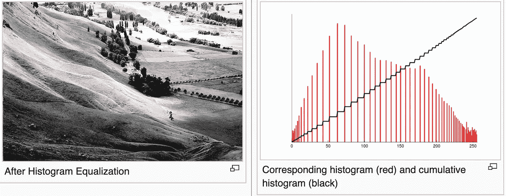

# 计算机视觉系列:直方图均衡化

> 原文：<https://medium.com/analytics-vidhya/computer-vision-series-histogram-equalization-87d1369ef183?source=collection_archive---------17----------------------->

阅读这篇文章的一些人已经在 Instagram 上发布了几张图片，并使用内置工具来增加/减少亮度、对比度、伽玛等。让你无聊的镜头变得更漂亮，更细致，更吸引人。我做了几次，我问自己计算机是如何做到的。在这篇文章中，我将讨论图像对比，并展示百万分之一的方法。

让我们看看下面的图片



一对低对比度和高对比度图像

在左图中，你可以看到一座红棕色的砖房、树木和雪。而且看起来又无聊又悲伤。在右图中，颜色看起来更亮？颜色看起来更亮，因为它们的对比度更高，所以图像看起来更有吸引力。文献说的够多了，我们来深入挖掘一下。

# 直方图:是什么？

在计算机视觉中，每幅图像都由像素组成，每种颜色的像素范围从 0 到 255 (0 最暗，255 最亮)。图像的颜色模式是 RGB(例如，Reg-Green-Blue 的 3 个颜色通道)。为了对图像进行统计研究，科学家绘制了一个图表来表示颜色频率，x 轴是从 0 到 255 的颜色范围，y 轴是一种颜色的像素数量。代表色频的图形称为**直方图**。让我们看看下面的样本图像及其直方图。



样本图像及其对应的直方图

样本图像是低对比度的，因为图像的细节在颜色方面彼此没有明显的不同。通过绘制图像的直方图，您可以清楚地看到代表样本像素的红色柱彼此靠近。这一观察表明，在灰度通道中只有 100 种颜色。换句话说，这个观察暗示了低对比度图像。

**增强图像对比度的一千种方法之一是拉伸直方图，使像素列之间的距离更远。拉伸图像直方图的一种方法是直方图均衡化。**

# 直方图均衡

是一种数学技术，通过寻找累积的归一化直方图来拉伸图像直方图。



计算每种颜色的累积归一化直方图的公式

**执行直方图均衡的步骤:**

*   构建直方图，可以通过将像素颜色的频率映射到字典来完成，关键字是颜色，值是属于颜色的像素。
*   通过为下一个颜色频率添加上一个颜色频率来构建累积直方图(CH ),依此类推。 *f(i)* 是累积直方图。
*   通过将 CH 乘以系数来计算归一化累积直方图(NCH):
    K/(2 * N)其中 K 是所有可能的颜色(通常从 0 到 255)，N 是图像大小
*   计算最接近整数的 NCH 底

这是你和我在均衡上面的样本图像直方图后期望看到的。显然，图像看起来更有吸引力，因为它的对比度增强了。另外，看看图像直方图，上面的红色列从 0 到 255 分布得更均匀。每两列之间的空白意味着更多的对比。



均衡直方图后

对于理论和数学来说，这已经足够了。让我们弄脏你的手。


> 下面的教程是用 Python3 实现的。你可以去我的 Github repo 下载 [MoCV](https://github.com/quocdat32461997/MoCV) ，这是我为实现计算机视觉算法而创建的 Python 包。

导入依赖项

```
import numpy as np
import cv2 
```

让我们创建*直方图*函数

接下来，均衡图像直方图

现在，让我们重建对比增强图像

现在，让我们结合一切

```
image = cv2.imread("your_image", 0) #gray-scale, any channel
enhanced_image = upcontrastImage(image)
cv2.imwrite("your_enhanced_image", enhanced_image)
```

然后，转到存储增强图像的目录，并打开以查看它。使用 cv2.imshow(enhanced_image)不会显示预期的图像。

好了，这就是增强图像对比度的直方图均衡化及其在 Python 中的实现。所有源代码均可在此处获得:

[](https://github.com/quocdat32461997/MoCV) [## quocdat32461997/MoCV

### 计算机视觉算法列表:直方图-计算图像直方图直方图均衡-均衡图像…

github.com](https://github.com/quocdat32461997/MoCV)