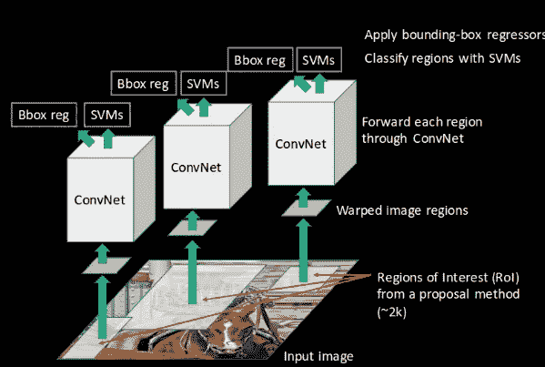
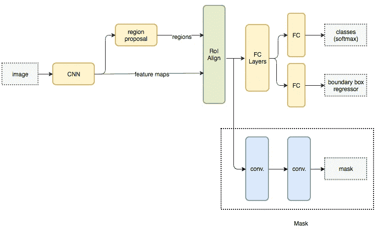
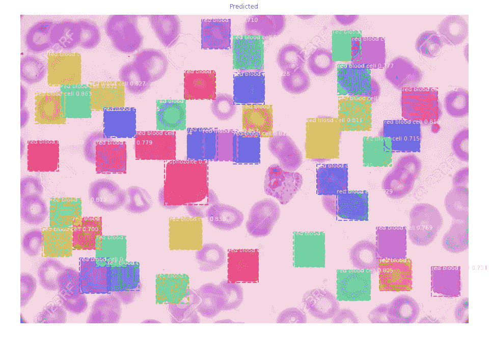

# 计算机视觉技术:在疟疾细胞数据上实现 Mask-R CNN

> 原文：<https://medium.com/analytics-vidhya/computer-vision-techniques-implementing-mask-r-cnn-on-malaria-cells-data-e03b9fbeb6be?source=collection_archive---------2----------------------->

基于 Mask-R CNN 的疟疾细胞检测

> 当今世界，计算机视觉是人工智能中最强大、最复杂的领域。随着我们的深入，我们将体验计算机视觉的各种应用和技术。

计算机视觉是试图复制人眼复杂性的计算机科学领域。它使计算机能够检测图像和视频中的对象。由于深度学习和各种 CNN 和 R-CNN 技术，这在今天成为可能。

有 5 种主要的计算机视觉技术:

1.  图像分类
2.  带定位的图像分类
3.  目标检测
4.  图像分割:语义分割
5.  图像分割:实例分割

# 1.图像分类

在图像分类问题中，各种图像中的每一幅图像都属于一个类别。我们需要定义图像的标签，并预测图像的类别。

让我们公式化一个问题:

*   假设我们有一个 MNIST 数据集，其中有 N 幅图像，这些图像被分类到 10 个标签中的任何一个标签中:0，1，2，3，4，5，6，7，8，9 是我们的输入数据。
*   然后，我们使用该输入或训练数据集来训练分类器以学习该模型。
*   最后，我们将评估我们的模型，要求它预测一组新图像的标签。然后，我们可以将真实标签与分类器给出的图像的预测标签进行比较。

这里，我们可以使用多标签分类器或 CNN(卷积神经网络)来训练我们的分类器。

使用 CNN 预测的 MNIST 图像(红色数字显示预测值)

在上图中，我们使用 CNN 训练了 MNIST 数据，并预测了一些图像的标签。

**输出:图像分类的输出是类别标签或类别 id。**

**问题:**如果我们想定位物体的位置呢？

# 2.带定位的图像分类

比方说，我们有狗和猫的图像，我们用 CNN 对它们进行分类，如果我们想知道它们在图像中的位置呢？

这是更具挑战性的图像分类版本。

输出:输出是类别标签+由边界框给出的图像中对象的位置。边界框是围绕对象的矩形或正方形框。

图片显示了疟疾细胞图像中细胞的边界框

图像分类与带定位的图像分类的区别(来源:互联网)

**问:**如果一张图片中有不同类型的物体会怎么样？

# 3.目标检测

在具有定位的图像分类中，每个图像可以具有多个具有相同类别标签的对象，但是如果图像具有具有不同类别标签的不同对象，则识别它们的类别标签和包围盒属于对象检测。

3 种计算机视觉技术的区别(来源:互联网)

输出:它给出了图像中每个对象的类别标签和边界框。

疟疾细胞图像上的目标检测(给出图像中每个细胞的类别标签和包围盒)。在这张图片中，一些细胞是红细胞，一些是环状的。

可以使用四种算法来完成对象检测:

1.  **CNN-卷积神经网络**像我们的眼睛一样检测边缘，从而定义物体的边界。是的，我们可以使用 CNN 来检测图像中的对象。CNN 进行目标检测的步骤是:

*   首先，我们将一幅图像作为输入。
*   然后，使用滑动窗口技术将图像划分成各种区域，就像将 100* 100 像素的图像划分成各种 10* 10 像素的区域一样。
*   我们将把每个区域看作独立的图像。
*   把每个地区传给 CNN，把他们分成各种类别。
*   一旦我们得到了每个区域对应的类别，我们就可以将每个区域合并，得到含有检测目标的原始图像。

CNN 的问题是，我们需要将 CNN 应用于大量的位置和规模，这在计算上非常昂贵！

**2。R-CNN(基于区域的 CNN)**-R-CNN 算法不是在大量区域上工作，而是在图像中提出一堆盒子，并检查这些盒子中是否包含任何对象。r-CNN**T5【使用**选择性搜索**从图像中提取这些方框，这些方框被称为 **ROI(感兴趣区域)。** 我们来了解一下**选择性搜索**:一张图像基本上有四个区域:变化的尺度、颜色、纹理、包围。选择性搜索识别图像中的这些模式，并在此基础上提出各种区域。**

**选择性搜索**中的步骤:
拍摄图像- >初始分割- >组合相似的片段(基于颜色、纹理或大小相似性以及形状兼容性)- > ROI(感兴趣区域)

美国有线电视新闻网(来源:互联网)

在 **R-CNN** 中检测物体的步骤如下:

1.  R-CNN 利用选择性搜索来创建大约 2000 个感兴趣区域。
2.  这些区域被扭曲成固定大小的图像或被重新整形，以便它们可以匹配 CNN 输入的大小，并单独馈入 CNN 网络。CNN 为每个区域提取特征。
3.  提取每个区域的特征，然后用 SVM 对目标和背景进行分类。每堂课，我们训练一个二进制 SVM。
4.  最后，提取的每个区域的特征还遵循线性回归模型来为图像中每个识别的对象生成更紧密的包围盒。

较少但更高质量的 ROI 使得 R-CNN 比滑动窗口 CNN 更快更准确。

美国有线电视新闻网的问题:

训练 R-CNN 模型既昂贵又缓慢，因为:

*   基于选择性搜索为每幅图像提取 2000 个区域
*   使用 CNN 提取每个图像区域的特征。假设我们有 N 个图像，那么 CNN 特征的数量将是 N * 2,000
*   使用 R-CNN 训练对象检测的 3 个模型(CNN、SVM 和回归器)使其速度慢且计算量大。

**3。快速 R-CNN** 解决 R-CNN 问题的方法是快速 R-CNN。在 R-CNN 中，我们为每张图片使用了大约 2000 个 CNN。但是，在快速 R-CNN 中，单个 CNN 用于每幅图像，并且一次获得所有特征，因此减少了计算时间。

在**快速 R-CNN** 探测物体的步骤如下:

1.  首先，我们使用一个**特征提取器**(一个 CNN)来提取整幅图像的特征。
2.  同时，我们还使用外部区域提议方法，如选择性搜索，来创建**ROI**。
3.  然后，我们将感兴趣区域和相应的特征图结合起来，形成用于对象检测的面片。
4.  我们根据 FC 层的输入，使用 **ROI pooling** 将补丁打包/整形为固定大小，并将其提供给完全连接的层。
5.  在全连接网络的顶部使用 softmax 层来预测类别。除了 softmax 图层之外，线性回归图层也被并行用于输出预测类的边界框坐标。

通过不重复特征提取，快速 R-CNN 大大减少了处理时间。

**快速 R-CNN 的问题:**快速 R-CNN 仍然使用区域提议法来寻找 ROI，这使得它非常耗时。

**4。更快的 R-CNN** 更快的 R-CNN 是 Fast R-CNN 的修改版。它们之间的主要区别在于，快速 RCNN 使用选择性搜索来生成感兴趣区域，而快速 RCNN 使用“**区域提议网络**”(RPN)。

RPN 以图像特征图作为输入，生成感兴趣区域。

更快的 R-CNN

步骤如下**更快的 R-CNN** 检测物体

1.  首先，我们使用一个**特征提取器**(一个 CNN)来提取整幅图像的特征。
2.  **区域建议网络**应用于这些特征地图。这将返回对象建议，即 ROI 及其客观性分数。
3.  然后 ROI 和相应的特征图都通过**ROI 合并层。**我们根据 FC 层的输入将提案包装/整形为固定大小，并将其提供给完全连接的层。
4.  在全连接网络的顶部使用 softmax 层来预测类别。与 softmax 图层一起，线性回归图层也用于并行输出预测类的边界框坐标。

**RPN** 在 CNN 生成的特征图上使用滑动窗口，在每个窗口，它生成比如说， *k* 不同形状和大小的锚框(固定边界框)。对于每个锚盒，RPN 预测两件事:

*   第一个是锚是对象的概率(不考虑对象属于哪个类)。
*   第二个是边界框回归器，用于调整锚点以更好地适应对象。

**问题**:物体的实际形状呢？

# 4.图像分割:语义分割

对象检测告诉我们每个对象的类别标签和边界框。但是，它没有告诉我们每个物体的实际形状。

因此，这里图像分割进入图片。

图像分割为每个对象创建了一个像素级的遮罩，从而为我们提供了对象的精确形状。

**问题**:我们哪里需要图像分割？

**回答**:下面是图像分割的一些应用:

1.  疟疾或癌症检测细胞:在医学界，正确检测图像中的细胞可以告诉我们有关疾病的信息。
2.  自动驾驶汽车:要驾驶汽车，我们需要了解我们前方或侧面物体的实际形状。因为自动驾驶汽车也需要它。
3.  从卫星系统定位物体。

图像分割有两种类型:

**一、语义分割:**图像中的每个像素都属于一个特定的类别——汽车、建筑物、窗户等。并且属于特定类别的所有像素都被分配了单一颜色。例如，它将图像像背景一样分割成 1 类，将图像中的汽车分割成 1 类，将图像中的人分割成 1 类。所以，这里总共有 3 个类，用 3 种颜色的 3 个蒙版分割图片。

语义分割与实例分割(图片来自互联网)

有一些实现语义分段的架构，如 FCN(全卷积网络)、编码器-解码器架构(例如 U-Net 架构)等。

问:如果想分别检测同一个类/类型的每个对象呢？

**二。实例分割:**它分别对每个对象进行分割。

# 5.图像分割:实例分割

在实例分段中，同一类的不同实例被单独分段。比如，在上面的图片中，同一个类(动物)的不同实例被赋予了不同的标签。
许多对象的边界框相互重叠。所以面具有助于检测物体的确切形状。
**用于实例分割的算法之一是 Mask R-CNN。**

## 屏蔽 R-CNN:

屏蔽 R-CNN 基本上是建立在更快的 R-CNN 之上的。这是一个像素级的图像分割。

面具 R-CNN(来源:互联网)

在**屏蔽 R-CNN** 中检测物体的步骤

1.  首先，我们使用一个**特征提取器**(一个 CNN)来提取整幅图像的特征。
2.  **区域建议网络**应用于这些特征地图。这将返回对象建议，即 ROI 及其客观性分数。
3.  然后 ROI 和相应的特征图都通过**ROI Align 层。在 Mask R-CNN 中，使用 ROI Align** 层代替 ROI Pooling。RoI Align 层旨在修复由 RoI 池中的量化导致的位置错位。感兴趣的区域被准确地从原始图像映射到特征图上，而不用舍入到整数。
4.  在全连接网络的顶部使用 softmax 层来预测类别。与 softmax 图层一起，线性回归图层也用于并行输出预测类的边界框坐标。
5.  ROI 对准层的输出也单独进入卷积层以预测掩模。

## 掩模 R-CNN 中的损失函数:

掩模 R-CNN 中的损失包括由于 RPN(区域建议网络)造成的损失和由于分类、定位和分割掩模造成的损失。

1.损失(RPN)= RPN_Class 损失+ RPN_BBox 损失

2.损失(掩码 R-CNN)=损失(类别标签预测)+损失(边界框预测)+损失(掩码预测)

## 总损耗=损耗(RPN) +损耗(屏蔽 R-CNN)

因此，我们的优化问题是最小化总损失

# 在疟疾数据单元上实现 Mask R-CNN

我已经从 kaggle 获取了疟疾数据细胞的数据。链接描述如下:
数据来源:[**https://www.kaggle.com/kmader/malaria-bounding-boxes**](https://www.kaggle.com/kmader/malaria-bounding-boxes)

在这个数据中是图像(。png 或者。jpg 格式)。有 2 组图像，包括 1208 个训练图像和 120 个测试图像。

**标签:**数据由两类未感染细胞(红细胞和白细胞)和四类感染细胞(配子体、环、滋养体和裂殖体)组成。数据显示未感染的红细胞与未感染的白细胞和感染的细胞之间存在严重的不平衡，后者占所有细胞的 95%以上。

JSON 文件中的每个单元都有一个类标签和一组边界框坐标。
我有一个使用 Mask-RCNN(掩模区域卷积神经网络)的训练模型。
我从下面的链接学会了 Mask-RCNN。这是一个训练袋鼠对象检测数据集。一些代码片段摘自下面的参考链接。# Ref:[https://machine learning mastery . com/how-to-train-a-object-detection-model-with-keras/](https://machinelearningmastery.com/how-to-train-an-object-detection-model-with-keras/)

Mask_RCNN 给出 3 个输出:
1。Class_ids
2。对象/单元边界框
3。对象/单元格的遮罩

**本案例研究分为 5 个步骤:** 1 .为 Keras
2 安装面罩 R-CNN。为目标探测准备数据集
3。用于疟疾细胞检测的训练掩模 R-CNN 模型
4。评测 Mask R-CNN 型号
5。检测新照片中的单元格

## 1.安装屏蔽 R-CNN

一、从*克隆或下载库*

*二。打开 cmd。转到 Mask_RCNN 目录，运行安装脚本:
*CD Mask _ RCNN
python setup . py install
我们会得到安装成功的消息。**

*三。如何检查 Mask RCNN 是否安装成功:
*运行命令:> pip show mask-rcnn
输出:名称:mask-rcnn
版本:2.1
摘要:Mask R-CNN 用于对象检测和实例分割
主页:*[*https://github.com/matterport/Mask_RCNN*](https://github.com/matterport/Mask_RCNN) *作者:Matterport
作者邮箱:*[*waleed.abdulla@gmail.com*](mailto:waleed.abdulla@gmail.com)*

*我们现在可以使用这个库了。*

## *2.为目标检测准备数据集*

*样本图像:*

**

*疟疾包围盒数据集的图像*

*示例 training.json 文件:*

**

*示例 json 文件*

*这里，图像具有 r * c 个像素，r 和 c 的最小和最大值定义边界框顶点。*

*为了创建数据集，我们需要为每个图像的每个边界框提取具有相应类别的最小值、最大值、r 值和 c 值。并为每个图像分配一个 image_id。*

**

*创建的数据帧的前 5 个条目*

*写出掩码 RCNN 的不同函数*

**

*代码片段*

*然后准备训练和测试数据集:*

**

*准备训练和测试数据集的代码段*

*让我们测试一下图像加载、遮罩和装箱在 not？*

**

*使用类标签测试图像加载、遮罩和边界框的代码片段*

*上面代码的输出:*

**

*image_id 15 的输出显示*

*图像的可视化显示了遮罩、虚线框格式的边界框和类 id。*

## *3.用于疟疾细胞检测训练掩模 R-CNN 模型*

*(一)。第一步是定义用于训练模型的配置:
我们定义了 MalariaConfig 类，它扩展了 mrcnn.config.Config 类。*

**

*马拉里亚配置类*

*㈡。训练模型
现在，我们将使用预定义的权重来训练模型。第一步是下载预适配面罩 R-CNN 模型的模型文件(架构和权重)。
将模型权重从 Mask R-CNN 的 matterplot github 目录下载到您当前工作目录下的一个名为“ *mask_rcnn_coco.h5* 的文件中。*

*现在，通过创建一个 *mrcnn.model.MaskRCNN* 类的实例来定义模型，并通过将“*模式*参数设置为“*训练*并使用我们上面定义的配置来指定模型将用于训练。*

*加载我们下载的 weight mask_rcnn_coco.h5。*

*现在训练模型。(代码片段如下所示)*

**

*训练掩模 R-CNN 模型*

*训练模型大约需要 2-3 个小时。我用的是 GPU(NVIDIA GeForce GTX 1080，Max-Q 设计)。*

*每个时代结束时都会创建一个模型。由于损耗随着每个时段而减少，因此我们将使用时段 5 文件**mask _ rcnn _ malaria _ CFG _ 0005 . H5**来评估模型性能。*

## *4.评估掩模 R-CNN 模型*

*第一步是为评估模型定义一个新的配置。参见下面的代码。*

**

*预测配置代码*

*接下来，我们可以用 config_pred 定义模型，并将'*模式*'参数设置为'*推理*，而不是'*训练*'。
接下来，我们可以从当前工作目录中保存的模型文件'*mask _ rcnn _ malaria _ CFG _ 0005 . H5*'中加载权重。*

**

*模型评估代码*

*plot_actual_vs_predicted 是为绘制实际图像和预测图像而定义的函数。下图是伪代码片段。*

**

*实际图像与预测图像的绘图代码*

*通常使用 mAP 和 IOU 来评估用于对象识别任务的模型的性能。*

*我们预测边界框，这样我们就可以确定预测边界框和实际边界框的重叠程度。这可以通过将重叠面积除以两个边界框的总面积，或者将交集除以并集来计算，称为“*交集除以并集*”或 IoU。完美的边界框预测将具有为 1 的 IoU。
如果 IoU 大于 0.5，例如它们重叠 50%或更多，则假定边界框的预测是肯定的，这是标准的。*

*精度是指正确预测的边界框(IoU > 0.5)占图像中预测的所有边界框的百分比。Recall 是图像中所有对象中正确预测的边界框(IoU > 0.5)的百分比。随着我们做出更多的预测，召回率会增加，但是精确度会下降或者变得不稳定，因为我们开始做出假阳性预测。对于每个数量的预测，召回( *x* )可以相对于精确度( *y* )来绘制，以创建曲线或直线。我们可以最大化这条线上每个点的值，并计算每个召回值的精确度或 AP 的平均值。
数据集中所有图像的平均精度(AP)的平均值或均值称为平均精度，或 mAP。*

*mask-rcnn 库提供了一个 *mrcnn.utils.compute_ap* 来计算给定图像的 ap 和其他指标。这些 AP 分数可以跨数据集收集，并且计算平均值以给出模型在检测数据集中的对象方面有多好的想法。*

****

*预测红细胞和营养体*

*从上面的实际和预测图像我们可以看到实际图像的大部分细胞是预测的。在此示例图像中，预测了红细胞和滋养层。*

***对模型进行评估后，我们得到:**
训练数据的 mAP 评估为 0.830
测试数据的 mAP 评估为 0.806*

## *5.检测新照片中的单元格*

*我从网上下载了一些疟疾细胞图像，并在这些图像上运行模型。这些图像不是训练和测试数据集的一部分。*

*结果如下:*

**

*实际图像 1*

**

*预测图像 1*

*在上面的新图像中，预测了 1 个营养橄榄石(红色掩膜),得分为 0.7443。*

**

*实际图像 2*

**

*预测图像 2*

*在上面的新图像中，预测了 1 颗营养橄榄石(红色掩膜),得分为 0.723。*

*在上面预测的图像中，显示了图像中许多单元的边界框和遮罩。并且许多红细胞和滋养体被正确地检测和预测。*

## *密码*

*关于代码，请查看我的 Github 简介*

* [## nidhibansal 1902/疟疾细胞-检测-案例研究-Mask-R-CNN

### 它是基于计算机视觉的。使用 Mask-RCNN 疟疾细胞检测-包围盒实现对象检测…

github.com](https://github.com/nidhibansal1902/Malaria-cells-detection-case-study-Mask-R-CNN) 

# 结论

在这篇博客中，我们讨论了各种计算机视觉技术。

详细讨论了 Mask R-CNN，并将其应用于疟疾数据单元。
对红细胞和寄生虫感染细胞的细胞识别效果较好。

## 改进的范围

1.  掩模形状可以改进到单元的精确尺寸。
2.  所实现的模型没有检测到所有被感染的细胞。它需要一些改进。* 

*如果你觉得我的文章有用，给它一个👏并帮助他人找到它。记住，你最多可以 ***拍 50 次*** *(按下👏图标更长)。这是一个很好的反馈方式！**