# 计算机视觉教程:图像分割技术的逐步介绍(第 1 部分)

> 原文：<https://medium.com/analytics-vidhya/computer-vision-tutorial-a-step-by-step-introduction-to-image-segmentation-techniques-part-1-c8a83a4fc9e7?source=collection_archive---------0----------------------->

当你打算过马路时，你做的第一件事是什么？我们通常会左顾右盼，看看路上的车辆，然后做出决定。我们的大脑能够在几毫秒内分析出哪种交通工具(轿车、公共汽车、卡车、汽车等)。)正向我们走来。机器能做到吗？

直到几年前，答案还是斩钉截铁的“不”。但是计算机视觉的兴起和进步已经改变了这个游戏。我们能够建立计算机视觉模型，可以检测物体，确定它们的形状，预测物体前进的方向，以及许多其他事情。你可能已经猜到了——这就是自动驾驶汽车背后的强大技术！

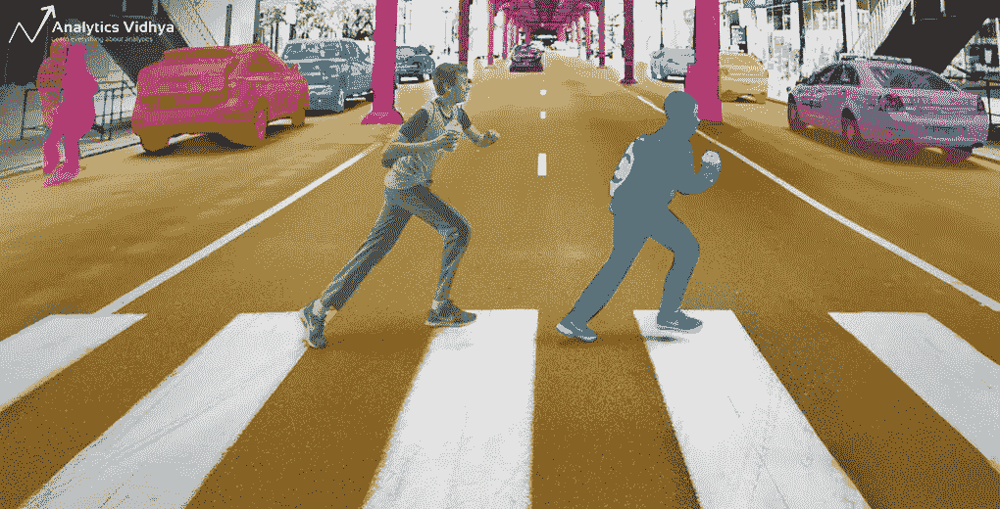

现在，有多种方法来应对计算机视觉的挑战。我遇到的最流行的方法是基于识别图像中存在的对象，也称为对象检测。但是如果我们想潜得更深呢？如果仅仅检测物体是不够的——我们想在更精细的层次上分析我们的图像，那该怎么办？

作为数据科学家，我们总是好奇于更深入地挖掘数据。问这样的问题是我喜欢在这个领域工作的原因！

在本文中，我将向您介绍图像分割的概念。这是一个强大的[计算机视觉算法](https://courses.analyticsvidhya.com/courses/computer-vision-using-deep-learning-version2?utm_source=blog&utm_medium=image-segmentation-article)，它建立在对象检测的理念之上，将我们带到了一个全新的图像数据处理水平。这项技术带来了如此多的可能性——它让我大吃一惊。

*如果你是深度学习和计算机视觉的新手，我推荐以下资源来了解关键概念:*

*   [*计算机视觉使用深度学习 2.0 课程*](https://courses.analyticsvidhya.com/courses/computer-vision-using-deep-learning-version2?utm_source=blog&utm_medium=image-segmentation-article)
*   [*认证项目:计算机视觉初学者*](https://courses.analyticsvidhya.com/bundles/computer-vision-combo?utm_source=blog&utm_medium=image-segmentation-article)

# 目录

1.  什么是图像分割？
2.  为什么我们需要图像分割？
3.  不同类型的图像分割
4.  基于区域的分割
5.  边缘检测分割
6.  基于聚类的分割
7.  脸书的面具 R-CNN 框架
8.  图像分割技术综述

# 什么是图像分割？

让我们用一个简单的例子来理解图像分割。考虑下图:

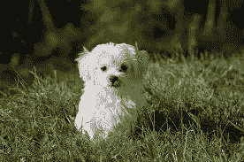

这里只有一个物体——一只狗。我们可以建立一个简单的猫狗分类器模型，并预测在给定的图像中有一只狗。但是如果我们在一个图像中同时有一只猫和一只狗呢？


在这种情况下，我们可以训练一个多标签分类器。现在，还有另一个警告——我们不知道图像中任何一个动物/物体的位置。

这就是图像本地化的由来(没有双关的意思！).它帮助我们识别给定图像中单个物体的位置。如果我们有多个对象存在，那么我们依赖于[对象检测](https://www.analyticsvidhya.com/blog/2018/10/a-step-by-step-introduction-to-the-basic-object-detection-algorithms-part-1/?utm_source=blog&utm_medium=introduction-image-segmentation-techniques-python) (OD)的概念。我们可以使用 OD 来预测每个对象的位置和类别。

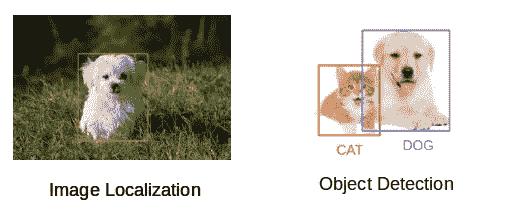

在检测物体之前，甚至在对图像进行分类之前，我们需要了解图像是由什么组成的。输入—图像分割。

# 那么图像分割是如何工作的呢？

我们可以将图像分割成不同的部分，称为片段。同时处理整个图像不是一个好主意，因为图像中会有不包含任何信息的区域。通过将图像分割成片段，我们可以利用重要的片段来处理图像。简而言之，这就是图像分割的工作原理。

图像是不同像素的集合或集合。我们使用图像分割将具有相似属性的像素组合在一起。花点时间浏览下面的视频(它会给你一个实际的图像分割的想法):


【cs231n.stanford.edu】来源:T2

对象检测建立对应于图像中每个类别的边界框。但是它没有告诉我们物体的形状。我们只得到边界框坐标的集合。我们想获得更多的信息——这对我们的目的来说太模糊了。

图像分割为图像中的每个对象创建逐像素的遮罩。这项技术让我们对图像中的物体有了更细致的了解。

为什么我们要去这么深的地方？不是所有的图像处理任务都可以用简单的包围盒坐标解决吗？让我们举一个真实世界的例子来回答这个相关的问题。

# 为什么我们需要图像分割？

癌症长期以来一直是一种致命的疾病。即使在当今技术进步的时代，如果我们不在早期发现癌症，它也可能是致命的。尽快检测出癌细胞有可能挽救数百万人的生命。

癌细胞的形状在确定癌症的严重程度方面起着至关重要的作用。你可能已经把这些碎片放在一起了——物体检测在这里不会很有用。我们将只生成边界框，这不会帮助我们识别细胞的形状。

图像分割技术在这里产生了巨大的影响。它们帮助我们以更精细的方式处理这个问题，并获得更有意义的结果。对医疗保健行业的每个人来说都是双赢。

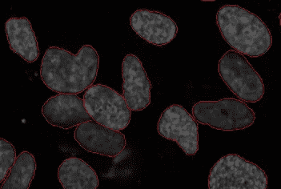

*来源:维基百科*

在这里，我们可以清楚地看到所有癌细胞的形状。还有许多其他应用，其中图像分割正在改变行业:

*   交通控制系统
*   自动驾驶汽车
*   在卫星图像中定位物体

甚至还有更多图像分割非常有用的应用。请在这篇文章下面的评论部分与我分享它们——让我们看看是否可以一起构建一些东西。🙂

# 不同类型的图像分割

我们可以将图像分割技术大致分为两种类型。考虑下面的图片:

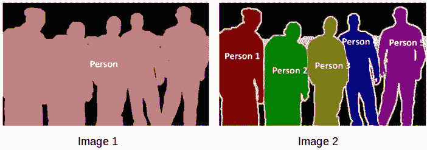

你能辨别这两者之间的区别吗？两幅图像都使用图像分割来识别和定位在场的人。

*   在图像 1 中，每个像素属于一个特定的类(背景或人)。此外，属于特定类的所有像素都用相同的颜色表示(背景为黑色，人物为粉红色)。这是语义分割的一个例子
*   图像 2 还为图像的每个像素分配了一个特定的类。然而，同一类的不同对象具有不同的颜色(人 1 为红色，人 2 为绿色，背景为黑色，等等。).这是一个实例分段的例子

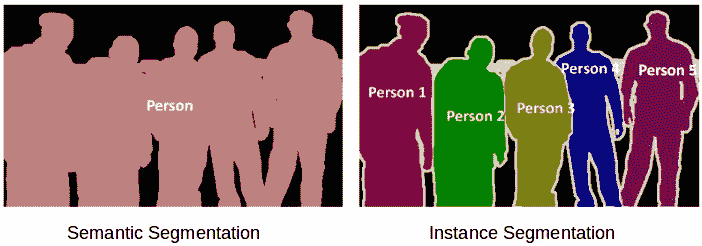

让我快速总结一下我们学到的东西。如果在一幅图像中有 5 个人，语义分割将集中于将所有人分类为单个实例。另一方面，实例分段。会逐一确认这些人的身份。

到目前为止，我们已经深入研究了图像处理和分割的理论概念。让我们稍微混合一下——我们将把学习概念与用 Python 实现它们结合起来。我坚信这是学习和记忆任何话题的最好方法。

# 基于区域的分割

分割不同对象的一种简单方法是使用它们的像素值。需要注意的重要一点是，如果对象和图像背景之间存在鲜明的对比，那么它们的像素值会有所不同。

在这种情况下，我们可以设置一个阈值。低于或高于该阈值的像素值可以被相应地分类(作为对象或背景)。这种技术被称为**阈值分割**。

> *如果我们想把图像分成两个区域(物体和背景)，我们定义一个单一的阈值。这就是所谓的***。**
> 
> *如果背景中有多个物体，我们必须定义多个阈值。这些阈值统称为**。***

**让我们实施我们在本节中学到的内容。下载 [**这个图像**](https://drive.google.com/open?id=1aM4otWKSsDz1Rof3LZkY055YkYXeO-vf) 并运行下面的代码。它会让你更好地理解阈值处理是如何工作的(如果你想尝试，你可以使用你选择的任何图像！).**

**首先，我们将导入所需的库。**

```
**from skimage.color import rgb2gray
import numpy as np
import cv2
import matplotlib.pyplot as plt
%matplotlib inline
from scipy import ndimage**
```

**让我们阅读下载的图像并绘制它:**

```
**image = plt.imread('1.jpeg')                       
image.shape                       
plt.imshow(image)**
```

**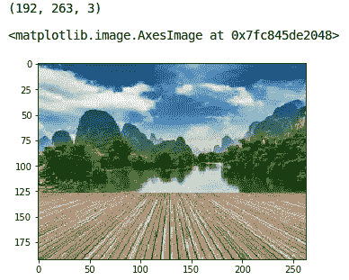**

**它是三通道图像(RGB)。我们需要把它转换成灰度，这样我们就只有一个通道了。这样做也有助于我们更好地理解算法是如何工作的。**

```
**gray = rgb2gray(image)                       
plt.imshow(gray, cmap='gray')**
```

**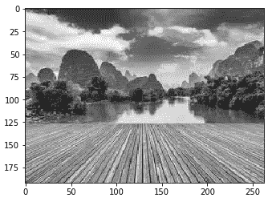**

**现在，我们想对这个图像应用一个特定的阈值。这个阈值应该将图像分成两部分——前景和背景。在此之前，让我们快速检查一下这张图片的形状:**

```
**gray.shape**
```

**(192, 263)**

**图像的高度和宽度分别为 192 和 263。**我们将取像素值的平均值，并将其用作阈值。**如果像素值大于我们的阈值，我们可以说它属于一个物体。如果像素值小于阈值，它将被视为背景。让我们编码如下:**

```
**gray_r = gray.reshape(gray.shape[0]*gray.shape[1])                       
for i in range(gray_r.shape[0]):                           
    if gray_r[i] > gray_r.mean():                               
        gray_r[i] = 1                           
    else:                               
        gray_r[i] = 0                       
gray = gray_r.reshape(gray.shape[0],gray.shape[1])                       
plt.imshow(gray, cmap='gray')**
```

**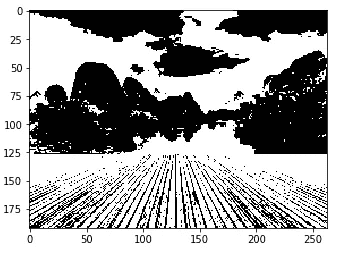**

**不错！较暗的区域(黑色)代表背景，较亮的区域(白色)代表前景。我们还可以定义多个阈值来检测多个对象:**

```
**gray = rgb2gray(image)
gray_r = gray.reshape(gray.shape[0]*gray.shape[1])
for i in range(gray_r.shape[0]):
    if gray_r[i] > gray_r.mean():
        gray_r[i] = 3
    elif gray_r[i] > 0.5:
        gray_r[i] = 2
    elif gray_r[i] > 0.25:
        gray_r[i] = 1
    else:
        gray_r[i] = 0
gray = gray_r.reshape(gray.shape[0],gray.shape[1])
plt.imshow(gray, cmap='gray')**
```

**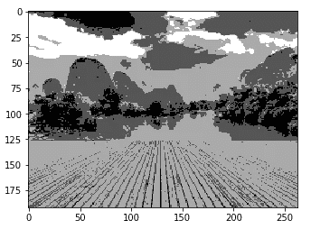**

**上图中有四个不同的部分。您可以设置不同的阈值，并检查分段是如何制作的。这种方法的一些优点是:**

*   **计算更简单**
*   **操作速度快**
*   **当目标和背景具有高对比度时，该方法表现得非常好**

**但是这种方法有一些限制。当我们没有明显的灰度差异，或者灰度像素值有重叠时，很难获得准确的片段。**

# **边缘检测分割**

**是什么将图像中的两个对象分开？具有不同灰度值(像素值)的两个相邻区域之间总是存在边缘。边缘可以被认为是图像不连续的局部特征。**

**我们可以利用这种不连续性来检测边缘，从而定义对象的边界。这有助于我们检测给定图像中存在的多个对象的形状。现在的问题是我们如何检测这些边缘？这是我们可以利用过滤器和卷积的地方。如果你需要了解这些概念，请参考本文。**

**下图将帮助您理解滤镜如何在图像上旋转:**

**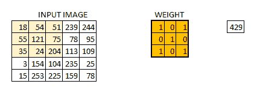**

**这是一步一步的工作过程:**

*   **以权重矩阵为例**
*   **把它放在图片上面**
*   **执行逐元素乘法并获得输出**
*   **按照选择的步幅移动权重矩阵**
*   **卷积，直到输入的所有像素都被使用**

**权重矩阵的值定义卷积的输出。我的建议是——从输入中提取特征很有帮助。研究人员发现，为这些权重矩阵选择一些特定的值有助于我们检测水平或垂直边缘(甚至水平和垂直边缘的组合)。**

**一个这样的权重矩阵是 sobel 算子。它通常用于检测边缘。sobel 算子有两个权重矩阵，一个用于检测水平边缘，另一个用于检测垂直边缘。让我展示一下这些操作符的样子，然后我们将在 Python 中实现它们。**

**索贝尔滤波器(水平)= 1**

**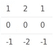**

**索贝尔滤波器(垂直)= 1**

**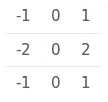**

**边缘检测通过在给定图像上卷积这些滤波器来工作。让我们把它们形象化在[这篇文章](https://drive.google.com/file/d/1gohzcl0AI1yVCF3zdGZnfcbvI_1poM32/view?usp=sharing)上。**

```
**image = plt.imread('index.png')                       
plt.imshow(image)**
```

**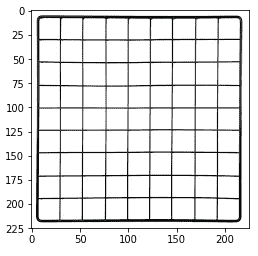**

**对于我们来说，理解如何在该图像中检测边缘应该是相当简单的。让我们将其转换为灰度，并定义将在此图像上卷积的 sobel 滤波器(水平和垂直):**

```
**# converting to grayscale
gray = rgb2gray(image)

# defining the sobel filters
sobel_horizontal = np.array([np.array([1, 2, 1]), np.array([0, 0, 0]), np.array([-1, -2, -1])])
print(sobel_horizontal, 'is a kernel for detecting horizontal edges')

sobel_vertical = np.array([np.array([-1, 0, 1]), np.array([-2, 0, 2]), np.array([-1, 0, 1])])
print(sobel_vertical, 'is a kernel for detecting vertical edges')**
```

**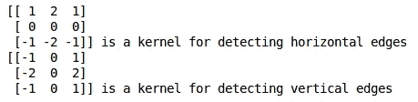**

**现在，使用 *scipy* 中 *ndimage* 包的*卷积*函数对图像进行卷积。**

```
**out_h = ndimage.convolve(gray, sobel_horizontal, mode='reflect')                       
out_v = ndimage.convolve(gray, sobel_vertical, mode='reflect')                       
# here mode determines how the input array is extended when the filter overlaps a border.**
```

**让我们绘制这些结果:**

```
**plt.imshow(out_h, cmap='gray')**
```

**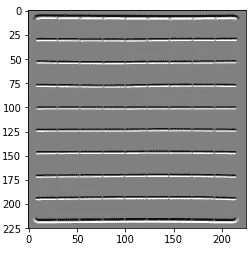**

```
**plt.imshow(out_v, cmap='gray')**
```

**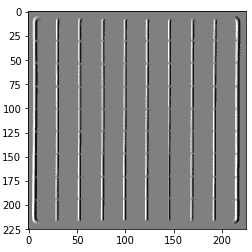**

**这里，我们能够识别水平和垂直边缘。还有一种类型的滤波器可以同时检测水平和垂直边缘。这被称为拉普拉斯算子:**

****

**让我们用 Python 定义这个过滤器，并在同一个图像上进行卷积:**

```
**kernel_laplace = np.array([np.array([1, 1, 1]), np.array([1, -8, 1]), np.array([1, 1, 1])])                       
print(kernel_laplace, 'is a laplacian kernel')**
```

**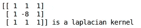**

**接下来，卷积滤波器并打印输出:**

```
**out_l = ndimage.convolve(gray, kernel_laplace, mode='reflect')                       
plt.imshow(out_l, cmap='gray')**
```

**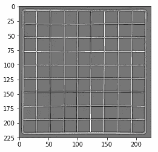**

**这里，我们可以看到我们的方法已经检测到水平和垂直边缘。我鼓励你在不同的图像上尝试，并与我分享你的结果。记住，最好的学习方法是通过练习！**

# **基于聚类的图像分割**

**这个想法可能是你在阅读图像分割时想到的。不能用聚类技术把图像分割成段吗？我们当然可以！**

**在这一节中，我们将直观地了解什么是集群(修改某些概念总是好的！)以及我们如何使用它来分割图像。**

**聚类是将群体(数据点)分成若干组的任务，使得相同组中的数据点比其他组中的数据点更类似于该相同组中的其他数据点。这些组被称为集群。**

**最常用的聚类算法之一是 [k-means](https://www.analyticsvidhya.com/blog/2016/11/an-introduction-to-clustering-and-different-methods-of-clustering/) 。这里，k 代表聚类的数量(不要与 k-最近邻混淆)。让我们了解一下 k-means 是如何工作的:**

1.  **首先，随机选择 k 个初始聚类**
2.  **将每个数据点随机分配给 k 个聚类中的任何一个**
3.  **计算这些集群的中心**
4.  **计算所有点到每个聚类中心的距离**
5.  **根据这个距离，这些点被重新分配给最近的聚类**
6.  **计算新形成的集群的中心**
7.  **最后，重复步骤(4)、(5)和(6)，直到聚类的中心不变或者我们达到设定的迭代次数**

****使用 k-means 算法的关键优点是简单易懂。**我们将这些点分配给离它们最近的聚类。**

**让我们来测试一下我们的学习，看看 k-means 分割图像中的对象有多好。我们将使用 [**这张图片**](https://drive.google.com/open?id=1aM4otWKSsDz1Rof3LZkY055YkYXeO-vf) ，所以下载它，阅读它并检查它的尺寸:**

```
**pic = plt.imread('1.jpeg')/255  # dividing by 255 to bring the pixel values between 0 and 1                       
print(pic.shape)                       
plt.imshow(pic)**
```

****

**这是形状(192，263，3)的三维图像。为了使用 k-means 对图像进行聚类，我们首先需要将其转换为一个二维数组，其形状为(长*宽，通道)。在我们的例子中，这将是(192*263，3)。**

```
**pic_n = pic.reshape(pic.shape[0]*pic.shape[1], pic.shape[2])                       
pic_n.shape**
```

****(50496，3)****

**我们可以看到图像已经被转换成一个二维数组。接下来，将 k-means 算法应用于这个整形后的数组，并获得聚类。k-means 的*cluster _ centers _ function*将返回聚类中心，而 *labels_ function* 将为我们提供每个像素的标签(它将告诉我们图像的哪个像素属于哪个聚类)。**

```
**from sklearn.cluster import KMeans                       
kmeans = KMeans(n_clusters=5, random_state=0).fit(pic_n)                       
pic2show = kmeans.cluster_centers_[kmeans.labels_]**
```

**我已经为这篇文章选择了 5 个集群，但是你可以使用这个数字并检查结果。现在，让我们将聚类恢复到其原始形状，即三维图像，并绘制结果。**

```
**cluster_pic = pic2show.reshape(pic.shape[0], pic.shape[1], pic.shape[2])                       
plt.imshow(cluster_pic)**
```

**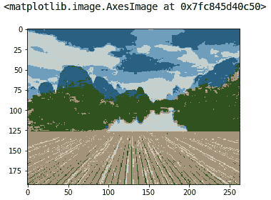**

**很神奇，不是吗？我们能够使用仅仅 5 个聚类很好地分割图像。我相信你可以通过增加聚类的数量来改进分割。**

**当我们有一个小的数据集时，k-means 非常有效。它可以分割图像中的对象，并给出令人印象深刻的结果。但是当应用于大型数据集(更多数量的图像)时，该算法遇到了障碍。**

**它会在每次迭代中查看所有样本，因此花费的时间太长。因此，实施起来也太昂贵了。并且由于 k-means 是一种基于距离的算法，它只适用于凸数据集，不适合聚类[非凸聚类](https://en.wikipedia.org/wiki/Convex_set)。**

**最后，让我们看看一个简单、灵活和通用的图像分割方法。**

# **屏蔽 R-CNN**

**脸书人工智能研究所(FAIR)的数据科学家和研究人员开创了一种深度学习架构，称为 Mask R-CNN，可以为图像中的每个对象创建一个像素级的掩模。这是一个非常酷的概念，请密切关注！**

**Mask R-CNN 是流行的[更快 R-CNN](https://www.analyticsvidhya.com/blog/2018/10/a-step-by-step-introduction-to-the-basic-object-detection-algorithms-part-1/?utm_source=blog&utm_medium=image-segmentation-article) 对象检测架构的扩展。屏蔽 R-CNN 为已经存在的更快的 R-CNN 输出增加了一个分支。更快的 R-CNN 方法为图像中的每个对象生成两个东西:**

*   **它的类别**
*   **边界框坐标**

**Mask R-CNN 为此添加了第三个分支，它也输出对象遮罩。看看下面的图片，直观地了解一下 R-CNN 是如何在内部工作的:**

****

**【arxiv.org】来源:T4**

1.  **我们将一幅图像作为输入，并将其传递给 ConvNet，后者返回该图像的特征图**
2.  **区域建议网络(RPN)应用于这些特征地图。这将返回对象建议及其客观性分数**
3.  **投资回报池层应用于这些提案，以将所有提案缩小到相同的大小**
4.  **最后，建议被传递到完全连接的层，以分类和输出对象的边界框。它还返回每个建议的掩码**

> ***Mask R-CNN 是当前最先进的图像分割技术，运行速度为 5 fps。***

# **图像分割技术综述**

**我在下表中总结了不同的图像分割算法..我建议下次在处理图像分割挑战或问题时，将它放在手边！**

**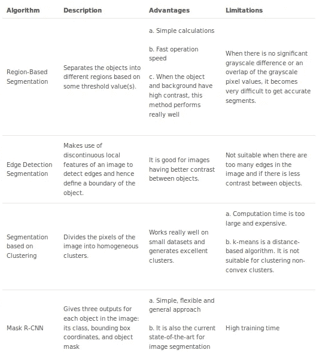**

# **结束注释**

**这篇文章只是我们学习图像分割的旅程的开始。在本系列的下一篇文章中，我们将深入探讨 Mask R-CNN 的实现。敬请关注！**

**我发现图像分割在我的深度学习生涯中是一个非常有用的功能。我从这些技术中获得的粒度级别令人震惊。我总是惊讶于我们能用几行代码提取出多少细节。我在下面提到了一些有用的资源，可以帮助您完成计算机视觉之旅:**

*   **[**计算机视觉使用深度学习 2.0 课程**](https://courses.analyticsvidhya.com/courses/computer-vision-using-deep-learning-version2?utm_source=blog&utm_medium=image-segmentation-article)**
*   **[**认证项目:计算机视觉初学者**](https://courses.analyticsvidhya.com/bundles/computer-vision-combo?utm_source=blog&utm_medium=image-segmentation-article)**

**我总是很感谢对我的文章的任何反馈或建议，所以请随时在下面的评论部分与我联系。**

***原载于 2019 年 4 月 1 日*[*https://www.analyticsvidhya.com*](https://www.analyticsvidhya.com/blog/2019/04/introduction-image-segmentation-techniques-python/)*。***