# 计算机视觉教程:实现用于图像分割的掩模 R-CNN(带 Python 代码)

> 原文：<https://medium.com/analytics-vidhya/computer-vision-tutorial-implementing-mask-r-cnn-for-image-segmentation-with-python-code-fe34da5b99cd?source=collection_archive---------1----------------------->

我对自动驾驶汽车很着迷。构建自动驾驶汽车系统的复杂性和不同计算机视觉技术的混合是像我这样的数据科学家的梦想。

因此，我开始尝试理解自动驾驶汽车如何潜在地检测物体背后的计算机视觉技术。简单的对象检测框架可能不起作用，因为它只是检测对象并在其周围绘制固定的形状。

在现实世界中，这是一个有风险的提议。想象一下，如果前方的道路有一个急转弯，我们的系统会在道路周围绘制一个矩形框。汽车可能无法理解是转弯还是直行。那是潜在的灾难！

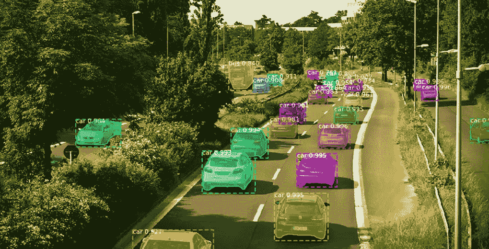

相反，我们需要一种可以检测道路准确形状的技术，这样我们的自动驾驶汽车系统也可以安全地导航急转弯。

我们可以用来构建这样一个系统的最新最先进的框架？那是面具 R-CNN！

因此，在本文中，我们将首先快速了解什么是图像分割。然后我们再来看这篇文章的核心——Mask R-CNN 框架。最后，我们将深入用 Python 实现我们自己的 Mask R-CNN 模型。我们开始吧！

# 图像分割概述

我们在本系列的第 1 部分中详细学习了[图像分割的概念。我们讨论了什么是图像分割及其不同的技术，如基于区域的分割、边缘检测分割和基于聚类的分割。](https://www.analyticsvidhya.com/blog/2019/04/introduction-image-segmentation-techniques-python/?utm_source=blog&utm_medium=computer-vision-implementing-mask-r-cnn-image-segmentation)

如果你需要快速复习(或者想从头开始学习图像分割)，我建议你先看看那篇文章。

我将在这里快速回顾一下这篇文章。图像分割为图像中的每个对象创建逐像素的遮罩。这项技术让我们对图像中的物体有了更细致的了解。下图将帮助您理解什么是图像分割:

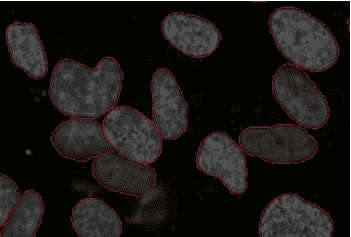

在这里，您可以看到每个对象(在这个特定的图像中是细胞)已经被分割。这就是图像分割的工作原理。

我们还讨论了图像分割的两种类型:语义分割和实例分割。同样，让我们举个例子来理解这两种类型:

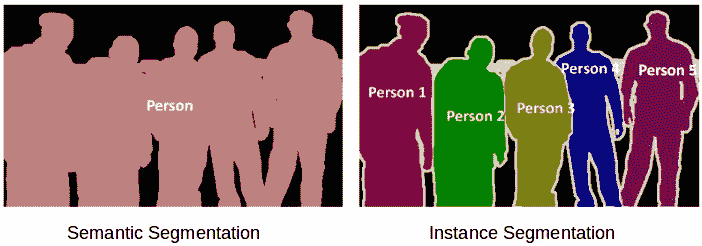

左图中的 5 个物体都是人。因此，**语义分割**会将所有人归类为单个实例。现在，右边的图像也有 5 个对象(都是人)。但是在这里，同一个类的不同对象被指定为不同的实例。这是一个**实例分割的例子。**

第一部分介绍了解决这类图像分割问题的不同技术及其在 Python 中的实现。在本文中，我们将实现一种称为 Mask R-CNN 的最新图像分割技术来解决实例分割问题。

# 了解屏蔽 R-CNN

Mask R-CNN 基本上是[更快 R-CNN](https://www.analyticsvidhya.com/blog/2018/10/a-step-by-step-introduction-to-the-basic-object-detection-algorithms-part-1/?utm_source=blog&utm_medium=computer-vision-implementing-mask-r-cnn-image-segmentation) 的延伸。更快的 R-CNN 广泛用于对象检测任务。对于给定的图像，它返回图像中每个对象的类标签和边界框坐标。因此，假设您传递了以下图像:

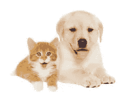

快速 R-CNN 模型将返回如下内容:

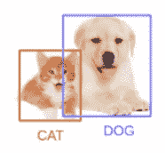

**Mask R-CNN 框架建立在更快的 R-CNN 之上。**所以，对于一个给定的图像，Mask R-CNN，除了每个对象的类标签和包围盒坐标，还会返回对象 Mask。

我们先快速了解一下 R-CNN 的工作速度有多快。这将有助于我们理解 R-CNN 背后的直觉。

*   更快的 R-CNN 首先使用 ConvNet 从图像中提取特征地图
*   这些特征图然后通过区域提议网络(RPN)传递，该网络返回候选边界框
*   然后，我们在这些候选边界框上应用 RoI 池层，以使所有候选对象具有相同的大小
*   最后，建议被传递到完全连接的层，以分类和输出对象的包围盒

一旦你理解了 R-CNN 的工作原理，理解 Mask R-CNN 就变得非常容易了。所以，让我们从输入开始一步一步地理解它，预测类标签、边界框和对象遮罩。

## 主干模型

与我们在更快的 R-CNN 中使用的从图像中提取特征图的 [ConvNet](https://www.analyticsvidhya.com/blog/2018/12/guide-convolutional-neural-network-cnn/?utm_source=blog&utm_medium=computer-vision-implementing-mask-r-cnn-image-segmentation) 类似，我们在 Mask R-CNN 中使用 ResNet 101 架构从图像中提取特征。因此，第一步是拍摄图像，并使用 ResNet 101 架构提取特征。这些特征作为下一层的输入。

## 区域提案网络

现在，我们采用上一步中获得的特征地图，并应用区域建议网络(RPM)。这基本上预测了该区域中是否存在物体。在这一步中，我们得到模型预测包含一些对象的那些区域或特征图。

## 感兴趣区域

从 RPN 获得的区域可能具有不同的形状，对吗？因此，我们应用一个池层，并将所有区域转换为相同的形状。接下来，这些区域通过完全连接的网络，以便预测类别标签和边界框。

到目前为止，这些步骤几乎与更快的 R-CNN 的工作方式相似。现在来看两个框架之间的区别。除此之外， **Mask R-CNN 还生成分段掩码。**

为此，我们首先计算感兴趣区域，以便可以减少计算时间。对于所有预测的区域，我们用基础真值盒计算并集上的交集(IoU)。我们可以这样计算借据:

IoU =交叉点面积/并集面积

**现在，只有当 IoU 大于或等于 0.5 时，我们才认为是感兴趣的区域。否则，我们就会忽略这个特定的区域。我们对所有区域都这样做，然后只选择 IoU 大于 0.5 的一组区域。**

我们用一个例子来理解一下。考虑这张图片:

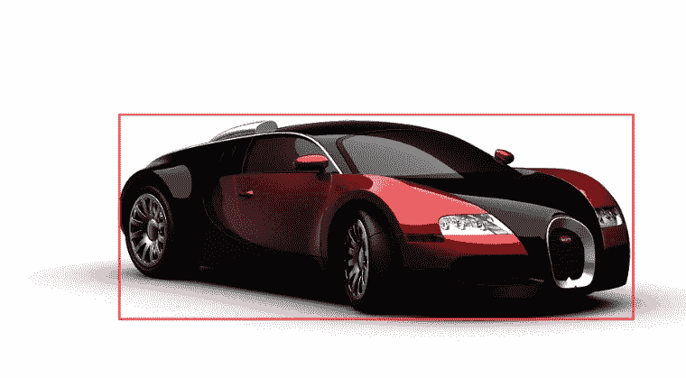

在这里，红色的盒子是这幅图像的地面真相盒。现在，假设我们从 RPN 中得到 4 个区域，如下所示:

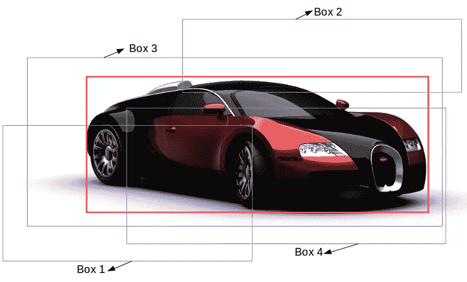

这里，框 1 和框 2 的 IoU 可能小于 0.5，而框 3 和框 4 的 IoU 大约大于 0.5。因此。我们可以说框 3 和框 4 是该特定图像的感兴趣区域，而框 1 和框 2 将被忽略。

接下来，我们来看看屏蔽 R-CNN 的最后一步。

## 分段掩码

一旦我们有了基于 IoU 值的 ROI，我们就可以向现有架构添加一个屏蔽分支。这将返回包含对象的每个区域的分段掩码。它为每个区域返回大小为 28 X 28 的遮罩，然后按比例放大以进行推断。

还是那句话，让我们从视觉上来理解。考虑下面的图像:

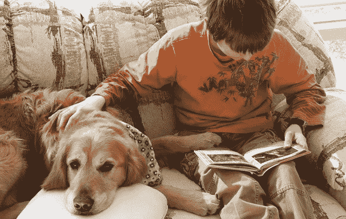

此图像的分段掩码如下所示:

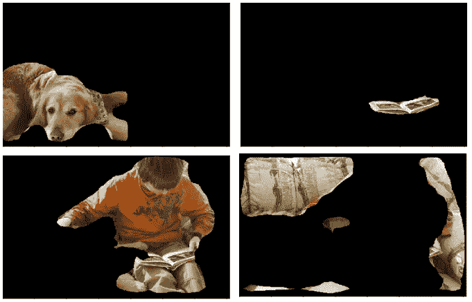

这里，我们的模型已经分割了图像中的所有对象。这是掩模 R-CNN 的最后一步，我们预测图像中所有物体的掩模。

记住口罩 R-CNN 的训练时间是相当高的。我花了大约 1 到 2 天的时间在著名的 [COCO 数据集](http://cocodataset.org/#home)上训练 Mask R-CNN。因此，就本文的范围而言，我们将不训练我们自己的 Mask R-CNN 模型。

我们将改为使用在 COCO 数据集上训练的掩模 R-CNN 模型的预训练权重。现在，在我们深入 Python 代码之前，让我们看一下使用 Mask R-CNN 模型执行实例分割的步骤。

# 实现屏蔽 R-CNN 的步骤

是时候执行一些图像分割任务了！我们将使用由脸书人工智能研究所(FAIR)的数据科学家和研究人员创建的 [mask rcnn 框架](https://github.com/matterport/Mask_RCNN)。

让我们看看使用掩模 R-CNN 执行图像分割的步骤。

# 步骤 1:克隆存储库

首先，我们将克隆具有 Mask R-CNN 架构的 *mask rcnn* 库。使用以下命令克隆存储库:

```
*git clone* [https://github.com/matterport/Mask_RCNN.git](https://github.com/matterport/Mask_RCNN.git)
```

一旦完成，我们需要安装 Mask R-CNN 所需的依赖项。

# 步骤 2:安装依赖项

以下是掩码 R-CNN 的所有依赖项列表:

**在使用 Mask R-CNN 框架之前，你必须安装所有这些依赖项。**

# 步骤 3:下载预先训练的重量(在 COCO 上训练)

接下来，我们需要下载预训练的重量。您可以使用 [**这个链接**](https://github.com/matterport/Mask_RCNN/releases) 来下载预先训练好的重量。这些权重是从在 MS COCO 数据集上训练的模型获得的。下载完权重后，将该文件粘贴到我们在步骤 1 中克隆的 Mask_RCNN 存储库的 samples 文件夹中。

# 第四步:预测我们的形象

最后，我们将使用 Mask R-CNN 架构和预训练的权重来为我们自己的图像生成预测。

一旦你完成了这四个步骤，是时候进入你的 Jupyter 笔记本了！我们将在 Python 中实现所有这些东西，然后为图像中的对象生成遮罩以及类和边界框。

# 在 Python 中实现掩码 R-CNN

Sp，你准备好钻研 Python，编码自己的图像分割模型了吗？我们开始吧！

为了执行我将在本节中介绍的所有代码块，在克隆的 Mask_RCNN 存储库的“samples”文件夹中创建一个新的 Python 笔记本。

让我们从导入所需的库开始:

```
import os
import sys
import random
import math
import numpy as np
import skimage.io
import matplotlib
import matplotlib.pyplot as plt

# Root directory of the project
ROOT_DIR = os.path.abspath("../")

import warnings
warnings.filterwarnings("ignore")

# Import Mask RCNN
sys.path.append(ROOT_DIR)  # To find local version of the library
from mrcnn import utils
import mrcnn.model as modellib
from mrcnn import visualize
# Import COCO config
sys.path.append(os.path.join(ROOT_DIR, "samples/coco/"))  # To find local version
import coco

%matplotlib inline
```

接下来，我们将定义预训练权重的路径以及我们要对其执行分割的图像:

```
# Directory to save logs and trained model
MODEL_DIR = os.path.join(ROOT_DIR, "logs")

# Local path to trained weights file
COCO_MODEL_PATH = os.path.join('', "mask_rcnn_coco.h5")

# Download COCO trained weights from Releases if needed
if not os.path.exists(COCO_MODEL_PATH):
    utils.download_trained_weights(COCO_MODEL_PATH)

# Directory of images to run detection on
IMAGE_DIR = os.path.join(ROOT_DIR, "images")
```

如果您没有将砝码放入样品文件夹，这将再次下载砝码。现在，我们将创建一个推理类，它将用于推理掩码 R-CNN 模型:

```
class InferenceConfig(coco.CocoConfig):
    # Set batch size to 1 since we'll be running inference on
    # one image at a time. Batch size = GPU_COUNT * IMAGES_PER_GPU
    GPU_COUNT = 1
    IMAGES_PER_GPU = 1

config = InferenceConfig()
config.display()
```

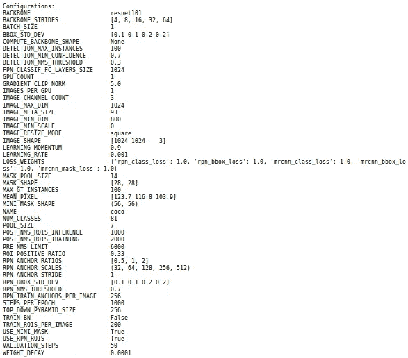

从上面的总结中你能推断出什么？我们可以看到我们将使用的面罩 R-CNN 模型的多种规格。

因此，主干是 resnet101，我们之前也讨论过。该模型将返回的遮罩形状是 28X28，因为它是在 COCO 数据集上训练的。而且我们一共 81 节课(包括后台)。

我们还可以看到其他各种统计数据，例如:

*   输入形状
*   要使用的 GPU 数量
*   验证步骤等等。

您应该花一些时间来理解这些规范。如果你对这些规范有任何疑问，欢迎在下面的评论区问我。

## 装载重量

接下来，我们将创建我们的模型并加载我们之前下载的预训练权重。*确保预训练的砝码与笔记本在同一个文件夹中，否则您必须给出砝码文件的位置:*

```
# Create model object in inference mode.
model = modellib.MaskRCNN(mode="inference", model_dir='mask_rcnn_coco.hy', config=config)

# Load weights trained on MS-COCO
model.load_weights('mask_rcnn_coco.h5', by_name=True)
```

现在，我们将定义 COCO 数据集的类，这将在预测阶段帮助我们:

```
# COCO Class names
class_names = ['BG', 'person', 'bicycle', 'car', 'motorcycle', 'airplane',
               'bus', 'train', 'truck', 'boat', 'traffic light',
               'fire hydrant', 'stop sign', 'parking meter', 'bench', 'bird',
               'cat', 'dog', 'horse', 'sheep', 'cow', 'elephant', 'bear',
               'zebra', 'giraffe', 'backpack', 'umbrella', 'handbag', 'tie',
               'suitcase', 'frisbee', 'skis', 'snowboard', 'sports ball',
               'kite', 'baseball bat', 'baseball glove', 'skateboard',
               'surfboard', 'tennis racket', 'bottle', 'wine glass', 'cup',
               'fork', 'knife', 'spoon', 'bowl', 'banana', 'apple',
               'sandwich', 'orange', 'broccoli', 'carrot', 'hot dog', 'pizza',
               'donut', 'cake', 'chair', 'couch', 'potted plant', 'bed',
               'dining table', 'toilet', 'tv', 'laptop', 'mouse', 'remote',
               'keyboard', 'cell phone', 'microwave', 'oven', 'toaster',
               'sink', 'refrigerator', 'book', 'clock', 'vase', 'scissors',
               'teddy bear', 'hair drier', 'toothbrush']
```

让我们加载一个图像，并尝试查看模型的执行情况。您可以使用您的任何图像来测试模型。

```
# Load a random image from the images folder
image = skimage.io.imread('sample.jpg')

# original image
plt.figure(figsize=(12,10))
skimage.io.imshow(image)
```

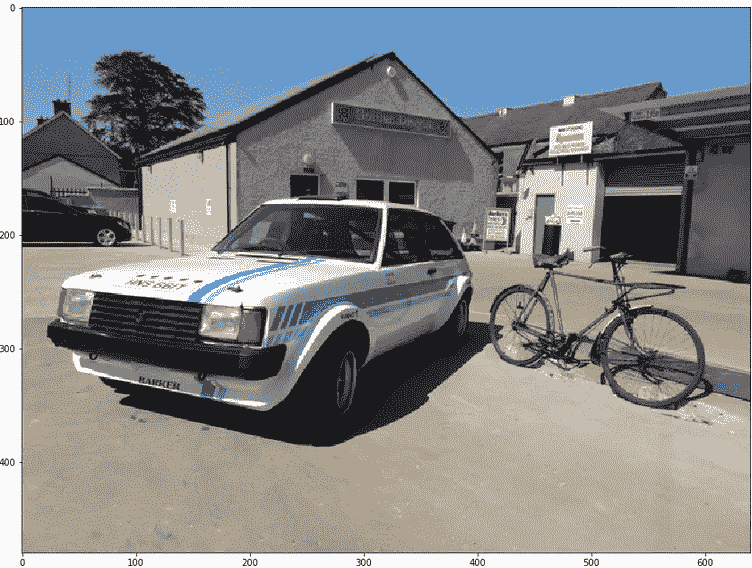

这是我们将要处理的图像。你可以清楚地看到有几辆汽车(一辆在前，一辆在后)和一辆自行车。

## 做预测

预测时间到了！我们将使用掩模 R-CNN 模型和预训练的权重，并观察它如何分割图像中的对象。我们将首先从模型中获取预测，然后绘制结果以将其可视化:

```
# Run detection
results = model.detect([image], verbose=1)

# Visualize results
r = results[0]
visualize.display_instances(image, r['rois'], r['masks'], r['class_ids'], class_names, r['scores'])
```

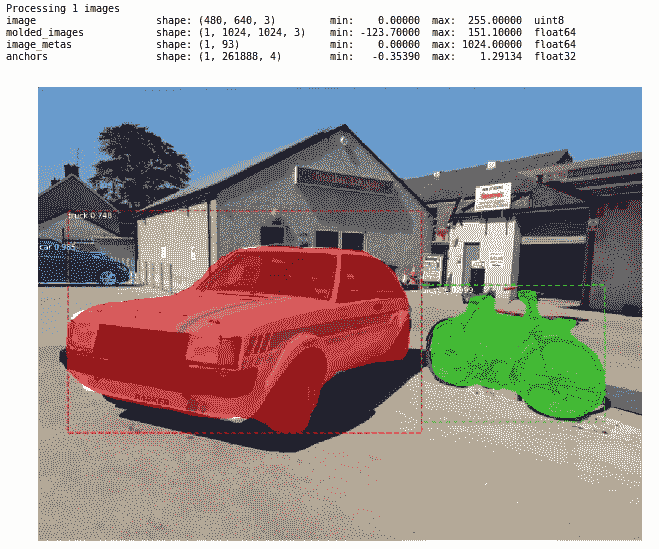

有意思。该模型在分割图像中的汽车和自行车方面做得非常好。我们也可以分别查看每个遮罩或被分割的对象。让我们看看我们能做些什么。

我将首先获取我们的模型预测的所有掩码，并将它们存储在掩码变量中。现在，这些掩码是布尔形式的(真和假)，因此我们需要将它们转换成数字(1 和 0)。让我们先这样做:

```
mask = r['masks']
mask = mask.astype(int)
mask.shape
```

**输出:**

```
(480,640,3)
```

这将给我们一个由 0 和 1 组成的数组，其中 0 表示在那个特定的像素上没有物体，1 表示在那个像素上有物体。请注意，遮罩的形状与原始图像的形状相似(您可以通过打印原始图像的形状来验证这一点)。

**然而，这里的 3 并不代表渠道形状的面具。**相反，它表示由我们的模型分割的对象的数量。由于模型已经在上面的样本图像中识别了 3 个对象，所以遮罩的形状是(480，640，3)。如果有 5 个对象，这个形状应该是(480，640，5)。

我们现在有了原始图像和蒙版阵列。为了从图像中打印或获取每个片段，我们将为循环创建一个*，并将每个蒙版与原始图像相乘以获取每个片段:*

```
for i in range(mask.shape[2]):
    temp = skimage.io.imread('sample.jpg')
    for j in range(temp.shape[2]):
        temp[:,:,j] = temp[:,:,j] * mask[:,:,i]
    plt.figure(figsize=(8,8))
    plt.imshow(temp)
```

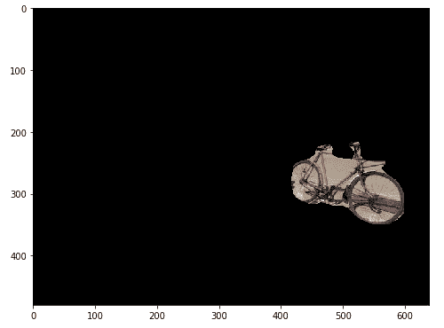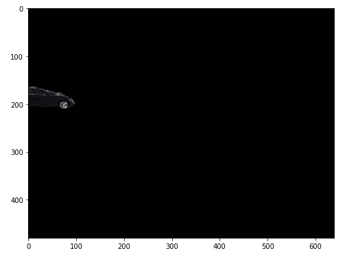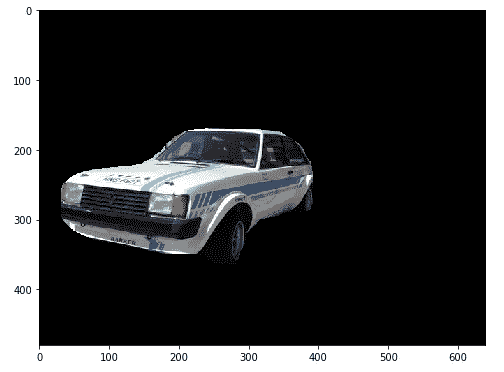

这就是我们如何从图像中绘制每个遮罩或对象。这可能有很多有趣且有用的用例。从整个图像中获取片段可以减少计算成本，因为我们现在不必预处理整个图像，而只需预处理片段。

## 结论

下面是我用我们的掩模 R-CNN 模型得到的一些结果:

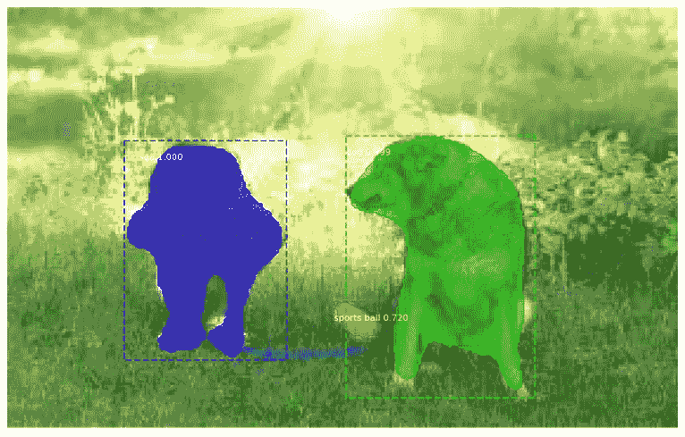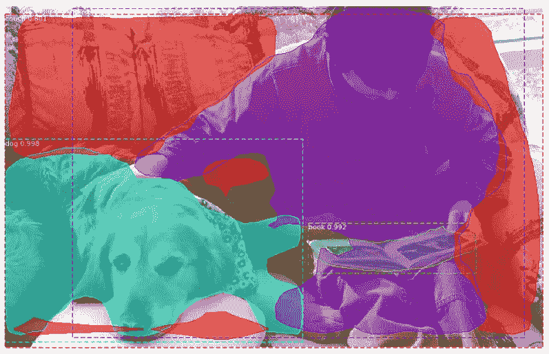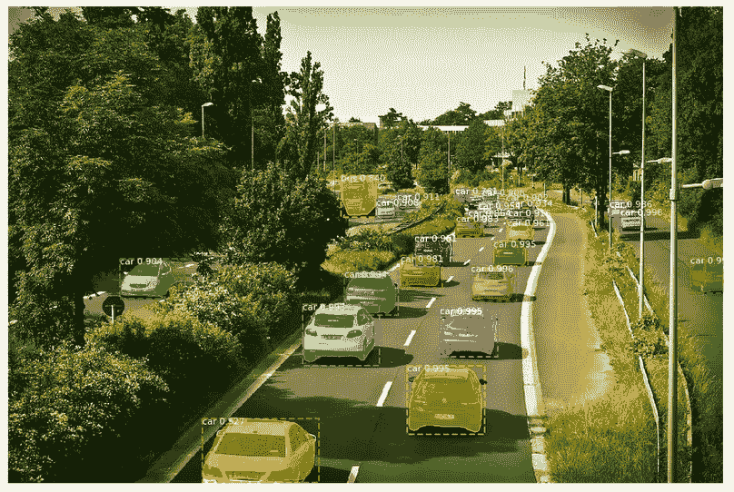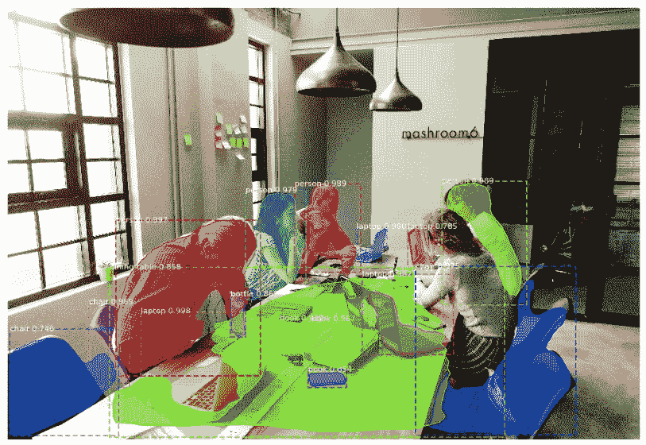

看起来棒极了！您刚刚使用 Mask R-CNN 构建了自己的图像分割模型——干得好。

# 结束注释

我喜欢使用这个可怕的 R-CNN 框架。也许我现在会尝试将其集成到自动驾驶汽车系统中。🙂

图像分割具有广泛的应用，从医疗保健行业到制造业。我建议你在不同的图像上尝试这个框架，看看它的表现如何。请随时与社区分享您的成果。

如果你对这篇文章有任何问题、疑问或反馈，请在下面的评论区发表。

*原载于 2019 年 7 月 22 日*[*【https://www.analyticsvidhya.com】*](https://www.analyticsvidhya.com/blog/2019/07/computer-vision-implementing-mask-r-cnn-image-segmentation/)*。*