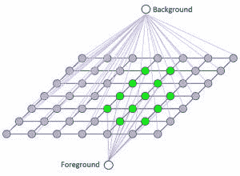
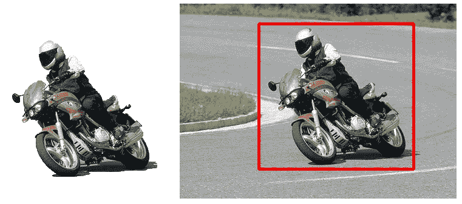

# 计算机视觉——不借助数学理解 GrabCut 算法

> 原文：<https://medium.com/analytics-vidhya/computer-vision-understanding-grabcut-algorithm-without-the-maths-9a97ef4c5ba3?source=collection_archive---------4----------------------->

如果你像我一样是计算机视觉领域的初学者，这可能适合你。让我们直接开始吧！哦，如果没有密码…

对象分割对计算机来说是一项艰巨的任务，甚至对工程师来说也是如此。直到最近(嗯，也许不是最近)，一种算法被引入，使这项任务变得容易。在我们继续解释算法之前，让我们在一个非常高的层次上解释什么是对象分割。

对象分割基本上是(你已经猜到了)将一幅图像分割成更小尺寸图像的过程。更具体地，在对象分割之后，计算机能够说出图像中有多少对象，并且能够说出图像中的对象是对应于前景还是背景。输入 GrabCut 算法。这里，我们将使用 GrabCut 算法将图像分割成前景和背景。

它是这样工作的:

你首先在图像上画一个矩形，这个矩形应该包括图像的主题，比如一个人或者一只狗。随后，您刚刚绘制的矩形之外的区域被自动定义为背景。背景中包含的数据被用作在定义的矩形内区分背景区域和前景区域的参考。

为了简单起见，该算法使用高斯混合模型(GMM)将矩形中的区域定义为颜色分布模型，其中每个像素都将被赋予一个标签，以告诉它是前景、背景还是未知。如果你对图像处理有一点了解，每个像素通过梯度彼此相连，因此该模型将鼓励颜色分布相似的相邻像素具有完全相同的标签。

然后，我们将创建一个用权重初始化的图，然后用最小割算法求解，产生 2 组顶点。然后，我们创建一个图，该图包含 N 个顶点，(N =像素数)并将相邻顶点与边连接起来，这些边的权重由顶点(像素)的颜色相似性定义。在这样做之后，我们将 2 个顶点(前景和背景的标签)添加到图中，根据像素匹配背景或前景的颜色分布的概率，每个顶点将被链接到 N 个像素。

更简单地说，GrabCut 方法放置 2 个标签，一个用于背景，一个用于前景，并根据每个像素的颜色分布与标签的相似性将所有像素链接到自身。

达到这一点将需要在算法中进行大量的研究，因此为了使其易于理解，该方法将在图像的图上运行最小切割的迭代，以完全定义具有标签的所有像素，因为一些像素最初将接收未知标签。最后，你会得到一个像这样的分割图像:

