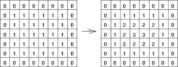
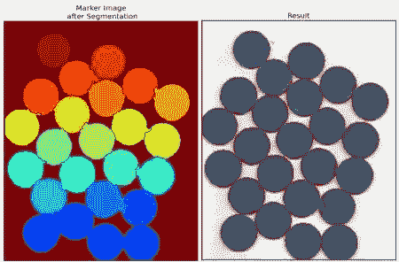

# 计算机视觉——分水岭算法

> 原文：<https://medium.com/analytics-vidhya/computer-vision-watershed-algorithm-ca16bd00485?source=collection_archive---------5----------------------->

在图像处理中，我们经常在对图像进行任何操作之前将图像转换成灰度。分水岭是灰度图像上执行对象分割的变换之一。然而，即使我们将图像转换为灰度，我们也不会丢失太多的信息！分水岭在这种情况下效果最好。让我们试着去理解它。

在任何灰度图像中，都有强度高的区域和强度低的区域。我们可以将这些高强度区域表示为峰，而将低强度区域表示为谷。可以将图像想象成地形图，其中每个像素的亮度都对地形图有所贡献，可以是局部高程，也可以是凹陷。为了分离图像中的对象，我们将在每个山谷中填充不同颜色的水。慢慢地，水将会上升，在某一点上，来自不同山谷的水开始汇合。这就是我们在峰顶建造屏障以避免峰顶被淹没。一旦屏障建立起来，屏障就构成了物体的边界。很酷的概念对吗？

但首先，我们必须正确标记山谷。为此，让我们处理算法。

首先，我们必须定义与图像中的对象相对应的标记(类似于标记哪个点/区域是谷或峰)。我们可以使用阈值处理等图像处理技术来找到这些标记，或者我们可以手动定义这些标记，这会降低准确性。有了这些标记后，我们用一种颜色标记前景，用另一种颜色标记背景。我们不确定它是背景还是前景的区域，我们将其标记为 0。

然后，我们计算欧几里得距离变换，并将该距离图传递给分水岭函数，以便用“水”填充山谷。

欧几里德距离变换，其中每个像素被变换成表示从像素到最近的对象边界的距离的值

分水岭算法的输出产生一组标签，其中每个标签对应于图像中的唯一对象。从这里开始，如果你熟悉图像处理技术，我们只需要循环通过每个标签来提取它们，并用你喜欢的任何颜色给它们着色。分水岭算法的最终结果如下所示:

检测到的硬币

另一个很酷的概念，对吗？