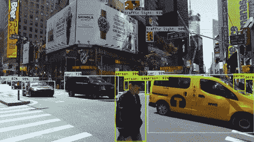
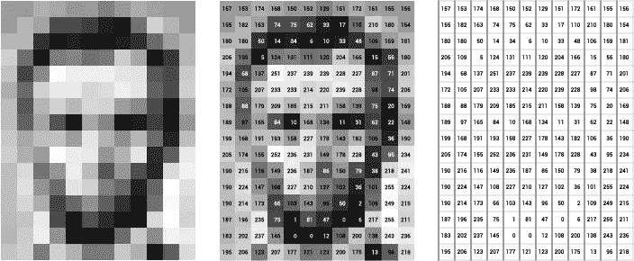
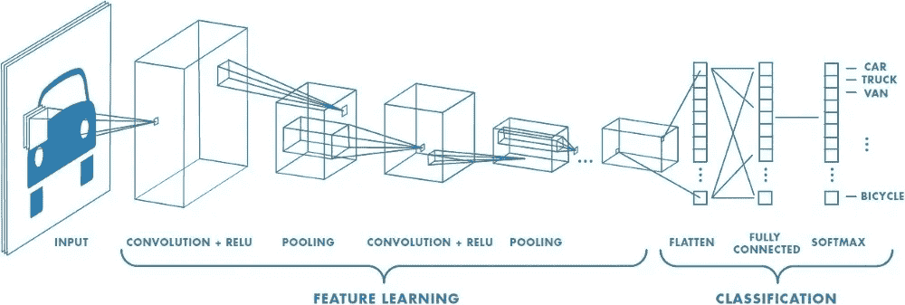
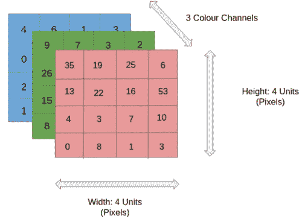
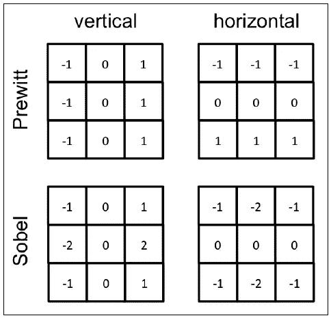
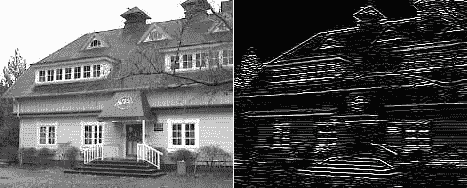
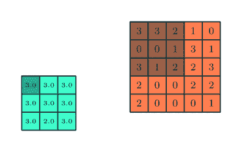

# 计算机视觉:什么，如何，为什么

> 原文：<https://medium.com/analytics-vidhya/computer-vision-what-how-why-380607f0bd64?source=collection_archive---------23----------------------->

你想知道你一直听到的那两个词是什么意思吗，让我们来谈谈吧。

# 什么是计算机视觉？

尽管很复杂，计算机视觉只是计算机“看”的能力。计算机和人类一样，使用视觉来理解周围的世界。它们完成这一任务的方式与人类不同，但许多原理是相同的。举个例子，当你读到“1 + 1”的时候你知道这是一个公式，你应该一比一地加上去。本质上，你看到了一个**模式**，你**认出了它**，并立即知道如何**解读它**。所有这一切的发生是因为，曾经，你被**教导**如何去做。

同样，计算机被**教授**模式，当**识别**时，它们可以**解释**。这不是一个新颖的想法；只是需要时间和大量的训练。然而，在我们谈论计算机如何“训练”之前，我们先谈谈它们看到了什么。不出所料，计算机看到的是一串数字。您可以在下图中看到这种差异。

左图:人类看到的。中心:计算机和人类所见的组合图像。右:计算机看到的。

最左边的图像是人类看到的，最右边的图像是计算机看到的。你可能已经知道，图片是由许多像素组成的。此外，每个像素仅包含一种颜色。计算机使用 0 到 255 之间的整数值来表示颜色。每个数字的含义取决于我们正在观看的图像类型。例如，此图像是灰度图像，因此图像中的每个像素对应 0 到 255 的值，0 表示黑色，255 表示白色。在灰度中，颜色的值本质上是它的亮度。

因此，如果你看中间的图像，你会看到较深的阴影有较低的数字，较浅的阴影有较高的数字。你可能想知道 RGB 图像，以及它们是否以同样的方式工作。这个问题的答案是。它们非常相似，但也有一些关键的区别。我们将在下一节详细讨论这些差异。

# 计算机视觉是如何工作的？

在我们进入核心问题之前，我想给出一个简短的声明。本文旨在帮助人们对一个复杂的主题有一个高层次的理解。很多想法将会用大致的笔画来展示。说了这么多，我们来谈谈计算机视觉是如何实现的。

计算机视觉最常见的是使用**卷积神经网络**或 **ConvNet** 来实现。这听起来可能很混乱，我们一会儿会深入细节，但是现在，把它看作是计算机可以学习的一种方式。这种类型的学习用于图像/视频，而不是其他，因为它非常擅长**模式检测**。正如我们之前所讨论的，这对视觉至关重要。

所以我们来分解一下。

卷积神经网络的图像

上图展示了 ConvNet 的基本概念。有三个主要组件，**输入**，**特征学习**，以及**分类**。输入是给网络的任何图像。特征学习是 ConvNet 如何将图像分解成可用于分类的模式。分类是压轴戏，模式被解释并分类为特定的对象。假设我给了 ConvNet 一个 RGB 图像。计算机将看到这个图像的三个部分。RBG 图像中的红色通道、绿色通道和蓝色通道由红色、蓝色和绿色组成。每个通道的像素都是一个从 0 到 255 的整数值，就像我们的灰度示例一样，但这次它们是在各自的范围内(红、蓝、绿)。一个更简单的形象化的方法是下图。

现在我们有了自己的图像，是时候处理它了。如你所见，这是一张 4px x 4px 的图像。为了处理这个图像，我们需要查看每个像素，总共 4px x 4px x 个通道或 48 个像素。这听起来可能不多，但请考虑处理一张 4k 图像(3840 x 2160 像素)。要处理一张 4k 的图像，你需要观察将近 2500 万个像素。此外，如果您正在处理视频，这将成为指数级的信息量。这就是我们使用 ConvNets 的原因，因为它们将图像简化为更容易处理的形式，并且在这样做的同时不会丢失预测的关键特征。接收图像后，ConvNet 的第一步是应用卷积层。

## 卷积层

卷积层用于提取高级模式。例如形状或边缘。为了提取这些模式，使用了一个**过滤器**，也称为**内核**。

这个过程可以在左边看到。我们的过滤器是黄色的 3 x 3 矩阵。过滤的工作原理是，过滤器在你的图像(绿色矩阵)周围滑动，然后取过滤器中值的点阵。在本例中，我们将图像像素值乘以该像素的滤镜值(红色数字)。一旦我们完成了 3×3 滤镜所观察的每个像素，我们就可以得到这些值的点积。随后，我们将这个值移入输出矩阵(红色矩阵)。

正如你所看到的，通过使用这个滤镜，我们将 5x5 的图像缩小为 3x3 的矩阵。过滤值是我们提取特征的方式。例如，我们可以使用以下过滤器来检测不同的边缘。

水平线检测

## 汇集层

池层的目的本质上是减少卷积特征的大小；正如我们之前谈到的，图像包含大量信息。因此，为了减少处理数据所需的计算能力，我们可以简单地减少数据。这就是联营。它提取主要特征，同时允许我们在丢弃数据时保留相关信息。通常使用平均池或最大池来执行池。
另一方面，平均池对池过滤器视野中的所有值进行平均。同时，最大池取过滤器视野中的最大值。下面是一个最大池过滤器的例子。

最大池化

## 要旨

您可以将任意数量的卷积层和池层分层在一起。通过添加更多，您可以捕获越来越多的低级信息，同时增加计算成本。分层是计算机对人脸或动物等事物进行分类的方式。您的第一层可能会捕捉简单的几何图案，如直线和圆。随后，接下来的几层可以捕捉眼睛，耳朵，皮毛和羽毛。一旦 ConvNet 完成特征学习，该信息就被传递给分类神经网络。这将输出我们的分类正确概率最高的图像。

它是如何分类的，这些信息是基于我们一开始所说的:**训练**。我们不会谈论太多关于你如何训练一台计算机，但基本原则是你给它已经分类的数据，比如人脸。计算机使用这些数据来学习是什么使人脸成为人脸，然后在未来查看新图像时使用这些学习到的信息。因此，如果一张新的图像有一张人脸，那么计算机应该能够让你知道它是人脸。

# 为什么重要？

计算机视觉让你受益！计算机视觉可以完成许多事情，例如检测缺陷，改善高尔夫挥杆，以及使自动驾驶汽车成为可能。计算机视觉越来越多地被用于自动化，在产品出厂前检测缺陷。这减少了缺陷零件，提高了客户满意度(即，您很满意)。此外，如果你想知道运动员是如何不断变得越来越好的，这可能与计算机视觉有关。计算机视觉可以帮助你最喜欢的棒球运动员挥杆，或者帮助你的球队根据对手的排列方式预测未来的比赛。体育正变得越来越依赖于计算机视觉的下一个优势，这将带来结果。更随意地说，它可以帮助你诊断为什么你不能停止从发球台切球。总而言之，计算机视觉进步很快，好处也很多。很快，你可能会在开车送你去上班的时候读到这篇文章。谢谢，计算机视觉！