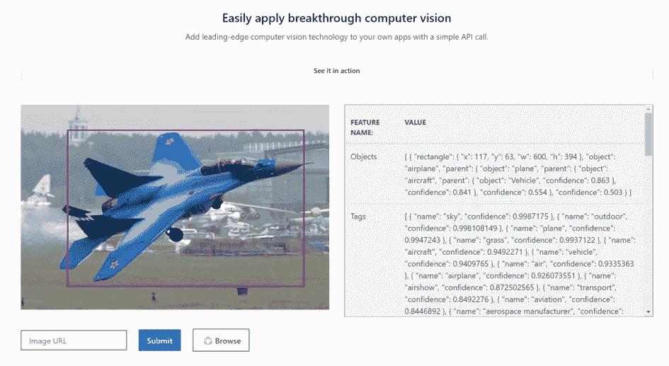
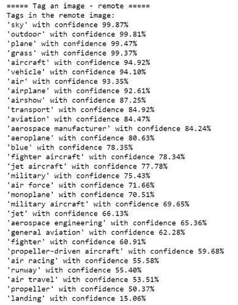
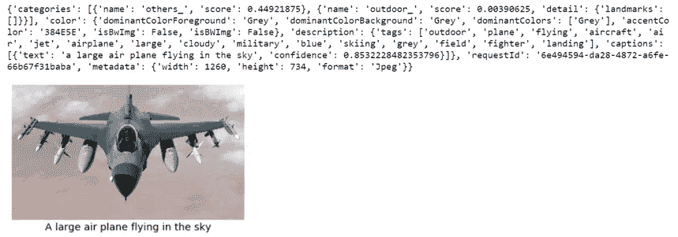
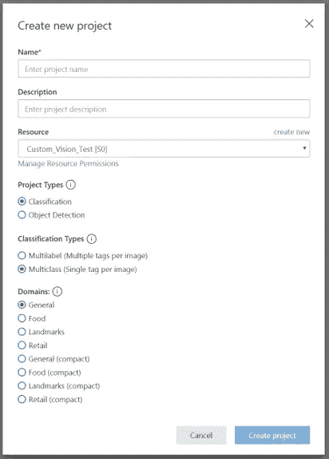
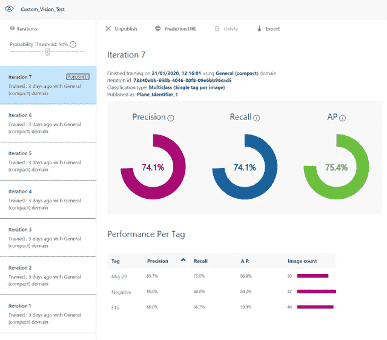
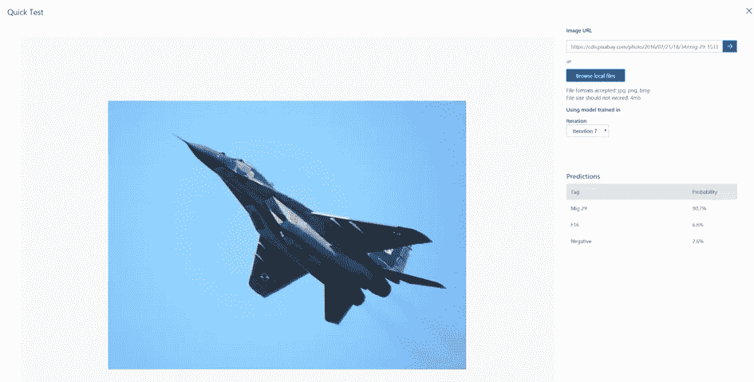
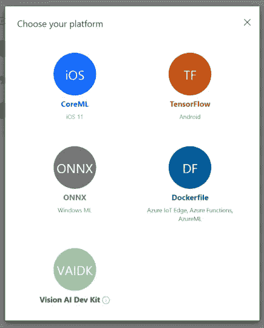
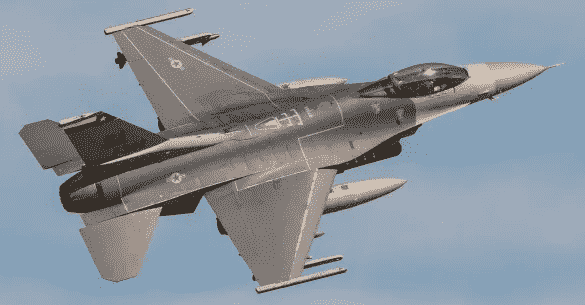
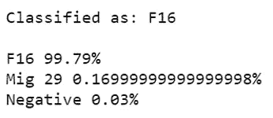
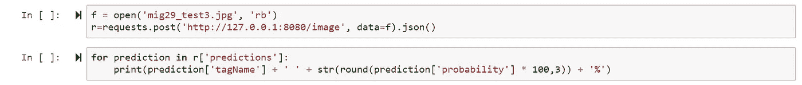

# 使用微软 Azure 认知服务的计算机视觉

> 原文：<https://medium.com/analytics-vidhya/computer-vision-with-microsoft-azure-cognitive-services-c2b82d396a67?source=collection_archive---------19----------------------->

# 每个人都可以轻松而强大地识别图像

我们都熟悉计算机视觉的概念，它是人工智能/人工智能最广泛的应用之一。除了自然语言处理之外，它可能是这个领域中最需要的能力之一。然而，入门门槛可能看起来高得吓人，仅仅开始构建概念演示就需要大量的图像和昂贵的硬件。这可能需要一大笔投资，试图说服你的高级管理层做出这样的承诺可能会很困难。

这就是迁移学习的概念变得非常有用的地方，采用一个现有的预训练模型，并根据您的特定需求重新调整它的用途。这比从头开始构建模型要求低得多，只需要一小部分计算能力。

参加了微软 Ignite 之旅后，他们的定制计算机视觉产品演示引起了我的兴趣，所以我想我应该尝试一下并分享我的发现。

# 基本演示

通过访问[这个网站](https://azure.microsoft.com/en-us/services/cognitive-services/computer-vision/)，任何人都可以上传文件到 Azure，并尝试他们认知服务技术的标准分类。例如，我从网上上传了一张 [Mig29 战斗机](https://nationalinterest.org/sites/default/files/styles/resize-1440/public/main_images/mig_1.jpg)的图片，我们得到了如下结果:

正如你所看到的，它产生了许多关于图像的可能信息..一个很好的功能是它可以生成的描述，正如你在下面看到的，它将这幅图像描述为'一架战斗机，飞过蓝天'，有 78%的概率。显然，这是不太正确的，我怀疑飞机的蓝色混淆了模型，但这是一个合理的开始。

> 描述
> 
> { "标签":["户外"、"飞机"、"草地"、"飞机"、"飞机"、"运输"、"蓝色"、"军用"、"喷气式"、"战斗机"、"飞行"、"跑道"、"空中"、"小型"、"大型"、"野外"、"灰色"、"着陆"、"板块"、"白色"、"群体"]、"字幕":[ { "文本":"一架战斗机飞过蓝天"、"信心":0.7829563 } ] }

# 通过 API 连接

能够在网站上尝试这些东西当然很好，但在任何实际环境中都没有多大用处。使用 Azure 帐户，我们可以在云中创建一些计算资源，为我们提供一个可以连接的 API(在这种情况下，使用 Jupyter 笔记本中的 Python)。

我不会详细说明这样做的细节，但是在使用向导[这里](https://docs.microsoft.com/en-us/azure/cognitive-services/computer-vision/quickstarts-sdk/python-sdk)做了一些工作之后，我能够发送我在上面使用的飞机的 url，并从 API 收到以下内容:

> =====描述图像-远程=====
> 
> 远程图像的描述:
> 
> 一架战斗机充满信心地飞过蓝天

我们还可以从 API 获得所有标签及其置信度(系统认为它在标签中的可信度):

还可以使用此 API 来分析本地保存的图片，该图片被发送到云，并返回输出，如下面的示例所示，该示例为保存在我的机器上的 F16 战斗机图片提供了标题和标签:

# 定制计算机视觉

正如我们所看到的，有一些非常强大的现成功能，可以使用 API 轻松地集成到软件和应用程序中。

但是，这样做有两个主要问题:

1.如果预先构建的模型不足以满足我们的需求，该怎么办？例如，系统可以很容易地识别出我们的图像中有飞机，但如果我们需要知道它是什么**类型**的战斗机呢？

2.这一切都依赖于我们能够连接到云资源来获取信息。如果我们不想依赖它，或者我们在离线环境中工作，那该怎么办？

为了解决这些问题，Azure 有一项名为“Custom Vision”的服务，它可以使用迁移学习来允许模型在特定的用例上进行训练，然后，一旦训练完成，模型就可以下载并安装在本地，例如手机，树莓 Pi 或任何其他边缘设备上。

有多种方法可以在 Azure 中构建自定义模型，但最简单的方法是前往 [customvision.ai](https://www.customvision.ai/) 并登录您的 Azure 帐户，从这里我们可以创建一个新项目。

然后，我们选择是否要对图像进行分类或检测图像中的对象，我们可以选择我们要如何分类以及图像的近似“域”是什么。通过选择领域，我们可以利用微软为食品/地标/零售培训的专业模型，如果它们与我们的用例相关的话。请注意，每个模型都有“精简”版本，如果您希望下载训练模型以在本地使用，则需要使用这些版本。

对于一个简单的演示，我选择建立一个模型，可以识别图像是否包含美国 F16 喷气式飞机、俄罗斯 Mig29 或“其他”(任何不是 F16 或 Mig29 的东西)，我还希望能够下载该模型。因此，我选择使用“通用(紧凑型)”型号，因为战斗机不属于这些类别中的任何一个。

下一步是将成批的图像上传到服务器，然后将它们标记为“F16”、“Mig 29”或“Negative”(他们对“其他”的称呼)。为了避免在模型中引起偏差，给模型提供大致相等的您想要识别的每个类别的数量是很重要的。然后你可以点击“Train ”, Azure 引擎将会根据你的数据对模型进行微调。

完成后，您会看到一些表明模型性能的统计数据。正如你从下面的统计数据中看到的，我已经训练了这个模型 7 次，每次都添加数据，并且已经实现了一个表现相当好的模型，尽管它在识别 Mig29s 和否定情况方面比 F16 好得多。有了更多的时间和数据，这无疑可以得到显著改善。

理想情况下，您会希望为模型提供数百张图片来进行训练，我使用了有限的数量，因为本演示的目的是简化模型的构建，而不是看它的表现如何，尽管在小样本量(38 张 Mig29s、44 张 F16 和 47 张“其他”图片)的情况下，它表现得相当好。如果您试图从头开始构建这个模型，您可能需要成千上万的图像来获得这种性能。

从这我们可以做一个“快速测试”，这将允许我们上传更多的图片，看看模型将它们归类为什么。在这种情况下，我们可以看到该模型以 90.7%的可信度正确识别了 Mig29:

您可以继续测试更多的图像，然后用正确的分类标记这些图像，并再次重新训练模型以尝试提高性能。目的是从不同的角度和不同的环境中给模型提供尽可能多的不同图像，这样它将挑选出你想要识别的物品的最重要的特征，而不会被图像的其他方面混淆。

例如，如果你只给了模型空中飞机的照片，那么它可能很难识别地面上的飞机，或者如果你只给了它蓝色米格 29 的照片，那么模型可能会训练假设蓝色是识别米格 29 的主要部分。

一旦我们有了满意的迭代，我们就可以发布模型了。然后，我们可以访问一个 API，我们可以用它来以编程方式访问模型，或者我们可以以不同的形式下载模型:

# 使用下载的模型

一旦下载完毕，我就可以使用 Python 中的 Tensorflow 模型，使用来自这个[页面](https://docs.microsoft.com/en-us/azure/cognitive-services/custom-vision-service/export-model-python)的代码，对图像进行分类，并且能够获得与使用在线版本时相同的结果。例如，当输入 F16 的图像时，我们得到:

类似地，我能够使用下载的 Docker 文件构建一个 Docker 容器，它能够以同样的方式对图像进行分类。一旦我启动并运行了容器，我就能够使用下面的代码获得预测:

# 结论

用于计算机视觉的人工智能是一个非常强大的工具，可以在许多情况下用于提高效率和帮助人类工作。缺点是，训练一个完全先进的标准模型可能是一项艰巨的工作，需要潜在的大量投资。

让主要提供商构建的模型适应特定任务的能力是快速测试该技术的提议用例的一个很好的方法，只需要很少的投资。